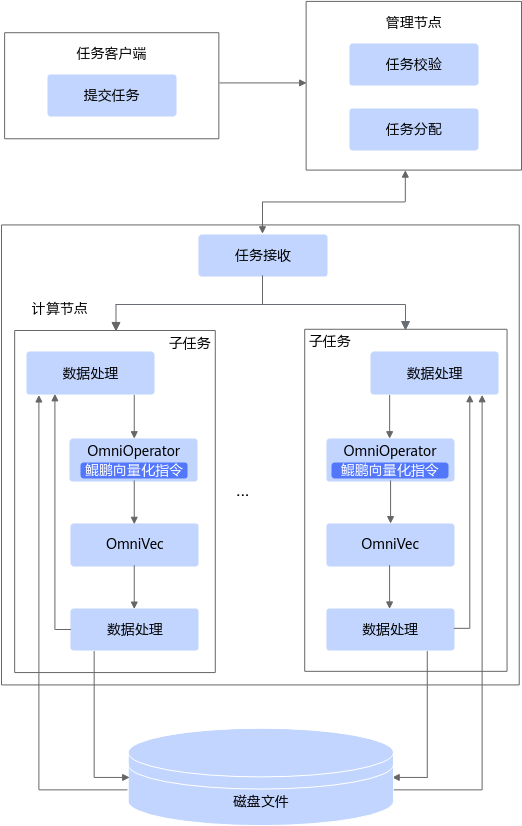

# OmniOperator介绍<a name="ZH-CN_TOPIC_0000002515818290"></a>

## 最新消息<a name="ZH-CN_TOPIC_0000002547298195"></a>

- \[2026.06.30\]：发布OmniOperator 2.2.0。新增ObjHashAggregateExec、InsertIntoHiveTable、GenerateExec、HiveTableScanExec支持；新增数据湖格式支持：Delta Lake 3.2.0、Hudi 0.15.0、Iceberg 1.5.0。
- \[2026.03.30\]：发布OmniOperator 2.1.0。新增InsertIntoHadoopFsRelationCommand支持插入HDFS、WriteFile支持ORC写入、Window支持Array数据分段、FileSourceScanExec支持Array数据读取、LocalLimitExec支持Array数据截取；新增支持datediff、pmod、charTypeWriteSideCheck、least、concat_ws、get_json_object表达式。
- \[2025.12.30\]：发布OmniOperator 2.0.0。新增适配Spark的适配层Gluten 1.3版本；SparkExtension新增支持concat_ws、regexp、regexp_replace、trim和floor表达式。
- \[2025.06.30\]：发布OmniOperator 1.9.0。Spark 3.3.1新增Parquet格式，支持列式写入；新增支持操作系统CentOS 7.9。

## 项目简介<a name="ZH-CN_TOPIC_0000002547258199"></a>

### 简介<a name="ZH-CN_TOPIC_0000002515658378"></a>

大数据OmniRuntime通过插件化的形式，端到端提升数据加载、数据计算和数据交换的性能，从而提升大数据分析性能。

随着互联网的发展，数据规模出现了爆炸式的增长，需要处理的数据量越来越大，CPU算力的增长远远滞后于数据的增长。大数据开源生态也越来越丰富，但多样化的计算引擎和开源组件也同时带来了全生命周期数据处理性能提升难的问题。不同的大数据引擎采用各自独特的优化策略和技术来提高性能和效率，但有些优化项会在多个引擎中重复应用，可能存在差异或冲突，导致计算性能下降。此外，重复应用相同的优化项可能导致资源竞争和冲突，降低整体计算性能。

大数据OmniRuntime是鲲鹏BoostKit大数据面向应用加速推出的一系列特性，通过插件化的形式，端到端提升数据加载、数据计算和数据交换的性能，从而提升大数据分析的性能。

OmniOperator算子加速为OmniRuntime的特性之一。OmniOperator算子加速采用Native Code（C/C++）实现大数据SQL算子来提高查询性能的特性，通过列式存储和向量化执行技术，同时利用鲲鹏向量化指令，用高性能Native算子替换开源版本Java算子，提升算子的执行效率，从而提升查询引擎的查询性能。

已适配的开源组件及版本有：

- Spark 3.1.1
- Spark 3.3.1
- Spark 3.4.3
- Spark 3.5.2
- Hive 3.1.0
- openLooKeng 1.6.1
- Gluten 1.3

### 架构介绍<a name="ZH-CN_TOPIC_0000002547298205"></a>

OmniOperator算子加速特性提供统一接口，供用户在分布式任务中调用。用户可将SQL任务提交至Spark集群，由集群管理节点进行任务调度，将多个子任务分发到对应的计算节点执行。

大数据引擎通常采用Java/Scala算子，难以充分发挥CPU的计算能力。同时对异构算力的支持有限，无法有效发挥硬件的计算性能优势。OmniOperator算子加速特性通过使用Native Code，充分发挥硬件计算性能优势，尤其在异构算力场景下表现突出。

OmniOperator算子加速特性：

- 实现了高性能算子。通过使用Native Code实现Omni算子，充分挖掘硬件特别是异构算力的性能潜力，相较于传统的Java和Scala算子，提升了计算引擎的执行效率。
- 实现了高效数据组织方式。定义了一种与语言无关的列式内存格式，使用堆外内存实现了OmniVec，可以支持零副本读取数据，避免了序列化开销，从而实现更高效的数据处理能力。

OmniOperator算子加速特性仅在单个任务中被用户代码调用，不涉及与其他子任务交互。OmniOperator算子加速特性的软件架构如下图所示。

**图 1** OmniOperator算子加速特性软件架构<a name="zh-cn_topic_0000002515301928_fig11886120161918"></a><a id="OmniOperator算子加速特性软件架构"></a>


OmniOperator算子加速特性提供统一接口，供用户在分布式任务中调用。用户可将SQL任务提交至Spark集群，由集群管理节点进行任务调度，将多个子任务分发到对应的计算节点执行。

### 应用场景<a name="ZH-CN_TOPIC_0000002515818282"></a>

OmniOperator算子加速特性主要应用于数据分析引擎场景，通过优化执行流程，提升数据分析性能。

OmniOperator算子加速特性提供Native算子，可替代分析引擎中原有的开源算子，从而加速SQL查询的执行，提升数据分析性能。用户提交SQL后，引擎会将其转换为一系列算子，OmniOperator通过使用性能更优的Native算子替换部分开源算子，实现执行效率的提升。

OmniOperator算子加速特性适用于大规模数据融合分析场景，能够有效应对高并发、大数据量的处理需求。

OmniOperator算子加速特性已支持以下分析引擎：

- Spark，适配框架：
    - SparkExtension，支持Spark 3.1.1、Spark 3.3.1、Spark 3.4.3、Spark 3.5.2。
    - Gluten，仅支持Spark 3.3.1、Spark 3.4.3、Spark 3.5.2，且需在支持SVE指令集的鲲鹏服务器上运行。

- Hive，适配框架：
    - HiveExtension，支持Hive 3.1.0。

OmniOperator算子加速特性主要应用于数据分析引擎场景，通过优化执行流程，提升数据分析性能。

### 相关概念<a name="ZH-CN_TOPIC_0000002547299019"></a>

- OmniVec：一种高效的堆外内存数据组织方式。它支持零副本读取数据，且没有序列化开销。
- Omni算子：高性能算子，使用Native Code（C/C++）替换了大数据底层的物理算子，提升了计算速度。

## 约束与限制<a name="ZH-CN_TOPIC_0000002515665484"></a>

### 公共约束<a name="ZH-CN_TOPIC_0000002547305319"></a>

为了更准确地规划与使用OmniOperator算子加速特性，建议合理规避可能的风险和限制。

- Decimal数据类型限制：OmniOperator算子加速特性支持64位和128位的Decimal数据类型。当Decimal值超过128位范围时，可能会抛出异常或返回null。这种行为可能导致OmniOperator算子加速特性与引擎开源版本在聚合操作（如SUM、AVG）中的表现存在不一致的情况。如果字段可能涉及AVG操作，且结果存在大数值的累加风险，建议改用Double或其他适合的类型存储以降低风险。
- Double类型的浮点精度问题：在使用Double类型对SUM和AVG进行操作时，OmniOperator算子加速特性可能因计算过程中的顺序差异导致结果的不一致。如果要求结果的精确性较高，请考虑使用更高精度的数据类型（如Decimal）。
- 算子Spill功能支持情况：当前Sort、Window和HashAgg等算子支持Spill功能，而BroadcastHashJoin、ShuffledHashJoin和SortMergeJoin等算子仍不支持该功能。请根据数据的特性和处理需求进行算子选择。

### Hive引擎约束<a name="ZH-CN_TOPIC_0000002515825400"></a>

- 当前UDF插件仅支持Simple UDF，用于执行基于Hive UDF框架编写的UDF函数。
- Hive OmniOperator算子加速在成功执行TPC-DS 99条时，由于Hive开源版本在q14、q72和q89运行时可能存在问题，因此OmniOperator算子加速暂不支持Hive引擎运行这3条SQL。
- Hive OmniOperator算子加速在支持POWER表达式时，由于C++ std::pow函数和Java的Math.pow函数实现存在一些细微差异，导致使用C++实现的POWER表达式和Hive开源版本的POWER表达式存在一定误差，但相对精度误差不大于1e-15。
- Hive OmniOperator算子加速在支持浮点数运算时，可能会产生和Hive开源版本行为不相同的场景，如除浮点数0.0等。若出现除浮点数0.0的场景，开源版本Hive返回null，OmniOperator算子加速则根据具体的运算行为返回Infinity、NaN或null。
- Hive引擎默认开启CBO优化，Hive OmniOperator算子加速当前仅支持开启CBO优化，不支持关闭，即不支持将hive.cbo.enable设置为false。
- 当SQL中存在Alter字段属性或使用LOAD DATA导入parquet数据的场景时，Hive引擎建议使用开源版本的TableScan算子。

    > **说明：** 
    >- Hive OmniOperator算子加速在表声明的数据存储结构和实际存储结构不匹配，且GroupBy和分桶的参数一致时，Hive开源版本可能出现Group By算子分组异常的问题。因此建议在建表时不采用分桶策略或使用load data local inpath的方式导入数据，以保障表声明的存储结构和实际存储结构相匹配。
    >- Hive OmniOperator算子加速在求和结果溢出时，可能会产生和引擎开源版本行为不相同的结果。OmniOperator算子加速返回null，使用户能够感知到运算发生溢出；开源版本Hive返回一个错误值，可能对用户造成误导。

### Spark引擎约束<a name="ZH-CN_TOPIC_0000002547265317"></a>

当前Spark对接OmniOperator的适配层框架有SparkExtension和Gluten。

> **须知：** 
>
>- Spark版本支持：
>    - SparkExtension支持Spark 3.1.1、Spark 3.3.1、Spark 3.4.3和Spark 3.5.2
>    - Gluten仅支持Spark 3.3.1、Spark 3.4.3和Spark 3.5.2
>- 操作系统差异：
>    - SparkExtension支持Centos 7.9、openEuler 20.03和openEuler 22.03
>    - Gluten支持openEuler 22.03和openEuler 24.03

- 不同的负载所需内存配置不一样，例如TPC-DS 3TB数据集，SparkExtension推荐配置下，堆外内存配置不低于20GB，99条所有SQL可成功运行，运行过程中日志可能出现`MEM_CAP_EXCEEDED`但不影响最终功能，建议适当增大堆外内存配置。如果堆外内存配置过低，SQL执行结果可能不正确。
- Spark OmniOperator算子加速支持`from_unixtime`和`unix_timestamp`表达式：
    1. 仅支持时间解析策略spark.sql.legacy.timeParserPolicy为EXCEPTION、CORRECTED的情况，不支持LEGACY。
    2. <a name="li23961023256"></a>对于一些不合理的参数（如不存在的日期，无效的超大时间戳值等），Omni实现与Spark开源版本实现的处理结果存在不一致。
    3. SparkExtension场景可以通过配置spark.omni.sql.columnar.unixTimeFunc.enabled=false来回退这两个函数，Gluten场景可以通过配置spark.gluten.sql.columnar.backend.omni.unixTimeFunc.enabled来回退这两个函数，即使用Spark开源版本对应的函数来规避[2](#li23961023256)中的不一致问题。

- Spark OmniOperator算子加速同时对超多列进行表达式Codegen时，例如500列，编译开销大于OmniOperator加速效果，建议该场景采用Spark开源版本执行相关操作。
- OmniOperator算子加速目前不支持Spark 3.4.3和Spark 3.5.2的CHAR类型数据、AVG函数数据类型是Decimal128的情况，在执行过程中存在上述场景会导致算子回退。
- OmniOperator算子加速目前不支持Spark 3.4.3和Spark 3.5.2的ORC列式写入。
- OmniOperator算子加速支持Spark 3.5.2中的`ROW_NUMBER`和rank函数计算，面对`dense_rank`场景时会算子回退。
- Spark OmniOperator算子加速不支持Boolean类型数据比较运算符（<、<=、\>、\>=、!=、<\>、=、==和<=\>），同时不支持所有数据类型的比较运算符（<=\>），在执行过程中存在这些场景会导致算子回退属于正常现象。如果在大表Join操作中发生回退，由于行列转换开销较大，可能导致性能下降。在实际使用中，建议尽量避免此类场景，以减少回退带来的性能影响。

## 目录结构<a name="ZH-CN_TOPIC_0000002547258197"></a>

项目全量目录层级介绍如下：

```text
├── docs                                                      # 项目文档目录
│   ├── zh                                                   # 中文文档目录
│   │   ├── figures                                          # 中文文档图片资源目录
│   │   ├── public_sys-resources                             # 中文文档图标资源目录
│   │   ├── faq.md                                           # OmniOperator安装使用常见问题
│   │   ├── installation_guide.md                            # OmniOperator安装指导
│   │   ├── quick_start.md                                   # OmniOperator快速入门
│   │   ├── release_notes.md                                 # OmniOperator版本说明书
│   │   └── user_guide.md                                    # OmniOperator使用指导
├── bindings                                                  # JNI侧目录
│   └── java                                                 # JNI侧核心代码
├── build_scripts                                             # 编译脚本目录
│   ├── build.sh                                             # 编译脚本
│   └── env_check.sh                                         # 环境检测脚本
├── core                                                      # C++侧目录
│   ├── secDTFuzz                                            # SecDT模糊测试相关配置与构建
│   ├── src                                                  # 核心C++实现
│   ├── test                                                 # 单元测试与可选基准
│   ├── CMakeLists.txt                                       # 顶层CMake配置
│   └── config.h.in                                          # 编译选项模板
├── examples                                                  # 示例与扩展目录
│   ├── externalfunctions                                    # 外部函数（UDF）示例代码
│   └── README.MD                                            # 示例说明
├── figures                                                   # 项目级图片资源（如架构图）
├── build.sh                                                  # 根目录编译入口脚本
├── CMakeLists.txt                                            # 根目录CMake配置
├── env_check.sh                                              # 根目录环境检测脚本
├── LICENSE                                                   # 开源许可证
├── README.md                                                 # 项目说明
```

## 版本说明<a name="ZH-CN_TOPIC_0000002515658372"></a>

每个版本的特性变更详细信息，请参见《[版本说明书](./docs/zh/release_notes.md)》。

## 环境部署<a name="ZH-CN_TOPIC_0000002515658370"></a>

介绍OmniOperator的环境依赖及安装方式，具体请参见《[安装指南](./docs/zh/installation_guide.md)》。

## 学习文档<a name="ZH-CN_TOPIC_0000002515818286"></a>

| 名称|简介|
|---|--------|
|[版本说明书](./docs/zh/release_notes.md)|提供OmniOperator每个发布版本的基础信息和特性更新信息。|
|[安装指南](./docs/zh/installation_guide.md)|提供安装OmniOperator的详细指导。|
|[用户指南](./docs/zh/user_guide.md)|提供使用OmniOperator的详细指导。|
|[常见问题](./docs/zh/faq.md)|提供OmniOperator安装、使用过程的常见问题和解决方法。|
|视频课程：[OmniRuntime特性大揭秘](https://www.hikunpeng.com/document/video-detail/2849)|提供操作视频，帮助开发者在鲲鹏服务器上了解、使能OmniRuntime特性。|

## 安全声明<a name="ZH-CN_TOPIC_0000002547265321"></a>

### 防病毒软件例行检查<a name="ZH-CN_TOPIC_0000002547269013"></a>

定期开展对集群和Spark组件的防病毒扫描，防病毒例行检查会帮助集群免受病毒、恶意代码、间谍软件以及恶意程序的攻击，降低系统瘫痪、信息泄露等风险。建议使用业界主流防病毒软件进行防病毒检查。

### 日志控制<a name="ZH-CN_TOPIC_0000002515669178"></a>

- 检查系统是否可以限制单个日志文件的大小。
- 检查日志空间占满后，是否存在机制进行清理。

### 漏洞修复<a name="ZH-CN_TOPIC_0000002515829100"></a>

为保证生产环境的安全，降低被攻击的风险，请开启防火墙，并定期修复以下漏洞。

- 操作系统漏洞
- JDK漏洞
- Hadoop及Spark漏洞
- ZooKeeper漏洞
- Kerberos漏洞
- OpenSSL漏洞
- 其他相关组件漏洞

    以CVE-2021-37137为例。

    漏洞描述：

    Netty 4.1.17版本存在两个Content-Length的http header可能会发生混淆的风险通告，漏洞编号：CVE-2021-37137。

    本系统使用hdfs-ceph（version 3.2.0）服务作为存算分离的存储对象，它因依赖aws-java-sdk-bundle-1.11.375.jar而涉及该漏洞。建议用户及时更新漏洞补丁进行防护，以免遭受黑客攻击。

    影响范围：

    Netty 4.1.68及以前版本。

    修复建议：

    目前厂商已发布升级补丁以修复漏洞，请参见[GitHub](https://github.com/netty/netty/security/advisories/GHSA-9vjp-v76f-g363)修复漏洞。

### SSH加固<a name="ZH-CN_TOPIC_0000002547309011"></a>

在部署安装过程中，需要通过SSH连接服务器。由于root用户拥有最高权限，直接使用root用户登录服务器可能会存在安全风险。建议您使用普通用户登录服务器进行安装部署，并建议您通过配置禁止root用户SSH登录的选项，来提升系统安全性。操作步骤：

用户登录系统后检查`/etc/ssh/sshd_config`配置项“PermitRootLogin”。

- 如果显示no，说明禁止了root用户SSH登录。
- 如果显示yes，说明需要修改PermitRootLogin为no。

### 公网地址声明<a name="ZH-CN_TOPIC_0000002547269015"></a>

**表 1** 公网地址声明<a id="公网地址声明"></a>

<a name="table5591719574"></a>
<table><tbody><tr id="row13592819778"><th class="firstcol" valign="top" width="30%" id="mcps1.2.3.1.1"><p id="p559212199711"><a name="p559212199711"></a><a name="p559212199711"></a>开源软件/第三方软件</p>
</th>
<td class="cellrowborder" valign="top" width="70%" headers="mcps1.2.3.1.1 "><p id="p1259291919710"><a name="p1259291919710"></a><a name="p1259291919710"></a>GCC</p>
</td>
</tr>
<tr id="row959213199719"><th class="firstcol" valign="top" width="30%" id="mcps1.2.3.2.1"><p id="p25928193714"><a name="p25928193714"></a><a name="p25928193714"></a>类型</p>
</th>
<td class="cellrowborder" valign="top" width="70%" headers="mcps1.2.3.2.1 "><p id="p259214193711"><a name="p259214193711"></a><a name="p259214193711"></a>开源软件</p>
</td>
</tr>
<tr id="row15921819775"><th class="firstcol" valign="top" width="30%" id="mcps1.2.3.3.1"><p id="p145921119774"><a name="p145921119774"></a><a name="p145921119774"></a>公网IP地址/公网URL地址/域名/邮箱地址</p>
</th>
<td class="cellrowborder" valign="top" width="70%" headers="mcps1.2.3.3.1 "><p id="p8592141918714"><a name="p8592141918714"></a><a name="p8592141918714"></a><a href="https://gcc.gnu.org/bugs/" target="_blank" rel="noopener noreferrer">https://gcc.gnu.org/bugs/</a></p>
</td>
</tr>
<tr id="row559214191971"><th class="firstcol" valign="top" width="30%" id="mcps1.2.3.4.1"><p id="p1359219191070"><a name="p1359219191070"></a><a name="p1359219191070"></a>所在文件类型</p>
</th>
<td class="cellrowborder" valign="top" width="70%" headers="mcps1.2.3.4.1 "><p id="p1059214191475"><a name="p1059214191475"></a><a name="p1059214191475"></a>二进制</p>
</td>
</tr>
<tr id="row185922197711"><th class="firstcol" valign="top" width="30%" id="mcps1.2.3.5.1"><p id="p7593619372"><a name="p7593619372"></a><a name="p7593619372"></a>文件名</p>
</th>
<td class="cellrowborder" valign="top" width="70%" headers="mcps1.2.3.5.1 "><p id="p1559317198713"><a name="p1559317198713"></a><a name="p1559317198713"></a>libboostkit-omniop-vector-2.0.0-aarch64.so</p>
</td>
</tr>
<tr id="row0593141917711"><th class="firstcol" valign="top" width="30%" id="mcps1.2.3.6.1"><p id="p1459319197711"><a name="p1459319197711"></a><a name="p1459319197711"></a>用途描述</p>
</th>
<td class="cellrowborder" valign="top" width="70%" headers="mcps1.2.3.6.1 "><p id="p2059320191370"><a name="p2059320191370"></a><a name="p2059320191370"></a>对应的邮箱地址为GCC开源组件官网地址，为编译开源组件时被动引入，产品实际未使用。</p>
</td>
</tr>
<tr id="row259317197712"><th class="firstcol" valign="top" width="30%" id="mcps1.2.3.7.1"><p id="p195931919976"><a name="p195931919976"></a><a name="p195931919976"></a>软件包</p>
</th>
<td class="cellrowborder" valign="top" width="70%" headers="mcps1.2.3.7.1 "><p id="p12877016104"><a name="p12877016104"></a><a name="p12877016104"></a>BoostKit-omniop_2.0.0.zip</p>
<p id="p1959311194714"><a name="p1959311194714"></a><a name="p1959311194714"></a>boostkit-omniop-operator-2.0.0-aarch64-centos.tar.gz</p>
</td>
</tr>
</tbody>
</table>

## 免责声明<a name="ZH-CN_TOPIC_0000002515818292"></a>

**致OmniOperator使用者**

- 本工具仅供调试和开发之用，使用者需自行承担使用风险，并理解以下内容：
    - 数据处理及删除：用户在使用本工具过程中产生的数据属于用户责任范畴。建议用户在使用完毕后及时删除相关数据，以防信息泄露。
    - 数据保密与传播：使用者了解并同意不得将通过本工具产生的数据随意外发或传播。对于由此产生的信息泄露、数据泄露或其他不良后果，本工具及其开发者概不负责。
    - 用户输入安全性：用户需自行保证输入的命令行的安全性，并承担因输入不当而导致的任何安全风险或损失。对于输入命令行不当所导致的问题，本工具及其开发者概不负责。

- 免责声明范围：本免责声明适用于所有使用本工具的个人或实体。使用本工具即表示您同意并接受本声明的内容，并愿意承担因使用该功能而产生的风险和责任，如有异议请停止使用本工具。
- 在使用本工具之前，请**谨慎阅读并理解以上免责声明的内容**。对于使用本工具所产生的任何问题或疑问，请及时联系开发者。

**致数据所有者**

如果您不希望您的模型或数据集等信息在OmniOperator中被提及，或希望更新OmniOperator中有关的描述，请在GitCode提交issue，我们将根据您的issue要求删除或更新您相关描述。衷心感谢您对OmniOperator的理解和贡献。

## 公网地址声明<a name="ZH-CN_TOPIC_0000002547298197"></a>

声明：以下依赖库均使用Gitee镜像源，以提高国内下载速度。<br>
fmt镜像地址：<https://gitee.com/mirrors/fmt.git><br>
folly镜像地址：<https://gitee.com/mirrors/folly.git>

## License<a name="ZH-CN_TOPIC_0000002547298197"></a>

OmniOperator产品的使用许可证，具体请参见[LICENSE](LICENSE)文件。

OmniOperator docs目录下的文档适用CC-BY 4.0许可证，具体请参见[LICENSE](./docs/LICENSE)文件。

## 贡献声明<a name="ZH-CN_TOPIC_0000002547298203"></a>

1. 提交错误报告：如果您在OmniOperator中发现了一个不存在安全问题的漏洞，请在OmniOperator仓库中的Issues中搜索，以防该漏洞被重复提交，如果找不到漏洞可以创建一个新的Issues。如果发现了一个安全问题请不要将其公开，请参阅安全问题处理方式。提交错误报告时应该包含完整信息。
2. 安全问题处理：本项目中对安全问题处理的形式，请通过邮箱通知项目核心人员确认编辑。
3. 解决现有问题：通过查看仓库的Issues列表可以发现需要处理的问题信息，可以尝试解决其中的某个问题。
4. 如何提出新功能：请使用Issues的Feature标签进行标记，我们会定期处理和确认开发。
5. 开始贡献：
    1. Fork本项目的仓库。
    2. Clone到本地。
    3. 创建开发分支。
    4. 本地测试：提交前请通过所有单元测试，包括新增的测试用例。
    5. 提交代码。
    6. 新建Pull Request。
    7. 代码检视：您需要根据评审意见修改代码，并重新提交更新。此流程可能涉及多轮迭代。
    8. 当您的PR获得足够数量的检视者批准后，Committer会进行最终审核。
    9. 审核和测试通过后，CI会将您的PR合并到项目的主干分支。

## 建议与交流<a name="ZH-CN_TOPIC_0000002547258203"></a>

欢迎大家为社区做贡献。如果有任何疑问或建议，请提交[Issues](https://gitcode.com/openeuler/OmniOperator/issues)，我们会尽快回复。感谢您的支持。

## 致谢<a name="ZH-CN_TOPIC_0000002515658382"></a>

OmniOperator由华为公司的下列部门联合贡献：

鲲鹏计算Boostkit开发部

感谢来自社区的每一个PR，欢迎贡献OmniOperator！
