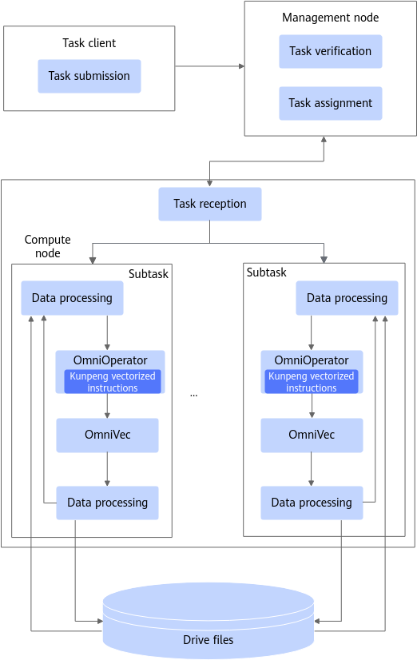

# Introduction to OmniOperator<a name="EN-US_TOPIC_0000002515818290"></a>

## What's New<a name="EN-US_TOPIC_0000002547298195"></a>

- \[2026-03-30\]: Released OmniOperator 2.1.0. Added **InsertIntoHadoopFsRelationCommand** to support HDFS insertion, **WriteFile** to support ORC write, **Window** to support array data segmentation, **FileSourceScanExec** to support array data read, and **LocalLimitExec** to support array data truncation. Added support for the expressions: **datediff**, **pmod**, **charTypeWriteSideCheck**, **least**, **concat_ws**, and **get_json_object**.
- \[2025-12-30\]: Released OmniOperator 2.0.0. Added the adaptation layer Gluten 1.3 for Spark, and added the **concat\_ws**, **regexp**, **regexp\_replace**, **trim**, and **floor** expressions for SparkExtension.
- \[2025-06-30\]: Released OmniOperator 1.9.0. Added the Parquet format and columnar write support for Spark 3.3.1, and added support for CentOS 7.9.


## Project Introduction<a name="EN-US_TOPIC_0000002547258199"></a>

### Overview<a name="EN-US_TOPIC_0000002515658378"></a>

The big data features of OmniRuntime are presented in the form of plugins to improve the performance of data loading, computing, and exchange from end to end.

Data volumes generated from Internet services have been growing much faster than CPUs' computing power. The open-source big data ecosystem is also developing on a fast track. However, diversified computing engines and open-source components make it difficult to improve data processing performance throughout the lifecycle. Different big data engines use their own unique tuning policies and technologies to improve performance and efficiency. Some tuning items may be applied across multiple engines, which may cause resource contention and conflicts, reducing overall computing performance.

OmniRuntime consists of a series of features provided by Kunpeng BoostKit for Big Data in terms of application acceleration. It aims to improve the performance of end-to-end data loading, computing, and exchange through plugins, thereby improving the performance of big data analytics.

OmniOperator is a subfeature of OmniRuntime. It implements big data SQL operators in native code \(C/C++\) to improve query performance. It leverages columnar storage and vectorized execution technologies as well as Kunpeng vectorized instructions, and replaces open-source Java operators with high-performance native operators to improve operator execution efficiency and query engine performance.

Compatible open-source components and versions:

- Spark 3.1.1
- Spark 3.3.1
- Spark 3.4.3
- Spark 3.5.2
- Hive 3.1.0
- openLooKeng 1.6.1
- Gluten 1.3


### Architecture<a name="EN-US_TOPIC_0000002547298205"></a>

OmniOperator provides unified interfaces for distributed tasks. You can submit an SQL task to a Spark cluster. The cluster management node schedules the task, that is, distributes subtasks to multiple compute nodes for execution.

Most big data engines use Java or Scala operators, which rarely achieve full CPU utilization. In addition, their support for heterogeneous computing resources is limited, preventing hardware performance from being fully leveraged. OmniOperator uses native code to make full use of hardware, especially in heterogeneous computing.

OmniOperator performs the following functions:

- Implements high-performance Omni operators using native code. It fully exploits the performance potential of hardware, particularly in heterogeneous computing environments. Compared with Java and Scala operators, Omni operators enhance the execution efficiency of compute engines.
- Provides an efficient data organization mode. It defines a column-oriented storage mode independent of languages and uses off-heap memory to implement OmniVec, which can read data with zero copy. There is no serialization overhead, allowing users to process data more efficiently.

OmniOperator is invoked by user code only in a single task and does not interact with other subtasks. The following figure shows the software architecture of OmniOperator.

**Figure  1**  Software architecture of OmniOperator<a name="en-us_topic_0000002515301928_fig11886120161918"></a>  


OmniOperator provides unified interfaces for distributed tasks. You can submit an SQL task to a Spark cluster. The cluster management node schedules the task, that is, distributes subtasks to multiple compute nodes for execution.
### Application Scenarios<a name="EN-US_TOPIC_0000002515818282"></a>

The OmniOperator feature is mainly used in data analytics engines. It optimizes the execution process to improve data analytics performance.

OmniOperator provides native operators that replace the open-source operators in analytics engines, accelerating SQL queries and enhancing data analytics performance. After a user submits an SQL statement, the engine converts the SQL statement into a series of operators. OmniOperator replaces some of the open-source operators with native operators to improve the execution efficiency.

OmniOperator is suited for large-scale data fusion analytics scenarios and can effectively handle high-concurrency and large-volume data processing requirements.

OmniOperator supports the following analytics engines:

- Spark adaptation frameworks
    - SparkExtension: Spark 3.1.1, 3.3.1, 3.4.3, and 3.5.2
    - Gluten: Spark 3.3.1, which must run on a Kunpeng server that supports the Scalable Vector Extension \(SVE\) instruction set.

- Hive adaptation framework
    - HiveExtension: Hive 3.1.0

The OmniOperator feature is mainly used in data analytics engines. It optimizes the execution process to improve data analytics performance.
### Related Concepts<a name="EN-US_TOPIC_0000002547299019"></a>

- OmniVec: An efficient off-heap memory data organization method. It supports zero-copy data read and has no serialization overhead.
- Omni operators: High-performance operators, which use native code \(C/C++\) to replace physical operators at the bottom layer of big data, increasing the computing speed.


## Constraints<a name="EN-US_TOPIC_0000002515665484"></a>

### Common Constraints<a name="EN-US_TOPIC_0000002547305319"></a>

To effectively plan and utilize the OmniOperator feature, it is recommended to be aware of potential risks and limitations.

- Restrictions on the Decimal data type: The OmniOperator feature supports 64-bit and 128-bit Decimal types. If a decimal value exceeds 128 bits, an exception may be thrown or a null value returned. This behavior can make OmniOperator's results inconsistent with the open-source version of the engine for aggregation operations \(for example, SUM or AVG\). If a field may involve AVG operations and the accumulated result could become very large, it is recommended to use Double or another suitable type to reduce the risk of overflow or errors.
- Floating-point precision of the Double type: When using the Double type for operations such as SUM or AVG, the OmniOperator feature may produce inconsistent results due to differences in computation order. If high precision is required, use a data type with higher precision, such as Decimal.
- Currently, operators like Sort, Window, and HashAgg support the spill function, while operators such as BroadcastHashJoin, ShuffledHashJoin, and SortMergeJoin do not. Select operators based on your data characteristics and processing requirements.


### Hive Engine Constraints<a name="EN-US_TOPIC_0000002515825400"></a>

- The user-defined function \(UDF\) plugin supports only simple UDFs. It is used to execute UDFs written based on the Hive UDF framework.
- While Hive OmniOperator executes the 99 TPC-DS statements, it does not support q14, q72, or q89 because open-source Hive may have problems when executing q14, q72, and q89.
- When Hive OmniOperator is working on POWER expressions, there is a slight implementation difference between the C++ std:pow function and Java Math.pow function. As a result, the POWER expression implemented using C++ is different from the open-source POWER expression of Hive, but the relative precision error is not greater than 1e-15.
- When Hive OmniOperator is used in floating-point arithmetic, an issue that does not match open-source Hive behaviors may occur. For example, when dividing the floating-point number of 0.0, open-source Hive returns Null, whereas OmniOperator returns Infinity, NaN, or Null.
- CBO optimization is enabled by default for the Hive engine. Hive OmniOperator must have CBO optimization enabled, specifically, **hive.cbo.enable** cannot be set to **false**.
- If SQL statements contain the **Alter** field attribute or use **LOAD DATA** to import parquet data, the open-source TableScan operator is recommended for the Hive engine.

    > **NOTE:** 
    >-   When the data storage structure declared by Hive OmniOperator in the table does not match the actual storage structure and the GroupBy operator is consistent with bucketing parameters, the GroupBy operator may encounter a grouping exception in open-source Hive. Therefore, to ensure that the declared storage structure matches the actual storage structure, use no bucketing policy when creating the table or run **load data local inpath** to import data.
    >-   When the sum result overflows, Hive OmniOperator may generate a result different from open-source behaviors of the engine. OmniOperator returns null for users to perceive the overflow, whereas open-source Hive returns an error value, which may cause misunderstanding.


### Spark Engine Constraints<a name="EN-US_TOPIC_0000002547265317"></a>

The adaptation layer frameworks that enable Spark to interoperate with OmniOperator are SparkExtension and Gluten.

> **NOTICE:** 
>-   Supported Spark versions:
>    -   Spark 3.1.1, 3.3.1, 3.4.3, and 3.5.2
>    -   Gluten supports only Spark 3.3.1.
>-   OS differences:
>    -   SparkExtension supports CentOS 7.9, openEuler 20.03, and openEuler 22.03.
>    -   Gluten supports openEuler 22.03.

- Different loads require different memory configurations. For example, for a 3 TB TPC-DS dataset, the recommended SparkExtension configuration requires that off-heap memory be greater than or equal to 20 GB so that all the 99 SQL statements can be successfully executed. During the execution, "MEM\_CAP\_EXCEEDED" may be reported in logs, but the execution result is not affected. If the off-heap memory configuration is too low, the SQL statement execution result may be incorrect.
- Spark OmniOperator supports the from\_unixtime and unix\_timestamp expressions.
    1. The time parsing policy **spark.sql.legacy.timeParserPolicy** must be **EXCEPTION** or **CORRECTED**, and cannot be **LEGACY**.
    2. For some improper parameter values \(such as non-existent dates and invalid ultra-large timestamp values\), the processing results of OmniRuntime are different from those of open-source Spark.
    3. In the SparkExtension scenario, you can set **spark.omni.sql.columnar.unixTimeFunc.enabled=false** to roll back the two functions. In the Gluten scenario, you can set **spark.gluten.sql.columnar.backend.omni.unixTimeFunc.enabled** to roll back the two functions. That is, use the functions corresponding to the open-source Spark version to avoid the difference in [2](#li23961023256).

- When Spark OmniOperator performs expression codegen on a large number of columns \(for example 500 columns\) at the same time, the compilation overhead is greater than the OmniOperator acceleration effect. In this scenario, you are advised to use open-source Spark.
- OmniOperator does not support decimal128 CHAR or AVG function data or of Spark 3.4.3 or Spark 3.5.2. Such data may cause operation rollback during operation acceleration.
- OmniOperator does not support ORC write for Spark 3.4.3 or Spark 3.5.2.
- OmniOperator supports the **ROW\_NUMBER** and **rank** functions in Spark 3.5.2. In the **dense\_rank** scenario, operators are rolled back.
- Spark OmniOperator does not support comparison operators \(<, <=, \>, \>=, !=, <\>, =, ==, <=\>\) for Boolean data, and does not support <=\> for any data type. If an incompatible operation exists during the execution, it is normal that the operator is rolled back. If a rollback occurs during the join operation of a large table, performance may deteriorate due to the high overhead of row-to-column conversion. In practice, it is recommended to avoid such scenarios to minimize the impact of rollback on performance.


## Directory Structure<a name="EN-US_TOPIC_0000002547258197"></a>

The full project directory structure is as follows:

```
├── docs                                                     # Project document directory
│   └── en                                                   # English document directory
│       ├── figures                                          # Directory of images in documents
│       ├── public_sys-resources                             # Directory of images in documents
│       ├── faq.md                                           # OminiOperator FAQs
│       ├── installation_guide.md                            # OminiOperator Installation Guide
│       ├── quick_start.md                                   # Quick Start
│       ├── release_notes.md                                 # OminiOperator Release Notes
│       ├── user_guide.md                                    # OminiOperator User Guide
├── bindings                                                 # JNI directory
│   └── java                                                 # JNI core code
├── build_scripts                                            # Compilation script directory
│   ├── build.sh                                             # Compilation script
│   └── env_check.sh                                         # Environment check script
├── core                                                     # C++ directory
│   ├── secDTFuzz                                            # SecDT fuzzy test configuration and build
│   ├── src                                                  # Core C++ implementation
│   ├── test                                                 # Unit test and optional benchmark
│   ├── CMakeLists.txt                                       # Top-level CMake configuration
│   └── config.h.in                                          # Compilation option template
├── examples                                                 # Example and extension directory
│   ├── externalfunctions                                    # Sample code of external UDFs
│   └── README_en.MD                                            # Description of the sample
├── figures                                                  # Project-level image resources (such as architecture diagrams)
├── build.sh                                                 # Root directory compilation entry script
├── CMakeLists.txt                                           # Root directory CMake configuration
├── env_check.sh                                             # Root directory environment check script
├── LICENSE                                                  # Open-source license
├── README_en.md                                                # Project description
```


## Release Notes<a name="EN-US_TOPIC_0000002515658372"></a>

For details about feature changes in each version, see [Release Notes](./docs/en/quick_start.md).


## Environment Deployment<a name="EN-US_TOPIC_0000002515658370"></a>

For details about the environment dependencies and installation methods of OmniOperator, see [Installation Guide](./docs/en/installation_guide.md).


## Helpful Links<a name="EN-US_TOPIC_0000002515818286"></a>

|Name|Overview|
|--|--|
|[Release Notes](./docs/en/release_notes.md)|Provides basic information and feature updates of each OmniOperator version.|
|[Installation Guide](./docs/en/installation_guide.md)|Describes how to install OmniOperator.|
|[User Guide](./docs/en/user_guide.md)|Provides details about how to use OmniOperator.|
|[FAQs](./docs/en/faq.md)|Provides answers to frequently asked questions (FAQs) about installing and using OmniOperator.|


## Security Statement<a name="EN-US_TOPIC_0000002547265321"></a>

### Routine Antivirus Software Check<a name="EN-US_TOPIC_0000002547269013"></a>

Periodically scan clusters and Spark components for viruses. This protects clusters from viruses, malicious code, spyware, and malicious programs, reducing risks such as system breakdown and information leakage. Mainstream antivirus software can be recommended for antivirus check.


### Log Control<a name="EN-US_TOPIC_0000002515669178"></a>

- Check whether the system can limit the size of a single log file.
- Check whether there is a mechanism for clearing logs when the log space is used up.


### Vulnerability Fixing<a name="EN-US_TOPIC_0000002515829100"></a>

To ensure the security of the production environment and reduce the risk of attacks, enable the firewall and periodically fix the following vulnerabilities:

- OS vulnerabilities
- JDK vulnerabilities
- Hadoop and Spark vulnerabilities
- ZooKeeper vulnerabilities
- Kerberos vulnerabilities
- OpenSSL vulnerabilities
- Vulnerabilities in other components

    The following uses CVE-2021-37137 as an example.

    Vulnerability description:

    Netty 4.1.17 has two Content-Length HTTP headers that may be confused. The vulnerability ID is CVE-2021-37137.

    The system uses the hdfs-ceph \(version 3.2.0\) service as the storage object with decoupled storage and compute. This service depends on **aws-java-sdk-bundle-1.11.375.jar** and involves this vulnerability. You are advised to update the vulnerability patch in a timely manner to prevent hacker attacks.

    Impact:

    Netty 4.1.68 and earlier versions

    Handling suggestion:

    Currently, the vendor has released an upgrade patch to fix the vulnerability. For details, visit [GitHub](https://github.com/netty/netty/security/advisories/GHSA-9vjp-v76f-g363).


### SSH Hardening<a name="EN-US_TOPIC_0000002547309011"></a>

During the installation and deployment, you need to connect to the server through SSH. The **root** user has all the operation permissions. Logging in to the server as the **root** user may pose security risks. You are advised to log in to the server as a common user for installation and deployment and disable **root** user login using SSH to improve system security. 

Check the **PermitRootLogin** configuration item in **/etc/ssh/sshd\_config**.

- If the value is **no**, **root** user login using SSH is disabled.
- If the value is **yes**, change it to **no**.


### Public Network Address Statement<a name="EN-US_TOPIC_0000002547269015"></a>

**Table  1**  Public network address statement

<a name="table5591719574"></a>
<table><tbody><tr id="row13592819778"><th class="firstcol" valign="top" width="30%" id="mcps1.2.3.1.1"><p id="p559212199711"><a name="p559212199711"></a><a name="p559212199711"></a>Open-Source/Third-Party Software</p>
</th>
<td class="cellrowborder" valign="top" width="70%" headers="mcps1.2.3.1.1 "><p id="p1259291919710"><a name="p1259291919710"></a><a name="p1259291919710"></a>GCC</p>
</td>
</tr>
<tr id="row959213199719"><th class="firstcol" valign="top" width="30%" id="mcps1.2.3.2.1"><p id="p25928193714"><a name="p25928193714"></a><a name="p25928193714"></a>Type</p>
</th>
<td class="cellrowborder" valign="top" width="70%" headers="mcps1.2.3.2.1 "><p id="p259214193711"><a name="p259214193711"></a><a name="p259214193711"></a>Open-source software</p>
</td>
</tr>
<tr id="row15921819775"><th class="firstcol" valign="top" width="30%" id="mcps1.2.3.3.1"><p id="p145921119774"><a name="p145921119774"></a><a name="p145921119774"></a>Public IP Address/Public URL/Domain Name/Email Address</p>
</th>
<td class="cellrowborder" valign="top" width="70%" headers="mcps1.2.3.3.1 "><p id="p8592141918714"><a name="p8592141918714"></a><a name="p8592141918714"></a><a href="https://gcc.gnu.org/bugs/" target="_blank" rel="noopener noreferrer">https://gcc.gnu.org/bugs/</a></p>
</td>
</tr>
<tr id="row559214191971"><th class="firstcol" valign="top" width="30%" id="mcps1.2.3.4.1"><p id="p1359219191070"><a name="p1359219191070"></a><a name="p1359219191070"></a>File Type</p>
</th>
<td class="cellrowborder" valign="top" width="70%" headers="mcps1.2.3.4.1 "><p id="p1059214191475"><a name="p1059214191475"></a><a name="p1059214191475"></a>Binary</p>
</td>
</tr>
<tr id="row185922197711"><th class="firstcol" valign="top" width="30%" id="mcps1.2.3.5.1"><p id="p7593619372"><a name="p7593619372"></a><a name="p7593619372"></a>File Name</p>
</th>
<td class="cellrowborder" valign="top" width="70%" headers="mcps1.2.3.5.1 "><p id="p1559317198713"><a name="p1559317198713"></a><a name="p1559317198713"></a>libboostkit-omniop-vector-2.0.0-aarch64.so</p>
</td>
</tr>
<tr id="row0593141917711"><th class="firstcol" valign="top" width="30%" id="mcps1.2.3.6.1"><p id="p1459319197711"><a name="p1459319197711"></a><a name="p1459319197711"></a>Usage</p>
</th>
<td class="cellrowborder" valign="top" width="70%" headers="mcps1.2.3.6.1 "><p id="p2059320191370"><a name="p2059320191370"></a><a name="p2059320191370"></a>This email address is the official address of the open-source component GCC, and is used only to compile the open-source component. This email address is not used inside this product.</p>
</td>
</tr>
<tr id="row259317197712"><th class="firstcol" valign="top" width="30%" id="mcps1.2.3.7.1"><p id="p195931919976"><a name="p195931919976"></a><a name="p195931919976"></a>Software Package</p>
</th>
<td class="cellrowborder" valign="top" width="70%" headers="mcps1.2.3.7.1 "><p id="p12877016104"><a name="p12877016104"></a><a name="p12877016104"></a>BoostKit-omniop_2.0.0.zip</p>
<p id="p1959311194714"><a name="p1959311194714"></a><a name="p1959311194714"></a>boostkit-omniop-operator-2.0.0-aarch64-centos.tar.gz</p>
</td>
</tr>
</tbody>
</table>


## Disclaimer<a name="EN-US_TOPIC_0000002515818292"></a>

**To OminiOperator users**

- This tool is intended solely for debugging and development. You are responsible for any risks and should carefully review the following information:
    - Data processing and deletion: Users are responsible for managing and deleting any data generated while using this tool. You are advised to promptly delete any related data after use to prevent information leaks.
    - Data confidentiality and transmission: Users understand and agree not to share or transmit any data generated by this tool. Neither the tool nor its developers are responsible for any information leaks, data breaches, or other negative consequences.
    - User input security: Users are responsible for the security of any commands they enter and for any risks or losses resulting from improper input. The tool and its developers are not liable for issues caused by incorrect command usage.

- Disclaimer scope: This disclaimer applies to all individuals and entities using this tool. By using the tool, you acknowledge and accept this statement and assume all risks and responsibilities arising from its use. If you do not agree, please stop using the tool immediately.
- Before using this tool, **please read and understand the preceding disclaimer**. If you have any questions, contact the developer.

**To data owners**

If you do not want your model or dataset to be mentioned in OminiOperator, or if you wish to update its description, please submit an issue on GitCode. We will delete or update your description according to your request. Thank you for your understanding and contribution to OminiOperator.


## License<a name="EN-US_TOPIC_0000002547298197"></a>

For details, see the [License](license.md) file.

The documents in the **_xxxdocs_** directory are licensed under CC BY 4.0. For details, see the [License](license.md) file.


## Contribution Statement<a name="EN-US_TOPIC_0000002547298203"></a>

1. Submit an error report: If you discover a vulnerability in OminiOperator that is not a security issue, first search the **Issues** in the OminiOperator repository to avoid submitting duplicates. If the vulnerability is not listed, create a new issue. If you discover a security-related problem, do not disclose it publicly. Please refer to the security handling guidelines for details. All error reports must include complete information about the issue.
2. Security issue handling: For guidance on handling security issues in this project, please contact the core team via email for instructions.
3. Resolving existing issues: Review the repository's issue list to identify issues that need attention, and attempt to resolve them.
4. How to propose new functions: Use the **Feature** tag when creating an issue for a new function. We will review and confirm proposals periodically.
5. How to contribute:
    1. Fork the repository of the project.
    2. Clone it to your local machine.
    3. Create a development branch.
    4. Local testing: All unit tests, including any new test cases, must pass before submission.
    5. Commit your code.
    6. Create a pull request \(PR\).
    7. Code review: Modify the code according to review comments and resubmit your changes. This process may involve multiple rounds of iterations.
    8. After your PR is approved by the required number of reviewers, the committer will conduct the final review.
    9. After your PR is approved and all tests pass, the CI system will merge it into the project's main branch.


## Suggestions and Feedback<a name="EN-US_TOPIC_0000002547258203"></a>

You are welcome to contribute to the community. If you have any questions or suggestions, please submit an [issue](https://gitcode.com/openeuler/OmniAdaptor). We will respond as soon as possible. Thank you for your support.


## Acknowledgments<a name="EN-US_TOPIC_0000002515658382"></a>

OminiOperator is jointly developed by the following Huawei departments:

Kunpeng Computing BoostKit Development Dept

Thank you to everyone in the community for your PRs. We warmly welcome contributions to OminiOperator!
