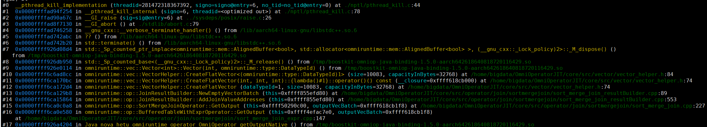
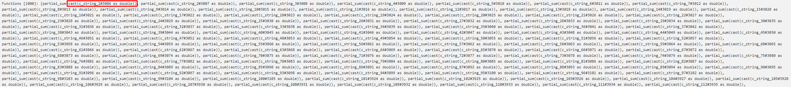
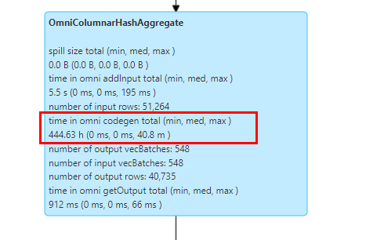

# FAQs<a name="EN-US_TOPIC_0000002517451240"></a>

## JVM Core Dumps Occur Occasionally When Spark Is Executed Based on BiSheng JDK 1.8.0.262<a name="EN-US_TOPIC_0000002517291332"></a>

**Symptom<a name="en-us_topic_0000001695776349_en-us_topic_0000001518928837_en-us_topic_0000001259822511_section456714280469"></a>**

When the LD\_PRELOAD environment variable is configured and Spark is executed based on BiSheng JDK 1.8.0.262, JVM coredump occasionally occurs. The error stack is as follows:

```bash
Stack: [0x0000ffd2ce0d0000, 0x0000ffd2ce2d00001, sp=0x0000ffd2ce2cb830, free space=2030k
Native frames: (J=compiled Java code, j=interpreted, Vv=VM code, C=native code)
C [libzip.so+0x52a4] fill_window+0x164
C [libzip.so+0x6460] deflate_slow+0x1b0
C [libzip.so+0x781c] deflate+0x1a4
C [libzip.so+0x3480] Java_java_util_zip_Deflater_deflateBytes+0x280
J 3376 java.util.zip.Deflater.deflateBytes (J[BIII)I (0 bytes) @ 0x0000fffe537ded84 [0x0000fffe537ded00+0x84]
V ~Runtimestub::_register_finalizer Java
J 12020 C2 org.apache.hadoop.io.WritableUtils.writeCompressedstringArray (Ljava/io/Dataoutput; [Ljava/lang/String;)V (43 bytes) @ 0x0000fffe55773a38 [0x0000fffe55773380+0x6b8]
j org.apache.hadoop.conf.Configuration.write (Ljava/io/DataOutput;) V+104
j org.apache.spark.util.SerializableConfiguration.$anonfun$writeObject$1 (Lorg/apache/spark/uti1/SerializableConfiguration; Ljava/io/ObjectOutputStream; ) V+9
j org.apache.spark.util.SerializableConfiguration$$Lambda$2298.apply$mcv$sp()V+8
J 14862 C2 scala.runtime.java8.JFunction0$mcV$sp.apply()Ljava/lang/Object; (10 bytes) @ 0x0000fffe55e08b34 [0x0000fffe55e08b00+0x34]
J 14673 C2 org.apache.spark.util.Utils$.tryOrIOException(Lscala/Function0;)Ljava/lang/Object; (100 bytes) @ 0x0000fffe55d5ddfc [0x0000fffe55d5ddc0+0x3c]
j org.apache.spark.util.SerializableConfiguration.write0bject(Ljava/io/ObjectOutputStream;) V+10
V ~StubRoutines::call_stub
V [libjvm.so+0x6f20f4] JavaCalls::call_helper(JavaValue*, methodHandle*, JavaCal1Arguments*, Thread*)+0xe54
V [libjvm.so+0xa82eac] Reflection::invoke(instanceKlassHandle, methodHandle, Handle, bool, objArrayHandle, BasicType, objArrayHandle, bool, Thread*) +0xaf4
V [libjvm.so+0xa8456c] Reflection::invoke_method(oopDesc*, Handle, objArrayHandle, Thread*)+0x144
V [libjvm.so+0x7b416c] JVM_InvokeMethod+0x11c
J 5318 sun.reflect.NativeMethodAccessorImpl.invoke0(Ljava/lang/reflect/Method; Ljava/lang/Object;[Ljava/lang/Object;)Ljava/lang/Object; (0 bytes) @ 0x0000fffe5436d1a8 [0x0000fffe5436d100+0xa8]
J 14063 C1 net.jpountz.lz4.LZ4BlockOutputStream.write([BII)V (106 bytes) @ 0x0000fffe55a967e0 [0x0000fffe55a96280+0x560]
C 0x00000007822fef70
```

**Key Process and Cause Analysis<a name="en-us_topic_0000001695776349_en-us_topic_0000001518928837_en-us_topic_0000001259822511_section192720412462"></a>**

This is a bug of BiSheng JDK 1.8.0.262. If a JVM uses  **java.util.zip.ZipFile**  to open a file and the file is being changed on the disk when it is opened, the JVM may crash.

**Conclusion and Solution<a name="en-us_topic_0000001695776349_section561918431353"></a>**

The BiSheng JDK is not forward compatible. You can upgrade the BiSheng JDK to version 1.8.0.342 \(recommended\) to avoid this problem.

## Core Dumps Occasionally Occur When Spark Is Executed to Query the Parquet Data Source Based on libhdfs.so of Hadoop 3.2.0<a name="EN-US_TOPIC_0000002517451242"></a>

**Symptom<a name="en-us_topic_0000001647616694_en-us_topic_0000001518928837_en-us_topic_0000001259822511_section456714280469"></a>**

When Spark is used to query the Parquet data source, if OmniOperator is enabled and depends on libhdfs.so of Hadoop 3.2.0, a core dump occasionally occurs. The error stack is as follows:

```bash
Stack: [0x00007fb9e8e5d000,0x00007fb9e8f5e000], sp=0x00007fb9e8f5cd40, free space=1023k
Native frames: (J=compiled Java code, j=interpreted , Vv=VM code, C=native code)
C [libhdfs.so+0xcd39]  hdfsThreadDestructor+0xb9
------------------  PROCESS  ------------------  
VM state:not at safepoint (normal execution)
VM Mutex/Monitor currently owned by a thread: ([ mutex/lock event])
[0x00007fbbc00119b0] CodeCache_lock - owner thread: 0x00007fbbc00d9800
[0x00007fbbc0012ab0] AdapterHandlerLibrary_lock - owner thread: 0x00007fba04451800

heap address: 0x00000000c0000000, size: 1024 MB, Compressed Oops mode: 32-bit
Narrow klass base: 0x0000000000000000, Narrow klass shift: 3
Compressed class space size: 1073741824 Address: 0x0000000100000000
```

**Key Process and Cause Analysis<a name="en-us_topic_0000001647616694_en-us_topic_0000001518928837_en-us_topic_0000001259822511_section192720412462"></a>**

This is a bug in Hadoop 3.2.0. For details, see  [Issues](https://issues.apache.org/jira/browse/HDFS-15270). If JNIEnv is invoked to obtain JVM information after a JVM exits, a core dump occurs. However, this bug is not completely fixed in the community, and core dumps occur occasionally because the situation where JNIEnv is a wild pointer is not considered.

**Conclusion and Solution<a name="en-us_topic_0000001647616694_section561918431353"></a>**

Check whether a JVM exists in the operating system in advance. If yes, use the obtained JVM pointer to detach the current thread to prevent core dumps caused by JNIEnv being a wild pointer. Use the  **libhdfs.so**  file provided in this version to avoid this problem. Alternatively, use the patch provided by the community to recompile  **libhdfs.so**. For details, see  [GitHub](https://github.com/apache/hadoop/pull/5955).

## OneForOneBlockFetcher Errors Occasionally Occur When a 10 TB Dataset Is Run on Spark 3.1.1<a name="EN-US_TOPIC_0000002517451258"></a>

**Symptom<a name="en-us_topic_0000001701032480_en-us_topic_0000001454201442_section758133012554"></a>**

When Spark 3.1.1 processes a 10 TB dataset, if  **spark.network.timeout**  is set to a small value, data fetch in the shuffle phase may time out. As a result, an error related to  **OneForOneBlockFetcher**  is triggered and the final data result may be inaccurate.

**Key Process and Cause Analysis<a name="en-us_topic_0000001701032480_en-us_topic_0000001454201442_section145813300553"></a>**

For a 10 TB dataset, the default  **spark.network.timeout**  of Spark is set to 120 seconds. In the shuffle phase, if an exception \(for example, timeout\) occurs during data fetch, Spark attempts to fetch data again. However, because the block ID is incorrect, the content of the re-fetched data may also be incorrect, potentially causing data inconsistency. This problem has been confirmed as a bug in the Spark community code and has been submitted for fixing on  [GitHub](https://github.com/apache/spark/pull/31643).

**Conclusion and Solution<a name="en-us_topic_0000001701032480_section239217135912"></a>**

Increase the value of  **spark.network.timeout**  to avoid data fetch timeout. The recommended value is  **600**, which can solve the problem in this case.

## When Spark Executes INSERT Statements to Query Multiple Wide Tables Using JOIN, a Core Dump Occurs Due to Insufficient Memory of the SMJ Operator<a name="EN-US_TOPIC_0000002517291318"></a>

**Symptom<a name="en-us_topic_0000001950009665_en-us_topic_0000001454201442_section758133012554"></a>**

In the scenario where Spark executes INSERT statements and there is only one data partition, when Sort Merge Join \(SMJ\) is performed in 50 consecutive tables, the off-heap memory is used up and the OmniOperator SMJ operator calls the new statement to apply for the vector memory. As a result, a core dump occurs.



**Key Process and Cause Analysis<a name="en-us_topic_0000001950009665_en-us_topic_0000001454201442_section145813300553"></a>**

OmniOperator uses column-based processing and occupies more memory than open source Spark which uses row-based processing. In addition, the resources applied by the SMJ operator during the calculation can only be released after the task is complete.

The problem occurs when INSERT statements are executed and there is only one data partition. Spark generates only one task. As a result, Sort Merge Join on 50 tables is executed in one task. In this case, the configured 38 GB off-heap memory is used up by the 50 consecutive SMJ operators during the calculation. When the new statement is used to apply for memory, a core dump occurs.

**Conclusion and Solution<a name="en-us_topic_0000001950009665_section239217135912"></a>**

This case is a rare scenario. Spark jobs aim to leverage the concurrency advantage of large-scale clusters. In normal cases, the situation where a single task \(single thread\) executes JOIN for a large number of tables does not exist. If this situation is triggered, you can perform the following operations for rectification:

- Adjust the value of  **spark.memory.offHeap.size**  to increase the off-heap memory and trigger the service again.
- Roll back to the Spark open source version to trigger services.

## Query Performance Degraded When Executing a Cast String to Double Expression Containing a Large Number of Columns \(for Example, 500 Columns\) in Spark SQL<a name="EN-US_TOPIC_0000002549011119"></a>

**Symptom<a name="en-us_topic_0000001921984084_en-us_topic_0000001454201442_section758133012554"></a>**

When Spark OmniOperator performs an aggregation query on a large number of varchar columns, for example, 500 columns, the SQL query performance is poor.


**Key Process and Cause Analysis<a name="en-us_topic_0000001921984084_en-us_topic_0000001454201442_section145813300553"></a>**

Aggregation operations on varchar columns involve the cast string to double expression processing, which is implemented by Codegen. Codegen itself has compilation overhead. The SQL query performance is reflected by both the compilation overhead and operator execution overhead. When Codegen compilation is required by a large number of columns at the same time, the compilation overhead is much greater than the OmniOperator operator execution time \(overhead\). As a result, the overall SQL query performance is poor.





**Conclusion and Solution<a name="en-us_topic_0000001921984084_section239217135912"></a>**

If SQL query is to be performed on a large number of columns that involve expression processing and Codegen compilation, you are advised to roll back to the open source Spark for query, which does not affect the consistency of task results.

## "Unable to create serializer 'org.apache.hive.com.esotericsoftware.kryo.serializers.FieldSerializer' for class: com.huawei.boostkit.hive.OmniGroupByOperator" Is Reported When Hive 3.1.0 Runs SQL Statements That Contain the GroupBy Operator<a name="EN-US_TOPIC_0000002548891121"></a>

**Symptom<a name="en-us_topic_0000002070738706_en-us_topic_0000001921984084_en-us_topic_0000001454201442_section758133012554"></a>**

When some SQL statements contain the  **GroupBy**  operator, Hive OmniOperator reports the error "Unable to create serializer 'org.apache.hive.com.esotericsoftware.kryo.serializers.FieldSerializer' for class: com.huawei.boostkit.hive.OmniGroupByOperator."


**Key Process and Cause Analysis<a name="en-us_topic_0000002070738706_en-us_topic_0000001921984084_en-us_topic_0000001454201442_section145813300553"></a>**

This problem may also occur when open source SQL statements are executed in Hive. A related issue is  [Kryo Issue](https://issues.apache.org/jira/browse/HIVE-14092?attachmentOrder=asc). This problem is caused by a Kryo bug and can be solved by using a later version of Kryo. This problem has been eliminated in Hive 4.0.

**Conclusion and Solution<a name="en-us_topic_0000002070738706_section19775722175318"></a>**

In the POM file of the Hive project, change the Kryo version to 4.0.0, recompile the package, and use it to replace the  **hive-exec-3.1.0.jar**  package in the  **lib**  directory of the Hive installation directory. You can also replace the  **hive-exec-3.1.0.jar**  package with a compiled  [Hive JAR](https://gitee.com/kunpengcompute/boostkit-bigdata/releases/download/tag_24.0.0_release_hive/hive-exec-3.1.0.jar)  package.

## q64 Suspended During Remote Deployment of Hive MetaStore<a name="EN-US_TOPIC_0000002517291328"></a>

**Symptom<a name="en-us_topic_0000002145370381_en-us_topic_0000002105043824_en-us_topic_0000002070738706_en-us_topic_0000001921984084_en-us_topic_0000001454201442_section758133012554"></a>**

When deploying Hive MetaStore remotely and running 1 TB ORC TPCDS-99, q64 is suspended. A Cartesian product is generated and join is always performed.

**Key Process and Cause Analysis<a name="en-us_topic_0000002145370381_en-us_topic_0000002105043824_en-us_topic_0000002070738706_en-us_topic_0000001921984084_en-us_topic_0000001454201442_section145813300553"></a>**

This problem may also occur when Hive executes open source SQL statements. That is, when q44 and q64 are executed in sequence, the MetaStore cache causes the q64 execution plan to change, resulting in a Cartesian product and a large amount of data.

**Conclusion and Solution<a name="en-us_topic_0000002145370381_en-us_topic_0000002105043824_en-us_topic_0000002070738706_section19775722175318"></a>**

Solution 1: Choose local deployment instead to prevent SQL statement execution plan changes caused by the cache.

Solution 2: If you still use remote deployment, execute q64 before q44.

## "error in opening zip file" Displayed When Running Gluten for Spark<a name="EN-US_TOPIC_0000002549011121"></a>

**Symptom<a name="en-us_topic_0000002484820694_en-us_topic_0000002425493241_en-us_topic_0000002145370381_en-us_topic_0000002105043824_en-us_topic_0000002070738706_en-us_topic_0000001921984084_en-us_topic_0000001454201442_section758133012554"></a>**

The message " error in opening zip file" is displayed when Gluten is running.

**Key Process and Cause Analysis<a name="en-us_topic_0000002484820694_en-us_topic_0000002425493241_en-us_topic_0000002145370381_en-us_topic_0000002105043824_en-us_topic_0000002070738706_en-us_topic_0000001921984084_en-us_topic_0000001454201442_section145813300553"></a>**

One step in the Gluten community code is to traverse all files in the deployment folder, but does not check whether the file is of the JAR type.

**Conclusion and Solution<a name="en-us_topic_0000002484820694_section55021731112312"></a>**

1. Run the  **ll**  command in the  **/usr/local**  directory to view the Tez soft link.

    ```bash
    ll
    ```

2. Delete the soft link.

    ```bash
    unlink tez
    ```

3. Run Gluten again.

## "libabsl\_xxx.so.2501.0.0 no such file" Displayed When Running Gluten for Spark<a name="EN-US_TOPIC_0000002548891105"></a>

**Symptom<a name="en-us_topic_0000002516860673_en-us_topic_0000002425583293_en-us_topic_0000002145370381_en-us_topic_0000002105043824_en-us_topic_0000002070738706_en-us_topic_0000001921984084_en-us_topic_0000001454201442_section758133012554"></a>**

The message "libabsl\_xxx.so.2501.0.0 no such file" is displayed when Gluten is running.

**Key Process and Cause Analysis<a name="en-us_topic_0000002516860673_en-us_topic_0000002425583293_en-us_topic_0000002145370381_en-us_topic_0000002105043824_en-us_topic_0000002070738706_en-us_topic_0000001921984084_en-us_topic_0000001454201442_section145813300553"></a>**

The libabsl version installed in the current environment is too early.

**Conclusion and Solution<a name="en-us_topic_0000002516860673_en-us_topic_0000002425583293_en-us_topic_0000002145370381_en-us_topic_0000002105043824_en-us_topic_0000002070738706_section19775722175318"></a>**

Install libabsl 2501 or later. Run the following commands to install libabsl:

```bash
cd /home/
git clone https://szv-open.codehub.huawei.com/OpenSourceCenter/abseil/abseil-cpp.git
git checkout tags/20250127.0
cd abseil-cpp/
mkdir build && cd build
cmake ..   -DCMAKE_CXX_STANDARD=17   -DCMAKE_CXX_STANDARD_REQUIRED=ON   -DABSL_PROPAGATE_CXX_STD=ON -DBUILD_SHARED_LIBS=ON
make -j32
make install
```
