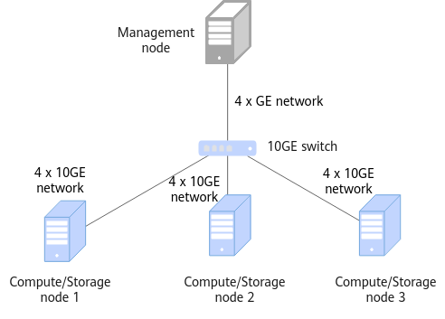

# Installation Guide<a name="EN-US_TOPIC_0000002515622552"></a>

## Installation Overview<a name="EN-US_TOPIC_0000002515782482"></a>

### Network Planning<a name="EN-US_TOPIC_0000002515782488"></a>

A storage-compute coupled networking architecture is recommended for the subfeatures. Storage nodes and compute nodes are shared to maximize the computing acceleration effect in big data scenarios.

The coupled storage and compute network of OmniOperator consists of four servers, which are one management node and three compute nodes. In the following, we will be using HDFS on the storage nodes for illustration:

- The management node is server1, which is used to manage tasks.
- The compute nodes are agent1, agent2, and agent3, which are used to run OmniOperator.

A server can function as a management node and a compute node at the same time. In single-node mode, operations performed on the management node or compute node mentioned in the following sections are performed on the same node.  [Figure 1](#fig734218245342)  shows the networking diagram.

**Figure  1**  Networking diagram<a name="fig734218245342"></a>  


A storage-compute coupled networking architecture is recommended for the subfeatures. Storage nodes and compute nodes are shared to maximize the computing acceleration effect in big data scenarios.
### Environment Requirements<a name="EN-US_TOPIC_0000002515622544"></a>

Before installing OmniOperator, prepare the hardware and software environments to facilitate subsequent installation operations.

**Hardware Requirements<a name="section197116445713"></a>**

[Table 1](#__d0e1171)  lists the hardware requirements for each node in the cluster.

**Table  1**  Hardware requirements

|Item|Management/Compute/Storage Node|
|--|--|
|Processor|Kunpeng 920 seriesKunpeng 950OmniOperator can be enabled for Gluten only on servers that support the SVE instruction set. You can run **cat /proc/cpuinfo | grep sve | head -n 1** to check whether the SVE instruction set is supported. If any command output is displayed, the SVE instruction set is supported.|
|Memory size|384 GB (12 x 32 GB)|
|Memory frequency|2666 MHz|
|Network|Service network: 10GEManagement network: 1GE|
|Drive|System drive: 1 x RAID 0 (1 x 1.2 TB SAS HDD)Data drive: 12 x RAID 0 (12 x 8 TB SATA HDD)|
|RAID controller card|LSI SAS3508|


**OS and Software Requirements<a name="section112321019581"></a>**

[Table 2](#table564mcpsimp)  lists the OS and software requirements for each node in the cluster.

**Table  2**  OS and software requirements

|Item|Version|Description|Management Node (Server)|Compute/Storage Node|
|--|--|--|--|--|
|OS|CentOS 7.9openEuler 20.03 LTS SP1openEuler 22.03 LTS SP1|Later patch versions such as openEuler 20.03 LTS SP3 and openEuler 22.03 LTS SP3 are also supported.|√|√|
|JDK|BiSheng JDK 1.8 (BiSheng JDK 1.8.0_342)|openEuler 22.03 LTS SP1 is incompatible with BiSheng JDK 1.8.0_262, which needs to be replaced with BiSheng JDK 1.8.0_342.For details about how to install the BiSheng JDK, see BiSheng JDK 8 Installation Guide.|√|√|
|Hadoop|3.2.0|See Hadoop Deployment Guide (CentOS 7.6 & openEuler 20.03).|√|√|
|Spark|3.1.13.3.13.4.33.5.2|See Spark Deployment Guide (CentOS 7.6 & openEuler 20.03).|√|-|
|Hive|3.1.0|See Hive Deployment Guide (CentOS 7.6 & openEuler 20.03).|√|-|
|Python|3.10.2 or later|None|√|√|


> **NOTE:** 
>-   √: indicates that the item is required on the node.
>-   -: indicates that the item is not required on the node.
>-   If the preceding third-party software has vulnerabilities, fix the vulnerabilities based on official instructions.
>-   The preceding component versions may be different from those in the  _Deployment Guide_. The  _Deployment Guide_  is for reference only.

**Obtaining Software Packages<a name="section189181357102011"></a>**

[Table 3](#_table677mcpsimp)  lists the software packages required for installing the OmniOperator feature and explains how to obtain them. In subsequent operations, install the required installation packages based on the operation guide.

> **NOTE:** 
>Use on Spark:
>-   SparkExtension requires installing the software packages numbered 1, 2 \(select the SparkExtension version according to the Spark version\), and 5.
>-   Gluten requires installing the software package numbered 4.
>Use on Hive:
>-   HiveExtension requires installing the software packages numbered 1, 3, and 5.

**Table  3**  OmniOperator software packages

|No.|Software Name|Package Name|Release Type|Description|How to Obtain|
|--|--|--|--|--|--|
|1|OmniRuntime package|BoostKit-omniruntime_1.9.0.zip|Closed source|OmniRuntime package (**BoostKit-omniruntime_1.9.0.zip**). Extract the package to obtain the OmniOperator software package **BoostKit-omniop_2.0.0.zip**.|Kunpeng communityBefore using the software package, read and agree to Kunpeng BoostKit User License Agreement 2.0.|
|2|SparkExtension|boostkit-omniop-spark-3.1.1-2.0.0-aarch64.zip|Open source|Spark extension package for the OmniOperator computing base.|Link|
|2|SparkExtension|boostkit-omniop-spark-3.3.1-2.0.0-aarch64.zip|Open source|Spark extension package for the OmniOperator computing base.|Link|
|2|SparkExtension|boostkit-omniop-spark-3.4.3-2.0.0-aarch64.zip|Open source|Spark extension package for the OmniOperator computing base.|Link|
|2|SparkExtension|boostkit-omniop-spark-3.5.2-2.0.0-aarch64.zip|Open source|Spark extension package for the OmniOperator computing base.|Link|
|3|HiveExtension|boostkit-omniop-hive-3.1.0-2.0.0-aarch64.zip|Open source|Hive extension package for the OmniOperator computing base.|Link|
|4|Gluten|Boostkit-omniruntime-gluten-1.0.0.zip|Open source|OmniOperator software installation package (adapted to Gluten)|Link|
|4|Gluten|Dependency_library_Gluten.zip|Open source|Library file on which Gluten depends.|Link|
|5|Dependency_library|Dependency_library_centos.zipDependency_library_openeuler20.03.zipDependency_library_openeuler22.03.zip|Open source|Library file on which OmniOperator depends. Select the dependency package that matches your OS type.|CentOS dependenciesopenEuler 20.03 dependenciesopenEuler 22.03 dependencies|


**Verifying the Software Package Integrity<a name="section16501429204018"></a>**

After downloading a software package from the Kunpeng community, verify the software package to ensure that it is consistent with the original one on the website.

Verify a software package as follows:

1. Obtain the digital certificate and software.
2. Obtain the  [verification tool and guide](https://support.huawei.com/enterprise/en/tool/pgp-verify-TL1000000054).
3. Verify the package integrity by following the procedure described in the  _OpenPGP Signature Verification Guide_  obtained from the URL.

Before installing OmniOperator, prepare the hardware and software environments to facilitate subsequent installation operations.


## Installing the Feature<a name="EN-US_TOPIC_0000002515782478"></a>

### Installation Node Requirements<a name="EN-US_TOPIC_0000002515782464"></a>

This section describes the requirements for installing dependency packages and configuring environment variables on each node before installing OmniOperator.

- If you choose to perform the installation by compiling the source code, before compiling the source code, install GCC/G++, Autoconf, and CMake on each node.  [Table 1](#en-us_topic_0000001519205289_table98249491204)  lists the version requirements.

    > **NOTE:** 
    >-   LLVM and Jemalloc can run properly only after being compiled on the OS. If you want to run them on CentOS, compile them on CentOS. If you want to run them on openEuler 20.03 LTS SP1 or openEuler 22.03 LTS SP1, compile them on openEuler 20.03 LTS SP1 or openEuler 22.03 LTS SP1.
    >-   Gluten depends on the ABSL library and can run properly only after it is compiled and installed on the current OS \(openEuler 22.03 SP1\).

    **Table  1**  Software required for source code compilation

|Software Name|Version Requirement|Download URL|
|--|--|--|
|GCC/G++|openEuler 20.03: 7.3.0|Link|
|GCC/G++|openEuler 22.03: 10.3.0|Link|
|Autoconf|2.69|Link|
|CMake|3.20.5|Link|


    1. Install GCC/G++. The following uses version 7.3.0 as an example.
        1. Check whether the GCC/G++ version is the target version.

            ```
            gcc --version
            g++ --version
            ```

        2. Compile and install GCC/G++.

            ```
            # Extract the installation package and go to the gcc-7.3.0 directory.
            tar -zxvf gcc-7.3.0.tar.gz
            cd gcc-7.3.0
            # Perform compilation and installation.
            mkdir build && cd build
            ../configure --prefix=/usr/local/gcc-7.3.0 --enable-languages=c,c++ --disable-multilib 
            make -j$(nproc)
            make install
            # Set environment variables.
            echo 'export PATH=/usr/local/gcc-7.3.0/bin:$PATH' >> /etc/profile
            echo 'export LD_LIBRARY_PATH=/usr/local/gcc-7.3.0/lib64:$LD_LIBRARY_PATH' >> /etc/profile
            source /etc/profile
            # Verify the Installation.
            gcc --version
            g++ --version
            ```

    2. Compile and install Autoconf.
        1. Check whether the Autoconf version is the target version.

            ```
            autoconf --version
            ```

        2. Compile and install Autoconf.

            ```
            # Extract the installation package and go to the autoconf-2.69 directory.
            tar -zxvf autoconf-2.69.tar.gz
            cd autoconf-2.69
            # Perform compilation and installation.
            ./configure --prefix=/usr/local/autoconf-2.69
            make -j$(nproc)
            make install
            # Set environment variables.
            echo 'export PATH=/usr/local/autoconf-2.69/bin:$PATH' >> /etc/profile
            source /etc/profile
            # Verify the Installation.
            autoconf --version
            ```

    3. Install CMake.
        1. Check whether the CMake version is the target version.

            ```
            cmake --version
            ```

        2. Install CMake.

            ```
            # Extract the installation package to any directory (/opt in this example).
            tar -zxvf cmake-3.20.5-linux-aarch64.tar.gz -C /opt
            # Set environment variables.
            echo 'export PATH=/opt/cmake-3.20.5-linux-aarch64/bin:$PATH' >> /etc/profile
            source /etc/profile
            # Verify the Installation.
            cmake --version
            ```

- Before installing OmniOperator, deploy necessary components in the cluster environment by following instructions in  [OS and Software Requirements](environment-requirements.md#section112321019581).
- Before configuring environment variables, check whether the environment variable  **LD\_LIBRARY\_PATH**  exists in your environment. If the environment variable does not exist, you do not need to add  **$LD\_LIBRARY\_PATH**  during configuration, so as to prevent irrelevant content from being introduced to the current path. Otherwise, security problems may occur. All environment variable export operations in this document comply with this principle. Take  **LD\_LIBRARY\_PATH**  as an example. If  **LD\_LIBRARY\_PATH**  already exists in your environment, use  **export LD\_LIBRARY\_PATH=_$LD\_LIBRARY\_PATH:/xxx_**. Otherwise, use  **export LD\_LIBRARY\_PATH=_/xxx_**.

This section describes the requirements for installing dependency packages and configuring environment variables on each node before installing OmniOperator.
### Installing Dependencies<a name="EN-US_TOPIC_0000002515782474"></a>

When installing OmniOperator locally, install the LLVM and jemalloc dependency packages on the management node to combine OmniOperator and Spark.

In the Spark on Yarn scenario, use the  **--archives**  parameter of Spark to simplify the deployment. You can install the dependencies either by downloading precompiled SO files or by compiling source code. The precompiled SO file can be downloaded and installed quickly, and is suitable for most scenarios. In contrast, compiling and installing from source code is slower, but may be required for certain compliance scenarios.

**Installing Dependencies \(By Downloading Precompiled SO Files for SparkExtension\)<a name="section54515015398"></a>**

**Installing LLVM and jemalloc**

> **NOTE:** 
>-   Select the dependency package based on your OS type. The following uses openEuler 22.03 as an example and the dependency package is  **Dependency\_library\_openeuler22.03.zip**.
>-   The  **/opt/omni-operator**  and  **/opt/omni-operator/lib**  directories can be customized.

1. Create an  **/opt/omni-operator/**  directory on the management node as the root directory for installing OmniOperator. Then go to the directory.

    ```
    mkdir /opt/omni-operator
    cd /opt/omni-operator
    -
    ```

2. Upload the  **Dependency\_library\_openeuler22.03.zip**  package obtained from  [Obtaining Software Packages](environment-requirements.md#section189181357102011)  to the  **/opt/omni-operator/**  directory and extract it.

    ```
    unzip Dependency_library_openeuler22.03.zip
    ```

3. Create an  **/opt/omni-operator/lib**  directory, and copy the  **libLLVM-15.so**  and  **libjemalloc.so.2**  subpackages in  **Dependency\_library\_openeuler**  to the  **/opt/omni-operator/lib**  directory.

    > **NOTICE:** 
    >If LLVM and jemalloc have been installed in the environment, delete the existing  **libLLVM-15.so**  and  **libjemalloc.so.2**  files before running the copy command.
    >```
    >rm -rf /opt/omni-operator/lib/libjemalloc.so.2
    >rm -rf /opt/omni-operator/lib/libLLVM-15.so
    >```

    ```
    cd /opt/omni-operator
    mkdir lib
    cp /opt/omni-operator/Dependency_library_openeuler22.03/libjemalloc.so.2 /opt/omni-operator/lib
    cp /opt/omni-operator/Dependency_library_openeuler22.03/libLLVM-15.so /opt/omni-operator/lib
    ```

**Installing Dependencies \(By Downloading Precompiled SO Files for Gluten\)<a name="section11238405227"></a>**

**Installing LLVM and jemalloc**

> **NOTE:** 
>-   The precompiled SO files of the ABSL library are not provided for Gluten. Therefore, you need to manually compile and install the SO files.
>-   The  **/opt/omni-operator**  and  **/opt/omni-operator/lib**  directories can be customized.

1. Create an  **/opt/omni-operator/**  directory on the management node as the root directory for installing OmniOperator. Then go to the directory.

    ```
    mkdir /opt/omni-operator
    cd /opt/omni-operator
    rm Dependency_library_Gluten.zip -rf
    ```

2. Upload the  **Dependency\_library\_Gluten.zip**  package obtained from  [Obtaining Software Packages](environment-requirements.md#section189181357102011)  to the  **/opt/omni-operator/**  directory and extract it.

    ```
    unzip Dependency_library_Gluten.zip
    ```

3. Create an  **/opt/omni-operator/lib**  directory, and copy the  **libLLVM-15.so**  and  **libjemalloc.so.2**  subpackages in  **Dependency\_library\_Gluten**  to the  **/opt/omni-operator/lib**  directory.

    > **NOTICE:** 
    >If LLVM and jemalloc have been installed in the environment, delete the existing  **libLLVM-15.so**  and  **libjemalloc.so.2**  files before running the copy command.
    >```
    >rm -rf /opt/omni-operator/lib/libjemalloc.so.2
    >rm -rf /opt/omni-operator/lib/libLLVM-15.so
    >```

    ```
    cd /opt/omni-operator
    mkdir lib
    cp /opt/omni-operator/Dependency_library_Gluten/libjemalloc.so.2 /opt/omni-operator/lib
    cp /opt/omni-operator/Dependency_library_Gluten/libLLVM-15.so /opt/omni-operator/lib
    ```

4. Compile and install ABSL. For details, see  [1](#li17569353267)  to  [3](#li1220195592616)  in the procedure for installing ABSL.

**Installing Dependencies \(By Compiling and Installing Source Code for SparkExtension and Gluten\)<a name="section3182322111816"></a>**

**Installing LLVM**

> **NOTE:** 
>The  **/opt/omni-operator**,  **/opt/omni-operator/llvm**, and  **/opt/omni-operator/lib**  directories can be customized.

1. Download  [llvm-project-llvmorg-15.0.4.tar.gz](https://github.com/llvm/llvm-project/archive/refs/tags/llvmorg-15.0.4.tar.gz), create an  **/opt/omni-operator**  directory on the management node as the root directory for installing OmniOperator, go to the directory, and upload the package to  **/opt/omni-operator**.

    ```
    mkdir /opt/omni-operator
    cd /opt/omni-operator
    tar zxvf llvm-project-llvmorg-15.0.4.tar.gz
    mv llvm-project-llvmorg-15.0.4 llvm
    cd llvm
    mkdir build
    ```

2. Go to the  **build**  directory, and compile and install LLVM.

    ```
    cd ./build
    cmake -DCMAKE_INSTALL_PREFIX=/opt/omni-operator/llvm -DCMAKE_BUILD_TYPE=Release -DLLVM_BUILD_LLVM_DYLIB=true -DLLVM_ENABLE_PROJECTS="clang" -G "Unix Makefiles" ../llvm
    make -j4
    make install
    ```

3. Create a  **lib**  directory in  **/opt/omni-operator**  and copy  **/opt/omni-operator/llvm/lib/libLLVM-15.so**  to  **/opt/omni-operator/lib**.

    ```
    mkdir /opt/omni-operator/lib
    cp /opt/omni-operator/llvm/lib/libLLVM-15.so /opt/omni-operator/lib/
    ```

**Installing jemalloc**

1. Download  [jemalloc-5.3.0.tar.gz](https://github.com/jemalloc/jemalloc/archive/refs/tags/5.3.0.tar.gz)  and upload it to the management node.

    ```
    cd /opt/omni-operator/
    tar zxvf jemalloc-5.3.0.tar.gz
    mv jemalloc-5.3.0 jemalloc
    ```

    > **NOTE:** 
    >The  **/opt/omni-operator/jemalloc**  directory can be customized.

2. Go to the  **jemalloc**  directory, run the script, and install the generated file.

    ```
    cd jemalloc
    ./autogen.sh --disable-initial-exec-tls
    make -j2
    ```

3. Copy  **/opt/omni-operator/jemalloc/lib/libjemalloc.so.2**  to the  **/opt/omni-operator/lib**  directory.

    ```
    cp /opt/omni-operator/jemalloc/lib/libjemalloc.so.2 /opt/omni-operator/lib/
    ```

**Installing ABSL**  \(required only when ABSL is enabled for Gluten\)

1. <a name="li17569353267"></a>Download the ABSL source code to the management node.

    ```
    git clone https://szv-open.codehub.huawei.com/OpenSourceCenter/abseil/abseil-cpp.git
    cd abseil-cpp/
    git checkout tags/20250127.0
    ```

2. Compile the ABSL source code.

    ```
    mkdir build && cd build
    cmake ..   -DCMAKE_CXX_STANDARD=17   -DCMAKE_CXX_STANDARD_REQUIRED=ON   -DABSL_PROPAGATE_CXX_STD=ON -DBUILD_SHARED_LIBS=ON
    make -j32
    make install
    ```

3. <a name="li1220195592616"></a>Copy the compiled ABSL library to  **/opt/omni-operator/lib**.

    ```
    cp /usr/local/lib64/libabsl_* /opt/omni-operator/lib
    ```

When installing OmniOperator locally, install the LLVM and jemalloc dependency packages on the management node to combine OmniOperator and Spark.
### Installing OmniOperator<a name="EN-US_TOPIC_0000002515622558"></a>

Install OmniOperator on the management and compute nodes and set environment variables. If OmniOperator is enabled for Gluten, skip this section.

> **NOTE:** 
>-   **BoostKit-omniop\_2.0.0.zip**  can be obtained by extracting  **BoostKit-omniruntime\_2.0.0.zip**. The  **BoostKit-omniop\_2.0.0.zip**  package contains the  **boostkit-omniop-operator-2.0.0-aarch64-openeuler.tar.gz**  and  **boostkit-omniop-operator-2.0.0-aarch64-centos.tar.gz**  packages, which are used for openEuler and CentOS, respectively. The following uses openEuler as an example.
>-   To install OmniOperator on CentOS, replace  **boostkit-omniop-operator-2.0.0-aarch64-openeuler.tar.gz**  in the following commands with  **boostkit-omniop-operator-2.0.0-aarch64-centos.tar.gz**.

1. Upload OmniOperator packages obtained in  [Obtaining Software Packages](environment-requirements.md#section189181357102011)  to the  **/opt/omni-operator/**  directory on the management and compute nodes.
2. Go to the  **/opt/omni-operator/**  directory and extract the packages.

    ```
    cd /opt/omni-operator/
    unzip BoostKit-omniruntime_1.9.0.zip
    unzip BoostKit-omniop_2.0.0.zip
    tar -zxvf boostkit-omniop-operator-2.0.0-aarch64-openeuler.tar.gz
    ```

3. Copy OmniOperator files to the  **/opt/omni-operator/lib**  directory and set the permission on the software packages in the directory to  **550**.

    ```
    cd /opt/omni-operator/boostkit-omniop-operator-2.0.0-aarch64
    cp -r include libboostkit* boostkit-omniop* libsecurec.so /opt/omni-operator/lib/
    chmod -R 550 /opt/omni-operator/lib/*
    ```

4. Create a  **conf**  folder in the  **/opt/omni-operator**  directory and set the folder permission to  **750**.

    ```
    cd /opt/omni-operator
    mkdir conf
    chmod 750 /opt/omni-operator/conf
    ```

5. Create an  **omni.conf**  file in the  **conf**  folder and change the file permission to  **640**, which is required to set OmniOperator configuration items.

    ```
    cd conf
    touch omni.conf
    chmod 640 omni.conf
    ```

6. Delete redundant files from  **/opt/omni-operator**.

    ```
    mkdir -p /opt/omni-operator-bak
    mv /opt/omni-operator/lib /opt/omni-operator-bak
    mv /opt/omni-operator/conf /opt/omni-operator-bak
    ls /opt/omni-operator
    rm -rf /opt/omni-operator
    cd /opt
    mv omni-operator-bak omni-operator
    ```

Install OmniOperator on the management and compute nodes and set environment variables. If OmniOperator is enabled for Gluten, skip this section.
### \(Optional\) Installing the UDF Plugin<a name="EN-US_TOPIC_0000002515622536"></a>

You need to perform the operations described in this section only when your service scenario involves user-defined functions \(UDFs\). Perform the following plugin operation operations only on the management node. UDFs cannot be accelerated when OmniOperator is enabled for Gluten.

This plugin supports only the HiveSimpleUDF type \(simple UDFs written based on the Hive UDF framework\). HiveSimpleUDF is built on the Hive UDF framework and is used to extend the set of functions available in Hive queries. Spark supports Hive UDF interfaces. Therefore, HiveSimpleUDF can be directly used in a Spark environment.

OmniOperator accelerates UDFs through row-by-row or batch processing. You can switch between these two processing modes by modifying the configuration file.

**Prerequisites<a name="section15136154016211"></a>**

- Ensure that your UDFs are simple UDFs implemented based on the Hive UDF framework.
- To use OmniOperator to accelerate UDFs, you need to provide related JAR packages and configuration files, including the following files:
- **udf.zip**: contains the class files of all UDFs.
- **conf.zip**: contains the configuration files on which the UDFs depend.
- **udf.properties**: used to configure OmniOperator to accelerate UDFs.

    Using  **udfName1**  and  **udfName2**  as examples, the  **udf.properties**  file has the following format:

    ```
    udfName1 com.huawei.udf.UdfName1
    udfName2 com.huawei.udf.UdfName2
    ```

**Installing the UDF Plugin Row-by-Row Processing<a name="section5383205172111"></a>**

1. Create an  **/opt/omni-operator/hive-udf**  directory on the management node.

    ```
    mkdir /opt/omni-operator/hive-udf
    ```

2. Upload the  **udf.zip**  and  **conf.zip**  packages to the  **/opt/omni-operator/hive-udf**  directory on the management node.

    > **NOTE:** 
    >You can customize the example names of the  **udf.zip**  and  **conf.zip**  packages based on your service requirements.

3. Extract the files.

    ```
    cd /opt/omni-operator/hive-udf
    unzip udf.zip
    rm -f udf.zip
    unzip conf.zip
    rm -f conf.zip
    ```

4. Modify the  **/opt/omni-operator/conf/omni.conf**  file.
    1. Open the configuration file.

        ```
        vi /opt/omni-operator/conf/omni.conf
        ```

    2. Press  **i**  to enter the insert mode and add the following UDF configuration.

        ```
        # <----UDF properties---->
        # false indicates expression row-by-row processing and true indicates expression bath processing.
        enableBatchExprEvaluate=false
        # UDF trustlist file path
        hiveUdfPropertyFilePath=./hive-udf/udf.properties
        # Directory of the Hive UDF JAR package
        hiveUdfDir=./hive-udf/udf
        ```

        > **NOTE:** 
        >The directory must start with a period \(.\). When OmniOperator is running, it reads the value of the  **OMNI\_HOME**  environment variable and uses this value to replace the period \(.\).

    3. Press  **Esc**, type  **:wq!**, and press  **Enter**  to save the file and exit.

5. Update the environment variable.
    1. Open the  **\~/.bashrc**  file.

        ```
        vi ~/.bashrc
        ```

    2. Press  **i**  to enter the insert mode and add  **LD\_LIBRARY\_PATH**  to update environment variables.

        ```
        export LD_LIBRARY_PATH=$LD_LIBRARY_PATH:${JAVA_HOME}/jre/lib/aarch64/server
        ```

    3. Press  **Esc**, type  **:wq!**, and press  **Enter**  to save the file and exit.
    4. Make the updated environment variable take effect.

        ```
        source ~/.bashrc
        ```

**Installing the UDF Plugin Batch Processing<a name="section518339172217"></a>**

After installing row-by-row processing on the management node, modify the  **/opt/omni-operator/conf/omni.conf**  file to support batch processing.

1. Open the file.

    ```
    vi /opt/omni-operator/conf/omni.conf
    ```

2. Press  **i**  to enter the insert mode, find the following statements, and modify them.

    ```
    enableBatchExprEvaluate=true
    ```

3. Press  **Esc**, type  **:wq!**, and press  **Enter**  to save the file and exit.

You need to perform the operations described in this section only when your service scenario involves user-defined functions \(UDFs\). Perform the following plugin operation operations only on the management node. UDFs cannot be accelerated when OmniOperator is enabled for Gluten.


