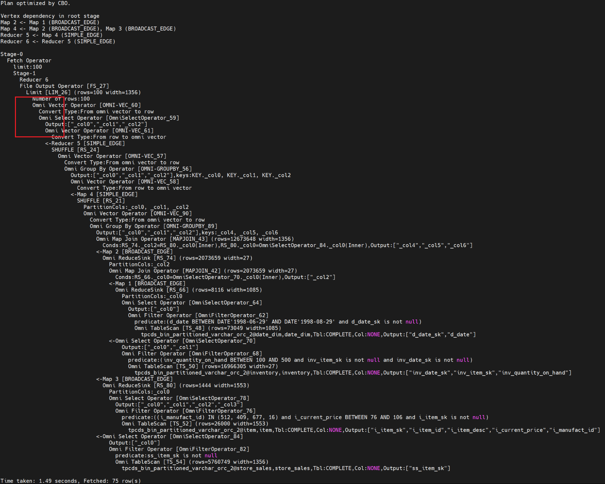
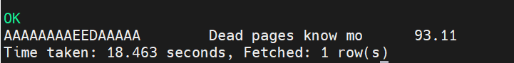
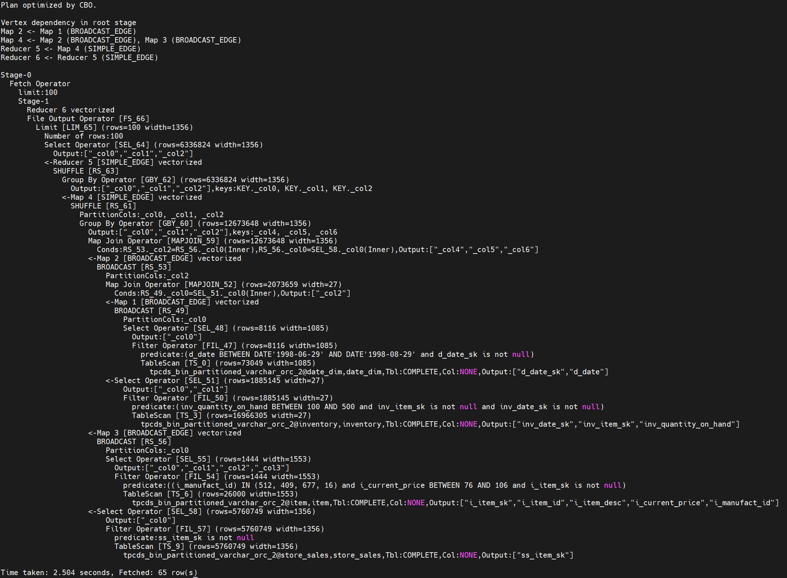
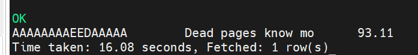

# User Guide<a name="EN-US_TOPIC_0000002547462879"></a>

## Using the Feature<a name="EN-US_TOPIC_0000002515743064"></a>

### Use on Spark<a name="EN-US_TOPIC_0000002547382891"></a>

#### Enablement on SparkExtension<a name="EN-US_TOPIC_0000002515902952"></a>

##### Overview<a name="EN-US_TOPIC_0000002515743060"></a>

When using the OmniOperator feature on Spark, you can enable it through SparkExtension or Gluten. Choose the appropriate enabling mode based on your specific scenario and requirements to maximize acceleration.

If you are using Spark 3.3.1, it is recommended to use Gluten to enable OmniOperator. For other Spark versions, use SparkExtension.

If you choose SparkExtension to enable OmniOperator, install the corresponding Spark and SparkExtension. For details about the Spark installation requirements, see the [Installation Guide](installation_guide.md). The sections that follow describe how to install and configure SparkExtension, and how to apply the OmniOperator feature to Spark.

When using the OmniOperator feature on Spark, you can enable it through SparkExtension or Gluten. Choose the appropriate enabling mode based on your specific scenario and requirements to maximize acceleration.
##### Supported Operators and Expressions<a name="EN-US_TOPIC_0000002515902958"></a>

This section describes the support scope, restrictions, and usage rules for SQL operators and expressions (including data types) when the OmniOperator feature is used with SparkExtension.

When the OmniOperator feature is used in SparkExtension, it supports the operators, expressions, and functions listed in [**Table 2** List of supported operators](#List of supported operators), [**Table 3** List of supported expressions](#List of supported expressions), and [**Table 4** List of supported cast expressions](#List of supported cast expressions). Symbols in the tables indicate whether operators and expressions are supported. For details about the meanings of the symbols, see [**Table 1** Meanings of the symbols](#Meanings of the symbols).

> **Notice:**
>-   This section uses Spark 3.3.1 as an example to describe the operators and expressions supported by OmniOperator.
>-   In this section, [List of supported operators](#section176711256181910) and [List of supported expressions](#section5353103435216) describe only the data types supported or involved by OmniOperator. The data types (BYTE/FLOAT/BINARY/ARRAY/MAP/STRUCT/CALENDAR/UDT), which are not listed, are not supported by OmniOperator.
>-   If you use operators and expressions that are not supported by OmniOperator, the execution plan will be rolled back to open-source execution, which deteriorates the performance.

**Table 1** Meanings of the symbols<a id="Meanings of the symbols"></a>

|Status| Description                                                              |
|--|------------------------------------------------------------------|
|S| Indicates that the operator or expression is supported.                                                    |
|PS| Indicates that the operator or expression is partially supported, with some restrictions. For details about the restrictions, see [Project Introduction](../../README.md).|
|NS| Indicates that the operator or expression is not supported.                                                   |
|NA| Indicates that the operator or expression is not involved. This scenario does not exist in open-source Spark.                                 |
|NA-2| Indicates a context function implemented based on open-source Spark, which does not involve using OmniOperator.                      |
|[Blank Cell]| Indicates a scenario that is irrelevant or needs to be confirmed.                                                     |


**List of Supported Operators<a name="section176711256181910" id="section176711256181910"></a>**

[**Table 2** List of supported operators](#List of supported operators) lists the operators supported by OmniOperator on Spark.

**Table 2** List of supported operators<a id="List of supported operators"></a>

|**Open-Source Operator**|**OmniOperator Operator**|**BOOLEAN**|**INT**|**LONG**|**DOUBLE**|**STRING**|**CHAR**|**VARCHAR**|**DATE**|**DECIMAL**|**SHORT**|**TIMESTAMP**|
|--|--|--|--|--|--|--|--|--|--|--|--|--|
|FileSourceScanExec|ColumnarFileSourceScanExec|S|S|S|S|S|S|S|S|S|S|S|
|ProjectExec|ColumnarProjectExec|S|S|S|S|S|S|S|S|S|NS|S|
|FilterExec|ColumnarFilterExec|S|S|S|S|S|S|S|S|S|NS|S|
|ProjectExec+FilterExec|ColumnarConditionProjectExec|S|S|S|S|S|S|S|S|S|NS|S|
|ExpandExec|ColumnarExpandExec|S|S|S|S|S|S|S|S|S|NS|S|
|HashAggregateExec|ColumnarHashAggregateExec|S|S|S|S|S|S|S|S|S|S|S|
|TopNSortExec|ColumnarTopNSortExec|S|S|S|S|S|S|S|S|S|NS|S|
|SortExec|ColumnarSortExec|S|S|S|S|S|S|S|S|S|S|S|
|BroadcastExchangeExec|ColumnarBroadcastExchangeExec|S|S|S|S|S|S|S|S|S|S|S|
|TakeOrderedAndProjectExec|ColumnarTakeOrderedAndProjectExec|S|S|S|S|S|S|S|S|S|S|S|
|UnionExec|ColumnarUnionExec|S|S|S|S|S|S|S|S|S|S|S|
|ShuffleExchangeExec|ColumnarShuffleExchangeExec|S|S|S|S|S|S|S|S|S|S|S|
|BroadcastHashJoinExec|ColumnarBroadcastHashJoinExec|S|S|S|S|S|S|S|S|S|S|S|
|SortMergeJoinExec|ColumnarSortMergeJoinExec|S|S|S|S|S|S|S|S|S|S|S|
|WindowExec|ColumnarWindowExec|S|S|S|S|S|S|S|S|S|S|S|
|ShuffledHashJoinExec|ColumnarShuffledHashJoinExec|S|S|S|S|S|S|S|S|S|S|S|
|LocalLimitExec|ColumnarLocalLimitExec|S|S|S|S|S|S|S|S|S|S|S|
|GlobalLimitExec|ColumnarGlobalLimitExec|S|S|S|S|S|S|S|S|S|S|S|
|CoalesceExec|ColumnarCoalesceExec|S|S|S|S|S|S|S|S|S|S|S|
|SubqueryBroadcastExec|OmniColumnarSubqueryBroadcastExec|S|S|S|S|S|S|S|S|S|S|S|
|AQEShuffleReadExec|OmniAQEShuffleReadExec|S|S|S|S|S|S|S|S|S|S|S|
|WindowGroupLimitExec|ColumnarWindowGroupLimitExec|S|S|S|S|S|S|S|S|S|NS|S|


**List of Supported Expressions<a name="section5353103435216" id="section5353103435216"></a>**

[**Table 3** List of supported expressions](#List of supported expressions) lists the expressions and functions supported by OmniOperator on Spark.

**Table 3** List of supported expressions<a id="List of supported expressions"></a>

| **Expression**               |**Supported by OmniOperator**|**Function Type**| **Restriction**                                                                                            | **BOOLEAN**      | **INT**      | **LONG**     | **DOUBLE**   | **STRING**   | **CHAR**     | **VARCHAR**  | **DATE**     | **DECIMAL**  | **NULL**     | **SHORT**    | **TIMESTAMP** | **ARRAY**    |
|------------------------|--|--|----------------------------------------------------------------------------------------------------------------------|------------------|--------------|--------------|--------------|--------------|--------------|--------------|--------------|--------------|--------------|--------------|---------------|--------------|
| !                      |S|Scalar Functions| -                                                                                                                    | S                | NA           | NA           | NA           | NA           | NA           | NA           | NA           | NA           | S            | NA           | NA            | NA           |
| %                      |S|Scalar Functions| -                                                                                                                    | NA               | S            | S            | S            | S            | S            | S            | NA           | S            | S            | NS           | NA            | NS           |
| *                      |S|Scalar Functions| -                                                                                                                    | NA               | S            | S            | S            | S            | S            | S            | NA           | S            | S            | NS           | NA            | NS           |
| +                      |S|Scalar Functions| -                                                                                                                    | NA               | S            | S            | S            | S            | S            | S            | NA           | S            | S            | NS           | NA            | NS           |
| -                      |S|Scalar Functions| -                                                                                                                    | NA               | S            | S            | S            | S            | S            | S            | NA           | S            | S            | NS           | NA            | NS           |
| /                      |S|Scalar Functions| -                                                                                                                    | NA               | S            | S            | S            | S            | S            | S            | NA           | S            | S            | NS           | NA            | NS           |
| <                      |S|Scalar Functions| -                                                                                                                    | NS               | S            | S            | S            | S            | S            | S            | S            | S            | S            | NS           | S             | NS           |
| <=                     |S|Scalar Functions| -                                                                                                                    | NS               | S            | S            | S            | S            | S            | S            | S            | S            | S            | NS           | S             | NS           |
| \>                     |S|Scalar Functions| -                                                                                                                    | NS               | S            | S            | S            | S            | S            | S            | S            | S            | S            | NS           | S             | NS           |
| \>=                    |S|Scalar Functions| -                                                                                                                    | NS               | S            | S            | S            | S            | S            | S            | S            | S            | S            | NS           | S             | NS           |
| and                    |S|Scalar Functions| -                                                                                                                    | S                | NA           | NA           | NA           | NA           | NA           | NA           | NA           | NA           | S            | NA           | NA            | NA           |
| any                    |S|Aggregate Functions| -                                                                                                                    | S                | NA           | NA           | NA           | NA           | NA           | NA           | NA           | NA           | S            | NA           | NA            | NA           |
| avg                    |S|Aggregate Functions| -                                                                                                                    | NA               | S            | S            | S            | S            | S            | S            | NA           | S            | S            | S            | NA            | NA           |
| between                |S|Scalar Functions| -                                                                                                                    | NS               | S            | S            | S            | S            | S            | S            | S            | S            | S            | NS           | S             | NS           |
| bool_and               |S|Aggregate Functions| -                                                                                                                    | S                | NA           | NA           | NA           | NA           | NA           | NA           | NA           | NA           | S            | NA           | NA            | NA           |
| bool_or                |S|Aggregate Functions| -                                                                                                                    | S                | NA           | NA           | NA           | NA           | NA           | NA           | NA           | NA           | S            | NA           | NA            | NA           |
| case                   |S|Scalar Functions| -                                                                                                                    | NS               | S            | S            | S            | S            | S            | S            | S            | S            | S            | NS           | S             | NS           |
| cast                   |S|Scalar Functions| For details, see [**Table 4** List of supported cast expressions](#List of supported cast expressions).                                                                           | [Blank Cell]     | [Blank Cell] | [Blank Cell] | [Blank Cell] | [Blank Cell] | [Blank Cell] | [Blank Cell] | [Blank Cell] | [Blank Cell] | [Blank Cell] | [Blank Cell] | [Blank Cell]  | [Blank Cell] |
| char_length            |S|Scalar Functions| -                                                                                                                    | NS               | S            | S            | S            | S            | S            | S            | S            | S            | S            | NS           | NS            | NA           |
| character_length       |S|Scalar Functions| -                                                                                                                    | NS               | S            | S            | S            | S            | S            | S            | S            | S            | S            | NS           | NS            | NA           |
| charTypeWriteSideCheck |S|Scalar Functions| -                                                                                                                    | NA               | NA           | NA           | NA           | S            | S            | S            | NA           | NA           | S            | NA           | NA            | NA           |
| concat_ws              |S|Scalar Functions| -                                                                                                                    | NS               | CS           | CS           | CS           | S            | S            | S            | CS           | CS           | S            | CS           | NS            | NS           |
| count                  |PS|Aggregate Functions| Only one input parameter is allowed.                                                                                                         | S                | S            | S            | S            | S            | S            | S            | S            | S            | S            | S            | S             | NS           |
| count_if               |S|Aggregate Functions| -                                                                                                                    | S                | NA           | NA           | NA           | NA           | NA           | NA           | NA           | NA           | S            | NA           | NA            | NA           |
| current_catalog        |NA-2|Scalar Functions| -                                                                                                                    | [Blank Cell]     | [Blank Cell] | [Blank Cell] | [Blank Cell] | [Blank Cell] | [Blank Cell] | [Blank Cell] | [Blank Cell] | [Blank Cell] | [Blank Cell] | [Blank Cell] | [Blank Cell]  | [Blank Cell] |
| current_database       |NA-2|Scalar Functions| -                                                                                                                    | [Blank Cell]     | [Blank Cell] | [Blank Cell] | [Blank Cell] | [Blank Cell] | [Blank Cell] | [Blank Cell] | [Blank Cell] | [Blank Cell] | [Blank Cell] | [Blank Cell] | [Blank Cell]  | [Blank Cell] |
| current_date           |NA-2|Scalar Functions| -                                                                                                                    | [Blank Cell]     | [Blank Cell] | [Blank Cell] | [Blank Cell] | [Blank Cell] | [Blank Cell] | [Blank Cell] | [Blank Cell] | [Blank Cell] | [Blank Cell] | [Blank Cell] | [Blank Cell]  | [Blank Cell] |
| current_timezone       |NA-2|Scalar Functions| -                                                                                                                    | [Blank Cell]     | [Blank Cell] | [Blank Cell] | [Blank Cell] | [Blank Cell] | [Blank Cell] | [Blank Cell] | [Blank Cell] | [Blank Cell] | [Blank Cell] | [Blank Cell] | [Blank Cell]  | [Blank Cell] |
| current_user           |NA-2|Scalar Functions| -                                                                                                                    | [Blank Cell]     | [Blank Cell] | [Blank Cell] | [Blank Cell] | [Blank Cell] | [Blank Cell] | [Blank Cell] | [Blank Cell] | [Blank Cell] | [Blank Cell] | [Blank Cell] | [Blank Cell]  | [Blank Cell] |
| datediff               |S|Scalar Functions| -                                                                                                                    | NA               | NA           | NA           | NA           | CS           | CS           | CS           | S            | NA           | S            | NA           | NA            | NA           |
| every                  |S|Aggregate Functions| -                                                                                                                    | S                | NA           | NA           | NA           | NA           | NA           | NA           | NA           | NA           | S            | NA           | NA            | NA           |
| first                  |S|Aggregate Functions| -                                                                                                                    | S                | S            | S            | S            | NS           | NS           | NS           | S            | S            | NS           | S            | S             | NS           |
| first_value            |S|Aggregate Functions| -                                                                                                                    | S                | S            | S            | S            | NS           | NS           | NS           | S            | S            | NS           | S            | S             | NS           |
| get_json_object        |S|Scalar Functions| -                                                                                                                    | NA                | NA           | NA            | NA           | S            | S            | S            | NA            | NA           | S| NA            | NA            | NA           |
| grouping_id            |S|Aggregate Functions| -                                                                                                                    | NA               | NA           | NA           | NA           | NA           | NA           | NA           | NA           | NA           | NA           | NA           | NA            | NA           |
| if                     |S|Scalar Functions| -                                                                                                                    | S                | S            | S            | S            | S            | S            | S            | S            | S            | S            | NS           | S             | NS           |
| instr                  |S|Scalar Functions| -                                                                                                                    | NS               | S            | S            | S            | S            | S            | S            | S            | S            | S            | NS           | NS            | NA           |
| isnotnull              |S|Scalar Functions| -                                                                                                                    | S                | S            | S            | S            | S            | S            | S            | S            | S            | S            | NS           | S             | NS           |
| isnull                 |S|Scalar Functions| -                                                                                                                    | S                | S            | S            | S            | S            | S            | S            | S            | S            | S            | NS           | S             | NS           |
| lcase                  |S|Scalar Functions| -                                                                                                                    | NS               | S            | S            | S            | S            | S            | S            | S            | S            | S            | NS           | NS            | NA           |
| least                  |S|Scalar Functions| Two input parameters are used.                                                                                                         | S                | S            | S            | S            | S            | S            | S            | NS           | S            | S            | S            | NS            | NS           |
| left                   |S|Scalar Functions| -                                                                                                                    | NS               | S            | S            | S            | S            | S            | S            | S            | S            | S            | NS           | NS            | NA           |
| length                 |S|Scalar Functions| -                                                                                                                    | NS               | S            | S            | S            | S            | S            | S            | S            | S            | S            | NS           | NS            | NA           |
| lower                  |S|Scalar Functions| -                                                                                                                    | NS               | S            | S            | S            | S            | S            | S            | S            | S            | S            | NS           | NS            | NA           |
| max                    |S|Aggregate Functions| -                                                                                                                    | S                | S            | S            | S            | NS           | NS           | NS           | S            | S            | NS           | S            | S             | NS           |
| md5                    |PS|Scalar Functions| The input parameter must be a variable of the String type.                                                                                                   | NA               | NA           | NA           | NA           | S            | S            | S            | NA           | NA           | S            | NA           | NA            | NA           |
| mean                   |S|Aggregate Functions| -                                                                                                                    | NA               | S            | S            | S            | S            | S            | S            | NA           | S            | S            | S            | NA            | NA           |
| min                    |S|Aggregate Functions| -                                                                                                                    | S                | S            | S            | S            | NS           | NS           | NS           | S            | S            | NS           | S            | S             | NS           |
| mod                    |S|Scalar Functions| -                                                                                                                    | NA               | S            | S            | S            | S            | S            | S            | NA           | S            | S            | NS           | NA            | NA           |
| not                    |S|Scalar Functions| -                                                                                                                    | S                | NA           | NA           | NA           | NA           | NA           | NA           | NA           | NA           | S            | NA           | NA            | NA           |
| nullif                 |S|Scalar Functions| -                                                                                                                    | NS               | S            | S            | S            | S            | S            | S            | S            | S            | S            | NS           | S             | NS           |
| nvl2                   |S|Scalar Functions| -                                                                                                                    | S                | S            | S            | S            | S            | S            | S            | S            | S            | S            | NS           | S             | NS           |
| or                     |S|Scalar Functions| -                                                                                                                    | S                | NA           | NA           | NA           | NA           | NA           | NA           | NA           | NA           | S            | NA           | NA            | NA           |
| positive               |S|Scalar Functions| -                                                                                                                    | NA               | S            | S            | S            | S            | S            | S            | NA           | S            | S            | NS           | NA            | NA           |
| pmod                   |S|Scalar Functions| -                                                                                                                    | NA               | S            | S            | NS           | NS           | NS           | NS           | NA           | NS           | S            | S            | NA            | NA           |
| rank                   |S|Window Functions| No input parameter is involved.                                                                                                               | NA               | NA           | NA           | NA           | NA           | NA           | NA           | NA           | NA           | NA           | NA           | NA            | NA           |
| replace                |S|Scalar Functions| -                                                                                                                    | NS               | S            | S            | S            | S            | S            | S            | S            | S            | S            | NS           | NS            | NA           |
| round                  |S|Scalar Functions| -                                                                                                                    | NA               | S            | S            | S            | S            | S            | S            | NA           | S            | S            | NS           | NA            | NA           |
| row_number             |S|Window Functions| No input parameter is involved.                                                                                                               | NA               | NA           | NA           | NA           | NA           | NA           | NA           | NA           | NA           | NA           | NA           | NA            | NA           |
| some                   |S|Aggregate Functions| -                                                                                                                    | S                | NA           | NA           | NA           | NA           | NA           | NA           | NA           | NA           | S            | NA           | NA            | NA           |
| substr                 |S|Scalar Functions| -                                                                                                                    | NA               | S            | S            | S            | S            | S            | S            | S            | S            | S            | NS           | NS            | NA           |
| substring              |S|Scalar Functions| -                                                                                                                    | NA               | S            | S            | S            | S            | S            | S            | S            | S            | S            | NS           | NS            | NA           |
| trunc                  |S|Scalar Functions| -                                                                                                                    | NA               | NA           | NA           | NA           | S            | S            | S            | S            | NA           | S            | NA           | NS            | NA           |
| ucase                  |S|Scalar Functions| -                                                                                                                    | NS               | S            | S            | S            | S            | S            | S            | S            | S            | S            | NS           | NS            | NA           |
| upper                  |S|Scalar Functions| -                                                                                                                    | NS               | S            | S            | S            | S            | S            | S            | S            | S            | S            | NS           | NS            | NA           |
| when                   |S|Scalar Functions| -                                                                                                                    | NS               | S            | S            | S            | S            | S            | S            | S            | S            | S            | NS           | NS            | NS           |
| !=                     |S|Scalar Functions| -                                                                                                                    | NS               | S            | S            | S            | S            | S            | S            | S            | S            | S            | NS           | S             | NS           |
| <>                     |S|Scalar Functions| -                                                                                                                    | NS               | S            | S            | S            | S            | S            | S            | S            | S            | S            | NS           | S             | NS           |
| =                      |S|Scalar Functions| -                                                                                                                    | NS               | S            | S            | S            | S            | S            | S            | S            | S            | S            | NS           | S             | NS           |
| ==                     |S|Scalar Functions| -                                                                                                                    | NS               | S            | S            | S            | S            | S            | S            | S            | S            | S            | NS           | S             | NS           |
| abs                    |S|Scalar Functions| -                                                                                                                    | NA               | S            | S            | S            | S            | S            | S            | NA           | S            | S            | NS           | NA            | NA           |
| concat                 |S|Scalar Functions| -                                                                                                                    | NS               | S            | S            | S            | S            | S            | S            | S            | S            | S            | NS           | NS            | NS           |
| contains               |S|Scalar Functions| -                                                                                                                    | NS               | S            | S            | S            | S            | S            | S            | S            | S            | S            | NS           | NS            | NA           |
| decode                 |PS|Scalar Functions| The number of input parameters must be greater than 2.                                                                                                      | NS               | S            | S            | S            | S            | S            | S            | S            | S            | S            | NS           | NS            | NS           |
| endswith               |PS|Scalar Functions| The second input parameter must be a constant of the String type.                                                                                                | NS               | S            | S            | S            | S            | S            | S            | S            | S            | S            | NS           | NS            | NA           |
| hash                   |S|Scalar Functions| -                                                                                                                    | S                | S            | S            | S            | S            | S            | S            | S            | S            | S            | NS           | S             | NS           |
| ifnull                 |S|Scalar Functions| -                                                                                                                    | S                | S            | S            | S            | S            | S            | S            | S            | S            | S            | NS           | S             | NS           |
| in                     |S|Scalar Functions| -                                                                                                                    | NS               | S            | S            | S            | S            | S            | S            | S            | S            | S            | NS           | S             | NS           |
| like                   |PS|Scalar Functions| The second input parameter must be a constant of the String type, and the constant cannot contain underscores (_) or more than one percent sign (%).                                                                            | NS               | S            | S            | S            | S            | S            | S            | S            | S            | S            | NS           | NS            | NA           |
| nvl                    |S|Scalar Functions| -                                                                                                                    | S                | S            | S            | S            | S            | S            | S            | S            | S            | S            | NS           | S             | NS           |
| regexp                 |PS|Scalar Functions| The second input parameter must be a constant of the String type, that is, '^\\d+$'                                                                                        | NS               | S            | S            | S            | S            | S            | S            | S            | S            | S            | NS           | NS            | NA           |
| regexp_like            |PS|Scalar Functions| The second input parameter must be a constant of the String type, that is, '^\\d+$'                                                                                        | NS               | S            | S            | S            | S            | S            | S            | S            | S            | S            | NS           | NS            | NA           |
| regr_avgx              |S|Aggregate Functions| -                                                                                                                    | NA               | S            | S            | S            | S            | S            | S            | NA           | S            | S            | NS           | NA            | NA           |
| regr_avgy              |S|Aggregate Functions| -                                                                                                                    | NA               | S            | S            | S            | S            | S            | S            | NA           | S            | S            | NS           | NA            | NA           |
| right                  |S|Scalar Functions| -                                                                                                                    | NS               | S            | S            | S            | S            | S            | S            | S            | S            | S            | NS           | NS            | NA           |
| rlike                  |PS|Scalar Functions| The second input parameter must be a constant of the String type, that is, '^\\d+$'                                                                                        | NS               | S            | S            | S            | S            | S            | S            | S            | S            | S            | NS           | NS            | NA           |
| startswith             |PS|Scalar Functions| The second input parameter must be a constant of the String type.                                                                                                | NS               | S            | S            | S            | S            | S            | S            | S            | S            | S            | NS           | NS            | NA           |
| sum                    |S|Aggregate Functions| -                                                                                                                    | NA               | S            | S            | S            | S            | S            | S            | NA           | S            | S            | S            | NA            | NA           |
| to_date                |PS|Scalar Functions| Only one input parameter is allowed.                                                                                                         | NS               | S            | S            | S            | S            | S            | S            | S            | S            | S            | NS           | NS            | NA           |
| xxhash64               |S|Scalar Functions| -                                                                                                                    | S                | S            | S            | S            | S            | S            | S            | S            | S            | S            | NS           | S             | NS           |
|                        ||| S                                                                                                                    | Scalar Functions | -            | NS           | S            | S            | S            | S            | S            | S            | S            | S            | S             | NS           |
| bigint                 |S|Scalar Functions| -                                                                                                                    | NS               | S            | S            | S            | S            | S            | S            | NS           | S            | S            | NS           | NS            | NA           |
| boolean                |S|Scalar Functions| -                                                                                                                    | S                | NS           | NS           | NS           | NS           | NS           | NS           | NS           | NS           | S            | NS           | NS            | NA           |
| date                   |S|Scalar Functions| -                                                                                                                    | NA               | NA           | NA           | NA           | S            | S            | S            | S            | NA           | S            | NA           | NS            | NA           |
| decimal                |S|Scalar Functions| -                                                                                                                    | NS               | S            | S            | S            | S            | S            | S            | NS           | S            | S            | NS           | NS            | NA           |
| double                 |S|Scalar Functions| -                                                                                                                    | NS               | S            | S            | S            | S            | S            | S            | NS           | S            | S            | NS           | NS            | NA           |
| int                    |S|Scalar Functions| -                                                                                                                    | NS               | S            | S            | S            | S            | S            | S            | NS           | S            | S            | NS           | NS            | NA           |
| string                 |S|Scalar Functions| -                                                                                                                    | NS               | S            | S            | S            | S            | S            | S            | S            | S            | S            | NS           | NS            | NS           |
| coalesce               |PS|Scalar Functions| Two input parameters are used.                                                                                                         | S                | S            | S            | S            | S            | S            | S            | S            | S            | S            | NS           | S             | NS           |
| from_unixtime          |PS|Scalar Functions| Only yyyy-MM-dd and yyyy-MM-dd HH:mm:ss are supported, and the time zone must be GMT+08:00, Asia/Beijing, or Asia/Shanghai.                     | NA               | S            | S            | S            | S            | S            | S            | NA           | S            | S            | NS           | NA            | NA           |
| greatest               |PS|Scalar Functions| Two input parameters are used.                                                                                                         | S                | S            | S            | S            | S            | S            | S            | NS           | S            | S            | NS           | NS            | NS           |
| unix_timestamp         |PS|Scalar Functions| timeExp must be String/Date. Only yyyy-MM-dd and yyyy-MM-dd HH:mm:ss are supported, and the time zone must be GMT+08:00, Asia/Beijing, or Asia/Shanghai.| NA               | NA           | NA           | NA           | S            | S            | S            | S            | NA           | S            | NA           | NS            | NA           |
| try_add                |S|Scalar Functions| -                                                                                                                    | NA               | S            | S            | S            | S            | S            | S            | NA           | S            | S            | NS           | NA            | NA           |
| try_divide             |S|Scalar Functions| -                                                                                                                    | NA               | S            | S            | S            | S            | S            | S            | NA           | S            | S            | NS           | NA            | NA           |
| try_multiply           |S|Scalar Functions| -                                                                                                                    | NA               | S            | S            | S            | S            | S            | S            | NA           | S            | S            | NS           | NA            | NA           |
| try_subtract           |S|Scalar Functions| -                                                                                                                    | NA               | S            | S            | S            | S            | S            | S            | NA           | S            | S            | NS           | NA            | NA           |
| try_avg                |S|Aggregate Functions| -                                                                                                                    | NA               | S            | S            | S            | S            | S            | S            | NA           | S            | S            | S            | NA            | NA           |
| try_sum                |S|Aggregate Functions| -                                                                                                                    | NA               | S            | S            | S            | S            | S            | S            | NA           | S            | S            | S            | NA            | NA           |


**Table 4** List of supported cast expressions<a id="List of supported cast expressions"></a>

|**Source/Target Type**|**BOOLEAN**|**INT**|**LONG**|**DOUBLE**|**STRING**|**CHAR**|**VARCHAR**|**DATE**|**DECIMAL**|**SHORT**|**TIMESTAMP**| **ARRAY** |
|--|--|--|--|--|--|--|--|--|--|--|--|-----------|
|**BOOLEAN**|S|NS|NS|NS|NS|NS|NS|NA|NS|NS|NS| NS        |
|**INT**|NS|S|S|S|S|S|S|NA|S|NS|NS| NS        |
|**LONG**|NS|S|S|S|S|S|S|NA|S|NS|NS| NS        |
|**DOUBLE**|NS|S|S|S|S|S|S|NA|S|NS|NS| NS        |
|**STRING**|NS|S|S|S|S|S|S|S|S|NS|NS| NA        |
|**CHAR**|NS|S|S|S|S|S|S|S|S|NS|NS| NS        |
|**VARCHAR**|NS|S|S|S|S|S|S|S|S|NS|NS| NS        |
|**DATE**|NS|NS|NS|NS|S|S|S|S|NS|NS|NS| NS        |
|**DECIMAL**|NS|S|S|S|S|S|S|NA|S|NS|NS| NS        |
|**NULL**|S|S|S|S|S|S|S|S|S|NS|NS| NS        |
|**SHORT**|NS|NS|NS|NS|NS|NS|NS|NS|NS|NS|NS| NS        |
|**TIMESTAMP**|NS|NS|NS|NS|NS|NS|NS|NS|NS|NS|NS| NS        |


This section describes the support scope, restrictions, and usage rules for SQL operators and expressions (including data types) when the OmniOperator feature is used with SparkExtension.
##### Installing SparkExtension<a name="EN-US_TOPIC_0000002547462869"></a>

The OmniOperator feature supports the Spark engine. You need to install Spark on the management node and all compute nodes, and configure the SparkExtension dependency for the openEuler OS.

Install the SparkExtension version specific to the used Spark version, for example, SparkExtension 3.1.1 for Spark 3.1.1. You can run the **spark-shell --version** command to query the Spark version.

Installing OmniOperator requires the Spark extension package and the library files. For details, see Table 3 in the [Installation Guide](installation_guide.md).

> **Note:**
>-   The **boostkit-omniop-spark-3.1.1-2.0.0-aarch64.zip** package contains **boostkit-omniop-spark-3.1.1-2.0.0-aarch64-openeuler.zip** (for NEON) and **boostkit-omniop-spark-3.1.1-2.0.0-aarch64-openeuler-sve.zip** (for SVE). Select either based on whether the model supports NEON or SVE instructions. The following uses **boostkit-omniop-spark-3.1.1-2.0.0-aarch64-openeuler.zip** (for NEON) as an example. To install the SVE dependency package on a server that supports SVE instructions, such as Kunpeng 920B, replace **boostkit-omniop-spark-3.1.1-2.0.0-aarch64-openeuler.zip** with **boostkit-omniop-spark-3.1.1-2.0.0-aarch64-openeuler-sve.zip**.
>-   Select the dependency package based on your OS type. The following uses openEuler 22.03 as an example and the dependency package is `Dependency_library_openeuler22.03.zip`.

**Installing SparkExtension 3.1.1<a name="section3748143825311"></a>**

1. Install Spark. For details, see "OS and Software Requirements" in the [Installation Guide](installation_guide.md).
2. Download the SparkExtension plugin package and extract it.

    Download **boostkit-omniop-spark-3.1.1-2.0.0-aarch64.zip** from the "Obtaining the Software Package" section in the [Installation Guide](installation_guide.md) and upload it to the **/opt/omni-operator/** directory on the management node.

3. Install the SparkExtension dependency of openEuler.

    > **Note:**
    >If another version of SparkExtension has been installed, skip this step. Check the **lib** directory in the `$OMNI_HOME` directory. If it contains the **.so** library and **.jar** package, this indicates that another version of SparkExtension has been installed. In this document, `$OMNI_HOME` is **/opt/omni-operator**.

    1. (Optional) Configure the yum repository. The following uses openEuler 22.03 LTS SP1 as an example.

        ```
        dnf config-manager --add-repo https://repo.oepkgs.net/openeuler/rpm/openEuler-22.03-LTS-SP1/extras/aarch64/
        ```

    2. Install the dependencies.

        ```
        yum install lz4-devel zstd-devel snappy-devel protobuf-c-devel protobuf-lite-devel boost-devel cyrus-sasl-devel jsoncpp-devel openssl-devel libatomic -y
        ```

4. Configure SparkExtension.
    1. Create an **/opt/omni-operator/** directory on the management node as the root directory for installing OmniOperator. Then go to the directory.

        ```
        mkdir /opt/omni-operator
        cd /opt/omni-operator
        ```

    2. Download **Dependency_library_openeuler22.03.zip** from the "Obtaining the Software Package" section in the [Installation Guide](installation_guide.md) and upload it to the **/opt/omni-operator** directory. Then extract the content applicable to the corresponding OS and copy it to the **/opt/omni-operator/lib** directory.

        > **Note:**
        >-   If another version of SparkExtension has been installed, skip this step. Check the **lib** directory in the `$OMNI_HOME` directory. If it contains the **.so** library and **.jar** package, this indicates that another version of SparkExtension has been installed. In this document, `$OMNI_HOME` is **/opt/omni-operator**.
        >-   If you have copied **libLLVM-15.so** and **libjemalloc.so.2** from the "Installing the Dependencies" section in the *Installation Guide* to the **/opt/omni-operator/lib** directory, skip the copy operation in this step.

        ```
        unzip Dependency_library_openeuler22.03.zip
        \cp -f /opt/omni-operator/Dependency_library_openeuler22.03/* /opt/omni-operator/lib
        ```

    3. Extract **boostkit-omniop-spark-3.1.1-2.0.0-aarch64.zip** to obtain **boostkit-omniop-spark-3.1.1-2.0.0-aarch64-openeuler.zip**.

        Extract **boostkit-omniop-spark-3.1.1-2.0.0-aarch64-openeuler.zip** to **obtain boostkit-omniop-spark-3.1.1-2.0.0-aarch64.jar** and **dependencies.tar.gz**.

        Move **boostkit-omniop-spark-3.1.1-2.0.0-aarch64.jar** to the **/opt/omni-operator/lib** directory.

        Extract **dependencies.tar.gz** to the **/opt/omni-operator/lib** directory.

        ```
        cd /opt/omni-operator
        rm -rf dependencies.tar.gz
        unzip boostkit-omniop-spark-3.1.1-2.0.0-aarch64.zip
        unzip boostkit-omniop-spark-3.1.1-2.0.0-aarch64-openeuler.zip
        mv boostkit-omniop-spark-3.1.1-2.0.0-aarch64.jar ./lib
        tar -zxvf dependencies.tar.gz -C ./lib
        rm -f *.zip
        ```

    4. Change the permission on the program file in the software package to **550**, on the configuration file directory to **750**, and on the configuration file to **640**.

        ```
        chmod -R 550 /opt/omni-operator/*
        chmod 750 /opt/omni-operator/conf
        chmod 640 /opt/omni-operator/conf/omni.conf
        ```

5. Add the following environment variable to the **\~/.bashrc** file on the management node:

    ```
    echo "export OMNI_HOME=/opt/omni-operator" >> ~/.bashrc
    source ~/.bashrc
    ```

**Installing SparkExtension 3.3.1<a name="section168801148145411"></a>**

1. Install Spark. For details, see "OS and Software Requirements" in the [Installation Guide](installation_guide.md).
2. Download the SparkExtension plugin package and extract it.

    Download **boostkit-omniop-spark-3.3.1-2.0.0-aarch64.zip** from the "Obtaining the Software Package" section in the [Installation Guide](installation_guide.md) and upload it to the **/opt/omni-operator/** directory on the management node.

3. Install the SparkExtension dependency of openEuler.

    > **Note:**
    >If another version of SparkExtension has been installed, skip this step. Check the **lib** directory in the **$OMNI_HOME** directory. If it contains the **.so** library and **.jar** package, this indicates that another version of SparkExtension has been installed. In this document, `$OMNI_HOME` is **/opt/omni-operator**.

    1. (Optional) Configure the yum repository. The following uses openEuler 22.03 LTS SP1 as an example.

        ```
        dnf config-manager --add-repo https://repo.oepkgs.net/openeuler/rpm/openEuler-22.03-LTS-SP1/extras/aarch64/
        ```

    2. Install the dependencies.

        ```
        yum install lz4-devel zstd-devel snappy-devel protobuf-c-devel protobuf-lite-devel boost-devel cyrus-sasl-devel jsoncpp-devel openssl-devel libatomic -y
        ```

4. Configure SparkExtension.
    1. Create an **/opt/omni-operator/** directory on the management node as the root directory for installing OmniOperator. Then go to the directory.

        ```
        mkdir /opt/omni-operator
        cd /opt/omni-operator
        ```

    2. Download **Dependency_library_openeuler22.03.zip** from the "Obtaining the Software Package" section in the [Installation Guide](installation_guide.md) and upload it to the **/opt/omni-operator** directory. Then extract the content applicable to the corresponding OS and copy it to the **/opt/omni-operator/lib** directory.

        > **Note:**
        >-   If another version of SparkExtension has been installed, skip this step. Check the **lib** directory in the `$OMNI_HOME` directory. If it contains the **.so** library and **.jar** package, this indicates that another version of SparkExtension has been installed. In this document, `$OMNI_HOME` is **/opt/omni-operator**.
        >-   If you have copied **libLLVM-15.so** and **libjemalloc.so.2** from the "Installing the Dependencies" section in the *Installation Guide* to the **/opt/omni-operator/lib** directory, skip the copy operation in this step.

        ```
        unzip Dependency_library_openeuler22.03.zip
        \cp -f /opt/omni-operator/Dependency_library_openeuler22.03/* /opt/omni-operator/lib
        ```

    3. Extract **boostkit-omniop-spark-3.3.1-2.0.0-aarch64.zip** to obtain **boostkit-omniop-spark-3.3.1-2.0.0-aarch64-openeuler.zip**.

        Extract **boostkit-omniop-spark-3.3.1-2.0.0-aarch64-openeuler.zip** to **obtain boostkit-omniop-spark-3.3.1-2.0.0-aarch64.jar** and **dependencies.tar.gz**.

        Move **boostkit-omniop-spark-3.3.1-2.0.0-aarch64.jar** to the **/opt/omni-operator/lib** directory.

        Extract **dependencies.tar.gz** to the **/opt/omni-operator/lib** directory.

        ```
        cd /opt/omni-operator
        rm -rf dependencies.tar.gz
        unzip boostkit-omniop-spark-3.3.1-2.0.0-aarch64.zip
        unzip boostkit-omniop-spark-3.3.1-2.0.0-aarch64-openeuler.zip
        mv boostkit-omniop-spark-3.3.1-2.0.0-aarch64.jar ./lib
        tar -zxvf dependencies.tar.gz -C ./lib
        rm -f *.zip
        ```

    4. Change the permission on the program file in the software package to **550**, on the configuration file directory to **750**, and on the configuration file to **640**.

        ```
        chmod -R 550 /opt/omni-operator/*
        chmod 750 /opt/omni-operator/conf
        chmod 640 /opt/omni-operator/conf/omni.conf
        ```

5. Add the following environment variable to the **\~/.bashrc** file on the management node:

    ```
    echo "export OMNI_HOME=/opt/omni-operator" >> ~/.bashrc
    source ~/.bashrc
    ```

**Installing SparkExtension 3.4.3<a name="section1522624995214"></a>**

1. Install Spark. For details, see "OS and Software Requirements" in the [Installation Guide](installation_guide.md).
2. Download the SparkExtension plugin package and extract it.

    Download **boostkit-omniop-spark-3.4.3-2.0.0-aarch64.zip** from the "Obtaining the Software Package" section in the [Installation Guide](installation_guide.md) and upload it to the **/opt/omni-operator/** directory on the management node.

3. Install the SparkExtension dependency of openEuler.

    > **Note:**
    >If another version of SparkExtension has been installed, skip this step. Check the **lib** directory in the `$OMNI_HOME` directory. If it contains the **.so** library and **.jar** package, this indicates that another version of SparkExtension has been installed. In this document, `$OMNI_HOME` is **/opt/omni-operator**.

    1. (Optional) Configure the yum repository. The following uses openEuler 22.03 LTS SP1 as an example.

        ```
        dnf config-manager --add-repo https://repo.oepkgs.net/openeuler/rpm/openEuler-22.03-LTS-SP1/extras/aarch64/
        ```

    2. Install the dependencies.

        ```
        yum install lz4-devel zstd-devel snappy-devel protobuf-c-devel protobuf-lite-devel boost-devel cyrus-sasl-devel jsoncpp-devel openssl-devel libatomic -y
        ```

4. Configure SparkExtension.
    1. Create an **/opt/omni-operator/** directory on the management node as the root directory for installing OmniOperator. Then go to the directory.

        ```
        mkdir /opt/omni-operator
        cd /opt/omni-operator
        ```

    2. Download **Dependency_library_openeuler22.03.zip** from the "Obtaining the Software Package" section in the [Installation Guide](installation_guide.md) and upload it to the **/opt/omni-operator** directory. Then extract the content applicable to the corresponding OS and copy it to the **/opt/omni-operator/lib** directory.

        > **Note:**
        >-   If another version of SparkExtension has been installed, skip this step. Check the **lib** directory in the `$OMNI_HOME` directory. If it contains the **.so** library and **.jar** package, this indicates that another version of SparkExtension has been installed. In this document, `$OMNI_HOME` is **/opt/omni-operator**.
        >-   If you have copied **libLLVM-15.so** and **libjemalloc.so.2** from the "Installing the Dependencies" section in the *Installation Guide* to the **/opt/omni-operator/lib** directory, skip the copy operation in this step.

        ```
        unzip Dependency_library_openeuler22.03.zip
        \cp -f /opt/omni-operator/Dependency_library_openeuler22.03/* /opt/omni-operator/lib
        ```

    3. Extract **boostkit-omniop-spark-3.4.3-2.0.0-aarch64.zip** to obtain **boostkit-omniop-spark-3.4.3-2.0.0-aarch64-openeuler.zip**.

        Extract **boostkit-omniop-spark-3.4.3-2.0.0-aarch64-openeuler.zip** to **obtain boostkit-omniop-spark-3.4.3-2.0.0-aarch64.jar** and **dependencies.tar.gz**.

        Move **boostkit-omniop-spark-3.4.3-2.0.0-aarch64.jar** to the **/opt/omni-operator/lib** directory.

        Extract **dependencies.tar.gz** to the **/opt/omni-operator/lib** directory.

        ```
        cd /opt/omni-operator
        rm -rf dependencies.tar.gz
        unzip boostkit-omniop-spark-3.4.3-2.0.0-aarch64.zip
        unzip boostkit-omniop-spark-3.4.3-2.0.0-aarch64-openeuler.zip
        mv boostkit-omniop-spark-3.4.3-2.0.0-aarch64.jar ./lib
        tar -zxvf dependencies.tar.gz -C ./lib
        rm -f *.zip
        ```

    4. Change the permission on the program file in the software package to **550**, on the configuration file directory to **750**, and on the configuration file to **640**.

        ```
        chmod -R 550 /opt/omni-operator/*
        chmod 750 /opt/omni-operator/conf
        chmod 640 /opt/omni-operator/conf/omni.conf
        ```

5. Add the following environment variable to the **\~/.bashrc** file on the management node:

    ```
    echo "export OMNI_HOME=/opt/omni-operator" >> ~/.bashrc
    source ~/.bashrc
    ```

**Installing SparkExtension 3.5.2<a name="section18509455195219"></a>**

1. Install Spark. For details, see "OS and Software Requirements" in the [Installation Guide](installation_guide.md).
2. Download the SparkExtension plugin package and extract it.

    Download **boostkit-omniop-spark-3.5.2-2.0.0-aarch64.zip** from the "Obtaining the Software Package" section in the [Installation Guide](installation_guide.md) and upload it to the **/opt/omni-operator/** directory on the management node.

3. Install the SparkExtension dependency of openEuler.

    > **Note:**
    >If another version of SparkExtension has been installed, skip this step. Check the **lib** directory in the `$OMNI_HOME` directory. If it contains the **.so** library and **.jar** package, this indicates that another version of SparkExtension has been installed. In this document, `$OMNI_HOME` is **/opt/omni-operator**.

    1. (Optional) Configure the yum repository. The following uses openEuler 22.03 LTS SP1 as an example.

        ```
        dnf config-manager --add-repo https://repo.oepkgs.net/openeuler/rpm/openEuler-22.03-LTS-SP1/extras/aarch64/
        ```

    2. Install the dependencies.

        ```
        yum install lz4-devel zstd-devel snappy-devel protobuf-c-devel protobuf-lite-devel boost-devel cyrus-sasl-devel jsoncpp-devel openssl-devel libatomic -y
        ```

4. Configure SparkExtension.
    1. Create an **/opt/omni-operator/** directory on the management node as the root directory for installing OmniOperator. Then go to the directory.

        ```
        mkdir /opt/omni-operator
        cd /opt/omni-operator
        ```

    2. Download **Dependency_library_openeuler22.03.zip** from the "Obtaining the Software Package" section in the [Installation Guide](installation_guide.md) and upload it to the **/opt/omni-operator** directory. Then extract the content applicable to the corresponding OS and copy it to the **/opt/omni-operator/lib** directory.

        > **Note:**
        >-   If another version of SparkExtension has been installed, skip this step. Check the **lib** directory in the `$OMNI_HOME` directory. If it contains the **.so** library and **.jar** package, this indicates that another version of SparkExtension has been installed. In this document, `$OMNI_HOME` is **/opt/omni-operator**.
        >-   If you have copied **libLLVM-15.so** and **libjemalloc.so.2** from the "Installing the Dependencies" section in the *Installation Guide* to the **/opt/omni-operator/lib** directory, skip the copy operation in this step.

        ```
        unzip Dependency_library_openeuler22.03.zip
        \cp -f /opt/omni-operator/Dependency_library_openeuler22.03/* /opt/omni-operator/lib
        ```

    3. Extract **boostkit-omniop-spark-3.5.2-2.0.0-aarch64.zip** to obtain **boostkit-omniop-spark-3.5.2-2.0.0-aarch64-openeuler.zip**.

        Extract **boostkit-omniop-spark-3.5.2-2.0.0-aarch64-openeuler.zip** to **obtain boostkit-omniop-spark-3.5.2-2.0.0-aarch64.jar** and **dependencies.tar.gz**.

        Move **boostkit-omniop-spark-3.5.2-2.0.0-aarch64.jar** to the **/opt/omni-operator/lib** directory.

        Extract **dependencies.tar.gz** to the **/opt/omni-operator/lib** directory.

        ```
        cd /opt/omni-operator
        rm -rf dependencies.tar.gz
        unzip boostkit-omniop-spark-3.5.2-2.0.0-aarch64.zip
        unzip boostkit-omniop-spark-3.5.2-2.0.0-aarch64-openeuler.zip
        mv boostkit-omniop-spark-3.5.2-2.0.0-aarch64.jar ./lib
        tar -zxvf dependencies.tar.gz -C ./lib
        rm -f *.zip
        ```

    4. Change the permission on the program file in the software package to **550**, on the configuration file directory to **750**, and on the configuration file to **640**.

        ```
        chmod -R 550 /opt/omni-operator/*
        chmod 750 /opt/omni-operator/conf
        chmod 640 /opt/omni-operator/conf/omni.conf
        ```

5. Add the following environment variable to the **\~/.bashrc** file on the management node:

    ```
    echo "export OMNI_HOME=/opt/omni-operator" >> ~/.bashrc
    source ~/.bashrc
    ```

The OmniOperator feature supports the Spark engine. You need to install Spark on the management node and all compute nodes, and configure the SparkExtension dependency for the openEuler OS.
##### Configuring the Spark Configuration File<a name="EN-US_TOPIC_0000002515743054"></a>

After installing the Spark engine, add Spark parameters to the OmniOperator configuration file so that services can be properly executed.

1. Add the following Spark configurations to the **/opt/omni-operator/conf/omni.conf** file.
    1. Open the file.

        ```
        vi /opt/omni-operator/conf/omni.conf
        ```

    2. Press **i** to enter the insert mode and add the following Spark configurations (recommended).

        ```
        # <----Spark---->
        #The default decimal rounding mode in mathematical operations is DOWN. HALF_UP indicates that a decimal is rounded to the nearest integer. If the distances between the decimal and two adjacent integers are the same, the decimal is rounded up. DOWN indicates truncation, that is, rounding towards zero.
        RoundingRule=DOWN
        #Indicates whethression row-by-row processinoperation result. The value is CHECK_RESCALE (default) or NOT_CHECK_RESCALE.
        CheckReScaleRule=CHECK_RESCALE
        #Indicates whether to replace null characters in the replace operation. The value is NOT_REPLACE (default) or REPLACE.
        #For example, in InputStr="apple", ReplaceStr="*", SearchStr="", openLooKeng replaces null characters in the middle of the letters to obtain OutputStr="*a*p*p*l*e*", whereas Spark does not, and OutputStr="apple" is obtained.
        EmptySearchStrReplaceRule=NOT_REPLACE
        #Indicates whether to directly convert a decimal to double data in C++. The value is CONVERT_WITH_STRING (default, indicating that the decimal is converted to a character string and then to double data) or CAST (indicating direct conversion).
        CastDecimalToDoubleRule=CONVERT_WITH_STRING
        #Indicates whether to return an empty string or intercept a character string if a negative index is less than the minimum index in the substr operation. The value is INTERCEPT_FROM_BEYOND (default) or EMPTY_STRING.
        #For example, in str="apple", strLength=5, startIndex=-7, subStringLength=3, the length of the character string "apple" is 5, and the third character is to be obtained from the position of index -7. The minimum negative index of "apple" is -4. Because -7 is less than -4, openLooKeng directly returns an empty string, whereas Spark still tries to obtain the third character from the position of index -7 and returns the first non-empty character "a".
        NegativeStartIndexOutOfBoundsRule=INTERCEPT_FROM_BEYOND
        #Indicates whether ContainerVector is supported. The value is NOT_SUPPORT (default) or SUPPORT.
        SupportContainerVecRule=NOT_SUPPORT
        #Indicates whether the precision can be reduced when a character string is converted to a date. The value can be ALLOW_REDUCED_PRECISION (default) or NOT_ALLOW_REDUCED_PRECISION.
        #For example, openLooKeng supports only the complete ISO date format. That is, the month and day cannot be omitted, for example, 1996-02-08. On the other hand, the month and day can be omitted in Spark, where 1996-02-28, 1996-02, and 1996 are all supported.
        StringToDateFormatRule=ALLOW_REDUCED_PRECISION
        #Indicates whether VectorBatch contains the filter column. The value can be NO_EXPR (default, indicating that the filter column is not contained) or EXPR_FILTER (indicating that the filter column is contained).
        SupportExprFilterRule=EXPR_FILTER
        #Indicates whether to support obtaining an element from the first element when startIndex=0 in the substr operation. The value is IS_SUPPORT (default) or IS_NOT_SUPPORT (The default start index is 1, and an empty string is returned by default when startIndex=0.).
        ZeroStartIndexSupportRule=IS_SUPPORT
        #Indicates whether to verify the expression.
        ExpressionVerifyRule=NOT_VERIFY
        
        # <----Other properties---->
        #Indicates whether to enable batch processing of CodeGen functions. This option is disabled by default.
        enableBatchExprEvaluate=false
        ```

    3. Press **Esc**, type **:wq!**, and press **Enter** to save the file and exit.

2. Package the OmniOperator installation directory and upload it to HDFS so that multiple nodes can access and process the file at the same time.
    1. Compress the **/opt/omni-operator** folder on the management node into the **omni-operator.tar.gz** file. The file name and path can be customized as required.

        ```
        cd /opt
        tar -czvf /opt/omni-operator.tar.gz -C /opt omni-operator
        ```

    2. Upload the installation package **omni-operator.tar.gz** to the planned account on HDFS. The following uses the **root** account as an example. You can replace it with another planned account and change the path **/user/root** accordingly.

        ```
        hdfs dfs -put /opt/omni-operator.tar.gz /user/root
        ```

        > **Note:**
        >After you upload and run **omni-operator.tar.gz**, you have the read permission on this file.

After installing the Spark engine, add Spark parameters to the OmniOperator configuration file so that services can be properly executed.
##### Executing the Spark Service<a name="EN-US_TOPIC_0000002547382869"></a>

Verify that SparkExtension takes effect and run a test case to show the performance optimization. Ensure that Spark engine services are running properly.

Spark uses interactive command lines to execute SQL tasks. To check whether SparkExtension has taken effect, add **EXPLAIN** before the SQL statement or view the Spark UI to check the operator names in the execution plan. If an operator name starting with **Omni** is displayed, SparkExtension has taken effect.

This test example uses the `tpcds_bin_partitioned_varchar_orc_2` data table, as described in [**Table 1** Test table information](#Test table information). The test SQL statement is the TPC-DS test dataset Q82.

**Table 1** Test table information<a id="Test table information"></a>

|Table|Format|Rows|
|--|--|--|
|item|orc|26000|
|inventory|orc|16966305|
|date_dim|orc|73049|
|store_sales|orc|5760749|


1. Start the Spark SQL CLI.

    - Command for starting open-source Spark SQL:

        ```
        /usr/local/spark/bin/spark-sql --deploy-mode client --driver-cores 8 --driver-memory 20g --master yarn --executor-cores 8 --executor-memory 26g --num-executors 36 --conf spark.executor.extraJavaOptions='-XX:+UseG1GC -XX:+UseNUMA' --conf spark.locality.wait=0 --conf spark.network.timeout=600 --conf spark.serializer=org.apache.spark.serializer.KryoSerializer --conf spark.sql.adaptive.enabled=true --conf spark.sql.autoBroadcastJoinThreshold=100M --conf spark.sql.broadcastTimeout=600 --conf spark.sql.shuffle.partitions=1000 --conf spark.sql.orc.impl=native --conf spark.task.cpus=1 --database tpcds_bin_partitioned_varchar_orc_2
        ```

    - Perform the following operations to start the SparkExtension 3.1.1 plugin:
        1. Go to the **/usr/local/spark/conf** directory and create the **spark-defaults-omnioperator.conf** file.

            ```
            cd /usr/local/spark/conf
            cp spark-defaults.conf spark-defaults-omnioperator.conf
            ```

        2. Change the permission on **spark-defaults-omnioperator.conf** to **640**.

            ```
            chmod 640 spark-defaults-omnioperator.conf
            ```

        3. Open **spark-defaults-omnioperator.conf**.

            ```
            vi spark-defaults-omnioperator.conf
            ```

        4. Press **i** to enter the insert mode and add the following content to the end of the file:

            ```
            spark.sql.optimizer.runtime.bloomFilter.enabled true
            spark.driverEnv.LD_LIBRARY_PATH /opt/omni-operator/lib
            spark.driverEnv.LD_PRELOAD /opt/omni-operator/lib/libjemalloc.so.2
            spark.driverEnv.OMNI_HOME /opt/omni-operator
            spark.driver.extraClassPath /opt/omni-operator/lib/boostkit-omniop-spark-3.1.1-2.0.0-aarch64.jar:/opt/omni-operator/lib/boostkit-omniop-bindings-2.0.0-aarch64.jar:/opt/omni-operator/lib/dependencies/protobuf-java-3.15.8.jar:/opt/omni-operator/lib/dependencies/boostkit-omniop-native-reader-3.1.1-2.0.0.jar
            spark.driver.extraLibraryPath /opt/omni-operator/lib
            spark.driver.defaultJavaOptions -Djava.library.path=/opt/omni-operator/lib
            spark.executorEnv.LD_LIBRARY_PATH ${PWD}/omni/omni-operator/lib
            spark.executorEnv.LD_PRELOAD ${PWD}/omni/omni-operator/lib/libjemalloc.so.2
            spark.executorEnv.MALLOC_CONF narenas:2
            spark.executorEnv.OMNI_HOME ${PWD}/omni/omni-operator
            spark.executor.extraClassPath ${PWD}/omni/omni-operator/lib/boostkit-omniop-spark-3.1.1-2.0.0-aarch64.jar:${PWD}/omni/omni-operator/lib/boostkit-omniop-bindings-2.0.0-aarch64.jar:${PWD}/omni/omni-operator/lib/dependencies/protobuf-java-3.15.8.jar:${PWD}/omni/omni-operator/lib/dependencies/boostkit-omniop-native-reader-3.1.1-2.0.0.jar
            spark.executor.extraLibraryPath ${PWD}/omni/omni-operator/lib
            spark.omni.sql.columnar.fusion false
            spark.shuffle.manager org.apache.spark.shuffle.sort.OmniColumnarShuffleManager
            spark.sql.codegen.wholeStage false
            spark.sql.extensions com.huawei.boostkit.spark.ColumnarPlugin
            spark.omni.sql.columnar.RewriteSelfJoinInInPredicate true
            spark.sql.execution.filterMerge.enabled true
            spark.omni.sql.columnar.dedupLeftSemiJoin true
            spark.omni.sql.columnar.radixSort.enabled true
            spark.executorEnv.MALLOC_CONF tcache:false
            spark.sql.adaptive.coalescePartitions.minPartitionNum 200
            spark.sql.join.columnar.preferShuffledHashJoin true
            ```

        5. Press **Esc**, type **:wq!**, and press **Enter** to save the file and exit.
        6. Run the startup command.

            ```
            /usr/local/spark/bin/spark-sql --archives hdfs://server1:9000/user/root/omni-operator.tar.gz#omni --deploy-mode client --driver-cores 8 --driver-memory 40g --master yarn --executor-cores 12 --executor-memory 5g --conf spark.memory.offHeap.enabled=true --conf spark.memory.offHeap.size=35g --num-executors 24 --conf spark.executor.extraJavaOptions='-XX:+UseG1GC' --conf spark.locality.wait=0 --conf spark.network.timeout=600 --conf spark.serializer=org.apache.spark.serializer.KryoSerializer --conf spark.sql.adaptive.enabled=true --conf spark.sql.adaptive.skewedJoin.enabled=true --conf spark.sql.autoBroadcastJoinThreshold=100M --conf spark.sql.broadcastTimeout=600 --conf spark.sql.shuffle.partitions=600 --conf spark.sql.orc.impl=native --conf spark.task.cpus=1 --properties-file /usr/local/spark/conf/spark-defaults-omnioperator.conf --database tpcds_bin_partitioned_varchar_orc_2
            ```

    - Perform the following operations to start the SparkExtension 3.3.1 plugin:
        1. Go to the **/usr/local/spark/conf** directory and create the **spark-defaults-omnioperator.conf** file.

            ```
            cd /usr/local/spark/conf
            cp spark-defaults.conf spark-defaults-omnioperator.conf
            ```

        2. Change the permission on **spark-defaults-omnioperator.conf** to **640**.

            ```
            chmod 640 spark-defaults-omnioperator.conf
            ```

        3. Open **spark-defaults-omnioperator.conf**.

            ```
            vi spark-defaults-omnioperator.conf
            ```

        4. Press **i** to enter the insert mode and add the following content to the end of the file:

            ```
            spark.sql.optimizer.runtime.bloomFilter.enabled true
            spark.driverEnv.LD_LIBRARY_PATH /opt/omni-operator/lib
            spark.driverEnv.LD_PRELOAD /opt/omni-operator/lib/libjemalloc.so.2
            spark.driverEnv.OMNI_HOME /opt/omni-operator
            spark.driver.extraClassPath /opt/omni-operator/lib/boostkit-omniop-spark-3.3.1-2.0.0-aarch64.jar:/opt/omni-operator/lib/boostkit-omniop-bindings-2.0.0-aarch64.jar:/opt/omni-operator/lib/dependencies/protobuf-java-3.15.8.jar:/opt/omni-operator/lib/dependencies/boostkit-omniop-native-reader-3.3.1-2.0.0.jar
            spark.driver.extraLibraryPath /opt/omni-operator/lib
            spark.driver.defaultJavaOptions -Djava.library.path=/opt/omni-operator/lib
            spark.executorEnv.LD_LIBRARY_PATH ${PWD}/omni/omni-operator/lib
            spark.executorEnv.LD_PRELOAD ${PWD}/omni/omni-operator/lib/libjemalloc.so.2
            spark.executorEnv.MALLOC_CONF narenas:2
            spark.executorEnv.OMNI_HOME ${PWD}/omni/omni-operator
            spark.executor.extraClassPath ${PWD}/omni/omni-operator/lib/boostkit-omniop-spark-3.3.1-2.0.0-aarch64.jar:${PWD}/omni/omni-operator/lib/boostkit-omniop-bindings-2.0.0-aarch64.jar:${PWD}/omni/omni-operator/lib/dependencies/protobuf-java-3.15.8.jar:${PWD}/omni/omni-operator/lib/dependencies/boostkit-omniop-native-reader-3.3.1-2.0.0.jar
            spark.executor.extraLibraryPath ${PWD}/omni/omni-operator/lib
            spark.omni.sql.columnar.fusion false
            spark.shuffle.manager org.apache.spark.shuffle.sort.OmniColumnarShuffleManager
            spark.sql.codegen.wholeStage false
            spark.sql.extensions com.huawei.boostkit.spark.ColumnarPlugin
            spark.omni.sql.columnar.RewriteSelfJoinInInPredicate true
            spark.sql.execution.filterMerge.enabled true
            spark.omni.sql.columnar.dedupLeftSemiJoin true
            spark.omni.sql.columnar.radixSort.enabled true
            spark.executorEnv.MALLOC_CONF tcache:false
            spark.sql.adaptive.coalescePartitions.minPartitionNum 200
            spark.sql.join.columnar.preferShuffledHashJoin true
            ```

        5. Press **Esc**, type **:wq!**, and press **Enter** to save the file and exit.
        6. Run the startup command.

            ```
            /usr/local/spark/bin/spark-sql --archives hdfs://server1:9000/user/root/omni-operator.tar.gz#omni --deploy-mode client --driver-cores 8 --driver-memory 40g --master yarn --executor-cores 12 --executor-memory 5g --conf spark.memory.offHeap.enabled=true --conf spark.memory.offHeap.size=35g --num-executors 24 --conf spark.executor.extraJavaOptions='-XX:+UseG1GC' --conf spark.locality.wait=0 --conf spark.network.timeout=600 --conf spark.serializer=org.apache.spark.serializer.KryoSerializer --conf spark.sql.adaptive.enabled=true --conf spark.sql.adaptive.skewedJoin.enabled=true --conf spark.sql.autoBroadcastJoinThreshold=100M --conf spark.sql.broadcastTimeout=600 --conf spark.sql.shuffle.partitions=600 --conf spark.sql.orc.impl=native --conf spark.task.cpus=1 --properties-file /usr/local/spark/conf/spark-defaults-omnioperator.conf --database tpcds_bin_partitioned_varchar_orc_2
            ```

    - Perform the following operations to start the SparkExtension 3.4.3 plugin:
        1. Go to the **/usr/local/spark/conf** directory and create the **spark-defaults-omnioperator.conf** file.

            ```
            cd /usr/local/spark/conf
            cp spark-defaults.conf spark-defaults-omnioperator.con
            ```

        2. Change the permission on **spark-defaults-omnioperator.conf** to **640**.

            ```
            chmod 640 spark-defaults-omnioperator.conf
            ```

        3. Open **spark-defaults-omnioperator.conf**.

            ```
            vi spark-defaults-omnioperator.conf
            ```

        4. Press **i** to enter the insert mode and add the following content to the end of the file:

            ```
            spark.sql.optimizer.runtime.bloomFilter.enabled true 
            spark.driverEnv.LD_LIBRARY_PATH /opt/omni-operator/lib 
            spark.driverEnv.LD_PRELOAD /opt/omni-operator/lib/libjemalloc.so.2 
            spark.driverEnv.OMNI_HOME /opt/omni-operator 
            spark.driver.extraClassPath /opt/omni-operator/lib/boostkit-omniop-spark-3.4.3-2.0.0-aarch64.jar:/opt/omni-operator/lib/boostkit-omniop-bindings-2.0.0-aarch64.jar:/opt/omni-operator/lib/dependencies/protobuf-java-3.15.8.jar:/opt/omni-operator/lib/dependencies/boostkit-omniop-native-reader-3.4.3-2.0.0.jar 
            spark.driver.extraLibraryPath /opt/omni-operator/lib 
            spark.driver.defaultJavaOptions -Djava.library.path=/opt/omni-operator/lib 
            spark.executorEnv.LD_LIBRARY_PATH ${PWD}/omni/omni-operator/lib
            spark.executorEnv.LD_PRELOAD ${PWD}/omni/omni-operator/lib/libjemalloc.so.2 
            spark.executorEnv.MALLOC_CONF narenas:2 
            spark.executorEnv.OMNI_HOME ${PWD}/omni/omni-operator 
            spark.executor.extraClassPath ${PWD}/omni/omni-operator/lib/boostkit-omniop-spark-3.4.3-2.0.0-aarch64.jar:${PWD}/omni/omni-operator/lib/boostkit-omniop-bindings-2.0.0-aarch64.jar:${PWD}/omni/omni-operator/lib/dependencies/protobuf-java-3.15.8.jar:${PWD}/omni/omni-operator/lib/dependencies/boostkit-omniop-native-reader-3.4.3-2.0.0.jar
            spark.executor.extraLibraryPath ${PWD}/omni/omni-operator/lib 
            spark.omni.sql.columnar.fusion false 
            spark.shuffle.manager org.apache.spark.shuffle.sort.OmniColumnarShuffleManager 
            spark.sql.codegen.wholeStage false 
            spark.sql.extensions com.huawei.boostkit.spark.ColumnarPlugin 
            spark.omni.sql.columnar.RewriteSelfJoinInInPredicate true 
            spark.sql.execution.filterMerge.enabled true 
            spark.omni.sql.columnar.dedupLeftSemiJoin true 
            spark.omni.sql.columnar.radixSort.enabled true 
            spark.executorEnv.MALLOC_CONF tcache:false 
            spark.sql.adaptive.coalescePartitions.minPartitionNum 200 
            spark.sql.join.columnar.preferShuffledHashJoin true
            ```

        5. Press **Esc**, type **:wq!**, and press **Enter** to save the file and exit.
        6. Run the startup command.

            ```
            /usr/local/spark/bin/spark-sql --archives hdfs://server1:9000/user/root/omni-operator.tar.gz#omni --deploy-mode client --driver-cores 8 --driver-memory 40g --master yarn --executor-cores 12 --executor-memory 5g --conf spark.memory.offHeap.enabled=true --conf spark.memory.offHeap.size=35g --num-executors 24 --conf spark.executor.extraJavaOptions='-XX:+UseG1GC' --conf spark.locality.wait=0 --conf spark.network.timeout=600 --conf spark.serializer=org.apache.spark.serializer.KryoSerializer --conf spark.sql.adaptive.enabled=true --conf spark.sql.adaptive.skewedJoin.enabled=true --conf spark.sql.autoBroadcastJoinThreshold=100M --conf spark.sql.broadcastTimeout=600 --conf spark.sql.shuffle.partitions=600 --conf spark.sql.orc.impl=native --conf spark.task.cpus=1 --properties-file /usr/local/spark/conf/spark-defaults-omnioperator.conf --database tpcds_bin_partitioned_varchar_orc_2
            ```

    - Perform the following operations to start the SparkExtension 3.5.2 plugin:

        1. Go to the **/usr/local/spark/conf** directory and create the **spark-defaults-omnioperator.conf** file.

            ```
            cd /usr/local/spark/conf
            cp spark-defaults.conf spark-defaults-omnioperator.conf
            ```

        2. Change the permission on **spark-defaults-omnioperator.conf** to **640**.

            ```
            chmod 640 spark-defaults-omnioperator.conf
            ```

        3. Open **spark-defaults-omnioperator.conf**.

            ```
            vi spark-defaults-omnioperator.conf
            ```

        4. Press **i** to enter the insert mode and add the following content to the end of the file:

            ```
            spark.sql.optimizer.runtime.bloomFilter.enabled true
            spark.driverEnv.LD_LIBRARY_PATH /opt/omni-operator/lib
            spark.driverEnv.LD_PRELOAD /opt/omni-operator/lib/libjemalloc.so.2
            spark.driverEnv.OMNI_HOME /opt/omni-operator
            spark.driver.extraClassPath /opt/omni-operator/lib/boostkit-omniop-spark-3.5.2-2.0.0-aarch64.jar:/opt/omni-operator/lib/boostkit-omniop-bindings-2.0.0-aarch64.jar:/opt/omni-operator/lib/dependencies/protobuf-java-3.15.8.jar:/opt/omni-operator/lib/dependencies/boostkit-omniop-native-reader-3.5.2-2.0.0.jar
            spark.driver.extraLibraryPath /opt/omni-operator/lib
            spark.driver.defaultJavaOptions -Djava.library.path=/opt/omni-operator/lib
            spark.executorEnv.LD_LIBRARY_PATH ${PWD}/omni/omni-operator/lib
            spark.executorEnv.LD_PRELOAD ${PWD}/omni/omni-operator/lib/libjemalloc.so.2
            spark.executorEnv.MALLOC_CONF narenas:2
            spark.executorEnv.OMNI_HOME ${PWD}/omni/omni-operator
            spark.executor.extraClassPath ${PWD}/omni/omni-operator/lib/boostkit-omniop-spark-3.5.2-2.0.0-aarch64.jar:${PWD}/omni/omni-operator/lib/boostkit-omniop-bindings-2.0.0-aarch64.jar:${PWD}/omni/omni-operator/lib/dependencies/protobuf-java-3.15.8.jar:${PWD}/omni/omni-operator/lib/dependencies/boostkit-omniop-native-reader-3.5.2-2.0.0.jar
            spark.executor.extraLibraryPath ${PWD}/omni/omni-operator/lib
            spark.omni.sql.columnar.fusion false
            spark.shuffle.manager org.apache.spark.shuffle.sort.OmniColumnarShuffleManager
            spark.sql.codegen.wholeStage false
            spark.sql.extensions com.huawei.boostkit.spark.ColumnarPlugin
            spark.omni.sql.columnar.RewriteSelfJoinInInPredicate true
            spark.sql.execution.filterMerge.enabled true
            spark.omni.sql.columnar.dedupLeftSemiJoin true
            spark.omni.sql.columnar.radixSort.enabled true
            spark.executorEnv.MALLOC_CONF tcache:false
            spark.sql.adaptive.coalescePartitions.minPartitionNum 200
            spark.sql.join.columnar.preferShuffledHashJoin true
            ```

        5. Press **Esc**, type **:wq!**, and press **Enter** to save the file and exit.
        6. Run the startup command.

            ```
            /usr/local/spark/bin/spark-sql --archives hdfs://server1:9000/user/root/omni-operator.tar.gz#omni --deploy-mode client --driver-cores 8 --driver-memory 40g --master yarn --executor-cores 12 --executor-memory 5g --conf spark.memory.offHeap.enabled=true --conf spark.memory.offHeap.size=35g --num-executors 24 --conf spark.executor.extraJavaOptions='-XX:+UseG1GC' --conf spark.locality.wait=0 --conf spark.network.timeout=600 --conf spark.serializer=org.apache.spark.serializer.KryoSerializer --conf spark.sql.adaptive.enabled=true --conf spark.sql.adaptive.skewedJoin.enabled=true --conf spark.sql.autoBroadcastJoinThreshold=100M --conf spark.sql.broadcastTimeout=600 --conf spark.sql.shuffle.partitions=600 --conf spark.sql.orc.impl=native --conf spark.task.cpus=1 --properties-file /usr/local/spark/conf/spark-defaults-omnioperator.conf --database tpcds_bin_partitioned_varchar_orc_2
            ```

        > **Note:**
        >-   hdfs://server1:9000/user/root/omni-operator.tar.gz\#omni: Set **hdfs://server1:9000** based on the actual value of **fs.defaultFS** in the **core-site.xml** file of Hadoop. You can replace **/user/root/omni-operator.tar.gz** with a custom directory and this directory is associated with the operations in [2](#config-spark). **\#omni** indicates the directory where the **omni-operator.tar.gz** package is extracted. You can customize the directory.
        >-   The preceding startup command is used in Yarn mode. If the SparkExtension plugin is started in local mode, change **--master yarn** to **--master local**. Before starting the plugin, add **export LD_PRELOAD=/opt/omni-operator/lib/libjemalloc.so.2** to the **\~/.bashrc** file on all nodes and update environment variables. Replace **$\{PWD\}/omni** in the startup command with **/opt**.

     [**Table 2** SparkExtension startup parameters](#SparkExtension startup parameters) describes the SparkExtension startup parameters.

    **Table 2** SparkExtension startup parameters<a id="SparkExtension startup parameters"></a>

|Parameter|Default Value|Description|
|--|--|--|
|spark.sql.extensions|com.huawei.boostkit.spark.ColumnarPlugin|Starts SparkExtension.|
|spark.shuffle.manager|sort|Indicates whether to enable columnar shuffle. If you enable this function, configure the shuffleManager class of OmniShuffle and add the configuration item **--conf spark.shuffle.manager="org.apache.spark.shuffle.sort.OmniColumnarShuffleManager"**. By default, open-source Shuffle is used for sorting.|
|spark.omni.sql.columnar.hashagg|true|Indicates whether to enable columnar HashAgg. **true**: yes; **false**: no.|
|spark.omni.sql.columnar.project|true|Indicates whether to enable columnar Project. **true**: yes; **false**: no.|
|spark.omni.sql.columnar.projfilter|true|Indicates whether to enable columnar ConditionProject (Project + Filter convergence operator). **true**: yes; **false**: no.|
|spark.omni.sql.columnar.filter|true|Indicates whether to enable columnar Filter. **true**: yes; **false**: no.|
|spark.omni.sql.columnar.sort|true|Indicates whether to enable columnar Sort. **true**: yes; **false**: no.|
|spark.omni.sql.columnar.window|true|Indicates whether to enable columnar Window. **true**: yes; **false**: no.|
|spark.omni.sql.columnar.broadcastJoin|true|Indicates whether to enable columnar BroadcastHash Join. **true**: yes; **false**: no.|
|spark.omni.sql.columnar.nativefilescan|true|Indicates whether to enable columnar NativeFilescan, including ORC and Parquet file formats. **true**: yes; **false**: no.|
|spark.omni.sql.columnar.sortMergeJoin|true|Indicates whether to enable columnar SortMerge Join. **true**: yes; **false**: no.|
|spark.omni.sql.columnar.takeOrderedAndProject|true|Indicates whether to enable columnar TakeOrderedAndProject. **true**: yes; **false**: no.|
|spark.omni.sql.columnar.shuffledHashJoin|true|Indicates whether to enable columnar ShuffledHash Join. **true**: yes; **false**: no.|
|spark.shuffle.columnar.shuffleSpillBatchRowNum|10000|Specifies the number of rows in each batch output by shuffle. Adjust the parameter value based on the actual memory specifications. You can increase the value to reduce the number of batches for writing drive files and increase the write speed.|
|spark.shuffle.columnar.shuffleSpillMemoryThreshold|2147483648|Specifies the upper limit of shuffle spill, in bytes. When the shuffle memory reaches the default upper limit, data is spilled. Adjust the parameter value based on the actual memory specifications. You can increase the value to reduce the number of shuffle spills to drives and drive I/O operations.|
|spark.omni.sql.columnar.sortMergeJoin.fusion|false|Indicates whether to enable SortMerge Join convergence. **true**: yes; **false**: no.|
|spark.shuffle.columnar.compressBlockSize|65536|Specifies the size of a compressed shuffle data block, in bytes. Adjust the parameter value based on the actual memory specifications. The default value is recommended.|
|spark.sql.execution.columnar.maxRecordsPerBatch|4096|Specifies the size of the initialized buffer for columnar shuffle, in bytes. Adjust the parameter value based on the actual memory specifications. You can increase the value to reduce the number of shuffle reads/writes and improve performance.|
|spark.shuffle.compress|true|Indicates whether to enable compression for the shuffle output. **true**: yes; **false**: no.|
|spark.io.compression.codec|lz4|Specifies the compression format for the shuffle output. Possible values are **uncompressed**, **zlib**, **snappy**, **lz4**, and **zstd**.|
|spark.omni.sql.columnar.sortSpill.rowThreshold|214783647|Specifies the threshold that triggers spilling for the Sort operator, in rows. When the number of data rows to be processed exceeds the specified value, data is spilled. Adjust the parameter value based on the actual memory specifications. You can increase the value to reduce the number of Sort operator spills to drives and drive I/O operations.|
|spark.omni.sql.columnar.sortSpill.memFraction|90|Specifies the threshold that triggers spilling for the Sort operator. When the off-heap memory usage for data processing exceeds the specified value, data is spilled. This parameter is used together with the **spark.memory.offHeap.size** parameter, which means the total off-heap memory size. Adjust the parameter value based on the actual memory specifications. You can increase the value to reduce the number of Sort operator spills to drives and drive I/O operations.|
|spark.omni.sql.columnar.broadcastJoin.shareHashtable|true|Indicates whether the builder constructs only one hash table and whether the hash table is shared by all lookup joins in Broadcast Join. **true**: yes; **false**: no.|
|spark.omni.sql.columnar.sortSpill.dirDiskReserveSize|10737418240|Specifies the size of the available drive space reserved for data spilling of the Sort operator, in bytes. If the actual size is less than the specified value, an exception is thrown. Adjust the parameter value based on the actual drive capacity and service scenario. It is recommended that the value be less than or equal to the service data size. The upper limit of the value is the actual drive capacity.|
|spark.omni.sql.columnar.sortSpill.enabled|false|Indicates whether to enable spilling for the Sort operator. **true**: yes; **false**: no.|
|spark.omni.sql.columnar.JoinReorderEnhance|true|Indicates whether to enable the join reordering optimization policy. **true**: yes; **false**: no. The heuristic join reordering algorithm automatically optimizes join reordering based on the number of **where** filter criteria and the table size.|
|spark.default.parallelism|200|Specifies the number of tasks concurrently executed by Spark.|
|spark.sql.shuffle.partitions|200|Specifies the number of shuffle partitions when Spark performs aggregation or join operations.|
|spark.sql.adaptive.enabled|false|Indicates whether to enable adaptive query optimization. The execution plan can be dynamically adjusted during query execution. **true**: yes; **false**: no.|
|spark.executorEnv.MALLOC_CONF|narenas:1|Controls the memory allocation policy of each Executor process in Spark.|
|spark.sql.autoBroadcastJoinThreshold|10M|Specifies the threshold for using Broadcast Join to join small tables during join operations.|
|spark.sql.broadcastTimeout|300|Specifies the timeout duration of broadcasting small tables to other nodes.|
|spark.omni.sql.columnar.fusion|false|Indicates whether to fuse multiple operators into one operator. **true**: yes; **false**: no.|
|spark.locality.wait|3|Specifies the waiting duration for data localization.|
|spark.sql.cbo.enabled|false|Indicates whether to enable CBO. **true**: yes; **false**: no.|
|spark.sql.codegen.wholeStage|true|Indicates whether to enable whole stage code generation. **true**: yes; **false**: no.|
|spark.sql.orc.impl|native|**native** indicates that an open-source ORC library version is used, and **hive** indicates that the ORC library in Hive is used.|
|spark.serializer|-|Specifies serialization with Kryo.|
|spark.executor.extraJavaOptions|-|Specifies the path to the local Hadoop library that the Executor uses for acceleration.|
|spark.driver.extraJavaOptions|-|Specifies the path to the local Hadoop library that the driver uses for acceleration.|
|spark.network.timeout|120|Specifies the default timeout duration of all network interactions, in seconds.|
|spark.omni.sql.columnar.RewriteSelfJoinInInPredicate|false|Indicates whether to convert Self Join in the **in** expression to HashAgg so as to delete unused columns to reduce the data volume. **true**: yes; **false**: no.|
|spark.sql.execution.filterMerge.enabled|false|Indicates whether to combine expressions with similar structures in the same table so as to reduce the scan data volume. **true**: yes; **false**: no.|
|spark.omni.sql.columnar.dedupLeftSemiJoin|false|Indicates whether to deduplicate the LeftSemi Join right table so as to reduce the join data volume. **true**: yes; **false**: no.|
|spark.omni.sql.columnar.radixSort.enabled|false|Indicates whether to enable cardinality sorting optimization. When the number of rows to be sorted in a single task exceeds the threshold, cardinality sorting is invoked. The default value is **1,000,000**. **true**: yes; **false**: no.|
|spark.sql.join.columnar.preferShuffledHashJoin|false|Indicates whether to use ShuffledHashJoin whenever possible. **true**: yes; **false**: no.|
|spark.sql.adaptive.skewedJoin.enabled|false|Indicates whether to enable adaptive skewed join optimization. During adaptive skewed join optimization, some special join algorithms are used to process skewed data if any, improving the join operation efficiency. **true**: yes; **false**: no.|
|spark.sql.adaptive.coalescePartitions.minPartitionNum|1|Specifies the minimum number of shuffle partitions after merging. If this parameter is not set, the default degree of parallelism of the Spark cluster is used.|
|spark.omni.sql.columnar.bloomfilterSubqueryReuse|false|Indicates whether to reuse BloomFilter subquery, that is, reuse the data table so as to reduce one scan operation when BloomFilter takes effect. **true**: yes; **false**: no.|
|spark.omni.sql.columnar.adaptivePartialAggregation.enabled|false|Indicates whether to enable adaptive skipping of the HashAgg group aggregation operation in the partial stage. This optimization is performed during software running. The partial stage of group aggregation is skipped and data is directly output to the downstream operator if the sampling scenario is identified as a high cardinality scenario and if group aggregation is performed but the first/last aggregation does not exist. **true**: yes; **false**: no.|
|spark.omni.sql.columnar.adaptivePartialAggregationMinRows|500000|Specifies the minimum number of rows sampled for adaptivePartialAggregation optimization. When this number has been reached, the tool calculates the aggregation of the sampled data.|
|spark.omni.sql.columnar.adaptivePartialAggregationRatio|0.8|Specifies the minimum aggregation threshold for adaptivePartialAggregation optimization. If the aggregation of sampled data has reached the threshold, this type of optimization is applied.|
|spark.omni.sql.columnar.pushOrderedLimitThroughAggEnable.enabled|false|Indicates whether to enable pushOrderedLimitThroughAgg optimization. If the execution plan contains the Sort+Limit operator and the sorting field is a subset of the grouping field for the group aggregation operation, the TopNSort operator is pushed down to the partial stage of the group aggregation operation. This reduces the data processing volume of the downstream operator. **true**: yes; **false**: no. This type of optimization and the adaptivePartialAggregation optimization do not take effect at the same time.|
|spark.omni.sql.columnar.combineJoinedAggregates.enabled|false|Indicates whether to enable combineJoinedAggregates optimization. This type of optimization reduces repeated table read operations by merging subqueries that are based on the same data. **true**: yes; **false**: no.|
|spark.omni.sql.columnar.wholeStage.fallback.threshold|-1|When AQE is enabled, if the number of operators rolled back in a stage is greater than or equal to the threshold, all operators (except OmniColumnarToRow and OmniAQEShuffleReadExec) of the stage are rolled back to open-source operators. The value **–1** indicates that this function is disabled.|
|spark.omni.sql.columnar.query.fallback.threshold|-1|When AQE is disabled, if the number of operators rolled back in the execution plan is greater than or equal to the threshold, all operators of the stage are rolled back to open-source operators. The value **–1** indicates that this function is disabled.|
|spark.omni.sql.columnar.unixTimeFunc.enabled|true|Indicates whether to enable the from_unixtime and unix_timestamp expressions. **true**: yes; **false**: no.|
|spark.sql.orc.filterPushdown|true|Indicates whether to enable predicate pushdown for data query in ORC format.|
|spark.omni.sql.columnar.windowGroupLimit|true|Indicates whether to enable columnar WindowGroupLimit operator. **true**: yes; **false**: no.|
|spark.omni.sql.columnar.catalog.cache.size|128|Specifies the cache space size for the catalog metadata. If the value is less than or equal to 0, caching is disabled.|
|spark.omni.sql.columnar.catalog.cache.expire.time|600|Specifies the cache expiration time of the cached catalog metadata. The default value is 600 seconds.|
|spark.omni.sql.columnar.vec.predicate.enabled|false|Indicates whether to enable the vectorized predicate pushdown function. **true**: yes; **false**: no.|
|spark.omni.sql.columnar.numaBinding|false|Indicates whether to enable NUMA binding. This parameter is available for the NUMA architecture. **true**: yes; **false**: no. To enable NUMA binding, set **--conf spark.plugins=com.huawei.boostkit.spark.OmniSparkPlugin** and also **spark.omni.sql.columnar.coreRange**.|
|spark.omni.sql.columnar.coreRange|-|Set this parameter when enabling NUMA binding. It indicates the core ID range for each NUMA node. Separate different NUMA nodes using vertical bars. For example, for a 4-NUMA architecture with 96 cores: `0-23|24-47|48-71|72-95`.|


2. Check whether SparkExtension has taken effect.

    Run the following SQL statement in the SparkExtension CLI and open-source Spark SQL CLI:

    > **Note:**
    >You are advised to launch two command-line interfaces simultaneously and start SparkExtension in one window and the open-source Spark SQL in the other, for easy comparison.

    ```
    set spark.sql.adaptive.enabled=false;
    explain select i_item_id
        ,i_item_desc
        ,i_current_price
    from item, inventory, date_dim, store_sales
    where i_current_price between 76 and 76+30
    and inv_item_sk = i_item_sk
    and d_date_sk=inv_date_sk
    and d_date between cast('1998-06-29' as date) and cast('1998-08-29' as date)
    and i_manufact_id in (512,409,677,16)
    and inv_quantity_on_hand between 100 and 500
    and ss_item_sk = i_item_sk
    group by i_item_id,i_item_desc,i_current_price
    order by i_item_id
    limit 100;
    ```

    The following figure shows the execution plan output in the SparkExtension CLI. If the operator name starts with **Omni**, SparkExtension has taken effect.

    

    Execution plan outputted by open-source Spark SQL:

    

3. Run the following SQL statement.

    Run the following SQL statement in the SparkExtension CLI and open-source Spark SQL CLI:

    ```
    set spark.sql.adaptive.enabled=false;
    select i_item_id
        ,i_item_desc
        ,i_current_price
    from item, inventory, date_dim, store_sales
    where i_current_price between 76 and 76+30
    and inv_item_sk = i_item_sk
    and d_date_sk=inv_date_sk
    and d_date between cast('1998-06-29' as date) and cast('1998-08-29' as date)
    and i_manufact_id in (512,409,677,16)
    and inv_quantity_on_hand between 100 and 500
    and ss_item_sk = i_item_sk
    group by i_item_id,i_item_desc,i_current_price
    order by i_item_id
    limit 100;
    ```

4. Compare the query results of the TPC-DS test dataset Q82 executed by open-source Spark SQL and SparkExtension, and check the performance differences before and after SparkExtension is enabled.

    - Open-source Spark SQL execution result

        

        The execution plan is as follows:

        

    - Execution result after SparkExtension is enabled

        

        The execution plan is as follows:

        

    Execution result comparison: The query results of the two tests are the same. After SparkExtension is enabled, the time required for executing SQL statements is reduced. SparkExtension improves the Q82 query execution efficiency without affecting the query result.

Verify that SparkExtension takes effect and run a test case to show the performance optimization. Ensure that Spark engine services are running properly.


#### Enablement on Gluten<a name="EN-US_TOPIC_0000002547462875"></a>

##### Overview<a name="EN-US_TOPIC_0000002547462865"></a>

When using the OmniOperator feature on Spark, you can enable it through SparkExtension or Gluten. Choose the appropriate enabling mode based on your specific scenario and requirements to maximize acceleration.

If you are using Spark 3.3.1, it is recommended to use Gluten to enable OmniOperator. For other Spark versions, use SparkExtension.

If you choose to enable OmniOperator through the Gluten framework, you need to install Spark 3.3.1 and Gluten 1.3. For details about Spark installation requirements, see "OS and Software Requirements" in the [Installation Guide](installation_guide.md). The sections that follow describe how to install and configure Gluten, and how to apply the OmniOperator feature to Spark.

When using the OmniOperator feature on Spark, you can enable it through SparkExtension or Gluten. Choose the appropriate enabling mode based on your specific scenario and requirements to maximize acceleration.
##### Supported Operators and Expressions<a name="EN-US_TOPIC_0000002547462867"></a>

This section describes the operators, expressions, and data types supported by OmniOperator when Spark uses OmniOperator on Gluten.

When the OmniOperator feature is used on Gluten, it supports the operators, expressions, and functions listed in [**Table 2** List of supported operators](#List of supported operators_1) and [List of supported expressions](#section5353103435216). Symbols in the tables indicate whether operators and expressions are supported. For details about the meanings of the symbols, see [**Table 1** Meanings of the symbols](#Meanings of the symbols_1).

> **Notice:**
>-   [List of supported operators](#section176711256181910) and [List of supported expressions](#section5353103435216) describe only the data types supported or involved by OmniOperator. The data types (BYTE/FLOAT/BINARY/ARRAY/MAP/STRUCT/CALENDAR/UDT), which are not listed, are not supported by OmniOperator.
>-   If you use operators and expressions that are not supported by OmniOperator, the execution plan will be rolled back to open-source execution, which deteriorates the performance.

**Table 1** Meanings of the symbols<a id="Meanings of the symbols_1"></a>

|Status|Description|
|--|--|
|S|Indicates that the operator or expression is supported.|
|PS|Indicates that the operator or expression is partially supported, with some restrictions. For details about the restrictions, see [README.md](https://gitcode.com/openeuler/OmniOperator/blob/master/README.md).|
|NS|Indicates that the operator or expression is not supported.|
|NA|Indicates that the operator or expression is not involved. This scenario does not exist in open-source Spark.|
|NA-2|Indicates a context function implemented based on open-source Spark, which does not involve using OmniOperator.|
|[Blank Cell]|Indicates a scenario that is irrelevant or needs to be confirmed.|


**List of Supported Operators<a name="section176711256181910"></a>**

[**Table 2** List of supported operators](#List of supported operators_1) lists the operators supported by OmniOperator on Spark.

**Table 2** List of supported operators<a id="List of supported operators_1"></a>

|**Open-Source Operator**|**OmniOperator Operator**|**BOOLEAN**|**INT**|**LONG**|**DOUBLE**|**STRING**|**CHAR**|**VARCHAR**|**DATE**|**DECIMAL**|**SHORT**|**TIMESTAMP**|**ARRAY**|
|--|--|--|--|--|--|--|--|--|--|--|--|--|--|
|FileSourceScanExec|FileSourceScanExecTransformer|S|S|S|S|S|S|S|S|S|S|S|S|
|ProjectExec|ProjectExecTransformer|S|S|S|S|S|S|S|S|S|NS|S|NS|
|FilterExec|OmniFilterExecTransformer|S|S|S|S|S|S|S|S|S|NS|S|NS|
|ExpandExec|ExpandExecTransformer|S|S|S|S|S|S|S|S|S|NS|S|NS|
|HashAggregateExec|OmniHashAggregateExecTransformer|S|S|S|S|S|S|S|S|S|S|S|NS|
|TopNSortExec|OmniTopNSortTransformer|S|S|S|S|S|S|S|S|S|NS|S|NS|
|SortExec|SortExecTransformer|S|S|S|S|S|S|S|S|S|S|S|NS|
|BroadcastExchangeExec|ColumnarBroadcastExchangeExec|S|S|S|S|S|S|S|S|S|S|S|NS|
|TakeOrderedAndProjectExec|TakeOrderedAndProjectExecTransformer|S|S|S|S|S|S|S|S|S|S|S|NS|
|UnionExec|UnionExecTransformer|S|S|S|S|S|S|S|S|S|S|S|NS|
|ShuffleExchangeExec|OmniColumnarShuffleExchangeExec|S|S|S|S|S|S|S|S|S|S|S|NS|
|BroadcastHashJoinExec|OmniBroadcastHashJoinExecTransformer|S|S|S|S|S|S|S|S|S|S|S|NS|
|SortMergeJoinExec|OmniSortMergeJoinExecTransformer|S|S|S|S|S|S|S|S|S|S|S|NS|
|WindowExec|WindowExecTransformer|S|S|S|S|S|S|S|S|S|S|S|S|
|ShuffledHashJoinExec|OmniShuffledHashJoinExecTransformer|S|S|S|S|S|S|S|S|S|S|S|NS|
|LocalLimitExec|ColumnarLocalLimitExec|S|S|S|S|S|S|S|S|S|S|S|S|
|GlobalLimitExec|LimitExecTransformer|S|S|S|S|S|S|S|S|S|S|S|S|
|CoalesceExec|ColumnarCoalesceExec|S|S|S|S|S|S|S|S|S|S|S|NS|
|SubqueryBroadcastExec|ColumnarSubqueryBroadcastExec|S|S|S|S|S|S|S|S|S|S|S|NS|
|AQEShuffleReadExec|OmniAQEShuffleReadExec|S|S|S|S|S|S|S|S|S|S|S|NS|

Operator updates:

- Currently, the WindowExecTransformer operator supports the array type, but only the row_number and rank functions are supported.

- The WindowExecTransformer operator does not support aggregate functions.

- Currently, the FileSourceScanExecTransformer operator supports the array type, but only the ORC format is supported.

- InsertIntoHadoopFsRelationCommand supports insertion into HDFS.

- WriteFile supports ORC write.

- LocalLimitExec supports array data truncation.

**List of Supported Expressions<a name="section5353103435216"></a>**

For details, see [List of supported expressions] (#section5353103435216).

This section describes the operators, expressions, and data types supported by OmniOperator when Spark uses OmniOperator on Gluten.
##### Installing Gluten<a name="EN-US_TOPIC_0000002547382885"></a>

The OmniOperator feature supports the Spark engine. You need to install Spark on the management node and all compute nodes, and configure the Gluten dependency for the openEuler OS.

1. Install Spark. For details, see "OS and Software Requirements" in the [Installation Guide](installation_guide.md).

    > **Notice:**
    >Gluten supports only Spark 3.3.1. You can run the **spark-shell --version** command to check the current Spark version.

2. Download the Gluten plugin package and extract it.

    Obtain `Boostkit-omniruntime-gluten-1.0.0.zip` and `Dependency_library_Gluten.zip` from the "Obtaining the Software Package" section in the [Installation Guide](installation_guide.md) and upload them to the **/opt/omni-operator/** directory on the management node.

3. Install the Gluten dependency of openEuler.
    1. Configure a local yum repository. The following uses openEuler 22.03 LTS SP1 as an example.

        ```
        dnf config-manager --add-repo https://repo.oepkgs.net/openeuler/rpm/openEuler-22.03-LTS-SP1/extras/aarch64/
        ```

    2. Install the dependencies.

        ```
        yum install lz4-devel zstd-devel snappy-devel protobuf-c-devel protobuf-lite-devel boost-devel cyrus-sasl-devel jsoncpp-devel openssl-devel libatomic -y
        ```

4. Configure Gluten.
    1. Extract **Boostkit-omniruntime-gluten-1.0.0.zip** and **Dependency_library_Gluten.zip** to the **/opt/omni-operator/lib** directory.

        ```
        cd /opt/omni-operator
        unzip BoostKit-omniruntime-gluten-1.0.0.zip
        unzip Dependency_library_Gluten.zip
        unzip BoostKit-omniruntime-omnioperator-2.0.0.zip
        tar -zxvf boostkit-omniop-operator-2.0.0-aarch64-openeuler-sve.tar.gz
        mkdir lib
        mv libboundscheck.so libspark_columnar_plugin.so gluten-omni-bundle-spark3.3_2.12-openEuler_22.03_aarch_64-1.3.0.jar lib
        mv Dependency_library_Gluten/lib* lib/
        mv boostkit-omniop-operator-2.0.0-aarch64/libboostkit-omniop-* lib/
        ```

    2. Change the permission on the program file in the software package to **550**, on the configuration file directory to **750**, and on the configuration file to **640**.

        ```
        chmod -R 550 /opt/omni-operator/*
        chmod 750 /opt/omni-operator/conf
        chmod 640 /opt/omni-operator/conf/omni.conf
        ```

5. Add the following environment variable to the **\~/.bashrc** file on the management node:

    ```
    echo "export OMNI_HOME=/opt/omni-operator" >> ~/.bashrc
    source ~/.bashrc
    ```


##### Configure the Spark Configuration File<a name="EN-US_TOPIC_0000002515743068" id="config-spark"></a>

After installing the Spark engine, add the Spark configuration to the OmniOperator configuration file so that services can be properly executed.

1. Add the following Spark configurations to the **/opt/omni-operator/conf/omni.conf** file.
    1. Open **/opt/omni-operator/conf/omni.conf**.

        ```
        vi /opt/omni-operator/conf/omni.conf
        ```

    2. Press **i** to enter the insert mode and add the following Spark configurations (recommended).

        ```
        # <----Spark---->
        #The default decimal rounding mode in mathematical operations is DOWN. HALF_UP indicates that a decimal is rounded to the nearest integer. If the distances between the decimal and two adjacent integers are the same, the decimal is rounded up. DOWN indicates truncation, that is, rounding towards zero.
        RoundingRule=DOWN
        #Indicates whether to check for rescaling in the decimal operation result. The value is CHECK_RESCALE (default) or NOT_CHECK_RESCALE.
        CheckReScaleRule=CHECK_RESCALE
        #Indicates whether to replace null characters in the replace operation. The value is NOT_REPLACE (default) or REPLACE.
        #For example, in InputStr="apple", ReplaceStr="*", SearchStr="", openLooKeng replaces null characters in the middle of the letters to obtain OutputStr="*a*p*p*l*e*", whereas Spark does not, and OutputStr="apple" is obtained.
        EmptySearchStrReplaceRule=NOT_REPLACE
        #Indicates whether to directly convert a decimal to double data in C++. The value is CONVERT_WITH_STRING (default, indicating that the decimal is converted to a character string and then to double data) or CAST (indicating direct conversion).
        CastDecimalToDoubleRule=CONVERT_WITH_STRING
        #Indicates whether to return an empty string or intercept a character string if a negative index is less than the minimum index in the substr operation. The value is INTERCEPT_FROM_BEYOND (default) or EMPTY_STRING.
        #For example, in str="apple", strLength=5, startIndex=-7, subStringLength=3, the length of the character string "apple" is 5, and the third character is to be obtained from the position of index -7. The minimum negative index of "apple" is -4. Because -7 is less than -4, openLooKeng directly returns an empty string, whereas Spark still tries to obtain the third character from the position of index -7 and returns the first non-empty character "a".
        NegativeStartIndexOutOfBoundsRule=INTERCEPT_FROM_BEYOND
        #Indicates whether ContainerVector is supported. The value is NOT_SUPPORT (default) or SUPPORT.
        SupportContainerVecRule=NOT_SUPPORT
        #Indicates whether the precision can be reduced when a character string is converted to a date. The value can be ALLOW_REDUCED_PRECISION (default) or NOT_ALLOW_REDUCED_PRECISION.
        #For example, openLooKeng supports only the complete ISO date format. That is, the month and day cannot be omitted, for example, 1996-02-08. On the other hand, the month and day can be omitted in Spark, where 1996-02-28, 1996-02, and 1996 are all supported.
        StringToDateFormatRule=ALLOW_REDUCED_PRECISION
        #Indicates whether VectorBatch contains the filter column. The value can be NO_EXPR (default, indicating that the filter column is not contained) or EXPR_FILTER (indicating that the filter column is contained).
        SupportExprFilterRule=EXPR_FILTER
        #Indicates whether to support obtaining an element from the first element when startIndex=0 in the substr operation. The value is IS_SUPPORT (default) or IS_NOT_SUPPORT (The default start index is 1, and an empty string is returned by default when startIndex=0.).
        ZeroStartIndexSupportRule=IS_SUPPORT
        #Indicates whether to verify the expression.
        ExpressionVerifyRule=NOT_VERIFY
        
        # <----Other properties---->
        # Indicates whether to enable batch processing of CodeGen functions. This option is disabled by default.
        enableBatchExprEvaluate=false
        ```

    3. Press **Esc**, type **:wq!**, and press **Enter** to save the file and exit.

2. Package the OmniOperator installation directory and upload it to HDFS so that multiple nodes can access and process the file at the same time.
    1. Compress the **/opt/omni-operator** folder on the management node into the **omni-operator.tar.gz** file. The file name and path can be customized as required.

        ```
        cd /opt
        tar -czvf /opt/omni-operator.tar.gz -C /opt omni-operator
        ```

    2. Upload the installation package **omni-operator.tar.gz** to the planned account on HDFS. The following uses the **root** account as an example. You can replace it with another planned account and change the path **/user/root** accordingly.

        ```
        hdfs dfs -put /opt/omni-operator.tar.gz /user/root
        ```

        > **Note:**
        >After you upload and run **omni-operator.tar.gz**, you have the read permission on this file.

After installing the Spark engine, add the Spark configuration to the OmniOperator configuration file so that services can be properly executed.
##### Executing the Spark Task<a name="EN-US_TOPIC_0000002515902956"></a>

Verify that Gluten takes effect and run a test case to show the performance optimization. Ensure that Spark engine tasks are running properly.

Spark uses interactive command lines to execute SQL tasks. To check whether Gluten has taken effect, add **EXPLAIN** before the SQL statement or view the Spark UI to check the operator name in the execution plan. If an operator starting with **Omni** or ending with **Transformer** is displayed, Gluten has taken effect.

This task example uses the `tpcds_bin_partitioned_varchar_orc_2` data table, as described in [**Table 1** Test table information](#Test table information_1). The test SQL statement is the TPC-DS test dataset Q82.

**Table 1** Test table information<a id="Test table information_1"></a>

|Table|Format|Rows|
|--|--|--|
|item|orc|26000|
|inventory|orc|16966305|
|date_dim|orc|73049|
|store_sales|orc|5760749|


1. Start the Spark SQL CLI.
    - Command for starting open-source Spark SQL:

        ```
        /usr/local/spark/bin/spark-sql --deploy-mode client --driver-cores 8 --driver-memory 20g --master yarn --executor-cores 8 --executor-memory 26g --num-executors 36 --conf spark.executor.extraJavaOptions='-XX:+UseG1GC -XX:+UseNUMA' --conf spark.locality.wait=0 --conf spark.network.timeout=600 --conf spark.serializer=org.apache.spark.serializer.KryoSerializer --conf spark.sql.adaptive.enabled=true --conf spark.sql.autoBroadcastJoinThreshold=100M --conf spark.sql.broadcastTimeout=600 --conf spark.sql.shuffle.partitions=1000 --conf spark.sql.orc.impl=native --conf spark.task.cpus=1 --database tpcds_bin_partitioned_varchar_orc_2
        ```

    - Perform the following operations to start the Gluten plugin.
        1. Go to the **/usr/local/spark/conf** directory and create the **spark-defaults-omnioperator.conf** file.

            ```
            cd /usr/local/spark/conf
            cp spark-defaults.conf spark-defaults-omnioperator.conf
            ```

        2. Change the permission on **spark-defaults-omnioperator.conf** to **640**.

            ```
            chmod 640 spark-defaults-omnioperator.conf
            ```

        3. Open **spark-defaults-omnioperator.conf**.

            ```
            vi spark-defaults-omnioperator.conf
            ```

        4. Press **i** to enter the insert mode and add the following content to the end of the file:

            ```
            spark.plugins org.apache.gluten.GlutenPlugin
            spark.shuffle.manager org.apache.spark.shuffle.sort.ColumnarShuffleManager
            spark.executor.memoryOverhead=3g
            spark.memory.offHeap.enabled true
            spark.memory.offHeap.size 35g
            spark.gluten.sql.columnar.backend.lib omni
            spark.executor.extraClassPath ${PWD}/omni/omni-operator/lib/gluten-omni-bundle-spark3.3_2.12-openEuler_22.03_aarch_64-1.3.0.jar
            spark.driver.extraClassPath /opt/omni-operator/lib/gluten-omni-bundle-spark3.3_2.12-openEuler_22.03_aarch_64-1.3.0.jar
            spark.executorEnv.LD_LIBRARY_PATH ${PWD}/omni/omni-operator/lib
            spark.executorEnv.OMNI_HOME ${PWD}/omni/omni-operator
            spark.driverEnv.LD_LIBRARY_PATH /opt/omni-operator/lib
            spark.driverEnv.OMNI_HOME /opt/omni-operator
            spark.executorEnv.MALLOC_CONF narenas:2
            spark.driverEnv.MALLOC_CONF tcache:false
            spark.driverEnv.LD_PRELOAD /opt/omni-operator/lib/libjemalloc.so.2
            spark.executorEnv.LD_PRELOAD ${PWD}/omni/omni-operator/lib/libjemalloc.so.2
            spark.gluten.sql.columnar.libpath /opt/omni-operator/lib/libspark_columnar_plugin.so
            spark.gluten.sql.columnar.executor.libpath ${PWD}/omni/omni-operator/lib/libspark_columnar_plugin.so
            spark.gluten.sql.native.union true
            spark.gluten.sql.columnar.forceShuffledHashJoin true
            spark.sql.ansi.enabled false
            spark.executorEnv.MALLOC_CONF tcache:false
            spark.driverEnv.MALLOC_CONF tcache:false
            spark.sql.parquet.datetimeRebaseModeInRead CORRECTED
            spark.sql.parquet.int96RebaseModeInRead CORRECTED
            spark.sql.optimizer.runtime.bloomfilter.enabled false
            spark.gluten.sql.columnar.backend.omni.combineJoinedAggregates true
            spark.gluten.sql.columnar.backend.omni.joinReorderEnhance true
            spark.gluten.sql.columnar.backend.omni.dedupLeftSemiJoin true
            spark.gluten.sql.columnar.backend.omni.pushOrderedLimitThroughAggEnable true
            spark.gluten.sql.columnar.backend.omni.adaptivePartialAggregation true
            spark.gluten.sql.columnar.backend.omni.filterMerge true
            spark.gluten.sql.columnar.backend.omni.preferShuffledHashJoin true
            spark.gluten.sql.columnar.backend.omni.aggregationSpillEnabled false
            spark.gluten.sql.columnar.backend.omni.vec.predicate.enabled true
            spark.sql.optimizer.runtime.bloomFilter.enabled false
            spark.gluten.sql.columnar.backend.omni.rewriteSelfJoinInInPredicate true
            spark.gluten.sql.columnar.physicalJoinOptimizeEnable true
            spark.gluten.sql.columnar.physicalJoinOptimizationLevel 19
            spark.driver.maxResultSize 2G
            spark.network.timeout 600
            spark.serializer org.apache.spark.serializer.KryoSerializer
            spark.sql.adaptive.enabled true
            spark.sql.adaptive.skewedJoin.enabled true
            spark.sql.autoBroadcastJoinThreshold 100M
            spark.sql.broadcastTimeout 600
            spark.sql.shuffle.partitions 200
            spark.sql.orc.impl native
            spark.task.cpus 1
            spark.sql.sources.parallelPartitionDiscovery.parallelism 60
            spark.sql.shuffle.partitions 1000
            spark.sql.adaptive.coalescePartitions.minPartitionNum 400
            spark.sql.adaptive.coalescePartitions.initialPartitionNum 400
            spark.kryoserializer.buffer.max 1024m
            spark.reducer.maxSizeInFlight 128m
            spark.gluten.sql.columnar.maxBatchSize 8192
            ```

        5. Press **Esc**, type **:wq!**, and press **Enter** to save the file and exit.
        6. Run the startup command.

            ```
            /usr/local/spark/bin/spark-sql --archives hdfs://server1:9000/user/root/omni-operator.tar.gz#omni --deploy-mode client --driver-cores 8 --driver-memory 40g --master yarn --executor-cores 12 --executor-memory 5g --conf spark.memory.offHeap.enabled=true --conf spark.memory.offHeap.size=35g --num-executors 24 --conf spark.executor.extraJavaOptions='-XX:+UseG1GC' --conf spark.locality.wait=0 --conf spark.network.timeout=600 --conf spark.serializer=org.apache.spark.serializer.KryoSerializer --conf spark.sql.adaptive.enabled=true --conf spark.sql.adaptive.skewedJoin.enabled=true --conf spark.sql.autoBroadcastJoinThreshold=100M --conf spark.sql.broadcastTimeout=600 --conf spark.sql.shuffle.partitions=600 --conf spark.sql.orc.impl=native --conf spark.task.cpus=1 --properties-file /usr/local/spark/conf/spark-defaults-omnioperator.conf --database tpcds_bin_partitioned_varchar_orc_2
            ```

            > **Note:**
            >-   hdfs://server1:9000/user/root/omni-operator.tar.gz\#omni: Set **hdfs://server1:9000** based on the actual value of **fs.defaultFS** in the **core-site.xml** file of Hadoop. You can replace **/user/root/omni-operator.tar.gz** with a custom directory and this directory is associated with the operations in [2](#config-spark). **\#omni** indicates the directory where the **omni-operator.tar.gz** package is extracted. You can customize the directory.
            >-   The preceding startup command is used in Yarn mode. If the SparkExtension plugin is started in local mode, change **--master yarn** to **--master local**. Before starting the plugin, add **export LD_PRELOAD=/opt/omni-operator/lib/libjemalloc.so.2** to the **\~/.bashrc** file on all nodes and update environment variables. Replace **$\{PWD\}/omni** in the startup command with **/opt**.

             [**Table 2** Gluten startup parameters](#Gluten startup parameters) describes the Gluten startup parameters.

            **Table 2** Gluten startup parameters<a id="Gluten startup parameters"></a>

|Parameter|Default Value|Description|
|--|--|--|
|spark.plugins|org.apache.gluten.GlutenPlugin|Enable Gluten.|
|spark.shuffle.manager|sort|Indicates whether to enable columnar shuffle. If you enable this function, configure the shuffleManager class of OmniShuffle and add the configuration item **--conf spark.shuffle.manager="org.apache.spark.shuffle.sort.OmniColumnarShuffleManager"**. By default, open-source Shuffle is used for sorting.|
|spark.gluten.sql.columnar.hashagg|true|Indicates whether to enable columnar HashAgg. **true**: yes; **false**: no.|
|spark.gluten.sql.columnar.project|true|Indicates whether to enable columnar Project. **true**: yes; **false**: no.|
|spark.gluten.sql.columnar.filter|true|Indicates whether to enable columnar Filter. **true**: yes; **false**: no.|
|spark.gluten.sql.columnar.sort|true|Indicates whether to enable columnar Sort. **true**: yes; **false**: no.|
|spark.gluten.sql.columnar.window|true|Indicates whether to enable columnar Window. **true**: yes; **false**: no.|
|spark.gluten.sql.columnar.broadcastJoin|true|Indicates whether to enable columnar BroadcastHash Join. **true**: yes; **false**: no.|
|spark.gluten.sql.columnar.filescan|true|Indicates whether to enable columnar NativeFilescan, including ORC and Parquet file formats. **true**: yes; **false**: no.|
|spark.gluten.sql.columnar.sortMergeJoin|true|Indicates whether to enable columnar SortMerge Join. **true**: yes; **false**: no.|
|spark.gluten.sql.columnar.takeOrderedAndProject|true|Indicates whether to enable columnar TakeOrderedAndProject. **true**: yes; **false**: no.|
|spark.gluten.sql.columnar.shuffledHashJoin|true|Indicates whether to enable columnar ShuffledHash Join. **true**: yes; **false**: no.|
|spark.gluten.sql.columnar.backend.omni.shuffleSpillBatchRowNum|10000|Specifies the number of rows in each batch output by shuffle. Adjust the parameter value based on the actual memory specifications. You can increase the value to reduce the number of batches for writing drive files and increase the write speed.|
|spark.gluten.sql.columnar.backend.omni.shuffleTaskSpillMemoryThreshold|2147483648|Specifies the upper limit of shuffle spill, in bytes. When the shuffle memory reaches the default upper limit, data is spilled. Adjust the parameter value based on the actual memory specifications. You can increase the value to reduce the number of shuffle spills to drives and drive I/O operations.|
|spark.gluten.sql.columnar.backend.omni.compressBlockSize|65536|Specifies the size of a compressed shuffle data block, in bytes. Adjust the parameter value based on the actual memory specifications. The default value is recommended.|
|spark.gluten.sql.columnar.backend.omni.shuffleSpillBatchRowNum|10000|Specifies the size of the initialized buffer for columnar shuffle, in bytes. Adjust the parameter value based on the actual memory specifications. You can increase the value to reduce the number of shuffle reads/writes and improve performance.|
|spark.shuffle.compress|true|Indicates whether to enable compression for the shuffle output. **true**: yes; **false**: no.|
|spark.io.compression.codec|lz4|Specifies the compression format for the shuffle output. Possible values are **uncompressed**, **zlib**, **snappy**, **lz4**, and **zstd**.|
|spark.gluten.sql.columnar.backend.omni.sortSpill.rowThreshold|214783647|Specifies the threshold that triggers spilling for the Sort operator, in rows. When the number of data rows to be processed exceeds the specified value, data is spilled. Adjust the parameter value based on the actual memory specifications. You can increase the value to reduce the number of Sort operator spills to drives and drive I/O operations.|
|spark.gluten.sql.columnar.backend.omni.memFraction|90|Specifies the threshold that triggers spilling for the Sort operator. When the off-heap memory usage for data processing exceeds the specified value, data is spilled. This parameter is used together with the **spark.memory.offHeap.size** parameter, which means the total off-heap memory size. Adjust the parameter value based on the actual memory specifications. You can increase the value to reduce the number of Sort operator spills to drives and drive I/O operations.|
|spark.gluten.sql.columnar.backend.omni.broadcastJoin.sharehashtable|true|Indicates whether the builder constructs only one hash table and whether the hash table is shared by all lookup joins in Broadcast Join. **true**: yes; **false**: no.|
|spark.gluten.sql.columnar.backend.omni.spill.dirDiskReserveSize|10737418240|Specifies the size of the available drive space reserved for data spilling of the Sort operator, in bytes. If the actual size is less than the specified value, an exception is thrown. Adjust the parameter value based on the actual drive capacity and service scenario. It is recommended that the value be less than or equal to the service data size. The upper limit of the value is the actual drive capacity.|
|spark.gluten.sql.columnar.backend.omni.joinReorderEnhance|true|Indicates whether to enable the join reordering optimization policy. **true**: yes; **false**: no. The heuristic join reordering algorithm automatically optimizes join reordering based on the number of **where** filter criteria and the table size.|
|spark.default.parallelism|200|Specifies the number of tasks concurrently executed by Spark.|
|spark.sql.shuffle.partitions|200|Specifies the number of shuffle partitions when Spark performs aggregation or join operations.|
|spark.sql.adaptive.enabled|false|Indicates whether to enable adaptive query optimization. The execution plan can be dynamically adjusted during query execution. **true**: yes; **false**: no.|
|spark.executorEnv.MALLOC_CONF|narenas:1|Controls the memory allocation policy of each Executor process in Spark.|
|spark.sql.autoBroadcastJoinThreshold|10M|Specifies the threshold for using Broadcast Join to join small tables during join operations.|
|spark.sql.broadcastTimeout|300|Specifies the timeout duration of broadcasting small tables to other nodes.|
|spark.locality.wait|3|Specifies the waiting duration for data localization.|
|spark.sql.cbo.enabled|false|Indicates whether to enable CBO. **true**: yes; **false**: no.|
|spark.sql.codegen.wholeStage|true|Indicates whether to enable whole stage code generation. **true**: yes; **false**: no.|
|spark.sql.orc.impl|native|**native** indicates that an open-source ORC library version is used, and **hive** indicates that the ORC library in Hive is used.|
|spark.serializer|-|Specifies serialization with Kryo.|
|spark.executor.extraJavaOptions|-|Specifies the path to the local Hadoop library that the Executor uses for acceleration.|
|spark.driver.extraJavaOptions|-|Specifies the path to the local Hadoop library that the driver uses for acceleration.|
|spark.network.timeout|120|Specifies the default timeout duration of all network interactions, in seconds.|
|spark.gluten.sql.columnar.backend.omni.rewriteSelfJoinInInPredicate|false|Indicates whether to convert Self Join in the **in** expression to HashAgg so as to delete unused columns to reduce the data volume. **true**: yes; **false**: no.|
|spark.gluten.sql.columnar.backend.omni.filterMerge|false|Indicates whether to combine expressions with similar structures in the same table so as to reduce the scan data volume. **true**: yes; **false**: no.|
|spark.gluten.sql.columnar.backend.omni.dedupLeftSemiJoin|false|Indicates whether to deduplicate the LeftSemi Join right table so as to reduce the join data volume. **true**: yes; **false**: no.|
|spark.gluten.sql.columnar.backend.omni.preferShuffledHashJoin|false|Indicates whether to use ShuffledHashJoin whenever possible. **true**: yes; **false**: no.|
|spark.sql.adaptive.skewedJoin.enabled|false|Indicates whether to enable adaptive skewed join optimization. During adaptive skewed join optimization, some special join algorithms are used to process skewed data if any, improving the join operation efficiency. **true**: yes; **false**: no.|
|spark.sql.adaptive.coalescePartitions.minPartitionNum|1|Specifies the minimum number of shuffle partitions after merging. If this parameter is not set, the default degree of parallelism of the Spark cluster is used.|
|spark.gluten.sql.columnar.backend.omni.adaptivePartialAggregation|false|Indicates whether to enable adaptive skipping of the HashAgg group aggregation operation in the partial stage. This optimization is performed during software running. The partial stage of group aggregation is skipped and data is directly output to the downstream operator if the sampling scenario is identified as a high cardinality scenario and if group aggregation is performed but the first/last aggregation does not exist. **true**: yes; **false**: no.|
|spark.gluten.sql.columnar.backend.omni.pushOrderedLimitThroughAggEnable|false|Indicates whether to enable pushOrderedLimitThroughAgg optimization. If the execution plan contains the Sort+Limit operator and the sorting field is a subset of the grouping field for the group aggregation operation, the TopNSort operator is pushed down to the partial stage of the group aggregation operation. This reduces the data processing volume of the downstream operator. **true**: yes; **false**: no. This type of optimization and the adaptivePartialAggregation optimization do not take effect at the same time.|
|spark.gluten.sql.columnar.backend.omni.combineJoinedAggregates|false|Indicates whether to enable combineJoinedAggregates optimization. This type of optimization reduces repeated table read operations by merging subqueries that are based on the same data. **true**: yes; **false**: no.|
|spark.gluten.sql.columnar.wholeStage.fallback.threshold|-1|When AQE is enabled, if the number of operators rolled back in a stage is greater than or equal to the threshold, all operators (except OmniColumnarToRow and OmniAQEShuffleReadExec) of the stage are rolled back to open-source operators. The value **–1** indicates that this function is disabled.|
|spark.gluten.sql.columnar.query.fallback.threshold|-1|When AQE is disabled, if the number of operators rolled back in the execution plan is greater than or equal to the threshold, all operators of the stage are rolled back to open-source operators. The value **–1** indicates that this function is disabled.|
|spark.gluten.sql.columnar.backend.omni.unixTimeFunc.enabled|true|Indicates whether to enable the from_unixtime and unix_timestamp expressions. **true**: yes; **false**: no.|
|spark.sql.orc.filterPushdown|true|Indicates whether to enable predicate pushdown for data query in ORC format.|
|spark.gluten.sql.columnar.backend.omni.catalog.cache.size|128|Specifies the cache space size for the catalog metadata. If the value is less than or equal to 0, caching is disabled.|
|spark.gluten.sql.columnar.backend.omni.catalog.cache.expire.time|600|Specifies the cache expiration time of the cached catalog metadata. The default value is 600 seconds.|
|spark.gluten.sql.columnar.backend.omni.vec.predicate.enabled|false|Indicates whether to enable the vectorized predicate pushdown function. **true**: yes; **false**: no.|


2. Check whether Gluten takes effect.

    Run the following SQL statement in the Gluten CLI and open-source Spark SQL CLI:

    ```
    set spark.sql.adaptive.enabled=false;
    explain select i_item_id
        ,i_item_desc
        ,i_current_price
    from item, inventory, date_dim, store_sales
    where i_current_price between 76 and 76+30
    and inv_item_sk = i_item_sk
    and d_date_sk=inv_date_sk
    and d_date between cast('1998-06-29' as date) and cast('1998-08-29' as date)
    and i_manufact_id in (512,409,677,16)
    and inv_quantity_on_hand between 100 and 500
    and ss_item_sk = i_item_sk
    group by i_item_id,i_item_desc,i_current_price
    order by i_item_id
    limit 100;
    ```

    The following figure shows the execution plan output by Gluten. If the operator starts with **Omni** or ends with **Transformer**, Gluten has taken effect.

    

    The following figure shows the execution plan output by the open-source Spark SQL CLI:

    

3. Run the following SQL statement.

    Run the following SQL statement in the Gluten CLI and open-source Spark SQL CLI:

    ```
    set spark.sql.adaptive.enabled=false;
    select i_item_id
        ,i_item_desc
        ,i_current_price
    from item, inventory, date_dim, store_sales
    where i_current_price between 76 and 76+30
    and inv_item_sk = i_item_sk
    and d_date_sk=inv_date_sk
    and d_date between cast('1998-06-29' as date) and cast('1998-08-29' as date)
    and i_manufact_id in (512,409,677,16)
    and inv_quantity_on_hand between 100 and 500
    and ss_item_sk = i_item_sk
    group by i_item_id,i_item_desc,i_current_price
    order by i_item_id
    limit 100;
    ```

4. Compare the query results of the TPC-DS test dataset Q82 executed by open-source Spark SQL and Gluten, and check the performance differences before and after Gluten is enabled.

    - Open-source Spark SQL execution result

        

    - Execution result after Gluten is enabled

        

    Execution result comparison: The query results of the two tests are the same. After Gluten is enabled, the time required for executing SQL statements is reduced. Gluten improves the Q82 query execution efficiency without affecting the query result.

Verify that Gluten takes effect and run a test case to show the performance optimization. Ensure that Spark engine tasks are running properly.


#### (Optional) Memory Borrowing<a name="EN-US_TOPIC_0000002515902970"></a>

If off-heap memory has been configured in the startup parameters, skip this section. If not, perform the following steps:

1. Copy the [`parse_para.sh`](https://gitee.com/kunpengcompute/boostkit-bigdata/blob/main/tools/parse_parameter/parse_para.sh) script to the **$\{SPARK_HOME\}/bin/** directory.
2. Modify the permission on `parse_para.sh`.

    ```
    chmod 550 ${SPARK_HOME}/bin/parse_para.sh
    ```

3. Open the **spark-submit** script file.

    ```
    cd ${SPARK_HOME}/bin/
    vi spark-submit
    ```

4. Press **i** to enter the insert mode and modify the last line.

    ```
    exec 3< <(bash "${SPARK_HOME}/bin/parse_para.sh" "$@")
    mapfile -t new_args <&3
    pid=$!
    wait $pid
    ret=$?
    if [  $ret -eq 2 ]; then
            exec "${SPARK_HOME}"/bin/spark-class org.apache.spark.deploy.SparkSubmit "$@"
    else
            exec "${SPARK_HOME}"/bin/spark-class org.apache.spark.deploy.SparkSubmit "${new_args[@]}"
    fi
    ```

5. Press **Esc**, type **:wq!**, and press **Enter** to save the file and exit.
6. Add the startup parameter.

    ```
    --conf spark.omni.enableBorrow=true --conf spark.omni.borrowMemory.Fraction=90
    ```

    **Table 1** Parameter description<a id="Parameter description"></a>

|Parameter|Default Value|Description|
|--|--|--|
|spark.omni.enableBorrow|false|Indicates whether to enable memory borrowing. **true**: yes; **false**: no.|
|spark.omni.borrowMemory.Fraction|90|Percentage of the memory borrowed from the heap. The default value is 90%. If an error message is displayed indicating that the heap memory is insufficient, decrease the value of this parameter. If an error message is displayed indicating that the off-heap memory is insufficient, increase the value of this parameter.|


    > **NOTICE:** 
    >-   If "spark.memory.offHeap.enabled" has already been set to "true", memory borrowing cannot be enabled. To enable memory borrowing in this case, set this parameter to "false".
    >    ```
    >    --conf spark.memory.offHeap.enabled=false
    >    ```
    >-   The "executor-memory" setting in the "spark-default.conf" file cannot be read.
    >-   If the "executor-memory" size has not been configured, memory borrowing cannot be enabled.

If off-heap memory has been configured in the startup parameters, skip this section. If not, perform the following steps:
#### (Optional) Installing and Executing the Spark UDF Service<a name="EN-US_TOPIC_0000002547382873"></a>

The Spark UDF service is required only when using UDFs. Before running UDFs, ensure that the Spark engine is running properly.

OmniOperator supports only simple UDFs. If OmniOperator fails to accelerate UDFs, the UDF implementation falls back to the Spark mechanism.

**Installing the Spark UDF Plugin<a name="section1722345013"></a>**

You need to install the Spark UDF plugin only when you want to use UDFs in some specific data processing scenarios.

1. Check that the Spark engine has been installed (see "Installing SparkExtension") before installing the Spark UDF plugin.
2. Place the JAR packages on which the UDFs depend to the **/user/hive-udf** directory of HDFS.

    > **Note:**
    >-   The **/user/hive-udf** directory can be customized.
    >-   The JAR packages on which the UDFs depend need to be provided by yourself.

3. Register Hive UDFs on the management node of the cluster.

    For details about the registration method, see [Integration with Hive UDFs](https://spark.apache.org/docs/latest/sql-ref-functions-udf-hive.html).

**Executing the Spark UDF Service<a name="section13660151413529"></a>**

> **Note:**
>For details about how to execute SQL statements, view the execution plans, and compare results, see "Executing the Spark Service."

For details about the operations, see "Executing the Spark Service." You only need to add the following parameters to the command of starting the Spark SQL CLI of SparkExtension.

1. Append **/opt/omni-operator/lib/boostkit-omniop-udf-2.0.0-aarch64.jar** to the **spark.driver.extraClassPath** parameter.
    - The result in Spark 3.1.1 is as follows:

        ```
        --conf spark.driver.extraClassPath=/opt/omni-operator/lib/boostkit-omniop-spark-3.1.1-2.0.0-aarch64.jar:/opt/omni-operator/lib/boostkit-omniop-bindings-2.0.0-aarch64.jar:/opt/omni-operator/lib/boostkit-omniop-udf-2.0.0-aarch64.jar:/opt/omni-operator/lib/dependencies/protobuf-java-3.15.8.jar:/opt/omni-operator/lib/dependencies/boostkit-omniop-native-reader-3.1.1-2.0.0.jar
        ```

    - The result in Spark 3.3.1 is as follows:

        ```
        --conf spark.driver.extraClassPath=/opt/omni-operator/lib/boostkit-omniop-spark-3.3.1-2.0.0-aarch64.jar:/opt/omni-operator/lib/boostkit-omniop-bindings-2.0.0-aarch64.jar:/opt/omni-operator/lib/boostkit-omniop-udf-2.0.0-aarch64.jar:/opt/omni-operator/lib/dependencies/protobuf-java-3.15.8.jar:/opt/omni-operator/lib/dependencies/boostkit-omniop-native-reader-3.3.1-2.0.0.jar
        ```

    - The result in Spark 3.4.3 is as follows:

        ```
        --conf spark.driver.extraClassPath=/opt/omni-operator/lib/boostkit-omniop-spark-3.4.3-2.0.0-aarch64.jar:/opt/omni-operator/lib/boostkit-omniop-bindings-2.0.0-aarch64.jar:/opt/omni-operator/lib/boostkit-omniop-udf-2.0.0-aarch64.jar:/opt/omni-operator/lib/dependencies/protobuf-java-3.15.8.jar:/opt/omni-operator/lib/dependencies/boostkit-omniop-native-reader-3.4.3-2.0.0.jar
        ```

    - The result in Spark 3.5.2 is as follows:

        ```
        --conf spark.driver.extraClassPath=/opt/omni-operator/lib/boostkit-omniop-spark-3.5.2-2.0.0-aarch64.jar:/opt/omni-operator/lib/boostkit-omniop-bindings-2.0.0-aarch64.jar:/opt/omni-operator/lib/boostkit-omniop-udf-2.0.0-aarch64.jar:/opt/omni-operator/lib/dependencies/protobuf-java-3.15.8.jar:/opt/omni-operator/lib/dependencies/boostkit-omniop-native-reader-3.5.2-2.0.0.jar
        ```

2. Append **/opt/omni-operator/lib/boostkit-omniop-udf-2.0.0-aarch64.jar** to the **spark.executor.extraClassPath** parameter.
    - The result in Spark 3.1.1 is as follows:

        ```
        --conf spark.executor.extraClassPath='${PWD}/omni/omni-operator/lib/boostkit-omniop-spark-3.1.1-2.0.0-aarch64.jar':'${PWD}/omni/omni-operator/lib/boostkit-omniop-bindings-2.0.0-aarch64.jar':'${PWD}/omni/omni-operator/lib/boostkit-omniop-udf-2.0.0-aarch64.jar':'${PWD}/omni/omni-operator/lib/dependencies/protobuf-java-3.15.8.jar':'${PWD}/omni/omni-operator/lib/dependencies/boostkit-omniop-native-reader-3.1.1-2.0.0.jar'
        ```

    - The result in Spark 3.3.1 is as follows:

        ```
        --conf spark.executor.extraClassPath='${PWD}/omni/omni-operator/lib/boostkit-omniop-spark-3.3.1-2.0.0-aarch64.jar':'${PWD}/omni/omni-operator/lib/boostkit-omniop-bindings-2.0.0-aarch64.jar':'${PWD}/omni/omni-operator/lib/boostkit-omniop-udf-2.0.0-aarch64.jar':'${PWD}/omni/omni-operator/lib/dependencies/protobuf-java-3.15.8.jar':'${PWD}/omni/omni-operator/lib/dependencies/boostkit-omniop-native-reader-3.3.1-2.0.0.jar'
        ```

    - The result in Spark 3.4.3 is as follows:

        ```
        --conf spark.executor.extraClassPath='${PWD}/omni/omni-operator/lib/boostkit-omniop-spark-3.4.3-2.0.0-aarch64.jar':'${PWD}/omni/omni-operator/lib/boostkit-omniop-bindings-2.0.0-aarch64.jar':'${PWD}/omni/omni-operator/lib/boostkit-omniop-udf-2.0.0-aarch64.jar':'${PWD}/omni/omni-operator/lib/dependencies/protobuf-java-3.15.8.jar':'${PWD}/omni/omni-operator/lib/dependencies/boostkit-omniop-native-reader-3.4.3-2.0.0.jar'
        ```

    - The result in Spark 3.5.2 is as follows:

        ```
        --conf spark.executor.extraClassPath='${PWD}/omni/omni-operator/lib/boostkit-omniop-spark-3.5.2-2.0.0-aarch64.jar':'${PWD}/omni/omni-operator/lib/boostkit-omniop-bindings-2.0.0-aarch64.jar':'${PWD}/omni/omni-operator/lib/boostkit-omniop-udf-2.0.0-aarch64.jar':'${PWD}/omni/omni-operator/lib/dependencies/protobuf-java-3.15.8.jar':'${PWD}/omni/omni-operator/lib/dependencies/boostkit-omniop-native-reader-3.5.2-2.0.0.jar'
        ```

The Spark UDF service is required only when using UDFs. Before running UDFs, ensure that the Spark engine is running properly.


### Use on Hive<a name="EN-US_TOPIC_0000002515902960"></a>

#### Overview<a name="EN-US_TOPIC_0000002547382883"></a>

To use the OmniOperator feature, you need to install Hive and also HiveExtension of the corresponding version. For details about how to install Hive, see the [Installation Guide](installation_guide.md). The sections that follow describe how to install and configure HiveExtension, and how to apply the OmniOperator feature to Hive.


#### Installing HiveExtension<a name="EN-US_TOPIC_0000002515902968"></a>

The OmniOperator feature supports the Hive engine. You need to install the Hive engine on the cluster management node, and configure the HiveExtension dependency of openEuler on the management node and all compute nodes.

1. Install Hive. For details, see Table 2 of "Environment Requirements" in the *Installation Guide*.
2. Download the HiveExtension plugin package and extract it.
    1. Download **boostkit-omniop-hive-3.1.0-2.0.0-aarch64.zip** from Table 3 of "Environment Requirements" in the *Installation Guide* and extract it to obtain the **boostkit-omniop-spark-3.1.1-2.0.0-aarch64-openeuler.zip** (for NEON) and **boostkit-omniop-spark-3.1.1-2.0.0-aarch64-openeuler-sve.zip** (for SVE) packages. Select either based on whether the model supports NEON or SVE instructions.
    2. Extract **boostkit-omniop-spark-3.1.1-2.0.0-aarch64-openeuler.zip** (for NEON) or **boostkit-omniop-spark-3.1.1-2.0.0-aarch64-openeuler-sve.zip** (for SVE) to obtain the **boostkit-omniop-hive-3.1.0-2.0.0-aarch64.jar** file. Then upload the JAR file to the cluster management node.

3. Install the HiveExtension dependency of openEuler.

    Configure the local yum repository for each OS image and run the following commands to install the dependencies:

    ```
    yum install lz4-devel zstd-devel snappy-devel protobuf-c-devel protobuf-lite-devel boost-devel cyrus-sasl-devel jsoncpp-devel openssl-devel libatomic -y
    ```

4. <a name="en-us_topic_0000001908294293_li15544111764913"></a>Configure HiveExtension.
   
1. Create an **/opt/omni-operator/** directory on the management and compute nodes as the root directory for installing OmniOperator. Then go to the directory.
   
        ```
        mkdir /opt/omni-operator
        cd /opt/omni-operator
    ```
    
    ```
    
2. Download **Dependency_library_openeuler22.03.zip** from the "Obtaining the Software Package" section in the [Installation Guide](installation_guide.md) and upload it to the **/opt/omni-operator** directory. Then extract the content applicable to the corresponding OS and copy it to the **/opt/omni-operator/lib** directory.
   
        ```
        unzip Dependency_library_openeuler22.03.zip
        cp /opt/omni-operator/Dependency_library_openeuler22.03/* /opt/omni-operator/lib
    ```
    
    ```
    
3. Copy **boostkit-omniop-hive-3.1.0-2.0.0-aarch64.jar** to the /opt/omni-operator/lib directory and change the permission on the files in the directory to **550**.
   
        ```
        chmod -R 550 /opt/omni-operator/*
    ```
    
    ```
    
4. Create a HiveExtension configuration file directory.
   
        ```
        mkdir -p /opt/omni-operator/hive/conf
    ```
    
    ```
    
5. Set the following temporary environment variables on the management node:
   
        ```
        export OMNI_CONF=/opt/omni-operator/hive
        export HIVE_AUX_JARS_PATH=/opt/omni-operator/lib
        export LD_LIBRARY_PATH=/opt/omni-operator/lib:$LD_LIBRARY_PATH
    ```
    
        > **Note:**
        >-   You can customize the **/opt/omni-operator/hive** directory of the **OMNI_CONF** variable. If SparkExtension is deployed in the environment as well, this directory must be different from the default **/opt/omni-operator** directory.
        >-   Each time a new shell session is started, you need to reset the environment variables in [4](#en-us_topic_0000001908294293_li15544111764913).
    ```

The OmniOperator feature supports the Hive engine. You need to install the Hive engine on the cluster management node, and configure the HiveExtension dependency of openEuler on the management node and all compute nodes.
#### Configuring the Hive Configuration File<a name="EN-US_TOPIC_0000002515743070"></a>

After installing Hive, you need to add the Hive configuration to the OmniOperator configuration file so that services can be executed.

1. Added the Hive configuration.
    1. Create a Hive configuration file **/opt/omni-operator/hive/conf/omni.conf** on the cluster management node and all compute nodes.

        ```
        mkdir -p /opt/omni-operator/hive
        vi /opt/omni-operator/hive/conf/omni.conf
        ```

    2. Press **i** to enter the insert mode and add the following Hive configurations (recommended).

        ```
        # <----Other properties---->
        enableBatchExprEvaluate=false
        # <----Hive properties---->
        EmptySearchStrReplaceRule=REPLACE
        CastDecimalToDoubleRule=CONVERT_WITH_STRING
        ZeroStartIndexSupportRule=IS_SUPPORT
        SupportContainerVecRule=SUPPORT
        StringToDateFormatRule=NOT_ALLOW_REDUCED_PRECISION
        NegativeStartIndexOutOfBoundsRule=EMPTY_STRING
        SupportDecimalPrecisionImprovementRule=IS_SUPPORT
        ```

    3. Press **Esc**, type **:wq!**, and press **Enter** to save the file and exit.

2. Add the following content to the **$HIVE_HOME/conf/hive-site.xml** file on the management node:
    1. Open the file.

        ```
        vi $HIVE_HOME/conf/hive-site.xml
        ```

    2. Press **i** to enter the insert mode and add the following content to the file:

        ```
        <property>
              <name>hive.optimize.index.filter</name>
              <value>false</value>
        </property>
        <property>
              <name>hive.execution.engine</name>
              <value>tez</value>
        </property>
        ```

    3. Press **Esc**, type **:wq!**, and press **Enter** to save the file and exit.

After installing Hive, you need to add the Hive configuration to the OmniOperator configuration file so that services can be executed.
#### Executing the Hive Service<a name="EN-US_TOPIC_0000002515743050"></a>

Hive uses interactive command lines to execute SQL tasks. To check whether HiveExtension takes effect on Hive, prepend the **EXPLAIN** statement to the SQL statement. If the operator name starts with **Omni**, HiveExtension has taken effect.

In this example, the **tpcds_bin_partitioned_varchar_orc_2** data table is used as the test table and Q82 of the TPC-DS test dataset is used as the test SQL statement.

For details about the related tables and their basic information, see [**Table 1** Related tables](#Related tables).

**Table 1** Table information<a id="Table information"></a>

|Table|Format|Rows|
|--|--|--|
|item|orc|26000|
|inventory|orc|16966305|
|date_dim|orc|73049|
|store_sales|orc|5760749|


1. Start the Hive SQL CLI.

    - Commands for starting open-source Hive SQL:

        ```
        hive --database tpcds_bin_partitioned_varchar_orc_2 --hiveconf hive.fetch.task.conversion=none --hiveconf hive.cbo.enable=true --hiveconf hive.exec.reducers.max=600 --hiveconf hive.exec.compress.intermediate=true --hiveconf hive.tez.container.size=8192 --hiveconf tez.am.resource.memory.mb=8192 --hiveconf tez.task.resource.memory.mb=8192 --hiveconf tez.runtime.io.sort.mb=128 --hiveconf hive.merge.tezfiles=true --hiveconf tez.am.container.reuse.enabled=true 
        ```

    - Run the following command to start HiveExtension:

        ```
        hive --database tpcds_bin_partitioned_varchar_orc_2 --hiveconf hive.fetch.task.conversion=none --hiveconf hive.cbo.enable=true --hiveconf hive.exec.reducers.max=600 --hiveconf hive.exec.compress.intermediate=true --hiveconf hive.tez.container.size=8192 --hiveconf tez.am.resource.memory.mb=8192 --hiveconf tez.task.resource.memory.mb=8192 --hiveconf tez.runtime.io.sort.mb=128 --hiveconf hive.merge.tezfiles=true --hiveconf tez.am.container.reuse.enabled=true --hiveconf hive.exec.pre.hooks=com.huawei.boostkit.hive.OmniExecuteWithHookContext --hiveconf tez.task.launch.env=OMNI_CONF=/opt/omni-operator/hive,LD_LIBRARY_PATH=/opt/omni-operator/lib 
        ```

    > **Note:**
    >-   In the preceding startup command, the **OMNI_CONF** path must be the same as the custom configuration file directory in "Configuring the Hive Configuration File."
    >-   If the dataset contains data of the String type and each single field of the data contains a large amount of data (more than 512 characters), you are advised to add the following configuration:
    >    ```
    >    --hiveconf omni.hive.string.length=2000
    >    ```
    >-   If a large Parquet dataset (for example, 10 TB) is used, you are advised to increase the value of **hive.tez.container.size** and other related parameters of the Tez task. The recommended startup command is as follows:
    >    ```
    >    hive --database tpcds_bin_partitioned_varchar_parquet_10000 --hiveconf tez.task.launch.env=OMNI_CONF=/opt/omni-operator/hive,LD_LIBRARY_PATH=/opt/omni-operator/lib --hiveconf hive.vectorized.execution.enabled=true --hiveconf hive.cbo.enable=true --hiveconf hive.exec.reducers.max=600 --hiveconf hive.exec.compress.intermediate=true --hiveconf hive.tez.container.size=61440 --hiveconf tez.am.resource.memory.mb=61440 --hiveconf tez.task.resource.memory.mb=61440 --hiveconf mapreduce.reduce.java.opts=-Xmx49152m --hiveconf mapreduce.map.java.opts=-Xmx49152m --hiveconf tez.runtime.io.sort.mb=128 --hiveconf hive.merge.tezfiles=true --hiveconf tez.am.container.reuse.enabled=true --hiveconf hive.exec.pre.hooks=com.huawei.boostkit.hive.OmniExecuteWithHookContext --hiveconf tez.container.max.java.heap.fraction=0.5
    >    ```
    >-   The preceding startup command is used in Yarn mode. If you want to use the local mode instead, add the following parameters to the end of the startup command:
    >    ```
    >    --hiveconf tez.local.mode=true --hiveconf tez.runtime.optimize.local.fetch=true
    >    ```

     [**Table 2** HiveExtension startup parameters](#HiveExtension startup parameters) describes the HiveExtension startup parameters.

    **Table 2** HiveExtension startup parameters<a id="HiveExtension startup parameters"></a>

|Parameter|Default Value|Description|
|--|--|--|
|hive.exec.pre.hooks|com.huawei.boostkit.hive.OmniExecuteWithHookContext|Starts HiveExtension.|
|tez.task.launch.env|OMNI_CONF=/opt/omni-operator/hive,LD_LIBRARY_PATH=/opt/omni-operator/lib|Sets the environment of the Tez task process.|
|hive.fetch.task.conversion|more|Indicates whether to convert Hive data queries into MapReduce tasks. **more**: MapReduce is executed for part of tasks; **none**: MapReduce is executed for all tasks.|
|hive.cbo.enable|true|Indicates whether to enable the cost-based optimizer. **true**: yes; **false**: no.|
|hive.exec.reducers.max|1009|Sets the maximum number of reducers.|
|hive.exec.compress.intermediate|false|Indicates whether to compress intermediate files generated by Hive between MapReduce tasks. **true**: yes; **false**: no.|
|hive.tez.container.size|-1|Sets the default size of a container generated by a Tez task, in MB.|
|tez.am.resource.memory.mb|1024|Sets the memory size used by the ApplicationMaster corresponding to each Tez task in the cluster, in MB.|
|tez.task.resource.memory.mb|1024|Sets the memory size used by started tasks in a Tez container, in MB.|
|tez.runtime.io.sort.mb|100|Sets the size of the output sorting memory, in MB.|
|hive.merge.tezfiles|false|Indicates whether to merge the files generated by a Tez task. **true**: yes; **false**: no.|
|tez.am.container.reuse.enabled|true|Indicates whether to reuse containers. **true**: yes; **false**: no.|
|tez.local.mode|false|Indicates whether to enable the local mode. **true**: yes; **false**: no.|
|tez.runtime.optimize.local.fetch|true|Indicates whether to optimize the file logic in local mode. **true**: yes; **false**: no.|
|hive.vectorized.execution.enabled|true|Indicates whether to enable Hive vectorization. **true**: yes; **false**: no.|
|mapreduce.map.java.opts|-Xmx200m|Sets the maximum heap memory that can be used by the Map task.|
|mapreduce.reduce.java.opts|-Xmx200m|Sets the maximum heap memory that can be used by the Reduce task.|
|tez.container.max.java.heap.fraction|0.8|Sets the ratio of the heap memory available to the Tez main task process to the container memory.|
|omni.hive.string.length|-|Sets the maximum String data length supported by HiveExtension.|
|omni.hive.adaptivePartialAggregation.enabled|false|Enables adaptive skipping of the HashAgg group aggregation operation in the partial stage. This optimization is performed during running. The partial stage of group aggregation is skipped and data is directly output to the downstream operator if the sampling scenario is identified as a high cardinality scenario and group aggregation is performed.|
|omni.hive.adaptivePartialAggregationMinRows|500000|Specifies the minimum number of rows sampled for adaptivePartialAggregation optimization. When this number has been reached, the tool calculates the aggregation of the sampled data.|
|omni.hive.adaptivePartialAggregationRatio|0.8|Specifies the minimum aggregation threshold for adaptivePartialAggregation optimization. If the aggregation of sampled data has reached the threshold, this type of optimization is applied.|


2. Check whether HiveExtension takes effect.

    Run the following SQL statement in the HiveExtension CLI and open-source Hive SQL CLI:

    ```
    explain select i_item_id
        ,i_item_desc
        ,i_current_price
    from item, inventory, date_dim, store_sales
    where i_current_price between 76 and 76+30
    and inv_item_sk = i_item_sk
    and d_date_sk=inv_date_sk
    and d_date between cast('1998-06-29' as date) and cast('1998-08-29' as date)
    and i_manufact_id in (512,409,677,16)
    and inv_quantity_on_hand between 100 and 500
    and ss_item_sk = i_item_sk
    group by i_item_id,i_item_desc,i_current_price
    order by i_item_id
    limit 100;
    ```

    The following figure shows the execution plan output in the HiveExtension CLI. If the operator name starts with **Omni**, HiveExtension has taken effect.

    

    Execution plan outputted by open-source Hive SQL

    

3. Run the following SQL statement.

    Run the following SQL statement in the HiveExtension CLI and open-source Hive SQL CLI:

    ```
     select i_item_id
        ,i_item_desc
        ,i_current_price
    from item, inventory, date_dim, store_sales
    where i_current_price between 76 and 76+30
    and inv_item_sk = i_item_sk
    and d_date_sk=inv_date_sk
    and d_date between cast('1998-06-29' as date) and cast('1998-08-29' as date)
    and i_manufact_id in (512,409,677,16)
    and inv_quantity_on_hand between 100 and 500
    and ss_item_sk = i_item_sk
    group by i_item_id,i_item_desc,i_current_price
    order by i_item_id
    limit 100;
    ```

4. Compare the results.
    - Execution result of open-source Hive SQL:

        

        The execution plan is as follows:

        

    - HiveExtension execution result

        

        The execution plan is as follows:

        

    - Result comparison: The SQL output data of open-source Hive SQL is the same as that of HiveExtension.

Hive uses interactive command lines to execute SQL tasks. To check whether HiveExtension takes effect on Hive, prepend the **EXPLAIN** statement to the SQL statement. If the operator name starts with **Omni**, HiveExtension has taken effect.


## Maintaining the Feature<a name="EN-US_TOPIC_0000002547382877"></a>

### Upgrading OmniOperator<a name="EN-US_TOPIC_0000002547382875"></a>

Perform the following steps on the management node only. Ensure that no task is being executed on the OmniOperator upper-layer engine.

1. Delete the SO dependency files and OmniOperator files. The following uses the **/opt/omni-operator/lib** installation directory as an example.

    ```
    cd /opt/omni-operator/lib
    rm -rf libjemalloc.so.2 libLLVM-15.so
    rm -rf include libboostkit-omniop* boostkit-omniop* libsecurec.so
    ```

2. Download the dependency packages of the preinstalled version and the OmniOperator feature package (For details about how to obtain the packages, see "OS and Software Requirements" and "Obtaining the Software Packages" in the [Installation Guide](installation_guide.md)), and upload them to the management and compute nodes. Then install the packages by following instructions in "Installing the Dependencies" and "Installing OmniOperator" in the [Installation Guide](installation_guide.md).
3. When using OmniOperator on Spark, repackage and upload the OmniOperator installation files by following instructions in [2](#config-spark).

Perform the following steps on the management node only. Ensure that no task is being executed on the OmniOperator upper-layer engine.
### Uninstalling OmniOperator<a name="EN-US_TOPIC_0000002547382867"></a>

Perform the following steps on the management node only. Ensure that no task is being executed on the OmniOperator upper-layer engine.

Assume that the SparkExtension directories are **/opt/omni-operator/conf** and **/opt/omni-operator/lib**, and the HiveExtension directory is **/opt/omni-operator/hive**.

1. Delete the **conf** and **hive** folders.

    ```
    ls /opt/omni-operator
    rm -rf /opt/omni-operator/conf
    rm -rf /opt/omni-operator/hive
    ```

2. Go to the **/opt/omni-operator/lib** directory and delete the dependency SO files and OmniOperator files.

    ```
    cd /opt/omni-operator/lib
    rm -rf libjemalloc.so.2 libLLVM-15.so
    rm -rf include libboostkit-omniop* boostkit-omniop* libsecurec.so
    ```

3. When using OmniOperator on Spark, delete the OmniOperator installation package of HDFS.

    ```
    hdfs dfs -rm -f /user/root/omni-operator.tar.gz
    ```

4. Update the environment variable.
    1. Run the following command to open the **\~/.bashrc** file:

        ```
        vi ~/.bashrc
        ```

    2. Press **i** to enter the insert mode. Delete the OmniOperator path configuration from **LD_LIBRARY_PATH**.
    3. Press **Esc**, type **:wq!**, and press **Enter** to save the file and exit.
    4. Make the updated environment variable take effect.

        ```
        source ~/.bashrc
        ```

Perform the following steps on the management node only. Ensure that no task is being executed on the OmniOperator upper-layer engine.
### (Optional) Uninstalling the UDF Plugin<a name="EN-US_TOPIC_0000002515902962"></a>

Perform the following steps only on the management node.

If you do not need to use the OmniOperator software after uninstalling the UDF plugin, uninstall OmniOperator by following instructions in "Uninstalling OmniOperator."

1. Delete the **/opt/omni-operator/hive-udf** directory on the management and compute nodes.

    ```
    ls /opt/omni-operator
    rm -rf /opt/omni-operator/hive-udf
    ```

2. Update the **/opt/omni-operator/conf/omni.conf** configuration file.
    1. Open the file.

        ```
        vi /opt/omni-operator/conf/omni.conf
        ```

    2. Press **i** to enter the insert mode and update the UDF configuration.

        ```
        # <----UDF properties---->
        #"false" indicates expression row-by-row processing and "true" indicates expression batch processing.
        #enableBatchExprEvaluate=false
        #UDF trustlist file path
        #hiveUdfPropertyFilePath=./hive-udf/udf.properties
        #Hive UDF JAR file directory
        #hiveUdfDir=./hive-udf/udf
        ```

    3. Press **Esc**, type **:wq!**, and press **Enter** to save the file and exit.

3. When the OmniOperator UDF plugin is used on Spark, perform [2](#config-spark) again.
4. Update the environment variable.
    1. Run the following command to open the **\~/.bashrc** file:

        ```
        vi ~/.bashrc
        ```

    2. Press **i** to enter the insert mode and delete **$\{JAVA_HOME\}/jre/lib/aarch64/server** from **LD_LIBRARY_PATH** to update environment variables.
    3. Press **Esc**, type **:wq!**, and press **Enter** to save the file and exit.
    4. Make the updated environment variable take effect.

        ```
        source ~/.bashrc
        ```

Perform the steps only on the management node.
