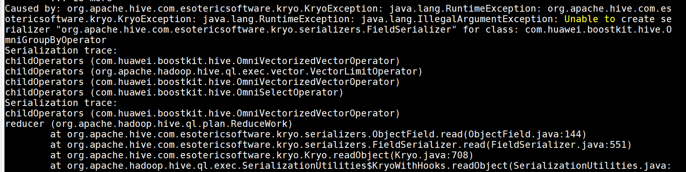

# 常见问题<a name="ZH-CN_TOPIC_0000002517451240"></a>

## 基于毕昇JDK 1.8.0.262执行Spark，偶发JVM core dump问题的解决方法<a name="ZH-CN_TOPIC_0000002517291332"></a>

**问题现象描述<a name="zh-cn_topic_0000001695776349_zh-cn_topic_0000001518928837_zh-cn_topic_0000001259822511_section456714280469"></a>**

配置LD\_PRELOAD环境变量的情况下，基于毕昇JDK 1.8.0.262执行Spark，偶发JVM core dump，报错堆栈如下。

```
Stack: [0x0000ffd2ce0d0000, 0x0000ffd2ce2d00001, sp=0x0000ffd2ce2cb830, free space=2030k
Native frames: (J=compiled Java code, j=interpreted, Vv=VM code, C=native code)
C [libzip.so+0x52a4] fill_window+0x164
C [libzip.so+0x6460] deflate_slow+0x1b0
C [libzip.so+0x781c] deflate+0x1a4
C [libzip.so+0x3480] Java_java_util_zip_Deflater_deflateBytes+0x280
J 3376 java.util.zip.Deflater.deflateBytes (J[BIII)I (0 bytes) @ 0x0000fffe537ded84 [0x0000fffe537ded00+0x84]
V ~Runtimestub::_register_finalizer Java
J 12020 C2 org.apache.hadoop.io.WritableUtils.writeCompressedstringArray (Ljava/io/Dataoutput; [Ljava/lang/String;)V (43 bytes) @ 0x0000fffe55773a38 [0x0000fffe55773380+0x6b8]
j org.apache.hadoop.conf.Configuration.write (Ljava/io/DataOutput;) V+104
j org.apache.spark.util.SerializableConfiguration.$anonfun$writeObject$1 (Lorg/apache/spark/uti1/SerializableConfiguration; Ljava/io/ObjectOutputStream; ) V+9
j org.apache.spark.util.SerializableConfiguration$$Lambda$2298.apply$mcv$sp()V+8
J 14862 C2 scala.runtime.java8.JFunction0$mcV$sp.apply()Ljava/lang/Object; (10 bytes) @ 0x0000fffe55e08b34 [0x0000fffe55e08b00+0x34]
J 14673 C2 org.apache.spark.util.Utils$.tryOrIOException(Lscala/Function0;)Ljava/lang/Object; (100 bytes) @ 0x0000fffe55d5ddfc [0x0000fffe55d5ddc0+0x3c]
j org.apache.spark.util.SerializableConfiguration.write0bject(Ljava/io/ObjectOutputStream;) V+10
V ~StubRoutines::call_stub
V [libjvm.so+0x6f20f4] JavaCalls::call_helper(JavaValue*, methodHandle*, JavaCal1Arguments*, Thread*)+0xe54
V [libjvm.so+0xa82eac] Reflection::invoke(instanceKlassHandle, methodHandle, Handle, bool, objArrayHandle, BasicType, objArrayHandle, bool, Thread*) +0xaf4
V [libjvm.so+0xa8456c] Reflection::invoke_method(oopDesc*, Handle, objArrayHandle, Thread*)+0x144
V [libjvm.so+0x7b416c] JVM_InvokeMethod+0x11c
J 5318 sun.reflect.NativeMethodAccessorImpl.invoke0(Ljava/lang/reflect/Method; Ljava/lang/Object;[Ljava/lang/Object;)Ljava/lang/Object; (0 bytes) @ 0x0000fffe5436d1a8 [0x0000fffe5436d100+0xa8]
J 14063 C1 net.jpountz.lz4.LZ4BlockOutputStream.write([BII)V (106 bytes) @ 0x0000fffe55a967e0 [0x0000fffe55a96280+0x560]
C 0x00000007822fef70
```

**关键过程、根本原因分析<a name="zh-cn_topic_0000001695776349_zh-cn_topic_0000001518928837_zh-cn_topic_0000001259822511_section192720412462"></a>**

这是毕昇JDK 1.8.0.262的一个Bug。如果JVM使用java.util.zip.ZipFile打开文件，并且如果该文件在磁盘上被修改时处于打开状态，JVM可能会崩溃。

**结论、解决方案及效果<a name="zh-cn_topic_0000001695776349_section561918431353"></a>**

毕昇JDK不具备向前兼容性，通过升级毕昇JDK版本至推荐版本1.8.0.342可规避该问题。


## 基于Hadoop 3.2.0版本的libhdfs.so，执行Spark查询Parquet数据源偶发core dump问题的解决方法<a name="ZH-CN_TOPIC_0000002517451242"></a>

**问题现象描述<a name="zh-cn_topic_0000001647616694_zh-cn_topic_0000001518928837_zh-cn_topic_0000001259822511_section456714280469"></a>**

使用Spark查询Parquet数据源时，若开启OmniOperator并依赖Hadoop 3.2.0版本的libhdfs.so时，会偶发core dump，报错堆栈如下。

```
Stack: [0x00007fb9e8e5d000,0x00007fb9e8f5e000], sp=0x00007fb9e8f5cd40, free space=1023k
Native frames: (J=compiled Java code, j=interpreted , Vv=VM code, C=native code)
C [libhdfs.so+0xcd39]  hdfsThreadDestructor+0xb9
------------------  PROCESS  ------------------  
VM state:not at safepoint (normal execution)
VM Mutex/Monitor currently owned by a thread: ([ mutex/lock event])
[0x00007fbbc00119b0] CodeCache_lock - owner thread: 0x00007fbbc00d9800
[0x00007fbbc0012ab0] AdapterHandlerLibrary_lock - owner thread: 0x00007fba04451800

heap address: 0x00000000c0000000, size: 1024 MB, Compressed Oops mode: 32-bit
Narrow klass base: 0x0000000000000000, Narrow klass shift: 3
Compressed class space size: 1073741824 Address: 0x0000000100000000
```

**关键过程、根本原因分析<a name="zh-cn_topic_0000001647616694_zh-cn_topic_0000001518928837_zh-cn_topic_0000001259822511_section192720412462"></a>**

这是Hadoop 3.2.0的一个BUG，可参考[Issues](https://issues.apache.org/jira/browse/HDFS-15270)。如果在JVM退出后再调用JNIEnv获取JVM信息，会造成core dump。但是该BUG的社区修复未完全解决该问题，还是存在偶发性的core dump，原因在于未考虑JNIEnv是野指针的情况。

**结论、解决方案及效果<a name="zh-cn_topic_0000001647616694_section561918431353"></a>**

通过提前判断操作系统中JVM是否存在，并在确认JVM存在的情况下，基于已获取的JNIEnv指针对当前线程执行detach操作，可以有效规避JNIEnv为野指针时引发的core dump异常。使用本版本提供的libhdfs.so可以规避该问题。或者使用社区的Patch重新编译libhdfs.so。可参考[Github](https://github.com/apache/hadoop/pull/5955)。


## Spark 3.1.1版本运行10T大数据集时，偶发OneForOneBlockFetcher相关错误的解决方法<a name="ZH-CN_TOPIC_0000002517451258"></a>

**问题现象描述<a name="zh-cn_topic_0000001701032480_zh-cn_topic_0000001454201442_section758133012554"></a>**

在Spark 3.1.1中处理10TB大数据集时，若“spark.network.timeout“设置过小，可能会导致Shuffle阶段在fetch数据时超时，从而触发与“OneForOneBlockFetcher“相关的错误，并可能导致最终数据结果不一致。

**关键过程、根本原因分析<a name="zh-cn_topic_0000001701032480_zh-cn_topic_0000001454201442_section145813300553"></a>**

在10TB规模的数据集下，Spark默认的“spark.network.timeout“\`设置为120秒。在Shuffle阶段，当数据fetch出现异常（如超时）时，Spark会尝试重新Fetch数据。然而，由于Block ID错乱，可能导致重新fetch的数据内容也错乱，从而引发概率性的数据不一致问题。该问题已被确认为Spark社区代码中的Bug，并已在[Github](https://github.com/apache/spark/pull/31643)上提交了修复。

**结论、解决方案及效果<a name="zh-cn_topic_0000001701032480_section239217135912"></a>**

考虑将spark.network.timeout调大，避免fetch数据超时。推荐设为600，可解决本例中问题。


## Spark执行INSERT语句查询多个大宽表Join时，SMJ算子出现内存不足导致core dump问题的解决方法<a name="ZH-CN_TOPIC_0000002517291318"></a>

**问题现象描述<a name="zh-cn_topic_0000001950009665_zh-cn_topic_0000001454201442_section758133012554"></a>**

在Spark执行INSERT语句且只有1个数据分区的场景下，当出现50个表连续SMJ（Sort Merge Join）操作时，可能会导致SMJ算子在堆外内存耗尽时调用new来申请vector内存，从而引发core dump问题。


**关键过程、根本原因分析<a name="zh-cn_topic_0000001950009665_zh-cn_topic_0000001454201442_section145813300553"></a>**

由于算子加速当前是列式处理，相比于Spark开源版本的行式处理，内存占用会更大，而且SMJ算子计算过程中申请的资源需要在Task结束后才能释放。

出现问题的场景是INSERT语句且只有1个数据分区，Spark只会生成1个task去执行任务。因此，会导致50个表的Sort Merge Join都在1个task内执行。此时用例配置的38g堆外内存在连续50个SMJ算子计算过程中已经耗尽，此时再通过new申请内存时，出现core dump。

**结论、解决方案及效果<a name="zh-cn_topic_0000001950009665_section239217135912"></a>**

该用例属于较为极端的场景，Spark作业本身是为了利用大规模集群的并发优势，正常情况下不会存在单个task（单线程）执行大量表Join的业务场景；如果触发该问题，可通过如下方法进行规避：

- 调整spark.memory.offHeap.size参数增大堆外内存后重新触发业务。
- 回退到Spark开源版本流程触发业务。


## 在Spark SQL中执行包含大量列（例如500列）的cast string to double表达式时查询性能差的解决方法<a name="ZH-CN_TOPIC_0000002549011119"></a>

**问题现象描述<a name="zh-cn_topic_0000001921984084_zh-cn_topic_0000001454201442_section758133012554"></a>**

当使用Spark OmniOperator对包含大量变长类型列（如500列）的数据进行聚合查询时，SQL查询性能可能会下降。


**关键过程、根本原因分析<a name="zh-cn_topic_0000001921984084_zh-cn_topic_0000001454201442_section145813300553"></a>**

在对变长类型列进行聚合操作时，需通过Codegen实现字符串到双精度浮点数的类型转换。由于Codegen本身存在编译开销，SQL查询的性能将受到编译时间和算子执行时间的双重影响。当超多列需要同时进行Codegen编译时，编译开销远大于OmniOperator算子执行时间，导致整体SQL查询性能慢。


**结论、解决方案及效果<a name="zh-cn_topic_0000001921984084_section239217135912"></a>**

当存在超多列需要进行表达式Codegen的SQL查询场景，建议回退至Spark开源版本进行查询，该操作不影响任务结果的一致性。


## Hive 3.1.0版本运行某些包含Group By算子的SQL集时，出现Unable to create serializer "org.apache.hive.com.esotericsoftware.kryo.serializers.FieldSerializer" for class: com.huawei.boostkit.hive.OmniGroupByOperator相关错误的解决方法<a name="ZH-CN_TOPIC_0000002548891121"></a>

**问题现象描述<a name="zh-cn_topic_0000002070738706_zh-cn_topic_0000001921984084_zh-cn_topic_0000001454201442_section758133012554"></a>**

某些SQL包含Group By算子，Hive OmniOperator会出现Unable to create serializer "org.apache.hive.com.esotericsoftware.kryo.serializers.FieldSerializer" for class: com.huawei.boostkit.hive.OmniGroupByOperator报错。



**关键过程、根本原因分析<a name="zh-cn_topic_0000002070738706_zh-cn_topic_0000001921984084_zh-cn_topic_0000001454201442_section145813300553"></a>**

该现象在Hive开源版本执行SQL时也可能会出现，相关issue为[Kryo ISSUE](https://issues.apache.org/jira/browse/HIVE-14092?attachmentOrder=asc)，该问题是Kryo的bug，使用高版本的Kryo即可解决，已在Hive 4.0版本解决。

**结论、解决方案及效果<a name="zh-cn_topic_0000002070738706_section19775722175318"></a>**

需要在Hive工程的pom文件将Kryo的version改为4.0.0重新编译打包，替换Hive安装目录“lib“下的hive-exec-3.1.0.jar，也可以使用已经编译好的[Hive JAR包](https://gitee.com/kunpengcompute/boostkit-bigdata/releases/download/tag_24.0.0_release_hive/hive-exec-3.1.0.jar)进行替换。


## Hive MetaStore远程部署，出现q64卡顿<a name="ZH-CN_TOPIC_0000002517291328"></a>

**问题现象描述<a name="zh-cn_topic_0000002145370381_zh-cn_topic_0000002105043824_zh-cn_topic_0000002070738706_zh-cn_topic_0000001921984084_zh-cn_topic_0000001454201442_section758133012554"></a>**

Hive的MetaStore使用远程部署，运行1TB ORC TPCDS-99时，q64会卡住，实际产生笛卡尔积。系统持续进行join操作，导致任务停滞。

**关键过程、根本原因分析<a name="zh-cn_topic_0000002145370381_zh-cn_topic_0000002105043824_zh-cn_topic_0000002070738706_zh-cn_topic_0000001921984084_zh-cn_topic_0000001454201442_section145813300553"></a>**

该现象在Hive开源版本执行SQL时也可能会出现，即先后运行q44和q64时，MetaStore缓存导致q64的执行计划发生变化，产生笛卡尔积，从而导致数据量过大。

**结论、解决方案及效果<a name="zh-cn_topic_0000002145370381_zh-cn_topic_0000002105043824_zh-cn_topic_0000002070738706_section19775722175318"></a>**

方案1：使用本地模式部署即可避免SQL语句之间因缓存引起的执行计划变化。

方案2：使用远程模式部署时，优先执行q64，将q64的执行顺序调整至q44之前。


## 执行Spark引擎业务过程中运行Gluten提示error in opening zip file的解决方法<a name="ZH-CN_TOPIC_0000002549011121"></a>

**问题现象描述<a name="zh-cn_topic_0000002484820694_zh-cn_topic_0000002425493241_zh-cn_topic_0000002145370381_zh-cn_topic_0000002105043824_zh-cn_topic_0000002070738706_zh-cn_topic_0000001921984084_zh-cn_topic_0000001454201442_section758133012554"></a>**

运行Gluten时提示error in opening zip file。

**关键过程、根本原因分析<a name="zh-cn_topic_0000002484820694_zh-cn_topic_0000002425493241_zh-cn_topic_0000002145370381_zh-cn_topic_0000002105043824_zh-cn_topic_0000002070738706_zh-cn_topic_0000001921984084_zh-cn_topic_0000001454201442_section145813300553"></a>**

Gluten社区代码里有一个步骤是遍历部署文件夹下的所有文件，但是没有对该报错文件是否为JAR类型进行校验。

**结论、解决方案及效果<a name="zh-cn_topic_0000002484820694_section55021731112312"></a>**

1. 在环境的/usr/local目录下输入**ll**命令查看tez软链接。

    ```
    ll
    ```

2. 删除tez软链接。

    ```
    unlink tez
    ```

3. 再次运行Gluten。


## 执行Spark引擎业务过程中运行Gluten提示libabsl\_xxx.so.2501.0.0 no such file的解决方法<a name="ZH-CN_TOPIC_0000002548891105"></a>

**问题现象描述<a name="zh-cn_topic_0000002516860673_zh-cn_topic_0000002425583293_zh-cn_topic_0000002145370381_zh-cn_topic_0000002105043824_zh-cn_topic_0000002070738706_zh-cn_topic_0000001921984084_zh-cn_topic_0000001454201442_section758133012554"></a>**

运行Gluten时提示libabsl\_xxx.so.2501.0.0 no such file。

**关键过程、根本原因分析<a name="zh-cn_topic_0000002516860673_zh-cn_topic_0000002425583293_zh-cn_topic_0000002145370381_zh-cn_topic_0000002105043824_zh-cn_topic_0000002070738706_zh-cn_topic_0000001921984084_zh-cn_topic_0000001454201442_section145813300553"></a>**

当前环境中安装的libabsl版本过低。

**结论、解决方案及效果<a name="zh-cn_topic_0000002516860673_zh-cn_topic_0000002425583293_zh-cn_topic_0000002145370381_zh-cn_topic_0000002105043824_zh-cn_topic_0000002070738706_section19775722175318"></a>**

安装2501或以上版本的libabsl即可解决问题。执行如下命令安装libabsl：

```
cd /home/
git clone https://szv-open.codehub.huawei.com/OpenSourceCenter/abseil/abseil-cpp.git
git checkout tags/20250127.0
cd abseil-cpp/
mkdir build && cd build
cmake ..   -DCMAKE_CXX_STANDARD=17   -DCMAKE_CXX_STANDARD_REQUIRED=ON   -DABSL_PROPAGATE_CXX_STD=ON -DBUILD_SHARED_LIBS=ON
make -j32
make install
```


