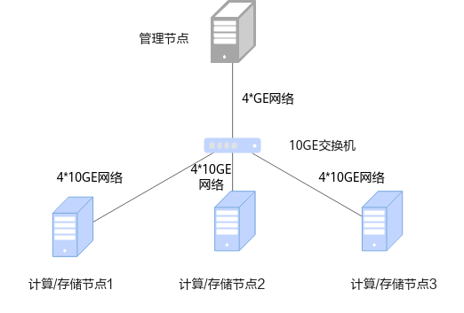

# 安装指南<a name="ZH-CN_TOPIC_0000002515622552"></a>

## 安装简介<a name="ZH-CN_TOPIC_0000002515782482"></a>

### 组网规划<a name="ZH-CN_TOPIC_0000002515782488"></a>

建议采用存算一体组网，即存储节点和计算节点共用，充分发挥OmniRuntime子特性在大数据场景中的计算加速效果。

OmniOperator算子加速组网规划的环境由4台服务器组成，使用存算一体的组网，分别是管理节点（1台）、计算节点（3台）。以存储节点为HDFS进行举例说明，其中：

- 管理节点为server1，用于管理任务。
- 计算节点为agent1、agent2和agent3，用于运行OmniOperator。

一台服务器可以同时充当管理节点和计算节点（如果是单机安装模式，后续文章中提到的在管理节点/计算节点上执行的操作，均需要在一个节点上执行），组网规划如[**图 1** 安装组网图](#安装组网图)所示。

**图 1** 安装组网图<a name="fig734218245342"></a><a id="安装组网图"></a><br/>


### 环境要求<a name="ZH-CN_TOPIC_0000002515622544"></a>

安装OmniOperator算子加速特性前，请参见本节内容，提前准备软硬件安装环境，以确保后续安装操作顺利进行。

**硬件要求<a name="section197116445713"></a>**

集群中各节点硬件要求如[**表 1** 硬件要求](#hardware_requirements)所示。

**表 1** 硬件要求<a id="hardware_requirements"></a>

|硬件环境|管理/计算/存储节点|
|--|--|
|处理器|鲲鹏920系列处理器鲲鹏950处理器只有支持SVE（Scalable Vector Extension，可扩展向量指令集）指令集的服务器支持在Gluten上使能OmniOperator。您可以通过**cat /proc/cpuinfo | grep sve | head -n 1**查询是否支持SVE指令集，如果有输出则表示支持。|
|内存大小|384GB（12 * 32GB）|
|内存频率|2666MHz|
|网络|业务网络10GE管理网络1GE|
|硬盘|系统盘：1 * RAID 0（1 * 1.2TB SAS HDD）数据盘：12 * RAID 0（12 * 8TB SATA HDD）|
|RAID控制卡|LSI SAS3508|


**操作系统和软件要求<a name="section112321019581"></a>**

集群中各节点操作系统和软件要求如[**表 2** 操作系统和软件要求](#operating_system_and_software_requirements)所示。

**表 2** 操作系统和软件要求<a id="operating_system_and_software_requirements"></a>

|项目| 版本                                                       | 说明                                                                                                 |管理节点（Server）|计算/存储节点|
|--|----------------------------------------------------------|----------------------------------------------------------------------------------------------------|--|--|
|操作系统| CentOS 7.9<br>openEuler 20.03 LTS SP1<br>openEuler 22.03 LTS SP1 | 例如openEuler 20.03 LTS SP3、openEuler 22.03 LTS SP3等后续补丁版本亦可。                                        |√|√|
|JDK| [毕昇JDK 1.8（毕昇JDK 1.8.0_342）](https://mirror.iscas.ac.cn/kunpeng/archive/compiler/bisheng_jdk/bisheng-jdk-8u262-linux-aarch64.tar.gz)                           | openEuler 22.03 LTS SP1与毕昇JDK 1.8.0_262不兼容，需更换为[毕昇JDK 1.8.0_342](https://mirror.iscas.ac.cn/kunpeng/archive/compiler/bisheng_jdk/bisheng-jdk-8u342-linux-aarch64.tar.gz)。毕昇JDK安装指南请参见《[毕昇JDK 8 安装指南](https://gitee.com/openeuler/bishengjdk-8/wikis/%E4%B8%AD%E6%96%87%E6%96%87%E6%A1%A3/%E6%AF%95%E6%98%87JDK%208%20%E5%AE%89%E8%A3%85%E6%8C%87%E5%8D%97)》。 |√|√|
|Hadoop| [3.2.0](https://archive.apache.org/dist/hadoop/common/hadoop-3.2.0/hadoop-3.2.0.tar.gz)                                                | 部署指南请参见《[Hadoop 集群部署（CentOS 7.6&openEuler 20.03）](https://www.hikunpeng.com/document/detail/zh/kunpengbds/ecosystemEnable/Hadoop/kunpenghadoop_04_0001.html)》。                                              |√|√|
|Spark| [3.1.1](https://archive.apache.org/dist/spark/spark-3.1.1/spark-3.1.1-bin-hadoop3.2.tgz) [3.3.1](https://archive.apache.org/dist/spark/spark-3.3.1/spark-3.3.1-bin-hadoop3.tgz) [3.4.3](https://archive.apache.org/dist/spark/spark-3.4.3/spark-3.4.3-bin-hadoop3.tgz) [3.5.2](https://archive.apache.org/dist/spark/spark-3.5.2/spark-3.5.2-bin-hadoop3.tgz)                  | 部署指南请参见《[Spark 部署指南（CentOS 7.6&openEuler 20.03）](https://www.hikunpeng.com/document/detail/zh/kunpengbds/ecosystemEnable/Spark/kunpengspark_04_0001.html)》。                                               |√|-|
|Hive| [3.1.0](https://archive.apache.org/dist/hive/hive-3.1.0/apache-hive-3.1.0-bin.tar.gz)                                                | 部署指南请参见《[Hive部署指南（CentOS 7.6&openEuler 20.03）](https://www.hikunpeng.com/document/detail/zh/kunpengbds/ecosystemEnable/Hive/kunpenghive_04_0001.html)》。                                                 |√|-|
|Python| [3.10.2及以上](https://www.python.org/ftp/python/)                                            | 无特殊要求。                                                                                             |√|√|


> **说明：** 
>-   √：表示对应节点需要安装该项目。
>-   -：表示对应节点不需要安装该项目。
>-   以上第三方依赖版本如有漏洞请根据官方说明进行漏洞修复。
>-   以上组件版本，可能和部署指南中的组件版本不一致，部署指南仅供部署参考。

**软件安装包获取<a name="section189181357102011"></a>**

安装OmniOperator算子加速特性所需软件安装包及其获取方式如[**表 3** OmniOperator算子加速软件获取列表](#omnioperator_software_obtains_columns)所示，后续的操作步骤中，请根据操作指导安装相应的安装包。

> **说明：** 
>
>在Spark引擎上的应用：
>-   SparkExtension场景涉及安装的软件包为序号1、2（根据Spark版本选择对应的SparkExtension版本）和5。
>-   Gluten场景涉及安装的软件包为序号4。
>
>在Hive引擎上的应用：
>
>-   HiveExtension场景涉及安装的软件包为序号1、3和5。

**表 3** OmniOperator算子加速软件获取列表<a id="omnioperator_software_obtains_columns"></a>


<table border="1" cellpadding="6" cellspacing="0">
  <thead>
    <tr>
      <th>序号</th>
      <th>名称</th>
      <th>包名</th>
      <th>发布类型</th>
      <th>说明</th>
      <th>获取地址</th>
    </tr>
  </thead>
  <tbody>
    <tr>
      <td rowspan="1">1</td>
      <td>OmniRuntime压缩包</td>
      <td>BoostKit-omniruntime_1.9.0.zip</td>
      <td>闭源</td>
      <td>解压OmniRuntime压缩包（BoostKit-omniruntime_1.9.0.zip），可获得OmniOperator算子加速软件安装包（BoostKit-omniop_2.0.0.zip）。</td>
      <td>鲲鹏社区：<a href="https://kunpeng-repo.obs.cn-north-4.myhuaweicloud.com/Kunpeng%20BoostKit/Kunpeng%20BoostKit%2025.3.0/BoostKit-omniruntime_1.9.0.zip">获取链接</a><br/>使用软件包前请先阅读<a href="https://www.hikunpeng.com/zh/legal/developer/boostkit/software/protocol">《鲲鹏应用使能套件BoostKit用户许可协议 2.0》</a>，如确认继续使用，则默认同意协议的条款和条件。</td>
    </tr>
    <tr>
      <td rowspan="4">2</td>
      <td rowspan="4">SparkExtension</td>
      <td>boostkit-omniop-spark-3.1.1-2.0.0-aarch64.zip</td>
      <td>开源</td>
      <td>使用OmniOperator算子加速计算底座时，Spark引擎扩展包。</td>
      <td><a href="https://gitcode.com/boostkit/boostkit-bigdata/releases/download/Kunpeng-BoostKit-25.3.0-OmniOperator-release-311/boostkit-omniop-spark-3.1.1-2.0.0-aarch64.zip">获取链接</a></td>
    </tr>
    <tr>      
      <td>boostkit-omniop-spark-3.3.1-2.0.0-aarch64.zip</td>
      <td>开源</td>
      <td>使用OmniOperator算子加速计算底座时，Spark引擎扩展包。</td>
      <td><a href="https://gitcode.com/boostkit/boostkit-bigdata/releases/download/Kunpeng-BoostKit-25.3.0-OmniOperator-release/boostkit-omniop-spark-3.3.1-2.0.0-aarch64.zip">获取链接</a></td>
    </tr>
    <tr>      
      <td>boostkit-omniop-spark-3.4.3-2.0.0-aarch64.zip</td>
      <td>开源</td>
      <td>使用OmniOperator算子加速计算底座时，Spark引擎扩展包。</td>
      <td><a href="https://gitcode.com/boostkit/boostkit-bigdata/releases/download/Kunpeng-BoostKit-25.3.0-OmniOperator-release/boostkit-omniop-spark-3.4.3-2.0.0-aarch64.zip">获取链接</a></td>
    </tr>
    <tr>      
      <td>boostkit-omniop-spark-3.5.2-2.0.0-aarch64.zip</td>
      <td>开源</td>
      <td>使用OmniOperator算子加速计算底座时，Spark引擎扩展包。</td>
      <td><a href="https://gitcode.com/boostkit/boostkit-bigdata/releases/download/Kunpeng-BoostKit-25.3.0-OmniOperator-release/boostkit-omniop-spark-3.5.2-2.0.0-aarch64.zip">获取链接</a></td>
    </tr>
    <tr>
      <td rowspan="1">3</td>
      <td>HiveExtension</td>
      <td>boostkit-omniop-hive-3.1.0-2.0.0-aarch64.zip</td>
      <td>开源</td>
      <td>使用OmniOperator算子加速计算底座时，Hive引擎扩展包。</td>
      <td><a href="https://gitcode.com/boostkit/boostkit-bigdata/releases/download/Kunpeng-BoostKit-25.3.0-OmniOperator-release-hive/boostkit-omniop-hive-3.1.0-2.0.0-aarch64.zip">获取链接</a></td>
    </tr>
    <tr>
      <td rowspan="2">4</td>
      <td rowspan="2">Gluten</td>
      <td>Boostkit-omniruntime-gluten-2.0.0.zip</td>
      <td>开源</td>
      <td>OmniOperator算子加速软件安装包（适配Gluten）。</td>
      <td><a href="https://atomgit.com/openeuler/OmniOperator/releases/download/26.0.0-OmniOperator-2.1.0-release/BoostKit-omniruntime-gluten-2.0.0.zip">获取链接</a></td>
    </tr>
    <tr>      
      <td>Dependency_library_Gluten.zip</td>
      <td>开源</td>
      <td>Gluten运行时所依赖的库文件。</td>
      <td><a href="https://gitcode.com/openeuler/OmniOperator/releases/download/26.0.0-OmniOperator-2.1.0-release/Dependency_library_Gluten.zip">获取链接</a></td>
    </tr>
    <tr>
      <td rowspan="1">5</td>
      <td>Dependency_library</td>
      <td>Dependency_library_centos.zip<br/>Dependency_library_openeuler20.03.zip<br/>Dependency_library_openeuler22.03.zip</td>
      <td>开源</td>
      <td>OmniOperator算子加速运行时所依赖的库文件。请根据OS类型选择对应的依赖包。</td>
      <td><a href="https://gitcode.com/boostkit/boostkit-bigdata/releases/download/Kunpeng-BoostKit-25.3.0-OmniOperator-release/Dependency_library_centos.zip">CentOS依赖获取链接</a><br/><a href="https://gitcode.com/boostkit/boostkit-bigdata/releases/download/Kunpeng-BoostKit-25.3.0-OmniOperator-release/Dependency_library_openeuler20.03.zip">openEuler20.03依赖获取链接</a><br/><a href="https://gitcode.com/boostkit/boostkit-bigdata/releases/download/Kunpeng-BoostKit-25.3.0-OmniOperator-release/Dependency_library_openeuler22.03.zip">openEuler22.03依赖获取链接</a></td>
    </tr>
  </tbody>
</table>  
                                                           

**软件安装包完整性校验<a name="section16501429204018"></a>**

从鲲鹏社区获取的软件安装包，下载软件安装包后需要校验软件安装包，确保与网站上的原始软件安装包一致。

校验方法：

1. 获取软件数字证书和软件安装包。
2. 获取[校验工具和校验方法](https://support.huawei.com/enterprise/zh/tool/pgp-verify-TL1000000054)。
3. 参见上述链接下载的《OpenPGP签名验证指南》进行软件安装包完整性检查。


## 安装特性<a name="ZH-CN_TOPIC_0000002515782478"></a>

### 安装节点要求<a name="ZH-CN_TOPIC_0000002515782464"></a>

安装节点要求介绍了安装OmniOperator算子加速前对各节点安装依赖包和配置环境变量的要求。

- 若使用源码编译安装方式，在源码编译前，需在各节点安装GCC/G++、Autoconf以及CMake，其版本要求请参见[**表 1** 源码编译前需要配置的软件](#源码编译前需要配置的软件)。

    > **说明：** 
    >-   LLVM和jemalloc需要在对应操作系统上编译才能正常运行，如需在CentOS上运行则需要在CentOS上编译；如需在openEuler上运行，需在以下两个版本的操作系统（openEuler 20.03 LTS SP1和openEuler 22.03 LTS SP1）中选择对应的版本进行编译。
    >-   Gluten运行依赖ABSL库，需要在当前运行系统（openEuler 22.03 SP1）上编译安装才能正常运行。

    **表 1** 源码编译前需要配置的软件<a id="源码编译前需要配置的软件"></a>

<table border="1" cellpadding="6" cellspacing="0">
  <thead>
    <tr>
      <th>名称</th>
      <th>版本要求</th>
      <th>获取链接</th>
    </tr>
  </thead>
  <tbody>
    <tr>
      <td rowspan="2">GCC/G++</td>
      <td>openEuler 20.03：7.3.0</td>
      <td><a href="https://mirrors.tuna.tsinghua.edu.cn/gnu/gcc/gcc-7.3.0/gcc-7.3.0.tar.gz" target="_blank">获取链接</a></td>
    </tr>
    <tr>
      <td>openEuler 22.03：10.3.0</td>
      <td><a href="https://mirrors.tuna.tsinghua.edu.cn/gnu/gcc/gcc-10.3.0/gcc-10.3.0.tar.gz" target="_blank">获取链接</a></td>
    </tr>
    <tr>
      <td>Autoconf</td>
      <td>2.69</td>
      <td><a href="https://ftp.gnu.org/gnu/autoconf/autoconf-2.69.tar.gz" target="_blank">获取链接</a></td>
    </tr>
    <tr>
      <td>CMake</td>
      <td>3.20.5</td>
      <td><a href="https://github.com/Kitware/CMake/releases/download/v3.20.5/cmake-3.20.5-linux-aarch64.tar.gz" target="_blank">获取链接</a></td>
    </tr>
  </tbody>
</table>


1. 编译安装GCC/G++。以7.3.0版本为例：
   1. 查看GCC/G++版本，确认是否为目标版本。
    
            ```
            gcc --version
            g++ --version
            ```
    
   2. 编译安装GCC/G++。
    
            ```
            # 解压安装包并进入目录gcc-7.3.0
            tar -zxvf gcc-7.3.0.tar.gz
            cd gcc-7.3.0
            # 编译安装
            mkdir build && cd build
            ../configure --prefix=/usr/local/gcc-7.3.0 --enable-languages=c,c++ --disable-multilib 
            make -j$(nproc)
            make install
            # 设置环境变量
            echo 'export PATH=/usr/local/gcc-7.3.0/bin:$PATH' >> /etc/profile
            echo 'export LD_LIBRARY_PATH=/usr/local/gcc-7.3.0/lib64:$LD_LIBRARY_PATH' >> /etc/profile
            source /etc/profile
            # 验证安装是否成功
            gcc --version
            g++ --version
            ```
    
2. 编译安装Autoconf。
    1. 查看Autoconf版本，确认是否为目标版本。
    
            ```
            autoconf --version
            ```
    
    2. 编译安装Autoconf。
    
            ```
            # 解压安装包并进入目录autoconf-2.69
            tar -zxvf autoconf-2.69.tar.gz
            cd autoconf-2.69
            # 编译安装
            ./configure --prefix=/usr/local/autoconf-2.69
            make -j$(nproc)
            make install
            # 设置环境变量
            echo 'export PATH=/usr/local/autoconf-2.69/bin:$PATH' >> /etc/profile
            source /etc/profile
            # 验证安装是否成功
            autoconf --version
            ```
    
3. 安装CMake。
    1. 查看CMake版本，确认是否为目标版本。
    
            ```
            cmake --version
            ```
    
    2. 安装CMake。
    
            ```
            # 解压安装包到任意目录（这里用/opt）
            tar -zxvf cmake-3.20.5-linux-aarch64.tar.gz -C /opt
            # 设置环境变量
            echo 'export PATH=/opt/cmake-3.20.5-linux-aarch64/bin:$PATH' >> /etc/profile
            source /etc/profile
            # 验证安装是否成功
            cmake --version
            ```

- 安装OmniOperator算子加速前，集群环境请参见[**表 2** 操作系统和软件要求](#operating_system_and_software_requirements)完成相关组件部署。
- 配置环境变量前请确认环境中是否已存在`LD_LIBRARY_PATH`环境变量。如果不存在则配置时无需追加`$LD_LIBRARY_PATH`，避免当前目录（cwd）被引入动态库查找路径，导致安全问题，全文中export环境变量操作均遵循此原则。以`LD_LIBRARY_PATH`为例，如果已存在则`export LD_LIBRARY_PATH=$LD_LIBRARY_PATH:/xxx`，不存在则`export LD_LIBRARY_PATH=/xxx`。

### 安装依赖<a name="ZH-CN_TOPIC_0000002515782474"></a>

通过本地方式安装OmniOperator算子加速，在OmniOperator算子加速结合Spark引擎应用时，在管理节点安装依赖包LLVM和jemalloc。

在Spark on Yarn场景中，通过Spark的`--archives`参数提升部署易用性。预编译so下载安装与源码编译安装两种方式可任选其一。预编译so下载安装更快速且便捷，适用于大部分场景；源码编译安装较慢，适用于一些有合规要求的场景。

**安装依赖（预编译so下载安装方式，SparkExtension场景）<a name="section54515015398"></a>**

**安装LLVM和jemalloc**

> **说明：** 
>-   根据OS类型选择对应的依赖包，以下安装以openEuler 22.03系统为例，对应`Dependency_library_openeuler22.03.zip`。
>-   `/opt/omni-operator`及`/opt/omni-operator/lib`目录用户可自行定义。

1. 在管理节点创建`/opt/omni-operator/`目录作为安装OmniOperator算子加速的根目录，进入该目录。

    ```
    mkdir /opt/omni-operator
    cd /opt/omni-operator
    ```
    
2. 从[**表 3** OmniOperator算子加速软件获取列表](#omnioperator_software_obtains_columns)中获取`Dependency_library_openeuler22.03.zip`，并上传到`/opt/omni-operator/`目录下，再进行解压。

    ```
    unzip Dependency_library_openeuler22.03.zip
    ```

3. 创建`/opt/omni-operator/lib`目录，将`Dependency_library_openeuler`中的libLLVM-15.so、libjemalloc.so.2复制到`/opt/omni-operator/lib`目录下。

    > **须知：** 
    >如果环境中安装过LLVM和jemalloc，需要先删除旧的libLLVM-15.so、libjemalloc.so.2文件，再执行复制命令。
    >```
    >rm -rf /opt/omni-operator/lib/libjemalloc.so.2
    >rm -rf /opt/omni-operator/lib/libLLVM-15.so
    >```

    ```
    cd /opt/omni-operator
    mkdir lib
    cp /opt/omni-operator/Dependency_library_openeuler22.03/libjemalloc.so.2 /opt/omni-operator/lib
    cp /opt/omni-operator/Dependency_library_openeuler22.03/libLLVM-15.so /opt/omni-operator/lib
    ```

**安装依赖（预编译so下载安装方式，Gluten场景）<a name="section11238405227"></a>**

**安装LLVM和jemalloc**

> **说明：** 
>-   Gluten场景中未提供ABSL库的预编译so文件，因此需要用户手动编译安装。
>-   `/opt/omni-operator`及`/opt/omni-operator/lib`目录用户可自行定义。

1. 在管理节点创建`/opt/omni-operator/`目录作为安装OmniOperator算子加速的根目录，进入该目录。

    ```
    mkdir /opt/omni-operator
    cd /opt/omni-operator
    rm Dependency_library_Gluten.zip -rf
    ```

2. 从[**表 3** OmniOperator算子加速软件获取列表](#omnioperator_software_obtains_columns)中获取`Dependency_library_Gluten.zip`压缩包，并上传到`/opt/omni-operator/`目录下，再进行解压。

    ```
    unzip Dependency_library_Gluten.zip
    ```

3. 创建`/opt/omni-operator/lib`目录，将`Dependency_library_Gluten`中的libLLVM-15.so、libjemalloc.so.2复制到`/opt/omni-operator/lib`目录下。

    > **须知：** 
    >如果环境中安装过LLVM和jemalloc，需要先删除旧的libLLVM-15.so、libjemalloc.so.2文件，再执行复制命令。
    >```
    >rm -rf /opt/omni-operator/lib/libjemalloc.so.2
    >rm -rf /opt/omni-operator/lib/libLLVM-15.so
    >```

    ```
    cd /opt/omni-operator
    mkdir lib
    cp /opt/omni-operator/Dependency_library_Gluten/libjemalloc.so.2 /opt/omni-operator/lib
    cp /opt/omni-operator/Dependency_library_Gluten/libLLVM-15.so /opt/omni-operator/lib
    ```

4. 手动编译安装ABSL。详细操作步骤请参见安装ABSL操作步骤的[1](#li17569353267)～[3](#li1220195592616)。

**安装依赖（源码编译安装方式，SparkExtension和Gluten场景）<a name="section3182322111816"></a>**

**安装LLVM**

> **说明：** 
>`/opt/omni-operator`、`/opt/omni-operator/llvm`和`/opt/omni-operator/lib`目录用户可自行定义。

1. 下载[llvm-project-llvmorg-15.0.4.tar.gz](https://github.com/llvm/llvm-project/archive/refs/tags/llvmorg-15.0.4.tar.gz)，在管理节点上创建目录`/opt/omni-operator`作为安装OmniOperator的根目录并进入，将压缩包上传到`/opt/omni-operator`目录下。

    ```
    mkdir /opt/omni-operator
    cd /opt/omni-operator
    tar zxvf llvm-project-llvmorg-15.0.4.tar.gz
    mv llvm-project-llvmorg-15.0.4 llvm
    cd llvm
    mkdir build
    ```

2. 进入`build`目录编译并安装LLVM。

    ```
    cd ./build
    cmake -DCMAKE_INSTALL_PREFIX=/opt/omni-operator/llvm -DCMAKE_BUILD_TYPE=Release -DLLVM_BUILD_LLVM_DYLIB=true -DLLVM_ENABLE_PROJECTS="clang" -G "Unix Makefiles" ../llvm
    make -j4
    make install
    ```

3. 在`/opt/omni-operator`下创建`lib`目录，拷贝`/opt/omni-operator/llvm/lib/libLLVM-15.so`到`/opt/omni-operator/lib`目录下。

    ```
    mkdir /opt/omni-operator/lib
    cp /opt/omni-operator/llvm/lib/libLLVM-15.so /opt/omni-operator/lib/
    ```

**安装jemalloc**

1. 下载[jemalloc-5.3.0.tar.gz](https://github.com/jemalloc/jemalloc/archive/refs/tags/5.3.0.tar.gz)，并上传到管理节点。

    ```
    cd /opt/omni-operator/
    tar zxvf jemalloc-5.3.0.tar.gz
    mv jemalloc-5.3.0 jemalloc
    ```

    > **说明：** 
    >`/opt/omni-operator/jemalloc`目录用户可自行定义。

2. 进入`jemalloc`目录，运行脚本并安装。

    ```
    cd jemalloc
    ./autogen.sh --disable-initial-exec-tls
    make -j2
    ```

3. 拷贝`/opt/omni-operator/jemalloc/lib/libjemalloc.so.2`到`/opt/omni-operator/lib`目录下。

    ```
    cp /opt/omni-operator/jemalloc/lib/libjemalloc.so.2 /opt/omni-operator/lib/
    ```

**安装ABSL**（仅在Gluten上使能时需要）

1. <a name="li17569353267"></a>在管理节点上下载ABSL源码。

    ```
    git clone https://szv-open.codehub.huawei.com/OpenSourceCenter/abseil/abseil-cpp.git
    cd abseil-cpp/
    git checkout tags/20250127.0
    ```

2. 编译ABSL源码。

    ```
    mkdir build && cd build
    cmake ..   -DCMAKE_CXX_STANDARD=17   -DCMAKE_CXX_STANDARD_REQUIRED=ON   -DABSL_PROPAGATE_CXX_STD=ON -DBUILD_SHARED_LIBS=ON
    make -j32
    make install
    ```

3. <a name="li1220195592616"></a>将编译好的ABSL库拷贝到`/opt/omni-operator/lib`。

    ```
    cp /usr/local/lib64/libabsl_* /opt/omni-operator/lib
    ```

### 安装OmniOperator<a name="ZH-CN_TOPIC_0000002515622558"></a>

在管理节点和计算节点安装OmniOperator并设置相应的环境变量。如果是在Gluten上使能OmniOperator，则跳过本章节。

> **说明：** 
>-   `BoostKit-omniop_2.0.0.zip`可通过`BoostKit-omniruntime_2.0.0.zip`解压获得。`BoostKit-omniop_2.0.0.zip`中有`boostkit-omniop-operator-2.0.0-aarch64-openeuler.tar.gz`和`boostkit-omniop-operator-2.0.0-aarch64-centos.tar.gz`两个包，分别适用于openEuler和CentOS操作系统，下文以openEuler为例进行说明。
>-   如果需要在CentOS系统安装OmniOperator算子加速，把以下命令参数中的`boostkit-omniop-operator-2.0.0-aarch64-openeuler.tar.gz`替换为`boostkit-omniop-operator-2.0.0-aarch64-centos.tar.gz`即可。

1. 将[**表 3** OmniOperator算子加速软件获取列表](#omnioperator_software_obtains_columns)中OmniOperator算子加速相关压缩文件上传到管理节点和计算节点的`/opt/omni-operator/`目录。
2. 进入`/opt/omni-operator/`目录解压OmniOperator算子加速相关文件。

    ```
    cd /opt/omni-operator/
    unzip BoostKit-omniruntime_1.9.0.zip
    unzip BoostKit-omniop_2.0.0.zip
    tar -zxvf boostkit-omniop-operator-2.0.0-aarch64-openeuler.tar.gz
    ```

3. 拷贝OmniOperator算子加速相关文件到`/opt/omni-operator/lib`目录下，并将该目录下的软件安装包权限设置为550。

    ```
    cd /opt/omni-operator/boostkit-omniop-operator-2.0.0-aarch64
    cp -r include libboostkit* boostkit-omniop* libsecurec.so /opt/omni-operator/lib/
    chmod -R 550 /opt/omni-operator/lib/*
    ```

4. 在`/opt/omni-operator`目录下创建`conf`文件夹，设置文件夹权限750。

    ```
    cd /opt/omni-operator
    mkdir conf
    chmod 750 /opt/omni-operator/conf
    ```

5. 在`conf`文件夹下新增`omni.conf`配置文件并修改配置文件权限为640，用于配置OmniOperator算子加速配置项。

    ```
    cd conf
    touch omni.conf
    chmod 640 omni.conf
    ```

6. 删除`/opt/omni-operator`的冗余文件。

    ```
    mkdir -p /opt/omni-operator-bak
    mv /opt/omni-operator/lib /opt/omni-operator-bak
    mv /opt/omni-operator/conf /opt/omni-operator-bak
    ls /opt/omni-operator
    rm -rf /opt/omni-operator
    cd /opt
    mv omni-operator-bak omni-operator
    ```

### （可选）安装UDF插件<a name="ZH-CN_TOPIC_0000002515622536"></a>

当业务场景明确需要使用UDF（User Defined Functions，用户自定义函数）功能时，才需要执行本章节的操作。插件安装操作仅需在管理节点完成。在Gluten上使能OmniOperator场景暂不支持加速UDF。

该插件目前仅支持HiveSimpleUDF类型（即基于Hive UDF框架编写的简单UDF）。HiveSimpleUDF是Hive中的一种用户定义函数类型，基于Hive的UDF框架实现，用于扩展Hive查询功能。由于Spark支持Hive的UDF接口，因此HiveSimpleUDF也可以在Spark环境中直接使用。

OmniOperator加速UDF，支持两种执行方式：行处理和批处理。可通过修改配置文件切换使用方式。

**前置条件<a name="section15136154016211"></a>**

- 使用前请确认您的UDF是基于Hive UDF框架实现的简单UDF。
- 为了使用OmniOperator加速UDF，用户需提供相关JAR包和配置文件，包括以下文件。
- udf.zip：包含所有UDF的class文件。
- conf.zip：包含UDF所依赖的配置文件。
- udf.properties：用于配置OmniOperator加速UDF。

    以udfName1和udfName2为例，udf.properties内容格式如下。

    ```
    udfName1 com.huawei.udf.UdfName1
    udfName2 com.huawei.udf.UdfName2
    ```

**UDF插件行处理安装<a name="section5383205172111"></a>**

1. 在管理节点创建`/opt/omni-operator/hive-udf`目录。

    ```
    mkdir /opt/omni-operator/hive-udf
    ```

2. 将上述相关的压缩文件udf.zip、conf.zip上传到管理节点的`/opt/omni-operator/hive-udf`目录。

    > **说明：** 
    >udf.zip、conf.zip等压缩包名称用户根据自己实际情况可进行自定义，本处仅提供示例。

3. 解压相关压缩文件。

    ```
    cd /opt/omni-operator/hive-udf
    unzip udf.zip
    rm -f udf.zip
    unzip conf.zip
    rm -f conf.zip
    ```

4. 在`/opt/omni-operator/conf/omni.conf`文件中更新配置。
    1. 打开配置文件。

        ```
        vi /opt/omni-operator/conf/omni.conf
        ```

    2. 按`i`进入编辑模式，新增关于UDF配置相关内容。

        ```
        # <----UDF properties---->
        #false表示使用表达式行处理，true表示使用表达式批处理
        enableBatchExprEvaluate=false
        #UDF白名单文件路径
        hiveUdfPropertyFilePath=./hive-udf/udf.properties
        #Hive UDF JAR所在目录路径
        hiveUdfDir=./hive-udf/udf
        ```

        > **说明：** 
        >配置的路径必须以字符`.`开始，OmniOperator运行的时候会读取环境变量`OMNI_HOME`的值替换字符`.`。

    3. 按`Esc`键，输入 **:wq!**，按`Enter`保存并退出编辑。

5. 更新环境变量。
    1. 打开`\~/.bashrc`文件。

        ```
        vi ~/.bashrc
        ```

    2. 按`i`进入编辑模式，追加`LD_LIBRARY_PATH`的内容更新环境变量。

        ```
        export LD_LIBRARY_PATH=$LD_LIBRARY_PATH:${JAVA_HOME}/jre/lib/aarch64/server
        ```

    3. 按`Esc`键，输入 **:wq!**，按`Enter`保存并退出编辑。
    4. 使更新后环境变量生效。

        ```
        source ~/.bashrc
        ```

**UDF插件批处理安装<a name="section518339172217"></a>**

在管理节点完成行处理安装的基础之上，执行以下步骤更新`/opt/omni-operator/conf/omni.conf`中的配置内容，以支持批处理操作。

1. 打开文件。

    ```
    vi /opt/omni-operator/conf/omni.conf
    ```

2. 按`i`进入编辑模式，找到以下语句并修改。

    ```
    enableBatchExprEvaluate=true
    ```

3. 按`Esc`键，输入 **:wq!**，按`Enter`保存并退出编辑。