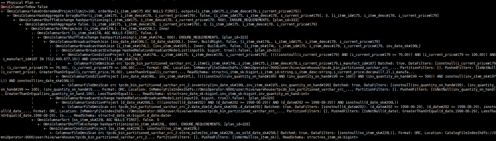
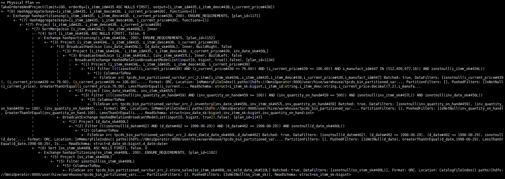
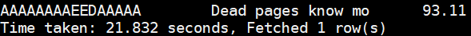
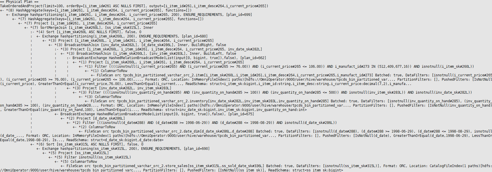
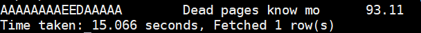
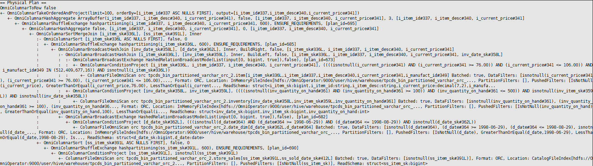
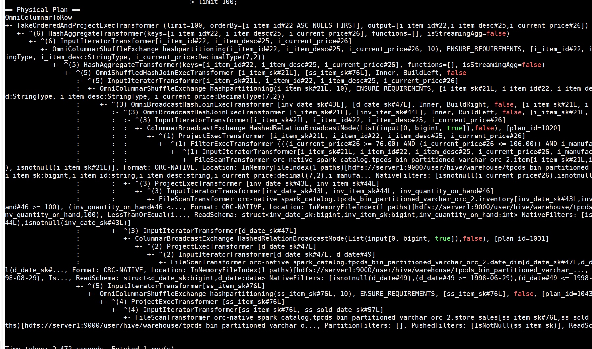
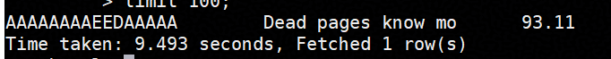
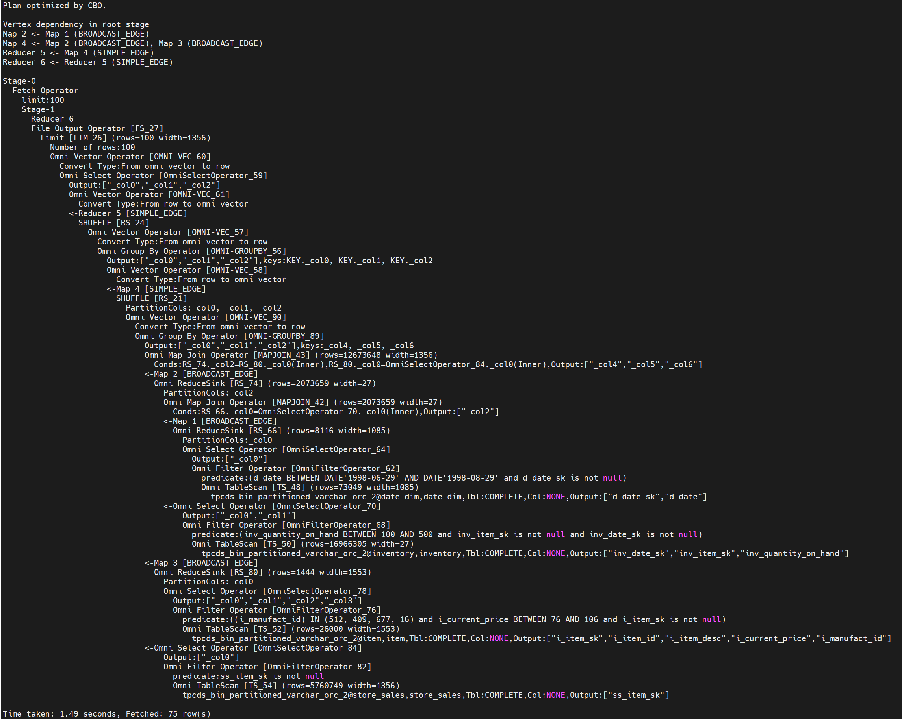

# 使用指南<a name="ZH-CN_TOPIC_0000002547462879"></a>

## 修订记录<a name="修订记录"></a>

发布OmniOperator 2.1.0：
- 新增InsertIntoHadoopFsRelationCommand支持插入HDFS、WriteFile支持ORC写入、Window支持Array数据分段、FileSourceScanExec支持Array数据读取、LocalLimitExec支持Array数据截取。
- 新增支持datediff、pmod、charTypeWriteSideCheck、least、concat_ws、get_json_object表达式。

## 使用特性<a name="ZH-CN_TOPIC_0000002515743064"></a>

### 在Spark引擎上的应用<a name="ZH-CN_TOPIC_0000002547382891"></a>

#### 在SparkExtension上使能<a name="ZH-CN_TOPIC_0000002515902952"></a>

##### 简介<a name="ZH-CN_TOPIC_0000002515743060"></a>

在Spark引擎中应用OmniOperator算子加速特性时，可以选择在SparkExtension或Gluten中使能该特性。根据具体场景和需求，选择合适的使能方式，可最大化加速效果。

如果使用的是Spark 3.3.1、Spark 3.4.3，建议优先选择通过Gluten框架启用OmniOperator；如果使用的是Spark其他版本，则可以选择通过用SparkExtension框架启用OmniOperator。

如果选择通过用SparkExtension框架启用OmniOperator，需要用户安装对应的Spark以及与之匹配的SparkExtension，Spark的安装要求见[`installation_guide.md`](installation_guide.md)。本小节将介绍SparkExtension的安装步骤、安装后的配置方法，以及如何将OmniOperator算子加速特性应用到Spark引擎中。

##### 算子和表达式支持情况<a name="ZH-CN_TOPIC_0000002515902958"></a>

介绍Spark引擎在SparkExtension上使用OmniOperator算子加速特性时，该特性对SQL算子及表达式（含数据类型）的支持范围、限制条件与使用规则。

在SparkExtension上使用OmniOperator算子加速特性时，该特性支持的算子、表达式、函数如[**表 2** 支持算子列表](#支持算子列表)、[**表 3** 支持表达式列表](#支持表达式列表)和[**表 4** cast表达式支持列表](#cast表达式支持列表)所示，表格中使用符号表示算子和表达式是否支持，符号的含义请参见[**表 1** 算子和表达式支持表格中符号的含义](#算子和表达式支持表格中符号的含义)。

> **须知：** 
>-   本节以Spark 3.3.1引擎为例，描述OmniOperator算子加速特性支持的算子和表达式。
>-   本章节[支持算子列表](#section176711256181910)和[支持表达式列表](#section5353103435216)中仅描述了OmniOperator算子加速支持或涉及的数据类型，未展示的数据类型（BYTE/FLOAT/BINARY/ARRAY/MAP/STRUCT/CALENDAR/UDT）是OmniOperator算子加速不支持的。
>-   如果使用OmniOperator算子加速不支持的算子和表达式，会导致执行计划回退为开源版本执行，对性能会有影响。

**表 1** 算子和表达式支持表格中符号的含义<a id="算子和表达式支持表格中符号的含义"></a>

|状态| 说明                                                               |
|--|------------------------------------------------------------------|
|S| 表示支持该算子或表达式。                                                     |
|PS| 表示部分支持该算子或表达式，但存在一些限定条件。具体的限定条件请参见[README.md](https://gitcode.com/openeuler/OmniOperator/blob/master/README.md)中的约束与限制。 |
|NS| 表示不支持该算子或表达式。                                                    |
|NA| 表示不涉及该算子或表达式。开源版本Spark也没有此输入场景。                                  |
|NA-2| 表示基于开源版本Spark实现的上下文函数，不涉及OmniOperator算子加速。                       |
|[Blank Cell]| 表示不适用或需要确认。                                                      |


**支持算子列表<a name="section176711256181910" id="section176711256181910"></a>**

Spark引擎使用OmniOperator算子加速特性支持的算子情况如[**表 2** 支持算子列表](#支持算子列表)所示。

**表 2** 支持算子列表<a id="支持算子列表"></a>

|**开源软件对应算子名称**|**OmniOperator算子加速算子名称**|**BOOLEAN**|**INT**|**LONG**|**DOUBLE**|**STRING**|**CHAR**|**VARCHAR**|**DATE**|**DECIMAL**|**SHORT**|**TIMESTAMP**|
|--|--|--|--|--|--|--|--|--|--|--|--|--|
|FileSourceScanExec|ColumnarFileSourceScanExec|S|S|S|S|S|S|S|S|S|S|S|
|ProjectExec|ColumnarProjectExec|S|S|S|S|S|S|S|S|S|NS|S|
|FilterExec|ColumnarFilterExec|S|S|S|S|S|S|S|S|S|NS|S|
|ProjectExec+FilterExec|ColumnarConditionProjectExec|S|S|S|S|S|S|S|S|S|NS|S|
|ExpandExec|ColumnarExpandExec|S|S|S|S|S|S|S|S|S|NS|S|
|HashAggregateExec|ColumnarHashAggregateExec|S|S|S|S|S|S|S|S|S|S|S|
|TopNSortExec|ColumnarTopNSortExec|S|S|S|S|S|S|S|S|S|NS|S|
|SortExec|ColumnarSortExec|S|S|S|S|S|S|S|S|S|S|S|
|BroadcastExchangeExec|ColumnarBroadcastExchangeExec|S|S|S|S|S|S|S|S|S|S|S|
|TakeOrderedAndProjectExec|ColumnarTakeOrderedAndProjectExec|S|S|S|S|S|S|S|S|S|S|S|
|UnionExec|ColumnarUnionExec|S|S|S|S|S|S|S|S|S|S|S|
|ShuffleExchangeExec|ColumnarShuffleExchangeExec|S|S|S|S|S|S|S|S|S|S|S|
|BroadcastHashJoinExec|ColumnarBroadcastHashJoinExec|S|S|S|S|S|S|S|S|S|S|S|
|SortMergeJoinExec|ColumnarSortMergeJoinExec|S|S|S|S|S|S|S|S|S|S|S|
|WindowExec|ColumnarWindowExec|S|S|S|S|S|S|S|S|S|S|S|
|ShuffledHashJoinExec|ColumnarShuffledHashJoinExec|S|S|S|S|S|S|S|S|S|S|S|
|LocalLimitExec|ColumnarLocalLimitExec|S|S|S|S|S|S|S|S|S|S|S|
|GlobalLimitExec|ColumnarGlobalLimitExec|S|S|S|S|S|S|S|S|S|S|S|
|CoalesceExec|ColumnarCoalesceExec|S|S|S|S|S|S|S|S|S|S|S|
|SubqueryBroadcastExec|OmniColumnarSubqueryBroadcastExec|S|S|S|S|S|S|S|S|S|S|S|
|AQEShuffleReadExec|OmniAQEShuffleReadExec|S|S|S|S|S|S|S|S|S|S|S|
|WindowGroupLimitExec|ColumnarWindowGroupLimitExec|S|S|S|S|S|S|S|S|S|NS|S|


**支持表达式列表<a name="section5353103435216" id="section5353103435216"></a>**

Spark引擎使用OmniOperator算子加速特性支持的表达式/函数情况如[**表 3** 支持表达式列表](#支持表达式列表)所示。

**表 3** 支持表达式列表<a id="支持表达式列表"></a>

| **表达式**                |**OmniOperator算子加速支持状态**|**函数类型**| **OmniOperator算子加速限制描述**                                                                                             | **BOOLEAN**      | **INT**      | **LONG**     | **DOUBLE**   | **STRING**   | **CHAR**     | **VARCHAR**  | **DATE**     | **DECIMAL**  | **NULL**     | **SHORT**    | **TIMESTAMP** | **ARRAY**    |
|------------------------|--|--|----------------------------------------------------------------------------------------------------------------------|------------------|--------------|--------------|--------------|--------------|--------------|--------------|--------------|--------------|--------------|--------------|---------------|--------------|
| !                      |S|Scalar Functions| -                                                                                                                    | S                | NA           | NA           | NA           | NA           | NA           | NA           | NA           | NA           | S            | NA           | NA            | NA           |
| %                      |S|Scalar Functions| -                                                                                                                    | NA               | S            | S            | S            | S            | S            | S            | NA           | S            | S            | NS           | NA            | NS           |
| *                      |S|Scalar Functions| -                                                                                                                    | NA               | S            | S            | S            | S            | S            | S            | NA           | S            | S            | NS           | NA            | NS           |
| +                      |S|Scalar Functions| -                                                                                                                    | NA               | S            | S            | S            | S            | S            | S            | NA           | S            | S            | NS           | NA            | NS           |
| -                      |S|Scalar Functions| -                                                                                                                    | NA               | S            | S            | S            | S            | S            | S            | NA           | S            | S            | NS           | NA            | NS           |
| /                      |S|Scalar Functions| -                                                                                                                    | NA               | S            | S            | S            | S            | S            | S            | NA           | S            | S            | NS           | NA            | NS           |
| <                      |S|Scalar Functions| -                                                                                                                    | NS               | S            | S            | S            | S            | S            | S            | S            | S            | S            | NS           | S             | NS           |
| <=                     |S|Scalar Functions| -                                                                                                                    | NS               | S            | S            | S            | S            | S            | S            | S            | S            | S            | NS           | S             | NS           |
| \>                     |S|Scalar Functions| -                                                                                                                    | NS               | S            | S            | S            | S            | S            | S            | S            | S            | S            | NS           | S             | NS           |
| \>=                    |S|Scalar Functions| -                                                                                                                    | NS               | S            | S            | S            | S            | S            | S            | S            | S            | S            | NS           | S             | NS           |
| and                    |S|Scalar Functions| -                                                                                                                    | S                | NA           | NA           | NA           | NA           | NA           | NA           | NA           | NA           | S            | NA           | NA            | NA           |
| any                    |S|Aggregate Functions| -                                                                                                                    | S                | NA           | NA           | NA           | NA           | NA           | NA           | NA           | NA           | S            | NA           | NA            | NA           |
| avg                    |S|Aggregate Functions| -                                                                                                                    | NA               | S            | S            | S            | S            | S            | S            | NA           | S            | S            | S            | NA            | NA           |
| between                |S|Scalar Functions| -                                                                                                                    | NS               | S            | S            | S            | S            | S            | S            | S            | S            | S            | NS           | S             | NS           |
| bool_and               |S|Aggregate Functions| -                                                                                                                    | S                | NA           | NA           | NA           | NA           | NA           | NA           | NA           | NA           | S            | NA           | NA            | NA           |
| bool_or                |S|Aggregate Functions| -                                                                                                                    | S                | NA           | NA           | NA           | NA           | NA           | NA           | NA           | NA           | S            | NA           | NA            | NA           |
| case                   |S|Scalar Functions| -                                                                                                                    | NS               | S            | S            | S            | S            | S            | S            | S            | S            | S            | NS           | S             | NS           |
| cast                   |S|Scalar Functions| 详情请参见[**表 4** cast表达式支持列表](#cast表达式支持列表)。                                                                            | [Blank Cell]     | [Blank Cell] | [Blank Cell] | [Blank Cell] | [Blank Cell] | [Blank Cell] | [Blank Cell] | [Blank Cell] | [Blank Cell] | [Blank Cell] | [Blank Cell] | [Blank Cell]  | [Blank Cell] |
| char_length            |S|Scalar Functions| -                                                                                                                    | NS               | S            | S            | S            | S            | S            | S            | S            | S            | S            | NS           | NS            | NA           |
| character_length       |S|Scalar Functions| -                                                                                                                    | NS               | S            | S            | S            | S            | S            | S            | S            | S            | S            | NS           | NS            | NA           |
| charTypeWriteSideCheck |S|Scalar Functions| -                                                                                                                    | NA               | NA           | NA           | NA           | S            | S            | S            | NA           | NA           | S            | NA           | NA            | NA           |
| concat_ws              |S|Scalar Functions| -                                                                                                                    | NS               | CS           | CS           | CS           | S            | S            | S            | CS           | CS           | S            | CS           | NS            | NS           |
| count                  |PS|Aggregate Functions| 仅支持一个入参的情况。                                                                                                          | S                | S            | S            | S            | S            | S            | S            | S            | S            | S            | S            | S             | NS           |
| count_if               |S|Aggregate Functions| -                                                                                                                    | S                | NA           | NA           | NA           | NA           | NA           | NA           | NA           | NA           | S            | NA           | NA            | NA           |
| current_catalog        |NA-2|Scalar Functions| -                                                                                                                    | [Blank Cell]     | [Blank Cell] | [Blank Cell] | [Blank Cell] | [Blank Cell] | [Blank Cell] | [Blank Cell] | [Blank Cell] | [Blank Cell] | [Blank Cell] | [Blank Cell] | [Blank Cell]  | [Blank Cell] |
| current_database       |NA-2|Scalar Functions| -                                                                                                                    | [Blank Cell]     | [Blank Cell] | [Blank Cell] | [Blank Cell] | [Blank Cell] | [Blank Cell] | [Blank Cell] | [Blank Cell] | [Blank Cell] | [Blank Cell] | [Blank Cell] | [Blank Cell]  | [Blank Cell] |
| current_date           |NA-2|Scalar Functions| -                                                                                                                    | [Blank Cell]     | [Blank Cell] | [Blank Cell] | [Blank Cell] | [Blank Cell] | [Blank Cell] | [Blank Cell] | [Blank Cell] | [Blank Cell] | [Blank Cell] | [Blank Cell] | [Blank Cell]  | [Blank Cell] |
| current_timezone       |NA-2|Scalar Functions| -                                                                                                                    | [Blank Cell]     | [Blank Cell] | [Blank Cell] | [Blank Cell] | [Blank Cell] | [Blank Cell] | [Blank Cell] | [Blank Cell] | [Blank Cell] | [Blank Cell] | [Blank Cell] | [Blank Cell]  | [Blank Cell] |
| current_user           |NA-2|Scalar Functions| -                                                                                                                    | [Blank Cell]     | [Blank Cell] | [Blank Cell] | [Blank Cell] | [Blank Cell] | [Blank Cell] | [Blank Cell] | [Blank Cell] | [Blank Cell] | [Blank Cell] | [Blank Cell] | [Blank Cell]  | [Blank Cell] |
| datediff               |S|Scalar Functions| -                                                                                                                    | NA               | NA           | NA           | NA           | CS           | CS           | CS           | S            | NA           | S            | NA           | NA            | NA           |
| every                  |S|Aggregate Functions| -                                                                                                                    | S                | NA           | NA           | NA           | NA           | NA           | NA           | NA           | NA           | S            | NA           | NA            | NA           |
| first                  |S|Aggregate Functions| -                                                                                                                    | S                | S            | S            | S            | NS           | NS           | NS           | S            | S            | NS           | S            | S             | NS           |
| first_value            |S|Aggregate Functions| -                                                                                                                    | S                | S            | S            | S            | NS           | NS           | NS           | S            | S            | NS           | S            | S             | NS           |
| get_json_object        |S|Scalar Functions| -                                                                                                                    | NA                | NA           | NA            | NA           | S            | S            | S            | NA            | NA           | S| NA            | NA            | NA           |
| grouping_id            |S|Aggregate Functions| -                                                                                                                    | NA               | NA           | NA           | NA           | NA           | NA           | NA           | NA           | NA           | NA           | NA           | NA            | NA           |
| if                     |S|Scalar Functions| -                                                                                                                    | S                | S            | S            | S            | S            | S            | S            | S            | S            | S            | NS           | S             | NS           |
| instr                  |S|Scalar Functions| -                                                                                                                    | NS               | S            | S            | S            | S            | S            | S            | S            | S            | S            | NS           | NS            | NA           |
| isnotnull              |S|Scalar Functions| -                                                                                                                    | S                | S            | S            | S            | S            | S            | S            | S            | S            | S            | NS           | S             | NS           |
| isnull                 |S|Scalar Functions| -                                                                                                                    | S                | S            | S            | S            | S            | S            | S            | S            | S            | S            | NS           | S             | NS           |
| lcase                  |S|Scalar Functions| -                                                                                                                    | NS               | S            | S            | S            | S            | S            | S            | S            | S            | S            | NS           | NS            | NA           |
| least                  |S|Scalar Functions| 仅支持两个入参的情况。                                                                                                          | S                | S            | S            | S            | S            | S            | S            | NS           | S            | S            | S            | NS            | NS           |
| left                   |S|Scalar Functions| -                                                                                                                    | NS               | S            | S            | S            | S            | S            | S            | S            | S            | S            | NS           | NS            | NA           |
| length                 |S|Scalar Functions| -                                                                                                                    | NS               | S            | S            | S            | S            | S            | S            | S            | S            | S            | NS           | NS            | NA           |
| lower                  |S|Scalar Functions| -                                                                                                                    | NS               | S            | S            | S            | S            | S            | S            | S            | S            | S            | NS           | NS            | NA           |
| max                    |S|Aggregate Functions| -                                                                                                                    | S                | S            | S            | S            | NS           | NS           | NS           | S            | S            | NS           | S            | S             | NS           |
| md5                    |PS|Scalar Functions| 入参仅支持String类型的变量。                                                                                                    | NA               | NA           | NA           | NA           | S            | S            | S            | NA           | NA           | S            | NA           | NA            | NA           |
| mean                   |S|Aggregate Functions| -                                                                                                                    | NA               | S            | S            | S            | S            | S            | S            | NA           | S            | S            | S            | NA            | NA           |
| min                    |S|Aggregate Functions| -                                                                                                                    | S                | S            | S            | S            | NS           | NS           | NS           | S            | S            | NS           | S            | S             | NS           |
| mod                    |S|Scalar Functions| -                                                                                                                    | NA               | S            | S            | S            | S            | S            | S            | NA           | S            | S            | NS           | NA            | NA           |
| not                    |S|Scalar Functions| -                                                                                                                    | S                | NA           | NA           | NA           | NA           | NA           | NA           | NA           | NA           | S            | NA           | NA            | NA           |
| nullif                 |S|Scalar Functions| -                                                                                                                    | NS               | S            | S            | S            | S            | S            | S            | S            | S            | S            | NS           | S             | NS           |
| nvl2                   |S|Scalar Functions| -                                                                                                                    | S                | S            | S            | S            | S            | S            | S            | S            | S            | S            | NS           | S             | NS           |
| or                     |S|Scalar Functions| -                                                                                                                    | S                | NA           | NA           | NA           | NA           | NA           | NA           | NA           | NA           | S            | NA           | NA            | NA           |
| positive               |S|Scalar Functions| -                                                                                                                    | NA               | S            | S            | S            | S            | S            | S            | NA           | S            | S            | NS           | NA            | NA           |
| pmod                   |S|Scalar Functions| -                                                                                                                    | NA               | S            | S            | NS           | NS           | NS           | NS           | NA           | NS           | S            | S            | NA            | NA           |
| rank                   |S|Window Functions| 不涉及入参。                                                                                                                | NA               | NA           | NA           | NA           | NA           | NA           | NA           | NA           | NA           | NA           | NA           | NA            | NA           |
| replace                |S|Scalar Functions| -                                                                                                                    | NS               | S            | S            | S            | S            | S            | S            | S            | S            | S            | NS           | NS            | NA           |
| round                  |S|Scalar Functions| -                                                                                                                    | NA               | S            | S            | S            | S            | S            | S            | NA           | S            | S            | NS           | NA            | NA           |
| row_number             |S|Window Functions| 不涉及入参。                                                                                                                | NA               | NA           | NA           | NA           | NA           | NA           | NA           | NA           | NA           | NA           | NA           | NA            | NA           |
| some                   |S|Aggregate Functions| -                                                                                                                    | S                | NA           | NA           | NA           | NA           | NA           | NA           | NA           | NA           | S            | NA           | NA            | NA           |
| substr                 |S|Scalar Functions| -                                                                                                                    | NA               | S            | S            | S            | S            | S            | S            | S            | S            | S            | NS           | NS            | NA           |
| substring              |S|Scalar Functions| -                                                                                                                    | NA               | S            | S            | S            | S            | S            | S            | S            | S            | S            | NS           | NS            | NA           |
| trunc                  |S|Scalar Functions| -                                                                                                                    | NA               | NA           | NA           | NA           | S            | S            | S            | S            | NA           | S            | NA           | NS            | NA           |
| ucase                  |S|Scalar Functions| -                                                                                                                    | NS               | S            | S            | S            | S            | S            | S            | S            | S            | S            | NS           | NS            | NA           |
| upper                  |S|Scalar Functions| -                                                                                                                    | NS               | S            | S            | S            | S            | S            | S            | S            | S            | S            | NS           | NS            | NA           |
| when                   |S|Scalar Functions| -                                                                                                                    | NS               | S            | S            | S            | S            | S            | S            | S            | S            | S            | NS           | NS            | NS           |
| !=                     |S|Scalar Functions| -                                                                                                                    | NS               | S            | S            | S            | S            | S            | S            | S            | S            | S            | NS           | S             | NS           |
| <>                     |S|Scalar Functions| -                                                                                                                    | NS               | S            | S            | S            | S            | S            | S            | S            | S            | S            | NS           | S             | NS           |
| =                      |S|Scalar Functions| -                                                                                                                    | NS               | S            | S            | S            | S            | S            | S            | S            | S            | S            | NS           | S             | NS           |
| ==                     |S|Scalar Functions| -                                                                                                                    | NS               | S            | S            | S            | S            | S            | S            | S            | S            | S            | NS           | S             | NS           |
| abs                    |S|Scalar Functions| -                                                                                                                    | NA               | S            | S            | S            | S            | S            | S            | NA           | S            | S            | NS           | NA            | NA           |
| concat                 |S|Scalar Functions| -                                                                                                                    | NS               | S            | S            | S            | S            | S            | S            | S            | S            | S            | NS           | NS            | NS           |
| contains               |S|Scalar Functions| -                                                                                                                    | NS               | S            | S            | S            | S            | S            | S            | S            | S            | S            | NS           | NS            | NA           |
| decode                 |PS|Scalar Functions| 仅支持入参数量大于2的情况。                                                                                                       | NS               | S            | S            | S            | S            | S            | S            | S            | S            | S            | NS           | NS            | NS           |
| endswith               |PS|Scalar Functions| 第二个入参仅支持String类型的常量。                                                                                                 | NS               | S            | S            | S            | S            | S            | S            | S            | S            | S            | NS           | NS            | NA           |
| hash                   |S|Scalar Functions| -                                                                                                                    | S                | S            | S            | S            | S            | S            | S            | S            | S            | S            | NS           | S             | NS           |
| ifnull                 |S|Scalar Functions| -                                                                                                                    | S                | S            | S            | S            | S            | S            | S            | S            | S            | S            | NS           | S             | NS           |
| in                     |S|Scalar Functions| -                                                                                                                    | NS               | S            | S            | S            | S            | S            | S            | S            | S            | S            | NS           | S             | NS           |
| like                   |PS|Scalar Functions| 第二个入参仅支持String类型的常量，且该常量中不能包含'_'以及多个'%'。                                                                             | NS               | S            | S            | S            | S            | S            | S            | S            | S            | S            | NS           | NS            | NA           |
| nvl                    |S|Scalar Functions| -                                                                                                                    | S                | S            | S            | S            | S            | S            | S            | S            | S            | S            | NS           | S             | NS           |
| regexp                 |PS|Scalar Functions| 第二个入参必须为String类型的常量'^\\d+$'。                                                                                         | NS               | S            | S            | S            | S            | S            | S            | S            | S            | S            | NS           | NS            | NA           |
| regexp_like            |PS|Scalar Functions| 第二个入参必须为String类型的常量'^\\d+$'。                                                                                         | NS               | S            | S            | S            | S            | S            | S            | S            | S            | S            | NS           | NS            | NA           |
| regr_avgx              |S|Aggregate Functions| -                                                                                                                    | NA               | S            | S            | S            | S            | S            | S            | NA           | S            | S            | NS           | NA            | NA           |
| regr_avgy              |S|Aggregate Functions| -                                                                                                                    | NA               | S            | S            | S            | S            | S            | S            | NA           | S            | S            | NS           | NA            | NA           |
| right                  |S|Scalar Functions| -                                                                                                                    | NS               | S            | S            | S            | S            | S            | S            | S            | S            | S            | NS           | NS            | NA           |
| rlike                  |PS|Scalar Functions| 第二个入参必须为String类型的常量'^\\d+$'。                                                                                         | NS               | S            | S            | S            | S            | S            | S            | S            | S            | S            | NS           | NS            | NA           |
| startswith             |PS|Scalar Functions| 第二个入参仅支持String类型的常量。                                                                                                 | NS               | S            | S            | S            | S            | S            | S            | S            | S            | S            | NS           | NS            | NA           |
| sum                    |S|Aggregate Functions| -                                                                                                                    | NA               | S            | S            | S            | S            | S            | S            | NA           | S            | S            | S            | NA            | NA           |
| to_date                |PS|Scalar Functions| 仅支持一个入参的情况。                                                                                                          | NS               | S            | S            | S            | S            | S            | S            | S            | S            | S            | NS           | NS            | NA           |
| xxhash64               |S|Scalar Functions| -                                                                                                                    | S                | S            | S            | S            | S            | S            | S            | S            | S            | S            | NS           | S             | NS           |
|                        ||| S                                                                                                                    | Scalar Functions | -            | NS           | S            | S            | S            | S            | S            | S            | S            | S            | S             | NS           |
| bigint                 |S|Scalar Functions| -                                                                                                                    | NS               | S            | S            | S            | S            | S            | S            | NS           | S            | S            | NS           | NS            | NA           |
| boolean                |S|Scalar Functions| -                                                                                                                    | S                | NS           | NS           | NS           | NS           | NS           | NS           | NS           | NS           | S            | NS           | NS            | NA           |
| date                   |S|Scalar Functions| -                                                                                                                    | NA               | NA           | NA           | NA           | S            | S            | S            | S            | NA           | S            | NA           | NS            | NA           |
| decimal                |S|Scalar Functions| -                                                                                                                    | NS               | S            | S            | S            | S            | S            | S            | NS           | S            | S            | NS           | NS            | NA           |
| double                 |S|Scalar Functions| -                                                                                                                    | NS               | S            | S            | S            | S            | S            | S            | NS           | S            | S            | NS           | NS            | NA           |
| int                    |S|Scalar Functions| -                                                                                                                    | NS               | S            | S            | S            | S            | S            | S            | NS           | S            | S            | NS           | NS            | NA           |
| string                 |S|Scalar Functions| -                                                                                                                    | NS               | S            | S            | S            | S            | S            | S            | S            | S            | S            | NS           | NS            | NS           |
| coalesce               |PS|Scalar Functions| 仅支持两个入参的情况。                                                                                                          | S                | S            | S            | S            | S            | S            | S            | S            | S            | S            | NS           | S             | NS           |
| from_unixtime          |PS|Scalar Functions| 仅支持format为yyyy-MM-dd和yyyy-MM-dd HH:mm:ss的情况，且时区需要在"GMT+08:00","Asia/Beijing","Asia/Shanghai"之中。                      | NA               | S            | S            | S            | S            | S            | S            | NA           | S            | S            | NS           | NA            | NA           |
| greatest               |PS|Scalar Functions| 仅支持两个入参的情况。                                                                                                          | S                | S            | S            | S            | S            | S            | S            | NS           | S            | S            | NS           | NS            | NS           |
| unix_timestamp         |PS|Scalar Functions| timeExp仅支持String/Date，format仅支持yyyy-MM-dd和yyyy-MM-dd HH:mm:ss的情况，且时区需要在"GMT+08:00","Asia/Beijing","Asia/Shanghai"之中。 | NA               | NA           | NA           | NA           | S            | S            | S            | S            | NA           | S            | NA           | NS            | NA           |
| try_add                |S|Scalar Functions| -                                                                                                                    | NA               | S            | S            | S            | S            | S            | S            | NA           | S            | S            | NS           | NA            | NA           |
| try_divide             |S|Scalar Functions| -                                                                                                                    | NA               | S            | S            | S            | S            | S            | S            | NA           | S            | S            | NS           | NA            | NA           |
| try_multiply           |S|Scalar Functions| -                                                                                                                    | NA               | S            | S            | S            | S            | S            | S            | NA           | S            | S            | NS           | NA            | NA           |
| try_subtract           |S|Scalar Functions| -                                                                                                                    | NA               | S            | S            | S            | S            | S            | S            | NA           | S            | S            | NS           | NA            | NA           |
| try_avg                |S|Aggregate Functions| -                                                                                                                    | NA               | S            | S            | S            | S            | S            | S            | NA           | S            | S            | S            | NA            | NA           |
| try_sum                |S|Aggregate Functions| -                                                                                                                    | NA               | S            | S            | S            | S            | S            | S            | NA           | S            | S            | S            | NA            | NA           |


**表 4** cast表达式支持列表<a id="cast表达式支持列表"></a>

|**源类型\目标类型**|**BOOLEAN**|**INT**|**LONG**|**DOUBLE**|**STRING**|**CHAR**|**VARCHAR**|**DATE**|**DECIMAL**|**SHORT**|**TIMESTAMP**| **ARRAY** |
|--|--|--|--|--|--|--|--|--|--|--|--|-----------|
|**BOOLEAN**|S|NS|NS|NS|NS|NS|NS|NA|NS|NS|NS| NS        |
|**INT**|NS|S|S|S|S|S|S|NA|S|NS|NS| NS        |
|**LONG**|NS|S|S|S|S|S|S|NA|S|NS|NS| NS        |
|**DOUBLE**|NS|S|S|S|S|S|S|NA|S|NS|NS| NS        |
|**STRING**|NS|S|S|S|S|S|S|S|S|NS|NS| NA        |
|**CHAR**|NS|S|S|S|S|S|S|S|S|NS|NS| NS        |
|**VARCHAR**|NS|S|S|S|S|S|S|S|S|NS|NS| NS        |
|**DATE**|NS|NS|NS|NS|S|S|S|S|NS|NS|NS| NS        |
|**DECIMAL**|NS|S|S|S|S|S|S|NA|S|NS|NS| NS        |
|**NULL**|S|S|S|S|S|S|S|S|S|NS|NS| NS        |
|**SHORT**|NS|NS|NS|NS|NS|NS|NS|NS|NS|NS|NS| NS        |
|**TIMESTAMP**|NS|NS|NS|NS|NS|NS|NS|NS|NS|NS|NS| NS        |

##### 安装SparkExtension<a name="ZH-CN_TOPIC_0000002547462869"></a>

OmniOperator算子加速特性支持Spark引擎，需在管理节点和所有计算节点安装Spark引擎，并配置openEuler操作系统的SparkExtension依赖。

用户根据需求安装与Spark版本相对应的SparkExtension，例如Spark 3.1.1对应SparkExtension 3.1.1。可通过**spark-shell --version**命令查询Spark版本。

OmniOperator算子加速安装所需Spark引擎扩展包和OmniOperator算子加速运行时所依赖的库文件详情如[安装指南](installation_guide.md)中表3所示。

> **说明：** 
>-   boostkit-omniop-spark-3.1.1-2.0.0-aarch64.zip中包含boostkit-omniop-spark-3.1.1-2.0.0-aarch64-openeuler.zip（NEON实现）和boostkit-omniop-spark-3.1.1-2.0.0-aarch64-openeuler-sve.zip（sve实现）两个包， 依据机型是否支持NEON、SVE指令进行选择。下文以boostkit-omniop-spark-3.1.1-2.0.0-aarch64-openeuler.zip（NEON实现）为例进行说明。如需在支持SVE指令的服务器上安装SVE实现的依赖包，将下文的boostkit-omniop-spark-3.1.1-2.0.0-aarch64-openeuler.zip换成boostkit-omniop-spark-3.1.1-2.0.0-aarch64-openeuler-sve.zip即可。
>-   请根据OS类型选择对应的依赖包，以下安装步骤以openEuler 22.03系统为例，对应`Dependency_library_openeuler22.03.zip`。

**安装SparkExtension 3.1.1<a name="section3748143825311"></a>**

1. 安装Spark引擎。请参见[安装指南](installation_guide.md)中《操作系统和软件要求》。
2. 下载SparkExtension插件包并解压。

    从[安装指南](installation_guide.md)的《软件安装包获取》下载得到boostkit-omniop-spark-3.1.1-2.0.0-aarch64.zip，并上传至管理节点的“/opt/omni-operator/“目录下。

3. 安装openEuler操作系统的SparkExtension依赖。

    > **说明：** 
    >如果已经安装其他版本的SparkExtension则可跳过此步骤。查看`$OMNI_HOME`目录下的lib目录，如果已经包含相关so库和JAR包即表明已经安装其他版本的SparkExtension。本文档中`$OMNI_HOME`为“/opt/omni-operator”。

    1. 【可选】配置Yum源。以openEuler 22.03 LTS SP1为例：

        ```
        dnf config-manager --add-repo https://repo.oepkgs.net/openeuler/rpm/openEuler-22.03-LTS-SP1/extras/aarch64/
        ```

    2. 安装依赖。

        ```
        yum install lz4-devel zstd-devel snappy-devel protobuf-c-devel protobuf-lite-devel boost-devel cyrus-sasl-devel jsoncpp-devel openssl-devel libatomic -y
        ```

4. 配置SparkExtension。
    1. 在管理节点创建“/opt/omni-operator/“目录作为安装OmniOperator算子加速的根目录，进入该目录。

        ```
        mkdir /opt/omni-operator
        cd /opt/omni-operator
        ```

    2. 从[安装指南](installation_guide.md)的《软件安装包获取》中获取`Dependency_library_openeuler22.03.zip`，并上传到“/opt/omni-operator“目录下，再将适用于对应操作系统的内容解压并拷贝到“/opt/omni-operator/lib“目录下。

        > **说明：** 
        >-   如果已经安装其他版本的SparkExtension则可跳过该步。查看`$OMNI_HOME`目录下的lib目录，如果已经包含相关so库和JAR包即表明已经安装其他版本的SparkExtension。本文档中`$OMNI_HOME`为“/opt/omni-operator”。
        >-   如果在安装指南的《安装依赖》中已拷贝libLLVM-15.so、libjemalloc.so.2两个so文件到“/opt/omni-operator/lib“目录下，则本步骤无需重复拷贝。

        ```
        unzip Dependency_library_openeuler22.03.zip
        \cp -f /opt/omni-operator/Dependency_library_openeuler22.03/* /opt/omni-operator/lib
        ```

    3. 解压boostkit-omniop-spark-3.1.1-2.0.0-aarch64.zip，得到boostkit-omniop-spark-3.1.1-2.0.0-aarch64-openeuler.zip。

        解压boostkit-omniop-spark-3.1.1-2.0.0-aarch64-openeuler.zip，得到boostkit-omniop-spark-3.1.1-2.0.0-aarch64.jar和dependencies.tar.gz。

        将boostkit-omniop-spark-3.1.1-2.0.0-aarch64.jar移动到“/opt/omni-operator/lib“目录下。

        将dependencies.tar.gz解压到“/opt/omni-operator/lib“目录下。

        ```
        cd /opt/omni-operator
        rm -rf dependencies.tar.gz
        unzip boostkit-omniop-spark-3.1.1-2.0.0-aarch64.zip
        unzip boostkit-omniop-spark-3.1.1-2.0.0-aarch64-openeuler.zip
        mv boostkit-omniop-spark-3.1.1-2.0.0-aarch64.jar ./lib
        tar -zxvf dependencies.tar.gz -C ./lib
        rm -f *.zip
        ```

    4. 修改软件安装包中的程序文件权限为550，配置文件目录权限为750，配置文件权限为640。

        ```
        chmod -R 550 /opt/omni-operator/*
        chmod 750 /opt/omni-operator/conf
        chmod 640 /opt/omni-operator/conf/omni.conf
        ```

5. 在管理节点的“\~/.bashrc“文件中添加如下环境变量。

    ```
    echo "export OMNI_HOME=/opt/omni-operator" >> ~/.bashrc
    source ~/.bashrc
    ```

**安装SparkExtension 3.3.1<a name="section168801148145411"></a>**

1. 安装Spark引擎。具体请参见[安装指南](installation_guide.md)中《操作系统和软件要求》。
2. 下载SparkExtension插件包并解压。

    从[安装指南](installation_guide.md)中《软件安装包获取》下载得到boostkit-omniop-spark-3.3.1-2.0.0-aarch64.zip，并上传至管理节点的“/opt/omni-operator/“目录下。

3. 安装openEuler操作系统的SparkExtension依赖。

    > **说明：** 
    >如果已经安装其他版本的SparkExtension则可跳过此步骤。查看“$OMNI_HOME“目录下的lib目录，如果已经包含相关so库和JAR包即表明已经安装其他版本的SparkExtension。本文档中`$OMNI_HOME`为“/opt/omni-operator”。

    1. 【可选】配置Yum源。以openEuler 22.03 LTS SP1为例：

        ```
        dnf config-manager --add-repo https://repo.oepkgs.net/openeuler/rpm/openEuler-22.03-LTS-SP1/extras/aarch64/
        ```

    2. 安装依赖。

        ```
        yum install lz4-devel zstd-devel snappy-devel protobuf-c-devel protobuf-lite-devel boost-devel cyrus-sasl-devel jsoncpp-devel openssl-devel libatomic -y
        ```

4. 配置SparkExtension。
    1. 在管理节点创建“/opt/omni-operator/“目录作为安装OmniOperator算子加速的根目录，进入该目录。

        ```
        mkdir /opt/omni-operator
        cd /opt/omni-operator
        ```

    2. 从[安装指南](installation_guide.md)的《软件安装包获取》中获取`Dependency_library_openeuler22.03.zip`，并上传到“/opt/omni-operator“目录下，再将适用于对应操作系统的压缩包内容解压并拷贝到“/opt/omni-operator/lib“目录下。

        > **说明：** 
        >-   如果已经安装其他版本的SparkExtension则可跳过该步。查看`$OMNI_HOME`目录下的lib目录，如果已经包含相关so库和JAR包即表明已经安装其他版本的SparkExtension。本文档中`$OMNI_HOME`为“/opt/omni-operator”。
        >-   如果在安装指南的《安装依赖》中已拷贝libLLVM-15.so、libjemalloc.so.2两个so文件到“/opt/omni-operator/lib“目录下，则本步骤无需重复拷贝。

        ```
        unzip Dependency_library_openeuler22.03.zip
        \cp -f /opt/omni-operator/Dependency_library_openeuler22.03/* /opt/omni-operator/lib
        ```

    3. 解压boostkit-omniop-spark-3.3.1-2.0.0-aarch64.zip，得到boostkit-omniop-spark-3.3.1-2.0.0-aarch64-openeuler.zip。

        解压boostkit-omniop-spark-3.3.1-2.0.0-aarch64-openeuler.zip，得到boostkit-omniop-spark-3.3.1-2.0.0-aarch64.jar和dependencies.tar.gz。

        将boostkit-omniop-spark-3.3.1-2.0.0-aarch64.jar移动到“/opt/omni-operator/lib“目录下。

        将dependencies.tar.gz解压到“/opt/omni-operator/lib“目录下。

        ```
        cd /opt/omni-operator
        rm -rf dependencies.tar.gz
        unzip boostkit-omniop-spark-3.3.1-2.0.0-aarch64.zip
        unzip boostkit-omniop-spark-3.3.1-2.0.0-aarch64-openeuler.zip
        mv boostkit-omniop-spark-3.3.1-2.0.0-aarch64.jar ./lib
        tar -zxvf dependencies.tar.gz -C ./lib
        rm -f *.zip
        ```

    4. 修改软件安装包中的程序文件权限为550，配置文件目录权限为750，配置文件权限为640。

        ```
        chmod -R 550 /opt/omni-operator/*
        chmod 750 /opt/omni-operator/conf
        chmod 640 /opt/omni-operator/conf/omni.conf
        ```

5. 在管理节点的“\~/.bashrc“文件中添加如下环境变量。

    ```
    echo "export OMNI_HOME=/opt/omni-operator" >> ~/.bashrc
    source ~/.bashrc
    ```

**安装SparkExtension 3.4.3<a name="section1522624995214"></a>**

1. 安装Spark引擎。具体请参见[安装指南](installation_guide.md)中《操作系统和软件要求》。
2. 下载SparkExtension插件包并解压。

    从[安装指南](installation_guide.md)的《软件安装包获取》下载得到boostkit-omniop-spark-3.4.3-2.0.0-aarch64.zip，并上传至管理节点的“/opt/omni-operator/“目录下。

3. 安装openEuler操作系统的SparkExtension依赖。

    > **说明：** 
    >如果已经安装其他版本的SparkExtension则可跳过此步骤。查看`$OMNI_HOME`目录下的lib目录，如果已经包含相关so库和JAR包即表明已经安装其他版本的SparkExtension。本文档中`$OMNI_HOME`为“/opt/omni-operator”。

    1. 【可选】配置Yum源。以openEuler 22.03 LTS SP1为例：

        ```
        dnf config-manager --add-repo https://repo.oepkgs.net/openeuler/rpm/openEuler-22.03-LTS-SP1/extras/aarch64/
        ```

    2. 安装依赖。

        ```
        yum install lz4-devel zstd-devel snappy-devel protobuf-c-devel protobuf-lite-devel boost-devel cyrus-sasl-devel jsoncpp-devel openssl-devel libatomic -y
        ```

4. 配置SparkExtension。
    1. 在管理节点创建“/opt/omni-operator/“目录作为安装OmniOperator算子加速的根目录，进入该目录。

        ```
        mkdir /opt/omni-operator
        cd /opt/omni-operator
        ```

    2. 从[安装指南](installation_guide.md)的《软件安装包获取》中获取`Dependency_library_openeuler22.03.zip`，并上传到“/opt/omni-operator”目录下，再将适用于对应操作系统的压缩包内容解压并拷贝到“/opt/omni-operator/lib“目录下。

        > **说明：** 
        >-   如果已经安装其他版本的SparkExtension则可跳过该步。查看`$OMNI_HOME`目录下的lib目录，如果已经包含相关so库和JAR包即表明已经安装其他版本的SparkExtension。本文档中`$OMNI_HOME`为“/opt/omni-operator”。
        >-   如果在安装指南的《安装依赖》中已拷贝libLLVM-15.so、libjemalloc.so.2两个so文件到“/opt/omni-operator/lib“目录下，则本步骤无需重复拷贝。

        ```
        unzip Dependency_library_openeuler22.03.zip
        \cp -f /opt/omni-operator/Dependency_library_openeuler22.03/* /opt/omni-operator/lib
        ```

    3. 解压boostkit-omniop-spark-3.4.3-2.0.0-aarch64.zip，得到boostkit-omniop-spark-3.4.3-2.0.0-aarch64-openeuler.zip。

        解压boostkit-omniop-spark-3.4.3-2.0.0-aarch64-openeuler.zip，得到boostkit-omniop-spark-3.4.3-2.0.0-aarch64.jar和dependencies.tar.gz。

        将boostkit-omniop-spark-3.4.3-2.0.0-aarch64.jar移动到“/opt/omni-operator/lib“目录下。

        将dependencies.tar.gz解压到“/opt/omni-operator/lib“目录下。

        ```
        cd /opt/omni-operator
        rm -rf dependencies.tar.gz
        unzip boostkit-omniop-spark-3.4.3-2.0.0-aarch64.zip
        unzip boostkit-omniop-spark-3.4.3-2.0.0-aarch64-openeuler.zip
        mv boostkit-omniop-spark-3.4.3-2.0.0-aarch64.jar ./lib
        tar -zxvf dependencies.tar.gz -C ./lib
        rm -f *.zip
        ```

    4. 修改软件安装包中的程序文件权限为550，配置文件目录权限为750，配置文件权限为640。

        ```
        chmod -R 550 /opt/omni-operator/*
        chmod 750 /opt/omni-operator/conf
        chmod 640 /opt/omni-operator/conf/omni.conf
        ```

5. 在管理节点的“\~/.bashrc“文件中添加如下环境变量。

    ```
    echo "export OMNI_HOME=/opt/omni-operator" >> ~/.bashrc
    source ~/.bashrc
    ```

**安装SparkExtension 3.5.2<a name="section18509455195219"></a>**

1. 安装Spark引擎。具体请参见[安装指南](installation_guide.md)中《操作系统和软件要求》。
2. 下载SparkExtension插件包并解压。

    从[安装指南](installation_guide.md)中《软件安装包获取》下载得到boostkit-omniop-spark-3.5.2-2.0.0-aarch64.zip，并上传至管理节点的“/opt/omni-operator/“目录下。

3. 安装openEuler操作系统的SparkExtension依赖。

    > **说明：** 
    >如果已经安装其他版本的SparkExtension则可跳过此步骤。查看`$OMNI_HOME`目录下的lib目录，如果已经包含相关so库和JAR包即表明已经安装其他版本的SparkExtension。本文档中`$OMNI_HOME`为“/opt/omni-operator”。

    1. 【可选】配置Yum源。以openEuler 22.03 LTS SP1为例：

        ```
        dnf config-manager --add-repo https://repo.oepkgs.net/openeuler/rpm/openEuler-22.03-LTS-SP1/extras/aarch64/
        ```

    2. 安装依赖。

        ```
        yum install lz4-devel zstd-devel snappy-devel protobuf-c-devel protobuf-lite-devel boost-devel cyrus-sasl-devel jsoncpp-devel openssl-devel libatomic -y
        ```

4. 配置SparkExtension。
    1. 在管理节点创建“/opt/omni-operator/“目录作为安装OmniOperator算子加速的根目录，进入该目录。

        ```
        mkdir /opt/omni-operator
        cd /opt/omni-operator
        ```

    2. 从[安装指南](installation_guide.md)的《软件安装包获取》中获取`Dependency_library_openeuler22.03.zip`，并上传到“/opt/omni-operator“目录下，再将适用于对应操作系统的压缩包内容解压并拷贝到“/opt/omni-operator/lib“目录下。

        > **说明：** 
        >-   如果已经安装其他版本的SparkExtension则可跳过该步。查看`$OMNI_HOME`目录下的lib目录，如果已经包含相关so库和JAR包即表明已经安装其他版本的SparkExtension。本文档中`$OMNI_HOME`为“/opt/omni-operator”。
        >-   如果在安装指南的《安装依赖》中已拷贝libLLVM-15.so、libjemalloc.so.2两个so文件到“/opt/omni-operator/lib“目录下，则本步骤无需重复拷贝。

        ```
        unzip Dependency_library_openeuler22.03.zip
        \cp -f /opt/omni-operator/Dependency_library_openeuler22.03/* /opt/omni-operator/lib
        ```

    3. 解压boostkit-omniop-spark-3.5.2-2.0.0-aarch64.zip，得到boostkit-omniop-spark-3.5.2-2.0.0-aarch64-openeuler.zip。

        然后解压boostkit-omniop-spark-3.5.2-2.0.0-aarch64-openeuler.zip，得到boostkit-omniop-spark-3.5.2-2.0.0-aarch64.jar和dependencies.tar.gz。

        最后将boostkit-omniop-spark-3.5.2-2.0.0-aarch64.jar移动到“/opt/omni-operator/lib“目录下，

        将dependencies.tar.gz解压到“/opt/omni-operator/lib“目录下。

        ```
        cd /opt/omni-operator
        rm -rf dependencies.tar.gz
        unzip boostkit-omniop-spark-3.5.2-2.0.0-aarch64.zip
        unzip boostkit-omniop-spark-3.5.2-2.0.0-aarch64-openeuler.zip
        mv boostkit-omniop-spark-3.5.2-2.0.0-aarch64.jar ./lib
        tar -zxvf dependencies.tar.gz -C ./lib
        rm -f *.zip
        ```

    4. 修改软件安装包中的程序文件权限为550，配置文件目录权限为750，配置文件权限为640。

        ```
        chmod -R 550 /opt/omni-operator/*
        chmod 750 /opt/omni-operator/conf
        chmod 640 /opt/omni-operator/conf/omni.conf
        ```

5. 在管理节点的“\~/.bashrc“文件中添加如下环境变量。

    ```
    echo "export OMNI_HOME=/opt/omni-operator" >> ~/.bashrc
    source ~/.bashrc
    ```

##### 配置Spark配置文件<a name="ZH-CN_TOPIC_0000002515743054"></a>

安装完Spark引擎后，还需在OmniOperator算子加速的配置文件中添加相应的Spark参数，才能正常执行业务。

1. 在“/opt/omni-operator/conf/omni.conf“文件中新增Spark配置内容。
    1. 打开文件。

        ```
        vi /opt/omni-operator/conf/omni.conf
        ```

    2. 按“i“进入编辑模式，新增关于Spark配置相关内容（推荐配置）。

        ```
        # <----Spark---->
        #数学运算中小数舍入模式，默认为DOWN。HALF_UP表示向最接近数字方向舍入，如果与两个相邻数字的距离相等，则向上舍入，就是通常讲的四舍五入。DOWN表示截断，即向零方向舍入。
        RoundingRule=DOWN
        #Decimal操作结果是否检查溢出，默认为CHECK_RESCALE。CHECK_RESCALE表示检查溢出，NOT_CHECK_RESCALE表示不检查溢出。
        CheckReScaleRule=CHECK_RESCALE
        #Replace操作中，对待空字符是否替换，默认为NOT_REPLACE。REPLACE表示替换，NOT_REPLACE表示不替换。
        #例如，InputStr="apple", ReplaceStr="*", SearchStr=""，openLooKeng会将字母中间的空字符替换，得到OutputStr="*a*p*p*l*e*"。Spark则不替换，得到OutputStr="apple"。
        EmptySearchStrReplaceRule=NOT_REPLACE
        #Decimal转Double过程中，C++直接转换或先转为字符串再进行转换，默认为CONVERT_WITH_STRING。CAST表示直接转换，CONVERT_WITH_STRING表示先转为字符串再进行转换。
        CastDecimalToDoubleRule=CONVERT_WITH_STRING
        #substr操作中，负数索引超出最小索引，直接返回空串或仍继续取字符串，默认为INTERCEPT_FROM_BEYOND。EMPTY_STRING表示返回空串，INTERCEPT_FROM_BEYOND表示继续取字符串。
        #例如，str="apple", strLength=5, startIndex=-7, subStringLength=3。字符串长度为5，从索引-7的位置取3个字符。"apple"长度为5，最小负数索引为-4，由于-7小于-4，OLK直接返回空串，Spark则仍从-7的位置取3个字符后仍继续取字符串，直到取到值"a"后返回。
        NegativeStartIndexOutOfBoundsRule=INTERCEPT_FROM_BEYOND
        #是否支持ContainerVector，默认为NOT_SUPPORT。SUPPORT表示支持，NOT_SUPPORT表示不支持。
        SupportContainerVecRule=NOT_SUPPORT
        #字符串转Date过程中，是否支持降低精度，默认为ALLOW_REDUCED_PRECISION。NOT_ALLOW_REDUCED_PRECISION表示不允许降低精度，ALLOW_REDUCED_PRECISION表示允许降低精度。
        #例如，openLooKeng要求完整书写ISO日期扩展格式，不能省略Month和Day，如1996-02-08。Spark支持省略Month和Day，如1996-02-28、1996-02和1996都支持。
        StringToDateFormatRule=ALLOW_REDUCED_PRECISION
        #VectorBatch是否包含filter column，默认为NO_EXPR。NO_EXPR表示不包含filter column，EXPR_FILTER表示包含filter column。
        SupportExprFilterRule=EXPR_FILTER
        #在substr运算时，默认为IS_SUPPORT，当配置项设置为IS_NOT_SUPPORT时,表示不支持startIndex=0时从第一个元素开始取，因为默认起始索引从1开始，若起始索引为0，默认返回空字符串，为IS_SUPPORT时，表示支持substr函数在startIndex=0时支持从第一个元素开始取。
        ZeroStartIndexSupportRule=IS_SUPPORT
        #表达式是否校验。
        ExpressionVerifyRule=NOT_VERIFY
        
        # <----Other properties---->
        # 是否开启codegen函数批处理，默认关闭。
        enableBatchExprEvaluate=false
        ```

    3. 按“Esc“键，输入**:wq!**，按“Enter“保存并退出编辑。

2. 将OmniOperator安装目录打包并上传至HDFS，以便多个节点可以同时访问和处理该文件。
    1. 将管理节点上的“/opt/omni-operator“文件夹打包为**omni-operator.tar.gz**，文件名和路径可根据实际需求自行定义。

        ```
        cd /opt
        tar -czvf /opt/omni-operator.tar.gz -C /opt omni-operator
        ```

    2. 将打包好的安装包**omni-operator.tar.gz**上传到HDFS上的规划账号下。以下示例使用root账号，实际使用中可替换为其他规划账号，路径“/user/root“也可根据实际情况修改。

        ```
        hdfs dfs -rm -r /user/root/omni-operator.tar.gz
        hdfs dfs -put /opt/omni-operator.tar.gz /user/root
        ```

        > **说明：** 
        >用户上传并运行omni-operator.tar.gz安装包后，对该文件具有读取权限。

##### 执行Spark引擎业务<a name="ZH-CN_TOPIC_0000002547382869"></a>

验证SparkExtension的生效情况，并通过测试示例展示其带来的性能优化效果，确保能够顺利执行Spark引擎业务。

Spark使用交互式页面命令行来执行SQL任务。如果需要确认SparkExtension是否生效，可以通过以下两种方式判断：在SQL语句前加**EXPLAIN**或查看Spark UI，观察执行计划中的算子名称，若出现以**Omni**开头的算子，则表明SparkExtension已生效。

本次测试示例使用`tpcds_bin_partitioned_varchar_orc_2`的数据表作为测试表，测试表的信息如[**表 1** 测试表信息](#测试表信息)所示。测试SQL为TPC-DS测试集Q82。

**表 1** 测试表信息<a id="测试表信息"></a>

|表名|表格式|总行数|
|--|--|--|
|item|orc|26000|
|inventory|orc|16966305|
|date_dim|orc|73049|
|store_sales|orc|5760749|


1. 启动Spark-SQL命令行窗口。

    - 开源版本Spark-SQL启动命令如下。

        ```
        /usr/local/spark/bin/spark-sql --deploy-mode client --driver-cores 8 --driver-memory 20g --master yarn --executor-cores 8 --executor-memory 26g --num-executors 36 --conf spark.executor.extraJavaOptions='-XX:+UseG1GC -XX:+UseNUMA' --conf spark.locality.wait=0 --conf spark.network.timeout=600 --conf spark.serializer=org.apache.spark.serializer.KryoSerializer --conf spark.sql.adaptive.enabled=true --conf spark.sql.autoBroadcastJoinThreshold=100M --conf spark.sql.broadcastTimeout=600 --conf spark.sql.shuffle.partitions=1000 --conf spark.sql.orc.impl=native --conf spark.task.cpus=1 --database tpcds_bin_partitioned_varchar_orc_2
        ```

    - SparkExtension 3.1.1插件启动步骤如下。
        1. 进入“/usr/local/spark/conf“目录创建spark-defaults-omnioperator.conf文件。

            ```
            cd /usr/local/spark/conf
            cp spark-defaults.conf spark-defaults-omnioperator.conf
            ```

        2. 修改spark-defaults-omnioperator.conf文件权限为640。

            ```
            chmod 640 spark-defaults-omnioperator.conf
            ```

        3. 打开“spark-defaults-omnioperator.conf“文件。

            ```
            vi spark-defaults-omnioperator.conf
            ```

        4. 按“i“进入编辑模式，在文件末尾追加以下参数。

            ```
            spark.sql.optimizer.runtime.bloomFilter.enabled true
            spark.driverEnv.LD_LIBRARY_PATH /opt/omni-operator/lib
            spark.driverEnv.LD_PRELOAD /opt/omni-operator/lib/libjemalloc.so.2
            spark.driverEnv.OMNI_HOME /opt/omni-operator
            spark.driver.extraClassPath /opt/omni-operator/lib/boostkit-omniop-spark-3.1.1-2.0.0-aarch64.jar:/opt/omni-operator/lib/boostkit-omniop-bindings-2.0.0-aarch64.jar:/opt/omni-operator/lib/dependencies/protobuf-java-3.15.8.jar:/opt/omni-operator/lib/dependencies/boostkit-omniop-native-reader-3.1.1-2.0.0.jar
            spark.driver.extraLibraryPath /opt/omni-operator/lib
            spark.driver.defaultJavaOptions -Djava.library.path=/opt/omni-operator/lib
            spark.executorEnv.LD_LIBRARY_PATH ${PWD}/omni/omni-operator/lib
            spark.executorEnv.LD_PRELOAD ${PWD}/omni/omni-operator/lib/libjemalloc.so.2
            spark.executorEnv.MALLOC_CONF narenas:2
            spark.executorEnv.OMNI_HOME ${PWD}/omni/omni-operator
            spark.executor.extraClassPath ${PWD}/omni/omni-operator/lib/boostkit-omniop-spark-3.1.1-2.0.0-aarch64.jar:${PWD}/omni/omni-operator/lib/boostkit-omniop-bindings-2.0.0-aarch64.jar:${PWD}/omni/omni-operator/lib/dependencies/protobuf-java-3.15.8.jar:${PWD}/omni/omni-operator/lib/dependencies/boostkit-omniop-native-reader-3.1.1-2.0.0.jar
            spark.executor.extraLibraryPath ${PWD}/omni/omni-operator/lib
            spark.omni.sql.columnar.fusion false
            spark.shuffle.manager org.apache.spark.shuffle.sort.OmniColumnarShuffleManager
            spark.sql.codegen.wholeStage false
            spark.sql.extensions com.huawei.boostkit.spark.ColumnarPlugin
            spark.omni.sql.columnar.RewriteSelfJoinInInPredicate true
            spark.sql.execution.filterMerge.enabled true
            spark.omni.sql.columnar.dedupLeftSemiJoin true
            spark.omni.sql.columnar.radixSort.enabled true
            spark.executorEnv.MALLOC_CONF tcache:false
            spark.sql.adaptive.coalescePartitions.minPartitionNum 200
            spark.sql.join.columnar.preferShuffledHashJoin true
            ```

        5. 按“Esc“键，输入:**wq!**，按“Enter“保存并退出编辑。
        6. 执行启动命令。

            ```
            /usr/local/spark/bin/spark-sql --archives hdfs://server1:9000/user/root/omni-operator.tar.gz#omni --deploy-mode client --driver-cores 8 --driver-memory 40g --master yarn --executor-cores 12 --executor-memory 5g --conf spark.memory.offHeap.enabled=true --conf spark.memory.offHeap.size=35g --num-executors 24 --conf spark.executor.extraJavaOptions='-XX:+UseG1GC' --conf spark.locality.wait=0 --conf spark.network.timeout=600 --conf spark.serializer=org.apache.spark.serializer.KryoSerializer --conf spark.sql.adaptive.enabled=true --conf spark.sql.adaptive.skewedJoin.enabled=true --conf spark.sql.autoBroadcastJoinThreshold=100M --conf spark.sql.broadcastTimeout=600 --conf spark.sql.shuffle.partitions=600 --conf spark.sql.orc.impl=native --conf spark.task.cpus=1 --properties-file /usr/local/spark/conf/spark-defaults-omnioperator.conf --database tpcds_bin_partitioned_varchar_orc_2
            ```

    - SparkExtension 3.3.1插件启动步骤如下。
        1. 在“/usr/local/spark/conf“目录创建spark-defaults-omnioperator.conf文件。

            ```
            cd /usr/local/spark/conf
            cp spark-defaults.conf spark-defaults-omnioperator.conf
            ```

        2. 修改spark-defaults-omnioperator.conf文件权限为640。

            ```
            chmod 640 spark-defaults-omnioperator.conf
            ```

        3. 打开“spark-defaults-omnioperator.conf“文件。

            ```
            vi spark-defaults-omnioperator.conf
            ```

        4. 按“i“进入编辑模式，在文件末尾追加以下参数。

            ```
            spark.sql.optimizer.runtime.bloomFilter.enabled true
            spark.driverEnv.LD_LIBRARY_PATH /opt/omni-operator/lib
            spark.driverEnv.LD_PRELOAD /opt/omni-operator/lib/libjemalloc.so.2
            spark.driverEnv.OMNI_HOME /opt/omni-operator
            spark.driver.extraClassPath /opt/omni-operator/lib/boostkit-omniop-spark-3.3.1-2.0.0-aarch64.jar:/opt/omni-operator/lib/boostkit-omniop-bindings-2.0.0-aarch64.jar:/opt/omni-operator/lib/dependencies/protobuf-java-3.15.8.jar:/opt/omni-operator/lib/dependencies/boostkit-omniop-native-reader-3.3.1-2.0.0.jar
            spark.driver.extraLibraryPath /opt/omni-operator/lib
            spark.driver.defaultJavaOptions -Djava.library.path=/opt/omni-operator/lib
            spark.executorEnv.LD_LIBRARY_PATH ${PWD}/omni/omni-operator/lib
            spark.executorEnv.LD_PRELOAD ${PWD}/omni/omni-operator/lib/libjemalloc.so.2
            spark.executorEnv.MALLOC_CONF narenas:2
            spark.executorEnv.OMNI_HOME ${PWD}/omni/omni-operator
            spark.executor.extraClassPath ${PWD}/omni/omni-operator/lib/boostkit-omniop-spark-3.3.1-2.0.0-aarch64.jar:${PWD}/omni/omni-operator/lib/boostkit-omniop-bindings-2.0.0-aarch64.jar:${PWD}/omni/omni-operator/lib/dependencies/protobuf-java-3.15.8.jar:${PWD}/omni/omni-operator/lib/dependencies/boostkit-omniop-native-reader-3.3.1-2.0.0.jar
            spark.executor.extraLibraryPath ${PWD}/omni/omni-operator/lib
            spark.omni.sql.columnar.fusion false
            spark.shuffle.manager org.apache.spark.shuffle.sort.OmniColumnarShuffleManager
            spark.sql.codegen.wholeStage false
            spark.sql.extensions com.huawei.boostkit.spark.ColumnarPlugin
            spark.omni.sql.columnar.RewriteSelfJoinInInPredicate true
            spark.sql.execution.filterMerge.enabled true
            spark.omni.sql.columnar.dedupLeftSemiJoin true
            spark.omni.sql.columnar.radixSort.enabled true
            spark.executorEnv.MALLOC_CONF tcache:false
            spark.sql.adaptive.coalescePartitions.minPartitionNum 200
            spark.sql.join.columnar.preferShuffledHashJoin true
            ```

        5. 按“Esc“键，输入:**wq!**，按“Enter“保存并退出编辑。
        6. 执行启动命令。

            ```
            /usr/local/spark/bin/spark-sql --archives hdfs://server1:9000/user/root/omni-operator.tar.gz#omni --deploy-mode client --driver-cores 8 --driver-memory 40g --master yarn --executor-cores 12 --executor-memory 5g --conf spark.memory.offHeap.enabled=true --conf spark.memory.offHeap.size=35g --num-executors 24 --conf spark.executor.extraJavaOptions='-XX:+UseG1GC' --conf spark.locality.wait=0 --conf spark.network.timeout=600 --conf spark.serializer=org.apache.spark.serializer.KryoSerializer --conf spark.sql.adaptive.enabled=true --conf spark.sql.adaptive.skewedJoin.enabled=true --conf spark.sql.autoBroadcastJoinThreshold=100M --conf spark.sql.broadcastTimeout=600 --conf spark.sql.shuffle.partitions=600 --conf spark.sql.orc.impl=native --conf spark.task.cpus=1 --properties-file /usr/local/spark/conf/spark-defaults-omnioperator.conf --database tpcds_bin_partitioned_varchar_orc_2
            ```

    - SparkExtension 3.4.3插件启动步骤如下。
        1. 在“/usr/local/spark/conf“目录创建spark-defaults-omnioperator.conf文件。

            ```
            cd /usr/local/spark/conf
            cp spark-defaults.conf spark-defaults-omnioperator.con
            ```

        2. 修改spark-defaults-omnioperator.conf文件权限为640。

            ```
            chmod 640 spark-defaults-omnioperator.conf
            ```

        3. 打开“spark-defaults-omnioperator.conf“文件。

            ```
            vi spark-defaults-omnioperator.conf
            ```

        4. 按“i“进入编辑模式，在文件末尾追加以下参数。

            ```
            spark.sql.optimizer.runtime.bloomFilter.enabled true 
            spark.driverEnv.LD_LIBRARY_PATH /opt/omni-operator/lib 
            spark.driverEnv.LD_PRELOAD /opt/omni-operator/lib/libjemalloc.so.2 
            spark.driverEnv.OMNI_HOME /opt/omni-operator 
            spark.driver.extraClassPath /opt/omni-operator/lib/boostkit-omniop-spark-3.4.3-2.0.0-aarch64.jar:/opt/omni-operator/lib/boostkit-omniop-bindings-2.0.0-aarch64.jar:/opt/omni-operator/lib/dependencies/protobuf-java-3.15.8.jar:/opt/omni-operator/lib/dependencies/boostkit-omniop-native-reader-3.4.3-2.0.0.jar 
            spark.driver.extraLibraryPath /opt/omni-operator/lib 
            spark.driver.defaultJavaOptions -Djava.library.path=/opt/omni-operator/lib 
            spark.executorEnv.LD_LIBRARY_PATH ${PWD}/omni/omni-operator/lib
            spark.executorEnv.LD_PRELOAD ${PWD}/omni/omni-operator/lib/libjemalloc.so.2 
            spark.executorEnv.MALLOC_CONF narenas:2 
            spark.executorEnv.OMNI_HOME ${PWD}/omni/omni-operator 
            spark.executor.extraClassPath ${PWD}/omni/omni-operator/lib/boostkit-omniop-spark-3.4.3-2.0.0-aarch64.jar:${PWD}/omni/omni-operator/lib/boostkit-omniop-bindings-2.0.0-aarch64.jar:${PWD}/omni/omni-operator/lib/dependencies/protobuf-java-3.15.8.jar:${PWD}/omni/omni-operator/lib/dependencies/boostkit-omniop-native-reader-3.4.3-2.0.0.jar
            spark.executor.extraLibraryPath ${PWD}/omni/omni-operator/lib 
            spark.omni.sql.columnar.fusion false 
            spark.shuffle.manager org.apache.spark.shuffle.sort.OmniColumnarShuffleManager 
            spark.sql.codegen.wholeStage false 
            spark.sql.extensions com.huawei.boostkit.spark.ColumnarPlugin 
            spark.omni.sql.columnar.RewriteSelfJoinInInPredicate true 
            spark.sql.execution.filterMerge.enabled true 
            spark.omni.sql.columnar.dedupLeftSemiJoin true 
            spark.omni.sql.columnar.radixSort.enabled true 
            spark.executorEnv.MALLOC_CONF tcache:false 
            spark.sql.adaptive.coalescePartitions.minPartitionNum 200 
            spark.sql.join.columnar.preferShuffledHashJoin true
            ```

        5. 按“Esc“键，输入:**wq!**，按“Enter“保存并退出编辑。
        6. 执行启动命令。

            ```
            /usr/local/spark/bin/spark-sql --archives hdfs://server1:9000/user/root/omni-operator.tar.gz#omni --deploy-mode client --driver-cores 8 --driver-memory 40g --master yarn --executor-cores 12 --executor-memory 5g --conf spark.memory.offHeap.enabled=true --conf spark.memory.offHeap.size=35g --num-executors 24 --conf spark.executor.extraJavaOptions='-XX:+UseG1GC' --conf spark.locality.wait=0 --conf spark.network.timeout=600 --conf spark.serializer=org.apache.spark.serializer.KryoSerializer --conf spark.sql.adaptive.enabled=true --conf spark.sql.adaptive.skewedJoin.enabled=true --conf spark.sql.autoBroadcastJoinThreshold=100M --conf spark.sql.broadcastTimeout=600 --conf spark.sql.shuffle.partitions=600 --conf spark.sql.orc.impl=native --conf spark.task.cpus=1 --properties-file /usr/local/spark/conf/spark-defaults-omnioperator.conf --database tpcds_bin_partitioned_varchar_orc_2
            ```

    - SparkExtension 3.5.2插件启动步骤如下。

        1. 在“/usr/local/spark/conf“目录创建spark-defaults-omnioperator.conf文件。

            ```
            cd /usr/local/spark/conf
            cp spark-defaults.conf spark-defaults-omnioperator.conf
            ```

        2. 修改spark-defaults-omnioperator.conf文件权限为640。

            ```
            chmod 640 spark-defaults-omnioperator.conf
            ```

        3. 打开“spark-defaults-omnioperator.conf“文件。

            ```
            vi spark-defaults-omnioperator.conf
            ```

        4. 按“i“进入编辑模式，在文件末尾追加以下参数。

            ```
            spark.sql.optimizer.runtime.bloomFilter.enabled true
            spark.driverEnv.LD_LIBRARY_PATH /opt/omni-operator/lib
            spark.driverEnv.LD_PRELOAD /opt/omni-operator/lib/libjemalloc.so.2
            spark.driverEnv.OMNI_HOME /opt/omni-operator
            spark.driver.extraClassPath /opt/omni-operator/lib/boostkit-omniop-spark-3.5.2-2.0.0-aarch64.jar:/opt/omni-operator/lib/boostkit-omniop-bindings-2.0.0-aarch64.jar:/opt/omni-operator/lib/dependencies/protobuf-java-3.15.8.jar:/opt/omni-operator/lib/dependencies/boostkit-omniop-native-reader-3.5.2-2.0.0.jar
            spark.driver.extraLibraryPath /opt/omni-operator/lib
            spark.driver.defaultJavaOptions -Djava.library.path=/opt/omni-operator/lib
            spark.executorEnv.LD_LIBRARY_PATH ${PWD}/omni/omni-operator/lib
            spark.executorEnv.LD_PRELOAD ${PWD}/omni/omni-operator/lib/libjemalloc.so.2
            spark.executorEnv.MALLOC_CONF narenas:2
            spark.executorEnv.OMNI_HOME ${PWD}/omni/omni-operator
            spark.executor.extraClassPath ${PWD}/omni/omni-operator/lib/boostkit-omniop-spark-3.5.2-2.0.0-aarch64.jar:${PWD}/omni/omni-operator/lib/boostkit-omniop-bindings-2.0.0-aarch64.jar:${PWD}/omni/omni-operator/lib/dependencies/protobuf-java-3.15.8.jar:${PWD}/omni/omni-operator/lib/dependencies/boostkit-omniop-native-reader-3.5.2-2.0.0.jar
            spark.executor.extraLibraryPath ${PWD}/omni/omni-operator/lib
            spark.omni.sql.columnar.fusion false
            spark.shuffle.manager org.apache.spark.shuffle.sort.OmniColumnarShuffleManager
            spark.sql.codegen.wholeStage false
            spark.sql.extensions com.huawei.boostkit.spark.ColumnarPlugin
            spark.omni.sql.columnar.RewriteSelfJoinInInPredicate true
            spark.sql.execution.filterMerge.enabled true
            spark.omni.sql.columnar.dedupLeftSemiJoin true
            spark.omni.sql.columnar.radixSort.enabled true
            spark.executorEnv.MALLOC_CONF tcache:false
            spark.sql.adaptive.coalescePartitions.minPartitionNum 200
            spark.sql.join.columnar.preferShuffledHashJoin true
            ```

        5. 按“Esc“键，输入:**wq!**，按“Enter“保存并退出编辑。
        6. 执行启动命令。

            ```
            /usr/local/spark/bin/spark-sql --archives hdfs://server1:9000/user/root/omni-operator.tar.gz#omni --deploy-mode client --driver-cores 8 --driver-memory 40g --master yarn --executor-cores 12 --executor-memory 5g --conf spark.memory.offHeap.enabled=true --conf spark.memory.offHeap.size=35g --num-executors 24 --conf spark.executor.extraJavaOptions='-XX:+UseG1GC' --conf spark.locality.wait=0 --conf spark.network.timeout=600 --conf spark.serializer=org.apache.spark.serializer.KryoSerializer --conf spark.sql.adaptive.enabled=true --conf spark.sql.adaptive.skewedJoin.enabled=true --conf spark.sql.autoBroadcastJoinThreshold=100M --conf spark.sql.broadcastTimeout=600 --conf spark.sql.shuffle.partitions=600 --conf spark.sql.orc.impl=native --conf spark.task.cpus=1 --properties-file /usr/local/spark/conf/spark-defaults-omnioperator.conf --database tpcds_bin_partitioned_varchar_orc_2
            ```

        > **说明：** 
        >-   hdfs://server1:9000/user/root/omni-operator.tar.gz\#omni：依据用户Hadoop的core-site.xml中配置的fs.defaultFS实际值设置“hdfs://server1:9000”。“/user/root/omni-operator.tar.gz”用户可自行定义，与[2](#config-spark)的操作关联。“\#omni”表示实际运行时omni-operator.tar.gz解压的目录，用户可自行定义。
        >-   上述启动命令为Yarn模式使用，若使用local模式启动SparkExtension插件，需将**--master yarn**改为**--master local**，同时在启动前需在所有节点的“\~/.bashrc“文件中添加`export LD_PRELOAD=/opt/omni-operator/lib/libjemalloc.so.2`并更新环境变量。启动命令中“$\{PWD\}/omni”全部替换为“/opt”。

    SparkExtension相关的启动参数信息如[**表 2** SparkExtension相关启动参数信息](#SparkExtension相关启动参数信息)所示。

    **表 2** SparkExtension相关启动参数信息<a id="SparkExtension相关启动参数信息"></a>

|启动参数名称|缺省值|含义|
|--|--|--|
|spark.sql.extensions|com.huawei.boostkit.spark.ColumnarPlugin|启用SparkExtension。|
|spark.shuffle.manager|sort|是否启用列式Shuffle，若启用请配置OmniShuffle Shuffle加速自有的shuffleManager类，需添加配置项--conf spark.shuffle.manager="org.apache.spark.shuffle.sort.OmniColumnarShuffleManager"。默认sort使用开源版本的Shuffle。|
|spark.omni.sql.columnar.hashagg|true|是否启用列式HashAgg，true表示启用，false表示关闭|
|spark.omni.sql.columnar.project|true|是否启用列式Project，true表示启用，false表示关闭。|
|spark.omni.sql.columnar.projfilter|true|是否启用列式ConditionProject（Project + Filter融合算子），true表示启用，false表示关闭。|
|spark.omni.sql.columnar.filter|true|是否启用列式Filter，true表示启用，false表示关闭。|
|spark.omni.sql.columnar.sort|true|是否启用列式Sort，true表示启用，false表示关闭。|
|spark.omni.sql.columnar.window|true|是否启用列式Window，true表示启用，false表示关闭。|
|spark.omni.sql.columnar.broadcastJoin|true|是否启用列式BroadcastHashJoin，true表示启用，false表示关闭。|
|spark.omni.sql.columnar.nativefilescan|true|是否启用列式NativeFilescan，true表示启用，false表示关闭，包括ORC和Parquet的文件格式。|
|spark.omni.sql.columnar.sortMergeJoin|true|是否启用列式SortMergeJoin，true表示启用，false表示关闭。|
|spark.omni.sql.columnar.takeOrderedAndProject|true|是否启用列式TakeOrderedAndProject，true表示启用，false表示关闭。|
|spark.omni.sql.columnar.shuffledHashJoin|true|是否启用列式ShuffledHashJoin，true表示启用，false表示关闭。|
|spark.shuffle.columnar.shuffleSpillBatchRowNum|10000|Shuffle输出的每个batch中包含数据的行数。请根据实际环境的内存调整参数，可以适当增大此参数，从而减少写入磁盘文件的批次，提升写入速度。|
|spark.shuffle.columnar.shuffleSpillMemoryThreshold|2147483648|Shuffle内存溢写上限，Shuffle内存上限达到缺省值时会发生溢写，单位：Byte。请根据实际环境的内存调整参数，可以适当增大此参数，从而减少Shuffle内存溢写到磁盘文件次数，减少磁盘IO操作。|
|spark.omni.sql.columnar.sortMergeJoin.fusion|false|是否开启sortMergeJoin融合，true表示和sort子节点融合，false表示和sort子节点不融合。|
|spark.shuffle.columnar.compressBlockSize|65536|Shuffle数据压缩块大小，单位：Byte。请根据实际环境的内存调整参数，建议采用缺省值。|
|spark.sql.execution.columnar.maxRecordsPerBatch|4096|列式Shuffle初始化Buffer大小，单位：Byte。请根据实际环境的内存调整参数，可以适当增大此参数，从而减少Shuffle读写次数，提升性能。|
|spark.shuffle.compress|true|Shuffle是否开启压缩。true表示压缩，false表示不压缩。|
|spark.io.compression.codec|lz4|Shuffle压缩格式。支持uncompressed、zlib、snappy、lz4和zstd格式。|
|spark.omni.sql.columnar.sortSpill.rowThreshold|214783647|sort算子溢写触发条件，处理数据行超过此值触发溢写，单位：行。请根据实际环境的内存调整参数，可以适当增大此参数，从而减少sort算子溢写到磁盘文件的次数，减少磁盘IO操作。|
|spark.omni.sql.columnar.sortSpill.memFraction|90|sort算子溢写触发条件，处理数据使用堆外内存超过此百分比触发溢写，与堆外内存总大小参数spark.memory.offHeap.size同时使用。请根据实际环境的内存调整参数，可以适当增大此参数，从而减少sort算子溢写到磁盘文件的次数，减少磁盘IO操作。|
|spark.omni.sql.columnar.broadcastJoin.shareHashtable|true|在Broadcast Join场景下，是否开启builder侧只构建一份hash table，并允许所有lookup join侧共用。true表示开启，false表示关闭。|
|spark.omni.sql.columnar.sortSpill.dirDiskReserveSize|10737418240|sort溢写磁盘预留可用空间大小，如果实际小于此值会抛异常，单位：Byte。根据实际环境的磁盘容量和业务场景调整参数，建议不超过业务数据大小，取值上限为实际环境的磁盘容量大小。|
|spark.omni.sql.columnar.sortSpill.enabled|false|sort算子是否开启溢写能力。true表示开启溢写能力，false表示关闭。|
|spark.omni.sql.columnar.JoinReorderEnhance|true|是否开启join重排序优化策略。默认为true表示开启，false表示关闭。启发式join可以根据where过滤条件的数量和table表的大小，自动优化join的顺序。|
|spark.default.parallelism|200|Spark并行执行的任务数。|
|spark.sql.shuffle.partitions|200|Spark执行聚合操作或者Join操作时的Shuffle分区数。|
|spark.sql.adaptive.enabled|false|是否启用自适应查询执行优化，可以在查询执行过程中动态地调整执行计划，true开启，false关闭。|
|spark.executorEnv.MALLOC_CONF|narenas:1|控制Spark中每一个Executor进程中的内存分配策略。|
|spark.sql.autoBroadcastJoinThreshold|10M|控制在执行Join操作时使用boradcastjoin小表的阈值大小。|
|spark.sql.broadcastTimeout|300|控制广播小表到其它节点的超时时间。|
|spark.omni.sql.columnar.fusion|false|是否把多个算子融合成一个算子。true表示是，false表示否。|
|spark.locality.wait|3|数据本地化等待时长。|
|spark.sql.cbo.enabled|false|是否开启CBO。true表示开启，false表示关闭。|
|spark.sql.codegen.wholeStage|true|是否开启全阶段代码生成。true表示开启，false表示关闭。|
|spark.sql.orc.impl|native|native表示使用开源版本的ORC库，hive表示使用Hive中的ORC库。|
|spark.serializer|空|使用Kryo序列化。|
|spark.executor.extraJavaOptions|空|Executor使用Hadoop本地库加速路径。|
|spark.driver.extraJavaOptions|空|Driver使用Hadoop本地库加速路径。|
|spark.network.timeout|120|所有网络交互的默认超时时间，单位：s。|
|spark.omni.sql.columnar.RewriteSelfJoinInInPredicate|false|是否启用将in表达式中的self join转换为hashagg，删除没用到的列，减少数据量。true表示开启，false表示关闭。|
|spark.sql.execution.filterMerge.enabled|false|是否开启将在同一个表上的结构相似的多个表达式合并处理，减少Scan数据量。true表示开启，false表示关闭。|
|spark.omni.sql.columnar.dedupLeftSemiJoin|false|是否启用对leftsemi join右表去重，减少join数据量。true表示开启，false表示关闭。|
|spark.omni.sql.columnar.radixSort.enabled|false|是否开启基数排序优化，当单个任务排序行数超过阈值后，调用基数排序，默认值100,0000。true表示开启，false表示关闭。|
|spark.sql.join.columnar.preferShuffledHashJoin|false|是否开启尽可能使用ShuffledHashJoin。true表示开启，false表示关闭。|
|spark.sql.adaptive.skewedJoin.enabled|false|是否开启自适应倾斜连接优化。自适应倾斜连接优化会在连接操作中检测到数据倾斜的情况下，自动采用一些特殊的连接算法来处理倾斜数据，从而提高连接操作的效率。true表示开启，false表示关闭。|
|spark.sql.adaptive.coalescePartitions.minPartitionNum|1|合并后的最小Shuffle分区数。如果不设置，默认为Spark集群的默认并行度。|
|spark.omni.sql.columnar.bloomfilterSubqueryReuse|false|是否开启重用BloomFilter subquery，在BloomFilter生效的情况下尝试重用数据表，减少一次scan操作。true表示开启，false表示关闭。|
|spark.omni.sql.columnar.adaptivePartialAggregation.enabled|false|是否开启自适应跳过HashAgg分组聚合操作Partial阶段处理优化。该优化为运行时优化，在满足必要条件：存在分组聚合操作，但不存在First/Last聚合前提下，若采样识别为高基数场景，则跳过分组聚合Partial阶段处理，直接向下游算子输出数据。true表示开启，false表示关闭。|
|spark.omni.sql.columnar.adaptivePartialAggregationMinRows|500000|adaptivePartialAggregation优化的最小采样行数。采样达到该行数时，开始计算采样数据的聚合情况。|
|spark.omni.sql.columnar.adaptivePartialAggregationRatio|0.8|adaptivePartialAggregation优化的最小聚合阈值。若采样数据聚合情况达到该阈值，则应用该优化。|
|spark.omni.sql.columnar.pushOrderedLimitThroughAggEnable.enabled|false|是否开启pushOrderedLimitThroughAgg优化。在执行计划包含Sort+Limit Operator，且排序字段为分组聚合操作中分组字段的子集时，该优化将TopNSort Operator下推到分组聚合partial阶段后，以减少下游算子数据处理量。true表示开启，false表示关闭。该优化不会和adaptivePartialAggregation优化同时生效。|
|spark.omni.sql.columnar.combineJoinedAggregates.enabled|false|是否开启combineJoinedAggregates优化。该优化通过合并基于相同数据的子查询减少重复的读表操作。true表示开启，false表示关闭。|
|spark.omni.sql.columnar.wholeStage.fallback.threshold|-1|在AQE开启的情况下，如果Stage回退的算子个数大于等于这个阈值，则该Stage的全部算子（除OmniColumnarToRow和OmniAQEShuffleReadExec算子）全部回退为开源软件对应算子。当设置为-1时，关闭此功能。|
|spark.omni.sql.columnar.query.fallback.threshold|-1|在AQE关闭的情况下，如果整个执行计划回退的算子个数大于等于这个阈值，则该Stage的全部算子全部回退为开源软件对应算子。当设置为-1时，关闭此功能。|
|spark.omni.sql.columnar.unixTimeFunc.enabled|true|是否启用from_unixtime和unix_timestamp表达式，true表示启用，false表示关闭。|
|spark.sql.orc.filterPushdown|true|控制ORC文件格式的数据查询时是否启用谓词下推功能。|
|spark.omni.sql.columnar.windowGroupLimit|true|是否启用列式WindowGroupLimit算子，true表示启用，false表示关闭。|
|spark.omni.sql.columnar.catalog.cache.size|128|设置缓存Catelog元数据的缓存空间大小。小于或等于0时为关闭缓存功能。|
|spark.omni.sql.columnar.catalog.cache.expire.time|600|设置缓存Catelog元数据的缓存过期时间，默认为600秒。|
|spark.omni.sql.columnar.vec.predicate.enabled|false|是否开启向量化谓词下推功能，true表示开启，false表示关闭。|
|spark.omni.sql.columnar.numaBinding|false|是否开启NUMA绑定，仅NUMA架构支持，true表示开启，false表示关闭。如果开启NUMA绑定，Spark启动参数需要指定--conf spark.plugins=com.huawei.boostkit.spark.OmniSparkPlugin，同时也需要指定spark.omni.sql.columnar.coreRange参数。|
|spark.omni.sql.columnar.coreRange|空|开启NUMA绑定时需要指定，表示运行机器的各NUMA核ID范围，不同NUMA间用'|'分割。如4NUMA架构96核机器参数：0-23|24-47|48-71|72-95。|


2. 验证SparkExtension是否生效。

    在SparkExtension和开源版本Spark-SQL交互式命令行窗口分别运行以下SQL语句。

    > **说明：** 
    >建议同时启动两个命令行界面，并在每个窗口中分别启动SparkExtension和开源版本Spark-SQL，方便对比。

    ```
    set spark.sql.adaptive.enabled=false;
    explain select i_item_id
        ,i_item_desc
        ,i_current_price
    from item, inventory, date_dim, store_sales
    where i_current_price between 76 and 76+30
    and inv_item_sk = i_item_sk
    and d_date_sk=inv_date_sk
    and d_date between cast('1998-06-29' as date) and cast('1998-08-29' as date)
    and i_manufact_id in (512,409,677,16)
    and inv_quantity_on_hand between 100 and 500
    and ss_item_sk = i_item_sk
    group by i_item_id,i_item_desc,i_current_price
    order by i_item_id
    limit 100;
    ```

    SparkExtension输出执行计划如下图，如果算子以**Omni**开头则证明SparkExtension生效。

    

    Spark-SQL开源版本输出执行计划如下图。

    

3. 运行SQL语句。

    在SparkExtension和开源版本Spark-SQL交互式命令行窗口分别运行以下SQL语句。

    ```
    set spark.sql.adaptive.enabled=false;
    select i_item_id
        ,i_item_desc
        ,i_current_price
    from item, inventory, date_dim, store_sales
    where i_current_price between 76 and 76+30
    and inv_item_sk = i_item_sk
    and d_date_sk=inv_date_sk
    and d_date between cast('1998-06-29' as date) and cast('1998-08-29' as date)
    and i_manufact_id in (512,409,677,16)
    and inv_quantity_on_hand between 100 and 500
    and ss_item_sk = i_item_sk
    group by i_item_id,i_item_desc,i_current_price
    order by i_item_id
    limit 100;
    ```

4. 对比开源版本Spark-SQL和SparkExtension执行TPC-DS测试集Q82的查询结果，查看使能SparkExtension前后的性能差异。

    - 开源版本Spark-SQL执行结果。

        

        执行计划如下。

        

    - 使能SparkExtension后的执行结果。

        

        执行计划如下。

        

    执行结果对比：两项测试在查询结果上完全一致，使能SparkExtension后，执行SQL的耗时减少。SparkExtension在不影响查询结果的前提下，有效提升了Q82查询的执行效率。


#### 在Gluten上使能<a name="ZH-CN_TOPIC_0000002547462875"></a>

##### 简介<a name="ZH-CN_TOPIC_0000002547462865"></a>

在Spark引擎中应用OmniOperator算子加速特性时，可以选择在SparkExtension或Gluten中使能该特性。根据具体场景和需求，选择合适的使能方式，可最大化加速效果。

如果使用的是Spark 3.3.1、Spark 3.4.3，建议优先选择通过Gluten框架启用OmniOperator；如果使用的是Spark其他版本，则可以选择通过用SparkExtension框架启用OmniOperator。

如果选择通过Gluten框架启用OmniOperator，需要用户安装Spark和配套的Gluten依赖包，Spark的安装要求请参见[安装指南](installation_guide.md)的《操作系统和软件要求》。小节将介绍Gluten的安装步骤、安装后的配置方法，以及如何将OmniOperator算子加速特性应用到Spark引擎中。

##### 算子和表达式支持情况<a name="ZH-CN_TOPIC_0000002547462867"></a>

介绍Spark引擎在Gluten上使用OmniOperator算子加速特性时，OmniOperator算子加速特性支持的算子、表达式及其数据类型列表。

在Gluten上使用OmniOperator算子加速特性时，该特性支持的算子、表达式、函数如[**表 2** 支持算子列表](#支持算子列表_1)和[支持表达式列表](#section5353103435216)所示，表格中使用符号表示算子和表达式是否支持，符号的含义请参见[**表 1** 算子和表达式支持表格中符号的含义](#算子和表达式支持表格中符号的含义_1)。

> **须知：** 
>-   [支持算子列表](#section176711256181910)和[支持表达式列表](#section5353103435216)中仅描述了OmniOperator算子加速特性支持或涉及的数据类型，未展示的数据类型（BYTE/FLOAT/BINARY/ARRAY/MAP/STRUCT/CALENDAR/UDT）是OmniOperator算子加速特性不支持的。
>-   如果使用OmniOperator算子加速特性不支持的算子和表达式，会导致执行计划回退为开源版本执行，对性能会有影响。

**表 1** 算子和表达式支持表格中符号的含义<a id="算子和表达式支持表格中符号的含义_1"></a>

|状态|说明|
|--|--|
|S|表示支持该算子或表达式。|
|PS|表示部分支持该算子或表达式，但存在一些限定条件。具体的限定条件请参见。|
|NS|表示不支持该算子或表达式。|
|NA|表示不涉及该算子或表达式。开源版本Spark也没有此输入场景。|
|NA-2|表示基于开源版本Spark实现的上下文函数，不涉及OmniOperator算子加速特性。|
|[Blank Cell]|表示不适用或需要确认。|


**支持算子列表<a name="section176711256181910"></a>**

Spark引擎使用OmniOperator算子加速特性支持的算子情况如[**表 2** 支持算子列表](#支持算子列表_1)所示。

**表 2** 支持算子列表<a id="支持算子列表_1"></a>

|**开源软件对应算子名称**|**OmniOperator算子加速特性算子名称**|**BOOLEAN**|**INT**|**LONG**|**DOUBLE**|**STRING**|**CHAR**|**VARCHAR**|**DATE**|**DECIMAL**|**SHORT**|**TIMESTAMP**|**ARRAY**|
|--|--|--|--|--|--|--|--|--|--|--|--|--|--|
|FileSourceScanExec|FileSourceScanExecTransformer|S|S|S|S|S|S|S|S|S|S|S|S|
|ProjectExec|ProjectExecTransformer|S|S|S|S|S|S|S|S|S|NS|S|NS|
|FilterExec|OmniFilterExecTransformer|S|S|S|S|S|S|S|S|S|NS|S|NS|
|ExpandExec|ExpandExecTransformer|S|S|S|S|S|S|S|S|S|NS|S|NS|
|HashAggregateExec|OmniHashAggregateExecTransformer|S|S|S|S|S|S|S|S|S|S|S|NS|
|TopNSortExec|OmniTopNSortTransformer|S|S|S|S|S|S|S|S|S|NS|S|NS|
|SortExec|SortExecTransformer|S|S|S|S|S|S|S|S|S|S|S|NS|
|BroadcastExchangeExec|ColumnarBroadcastExchangeExec|S|S|S|S|S|S|S|S|S|S|S|NS|
|TakeOrderedAndProjectExec|TakeOrderedAndProjectExecTransformer|S|S|S|S|S|S|S|S|S|S|S|NS|
|UnionExec|UnionExecTransformer|S|S|S|S|S|S|S|S|S|S|S|NS|
|ShuffleExchangeExec|OmniColumnarShuffleExchangeExec|S|S|S|S|S|S|S|S|S|S|S|NS|
|BroadcastHashJoinExec|OmniBroadcastHashJoinExecTransformer|S|S|S|S|S|S|S|S|S|S|S|NS|
|SortMergeJoinExec|OmniSortMergeJoinExecTransformer|S|S|S|S|S|S|S|S|S|S|S|NS|
|WindowExec|WindowExecTransformer|S|S|S|S|S|S|S|S|S|S|S|S|
|ShuffledHashJoinExec|OmniShuffledHashJoinExecTransformer|S|S|S|S|S|S|S|S|S|S|S|NS|
|LocalLimitExec|ColumnarLocalLimitExec|S|S|S|S|S|S|S|S|S|S|S|S|
|GlobalLimitExec|LimitExecTransformer|S|S|S|S|S|S|S|S|S|S|S|S|
|CoalesceExec|ColumnarCoalesceExec|S|S|S|S|S|S|S|S|S|S|S|NS|
|SubqueryBroadcastExec|ColumnarSubqueryBroadcastExec|S|S|S|S|S|S|S|S|S|S|S|NS|
|AQEShuffleReadExec|OmniAQEShuffleReadExec|S|S|S|S|S|S|S|S|S|S|S|NS|

算子更新点说明：

- WindowExecTransformer算子目前对Array类型进行了支持，但是只支持row_number和rank。

- WindowExecTransformer算子不支持聚合函数。

- FileSourceScanExecTransformer算子目前对Array类型进行了支持，但是只支持orc格式。

- InsertIntoHadoopFsRelationCommand支持插入HDFS。

- WriteFile支持ORC写入。

- LocalLimitExec支持Array数据截取。

**支持表达式列表<a name="section5353103435216"></a>**

请参见[支持表达式列表](#section5353103435216)。

##### 安装Gluten<a name="ZH-CN_TOPIC_0000002547382885"></a>

OmniOperator算子加速特性支持Spark引擎，需在管理节点和所有计算节点安装Spark引擎，并配置openEuler操作系统的Gluten依赖。

1. 安装Spark引擎。请参见[安装指南](installation_guide.md)的《操作系统和软件要求》。

    > **须知：** 
    >当前Gluten只支持Spark 3.3.1、Spark 3.4.3。可以通过**spark-shell --version**命令确认当前Spark版本。
    >
    >Spark 3.3.1 需获取依赖包有Boostkit-omniruntime-gluten-1.0.0.zip、Dependency_library_Gluten.zip。
    >
    >Spark 3.4.3 需获取依赖包有Boostkit-omniruntime-gluten-2.0.0.zip、Dependency_library_Gluten.zip。
    >
    >以下安装步骤以Spark3.4.3为例。

2. 下载Gluten插件包并解压。

    从[安装指南](installation_guide.md)的《软件安装包获取》获取`Boostkit-omniruntime-gluten-2.0.0.zip`和`Dependency_library_Gluten.zip`，并上传至管理节点的“/opt/omni-operator/”目录下。

3. 安装openEuler操作系统的Gluten依赖。
    1. 配置本地Yum源。以openEuler 22.03 LTS SP1为例：

        ```
        dnf config-manager --add-repo https://repo.oepkgs.net/openeuler/rpm/openEuler-22.03-LTS-SP1/extras/aarch64/
        ```

    2. 安装依赖。

        ```
        yum install lz4-devel zstd-devel snappy-devel protobuf-c-devel protobuf-lite-devel boost-devel cyrus-sasl-devel jsoncpp-devel openssl-devel libatomic -y
        ```

4. 配置Gluten。
    1. 将`Boostkit-omniruntime-gluten-2.0.0.zip`和`Dependency_library_Gluten.zip`解压到“/opt/omni-operator/lib”。

        ```
        cd /opt/omni-operator
        unzip BoostKit-omniruntime-gluten-2.0.0.zip
        unzip Dependency_library_Gluten.zip
        unzip BoostKit-omniruntime-omnioperator-2.1.0.zip
        tar -zxvf boostkit-omniop-operator-2.1.0-aarch64-openeuler-sve.tar.gz
        mkdir lib
        mv libboundscheck.so libspark_columnar_plugin.so gluten-omni-bundle-spark3.4_2.12-openEuler_22.03_aarch_64-1.3.0.jar lib
        mv Dependency_library_Gluten/lib* lib/
        mv boostkit-omniop-operator-2.1.0-aarch64/libboostkit-omniop-* lib/
        ```

    2. 修改软件安装包中的程序文件权限为550，配置文件目录权限为750，配置文件权限为640。

        ```
        chmod -R 550 /opt/omni-operator/*
        chmod 750 /opt/omni-operator/conf
        chmod 640 /opt/omni-operator/conf/omni.conf
        ```

5. 在管理节点的“\~/.bashrc“文件中添加如下环境变量。

    ```
    echo "export OMNI_HOME=/opt/omni-operator" >> ~/.bashrc
    source ~/.bashrc
    ```


##### 配置Spark配置文件<a name="ZH-CN_TOPIC_0000002515743068" id="config-spark"></a>

安装完Spark引擎后，还需在OmniOperator算子加速特性的配置文件中添加相应的Spark配置，才能正常执行业务。

1. 在“/opt/omni-operator/conf/omni.conf“文件中新增Spark配置内容。
    1. 打开“/opt/omni-operator/conf/omni.conf“文件。

        ```
        vi /opt/omni-operator/conf/omni.conf
        ```

    2. 按“i“进入编辑模式，新增关于Spark配置相关内容（推荐配置）。

        ```
        # <----Spark---->
        #数学运算中小数舍入模式，默认为DOWN。HALF_UP表示向最接近数字方向舍入，如果与两个相邻数字的距离相等，则向上舍入，就是通常讲的四舍五入。DOWN表示截断，即向零方向舍入。
        RoundingRule=DOWN
        #Decimal操作结果是否检查溢出，默认为CHECK_RESCALE。CHECK_RESCALE表示检查溢出，NOT_CHECK_RESCALE表示不检查溢出。
        CheckReScaleRule=CHECK_RESCALE
        #Replace操作中，对待空字符是否替换，默认为NOT_REPLACE。REPLACE表示替换，NOT_REPLACE表示不替换。
        #例如，InputStr="apple", ReplaceStr="*", SearchStr=""，openLooKeng会将字母中间的空字符替换，得到OutputStr="*a*p*p*l*e*"。Spark则不替换，得到OutputStr="apple"。
        EmptySearchStrReplaceRule=NOT_REPLACE
        #Decimal转Double过程中，C++直接转换或先转为字符串再进行转换，默认为CONVERT_WITH_STRING。CAST表示直接转换，CONVERT_WITH_STRING表示先转为字符串再进行转换。
        CastDecimalToDoubleRule=CONVERT_WITH_STRING
        #substr操作中，负数索引超出最小索引，直接返回空串或仍继续取字符串，默认为INTERCEPT_FROM_BEYOND。EMPTY_STRING表示返回空串，INTERCEPT_FROM_BEYOND表示继续取字符串。
        #例如，str="apple", strLength=5, startIndex=-7, subStringLength=3。 字符串长度为5，从索引-7的位置取3个字符。"apple"长度为5，最小负数索引为-4，由于-7小于-4，OLK直接返回空串，Spark则仍从-7的位置取3个字符后仍继续取字符串，直到取到值"a"后返回
        NegativeStartIndexOutOfBoundsRule=INTERCEPT_FROM_BEYOND
        #是否支持ContainerVector，默认为NOT_SUPPORT。SUPPORT表示支持，NOT_SUPPORT表示不支持。
        SupportContainerVecRule=NOT_SUPPORT
        #字符串转Date过程中，是否支持降低精度，默认为ALLOW_REDUCED_PRECISION。NOT_ALLOW_REDUCED_PRECISION表示不允许降低精度，ALLOW_REDUCED_PRECISION表示允许降低精度。
        #例如，openLooKeng要求完整书写ISO日期扩展格式，不能省略Month和Day，如1996-02-08。Spark支持省略Month和Day，如1996-02-28, 1996-02, 1996都支持。
        StringToDateFormatRule=ALLOW_REDUCED_PRECISION
        #VectorBatch是否包含filter column，默认为NO_EXPR。NO_EXPR表示不包含filter column，EXPR_FILTER表示包含filter column。
        SupportExprFilterRule=EXPR_FILTER
        #在substr运算时，默认为IS_SUPPORT，当配置项设置为IS_NOT_SUPPORT时,表示不支持startIndex=0时从第一个元素开始取，因为默认起始索引从1开始，若起始索引为0，默认返回空字符串，为IS_SUPPORT时，表示支持substr函数在startIndex=0时支持从第一个元素开始取。
        ZeroStartIndexSupportRule=IS_SUPPORT
        #表达式是否校验，
        ExpressionVerifyRule=NOT_VERIFY
        
        # <----Other properties---->
        # 是否开启codegen函数批处理，默认关闭
        enableBatchExprEvaluate=false
        ```

    3. 按“Esc“键，输入**:wq!**，按“Enter“保存并退出编辑。

2. 将OmniOperator安装目录打包并上传至HDFS，以便多个节点可以同时访问和处理该文件。
    1. 将管理节点上的“/opt/omni-operator“文件夹打包为**omni-operator.tar.gz**，文件名和路径可根据实际需求自行定义。

        ```
        cd /opt
        tar -czvf /opt/omni-operator.tar.gz -C /opt omni-operator
        ```

    2. 将打包好的安装包**omni-operator.tar.gz**上传到HDFS上的规划账号下。以下示例使用root账号，实际使用中可替换为其他规划账号，路径“/user/root“也可根据实际情况修改。

        ```
        hdfs dfs -rm -r /user/root/omni-operator.tar.gz
        hdfs dfs -put /opt/omni-operator.tar.gz /user/root
        ```

        > **说明：** 
        >用户上传并运行omni-operator.tar.gz安装包后，对该文件具有读取权限。

##### 执行Spark引擎任务<a name="ZH-CN_TOPIC_0000002515902956"></a>

验证Gluten的生效情况，并通过测试示例展示其带来的性能优化效果，确保能够顺利执行Spark引擎任务。

Spark使用交互式页面命令行来执行SQL任务。如果需要确认Gluten是否生效，可以通过以下两种方式判断：在SQL语句前加**EXPLAIN**或查看Spark UI，观察执行计划中的算子名称，若出现以**Omni**开头或**Transformer**的结尾算子，则表明Gluten已生效。

本次任务示例使用`tpcds_bin_partitioned_varchar_orc_2`的数据表作为测试表，测试表的信息如[**表 1** 测试表信息](#测试表信息_1)所示。测试SQL为TPC-DS测试集的Q82。

**表 1** 测试表信息<a id="测试表信息_1"></a>

|表名|表格式|总行数|
|--|--|--|
|item|orc|26000|
|inventory|orc|16966305|
|date_dim|orc|73049|
|store_sales|orc|5760749|


1. 启动Spark-SQL命令行窗口。
    - 开源版本Spark-SQL启动命令如下。

        ```
        /usr/local/spark/bin/spark-sql --deploy-mode client --driver-cores 8 --driver-memory 20g --master yarn --executor-cores 8 --executor-memory 26g --num-executors 36 --conf spark.executor.extraJavaOptions='-XX:+UseG1GC -XX:+UseNUMA' --conf spark.locality.wait=0 --conf spark.network.timeout=600 --conf spark.serializer=org.apache.spark.serializer.KryoSerializer --conf spark.sql.adaptive.enabled=true --conf spark.sql.autoBroadcastJoinThreshold=100M --conf spark.sql.broadcastTimeout=600 --conf spark.sql.shuffle.partitions=1000 --conf spark.sql.orc.impl=native --conf spark.task.cpus=1 --database tpcds_bin_partitioned_varchar_orc_2
        ```

    - Gluten插件启动步骤如下。
        1. 进入“/usr/local/spark/conf“目录创建spark-defaults-omnioperator.conf文件。

            ```
            cd /usr/local/spark/conf
            cp spark-defaults.conf spark-defaults-omnioperator.conf
            ```

        2. 修改spark-defaults-omnioperator.conf文件权限为640。

            ```
            chmod 640 spark-defaults-omnioperator.conf
            ```

        3. 打开“spark-defaults-omnioperator.conf“文件。

            ```
            vi spark-defaults-omnioperator.conf
            ```

        4. 按“i“进入编辑模式，在文件末尾追加以下参数。

            ```
            spark.plugins org.apache.gluten.GlutenPlugin
            spark.shuffle.manager org.apache.spark.shuffle.sort.ColumnarShuffleManager
            spark.executor.memoryOverhead=3g
            spark.memory.offHeap.enabled true
            spark.memory.offHeap.size 35g
            spark.gluten.sql.columnar.backend.lib omni
            spark.executor.extraClassPath ${PWD}/omni/omni-operator/lib/gluten-omni-bundle-spark3.4_2.12-openEuler_22.03_aarch_64-1.3.0.jar
            spark.driver.extraClassPath /opt/omni-operator/lib/gluten-omni-bundle-spark3.4_2.12-openEuler_22.03_aarch_64-1.3.0.jar
            spark.executorEnv.LD_LIBRARY_PATH ${PWD}/omni/omni-operator/lib
            spark.executorEnv.OMNI_HOME ${PWD}/omni/omni-operator
            spark.driverEnv.LD_LIBRARY_PATH /opt/omni-operator/lib
            spark.driverEnv.OMNI_HOME /opt/omni-operator
            spark.executorEnv.MALLOC_CONF narenas:2
            spark.driverEnv.MALLOC_CONF tcache:false
            spark.driverEnv.LD_PRELOAD /opt/omni-operator/lib/libjemalloc.so.2
            spark.executorEnv.LD_PRELOAD ${PWD}/omni/omni-operator/lib/libjemalloc.so.2
            spark.gluten.sql.columnar.libpath /opt/omni-operator/lib/libspark_columnar_plugin.so
            spark.gluten.sql.columnar.executor.libpath ${PWD}/omni/omni-operator/lib/libspark_columnar_plugin.so
            spark.gluten.sql.native.union true
            spark.gluten.sql.columnar.forceShuffledHashJoin true
            spark.sql.ansi.enabled false
            spark.executorEnv.MALLOC_CONF tcache:false
            spark.driverEnv.MALLOC_CONF tcache:false
            spark.sql.parquet.datetimeRebaseModeInRead CORRECTED
            spark.sql.parquet.int96RebaseModeInRead CORRECTED
            spark.sql.optimizer.runtime.bloomfilter.enabled false
            spark.gluten.sql.columnar.backend.omni.combineJoinedAggregates true
            spark.gluten.sql.columnar.backend.omni.joinReorderEnhance true
            spark.gluten.sql.columnar.backend.omni.dedupLeftSemiJoin true
            spark.gluten.sql.columnar.backend.omni.pushOrderedLimitThroughAggEnable true
            spark.gluten.sql.columnar.backend.omni.adaptivePartialAggregation true
            spark.gluten.sql.columnar.backend.omni.filterMerge true
            spark.gluten.sql.columnar.backend.omni.preferShuffledHashJoin true
            spark.gluten.sql.columnar.backend.omni.aggregationSpillEnabled false
            spark.gluten.sql.columnar.backend.omni.vec.predicate.enabled true
            spark.sql.optimizer.runtime.bloomFilter.enabled false
            spark.gluten.sql.columnar.backend.omni.rewriteSelfJoinInInPredicate true
            spark.gluten.sql.columnar.physicalJoinOptimizeEnable true
            spark.gluten.sql.columnar.physicalJoinOptimizationLevel 19
            spark.driver.maxResultSize 2G
            spark.network.timeout 600
            spark.serializer org.apache.spark.serializer.KryoSerializer
            spark.sql.adaptive.enabled true
            spark.sql.adaptive.skewedJoin.enabled true
            spark.sql.autoBroadcastJoinThreshold 100M
            spark.sql.broadcastTimeout 600
            spark.sql.shuffle.partitions 200
            spark.sql.orc.impl native
            spark.task.cpus 1
            spark.sql.sources.parallelPartitionDiscovery.parallelism 60
            spark.sql.shuffle.partitions 1000
            spark.sql.adaptive.coalescePartitions.minPartitionNum 400
            spark.sql.adaptive.coalescePartitions.initialPartitionNum 400
            spark.kryoserializer.buffer.max 1024m
            spark.reducer.maxSizeInFlight 128m
            spark.gluten.sql.columnar.maxBatchSize 8192
            ```

        5. 按“Esc“键，输入:**wq!**，按“Enter“保存并退出编辑。
        6. 执行启动命令。

            ```
            /usr/local/spark/bin/spark-sql --archives hdfs://server1:9000/user/root/omni-operator.tar.gz#omni --deploy-mode client --driver-cores 8 --driver-memory 40g --master yarn --executor-cores 12 --executor-memory 5g --conf spark.memory.offHeap.enabled=true --conf spark.memory.offHeap.size=35g --num-executors 24 --conf spark.executor.extraJavaOptions='-XX:+UseG1GC' --conf spark.locality.wait=0 --conf spark.network.timeout=600 --conf spark.serializer=org.apache.spark.serializer.KryoSerializer --conf spark.sql.adaptive.enabled=true --conf spark.sql.adaptive.skewedJoin.enabled=true --conf spark.sql.autoBroadcastJoinThreshold=100M --conf spark.sql.broadcastTimeout=600 --conf spark.sql.shuffle.partitions=600 --conf spark.sql.orc.impl=native --conf spark.task.cpus=1 --properties-file /usr/local/spark/conf/spark-defaults-omnioperator.conf --database tpcds_bin_partitioned_varchar_orc_2
            ```

            > **说明：** 
            >-   hdfs://server1:9000/user/root/omni-operator.tar.gz\#omni：依据用户Hadoop的core-site.xml中配置的fs.defaultFS实际值设置“hdfs://server1:9000”。“/user/root/omni-operator.tar.gz”用户可自行定义，与[2](#config-spark)的操作关联。“\#omni”表示实际运行时omni-operator.tar.gz解压的目录，用户可自行定义。
            >-   上述启动命令为Yarn模式使用，若使用local模式启动SparkExtension插件，需将**--master yarn**改为**--master local**，同时在启动前需在所有节点的“\~/.bashrc“文件中添加`export LD_PRELOAD=/opt/omni-operator/lib/libjemalloc.so.2`并更新环境变量。启动命令中“$\{PWD\}/omni”全部替换为“/opt”。

            Gluten相关的启动参数信息如[**表 2** Gluten相关启动参数信息](#Gluten相关启动参数信息)所示。

            **表 2** Gluten相关启动参数信息<a id="Gluten相关启动参数信息"></a>

|启动参数名称|缺省值|含义|
|--|--|--|
|spark.plugins|org.apache.gluten.GlutenPlugin|启用Gluten。|
|spark.shuffle.manager|sort|是否启用列式Shuffle，若启用请配置OmniShuffle Shuffle加速自有的shuffleManager类，需添加配置项--conf spark.shuffle.manager="org.apache.spark.shuffle.sort.OmniColumnarShuffleManager"。默认sort使用开源版本的Shuffle。|
|spark.gluten.sql.columnar.hashagg|true|是否启用列式HashAgg，true表示启用，false表示关闭|
|spark.gluten.sql.columnar.project|true|是否启用列式Project，true表示启用，false表示关闭。|
|spark.gluten.sql.columnar.filter|true|是否启用列式Filter，true表示启用，false表示关闭。|
|spark.gluten.sql.columnar.sort|true|是否启用列式Sort，true表示启用，false表示关闭。|
|spark.gluten.sql.columnar.window|true|是否启用列式Window，true表示启用，false表示关闭。|
|spark.gluten.sql.columnar.broadcastJoin|true|是否启用列式BroadcastHashJoin，true表示启用，false表示关闭。|
|spark.gluten.sql.columnar.filescan|true|是否启用列式NativeFilescan，true表示启用，false表示关闭，包括ORC和Parquet的文件格式。|
|spark.gluten.sql.columnar.sortMergeJoin|true|是否启用列式SortMergeJoin，true表示启用，false表示关闭。|
|spark.gluten.sql.columnar.takeOrderedAndProject|true|是否启用列式TakeOrderedAndProject，true表示启用，false表示关闭。|
|spark.gluten.sql.columnar.shuffledHashJoin|true|是否启用列式ShuffledHashJoin，true表示启用，false表示关闭。|
|spark.gluten.sql.columnar.backend.omni.shuffleSpillBatchRowNum|10000|Shuffle输出的每个batch中包含数据的行数。请根据实际环境的内存调整参数，可以适当增大此参数，从而减少写入磁盘文件的批次，提升写入速度。|
|spark.gluten.sql.columnar.backend.omni.shuffleTaskSpillMemoryThreshold|2147483648|Shuffle内存溢写上限，Shuffle内存上限达到缺省值时会发生溢写，单位：Byte。请根据实际环境的内存调整参数，可以适当增大此参数，从而减少Shuffle内存溢写到磁盘文件次数，减少磁盘IO操作。|
|spark.gluten.sql.columnar.backend.omni.compressBlockSize|65536|Shuffle数据压缩块大小，单位：Byte。请根据实际环境的内存调整参数，建议采用缺省值。|
|spark.gluten.sql.columnar.backend.omni.shuffleSpillBatchRowNum|10000|列式Shuffle初始化Buffer大小，单位：Byte。请根据实际环境的内存调整参数，可以适当增大此参数，从而减少Shuffle读写次数，提升性能。|
|spark.shuffle.compress|true|Shuffle是否开启压缩。true表示压缩，false表示不压缩。|
|spark.io.compression.codec|lz4|Shuffle压缩格式。支持uncompressed、zlib、snappy、lz4和zstd格式。|
|spark.gluten.sql.columnar.backend.omni.sortSpill.rowThreshold|214783647|sort算子溢写触发条件，处理数据行超过此值触发溢写，单位：行。请根据实际环境的内存调整参数，可以适当增大此参数，从而减少sort算子溢写到磁盘文件的次数，减少磁盘IO操作。|
|spark.gluten.sql.columnar.backend.omni.memFraction|90|sort算子溢写触发条件，处理数据使用堆外内存超过此百分比触发溢写，与堆外内存总大小参数spark.memory.offHeap.size同时使用。请根据实际环境的内存调整参数，可以适当增大此参数，从而减少sort算子溢写到磁盘文件的次数，减少磁盘IO操作。|
|spark.gluten.sql.columnar.backend.omni.broadcastJoin.sharehashtable|true|在Broadcast Join场景下，是否开启builder侧只构建一份hash table，并允许所有lookup join侧共用。true表示开启，false表示关闭。|
|spark.gluten.sql.columnar.backend.omni.spill.dirDiskReserveSize|10737418240|sort溢写磁盘预留可用空间大小，如果实际小于此值会抛异常，单位：Byte。根据实际环境的磁盘容量和业务场景调整参数，建议不超过业务数据大小，取值上限为实际环境的磁盘容量大小。|
|spark.gluten.sql.columnar.backend.omni.joinReorderEnhance|true|是否开启join重排序优化策略。默认为true表示开启，false表示关闭。启发式join可以根据where过滤条件的数量和table表的大小，自动优化join的顺序。|
|spark.default.parallelism|200|Spark并行执行的任务数。|
|spark.sql.shuffle.partitions|200|Spark执行聚合操作或者Join操作时的Shuffle分区数。|
|spark.sql.adaptive.enabled|false|是否启用自适应查询执行优化，可以在查询执行过程中动态地调整执行计划，true开启，false关闭。|
|spark.executorEnv.MALLOC_CONF|narenas:1|控制Spark中每一个Executor进程中的内存分配策略。|
|spark.sql.autoBroadcastJoinThreshold|10M|控制在执行Join操作时使用boradcastjoin小表的阈值大小。|
|spark.sql.broadcastTimeout|300|控制广播小表到其它节点的超时时间。|
|spark.locality.wait|3|数据本地化等待时长。|
|spark.sql.cbo.enabled|false|是否开启CBO。true表示开启，false表示关闭。|
|spark.sql.codegen.wholeStage|true|是否开启全阶段代码生成。true表示开启，false表示关闭。|
|spark.sql.orc.impl|native|native表示使用开源版本的ORC库，hive表示使用Hive中的ORC库。|
|spark.serializer|空|使用Kryo序列化。|
|spark.executor.extraJavaOptions|空|Executor使用Hadoop本地库加速路径。|
|spark.driver.extraJavaOptions|空|Driver使用Hadoop本地库加速路径。|
|spark.network.timeout|120|所有网络交互的默认超时时间，单位：s。|
|spark.gluten.sql.columnar.backend.omni.rewriteSelfJoinInInPredicate|false|是否启用将in表达式中的self join转换为hashagg，删除没用到的列，减少数据量。true表示开启，false表示关闭。|
|spark.gluten.sql.columnar.backend.omni.filterMerge|false|是否开启将在同一个表上的结构相似的多个表达式合并处理，减少Scan数据量。true表示开启，false表示关闭。|
|spark.gluten.sql.columnar.backend.omni.dedupLeftSemiJoin|false|是否启用对leftsemi join右表去重，减少join数据量。true表示开启，false表示关闭。|
|spark.gluten.sql.columnar.backend.omni.preferShuffledHashJoin|false|是否开启尽可能使用ShuffledHashJoin。true表示开启，false表示关闭。|
|spark.sql.adaptive.skewedJoin.enabled|false|是否开启自适应倾斜连接优化。自适应倾斜连接优化会在连接操作中检测到数据倾斜的情况下，自动采用一些特殊的连接算法来处理倾斜数据，从而提高连接操作的效率。true表示开启，false表示关闭。|
|spark.sql.adaptive.coalescePartitions.minPartitionNum|1|合并后的最小Shuffle分区数。如果不设置，默认为Spark集群的默认并行度。|
|spark.gluten.sql.columnar.backend.omni.adaptivePartialAggregation|false|是否开启自适应跳过HashAgg分组聚合操作Partial阶段处理优化。该优化为运行时优化，在满足必要条件：存在分组聚合操作，但不存在First/Last聚合前提下，若采样识别为高基数场景，则跳过分组聚合Partial阶段处理，直接向下游算子输出数据。true表示开启，false表示关闭。|
|spark.gluten.sql.columnar.backend.omni.pushOrderedLimitThroughAggEnable|false|是否开启pushOrderedLimitThroughAgg优化。在执行计划包含Sort+Limit Operator，且排序字段为分组聚合操作中分组字段的子集时，该优化将TopNSort Operator下推到分组聚合partial阶段后，以减少下游算子数据处理量。true表示开启，false表示关闭。该优化不会和adaptivePartialAggregation优化同时生效。|
|spark.gluten.sql.columnar.backend.omni.combineJoinedAggregates|false|是否开启combineJoinedAggregates优化。该优化通过合并基于相同数据的子查询减少重复的读表操作。true表示开启，false表示关闭。|
|spark.gluten.sql.columnar.wholeStage.fallback.threshold|-1|在AQE开启的情况下，如果Stage回退的算子个数大于等于这个阈值，则该Stage的全部算子（除OmniColumnarToRow和OmniAQEShuffleReadExec算子）全部回退为开源软件对应算子。当设置为-1时，关闭此功能。|
|spark.gluten.sql.columnar.query.fallback.threshold|-1|在AQE关闭的情况下，如果整个执行计划回退的算子个数大于等于这个阈值，则该Stage的全部算子全部回退为开源软件对应算子。当设置为-1时，关闭此功能。|
|spark.gluten.sql.columnar.backend.omni.unixTimeFunc.enabled|true|是否启用from_unixtime和unix_timestamp表达式，true表示启用，false表示关闭。|
|spark.sql.orc.filterPushdown|true|控制ORC文件格式的数据查询时是否启用谓词下推功能。|
|spark.gluten.sql.columnar.backend.omni.catalog.cache.size|128|设置缓存Catelog元数据的缓存空间大小。小于或等于0时为关闭缓存功能。|
|spark.gluten.sql.columnar.backend.omni.catalog.cache.expire.time|600|设置缓存Catelog元数据的缓存过期时间，默认为600秒。|
|spark.gluten.sql.columnar.backend.omni.vec.predicate.enabled|false|是否开启向量化谓词下推功能，true表示开启，false表示关闭。|


2. 查看Gluten是否生效。

    在Gluten和开源版本Spark-SQL交互式命令行窗口运行以下SQL语句。

    ```
    set spark.sql.adaptive.enabled=false;
    explain select i_item_id
        ,i_item_desc
        ,i_current_price
    from item, inventory, date_dim, store_sales
    where i_current_price between 76 and 76+30
    and inv_item_sk = i_item_sk
    and d_date_sk=inv_date_sk
    and d_date between cast('1998-06-29' as date) and cast('1998-08-29' as date)
    and i_manufact_id in (512,409,677,16)
    and inv_quantity_on_hand between 100 and 500
    and ss_item_sk = i_item_sk
    group by i_item_id,i_item_desc,i_current_price
    order by i_item_id
    limit 100;
    ```

    Gluten输出执行计划如下图。如果算子以**Omni**开头或者**Transformer**结尾，证明Gluten生效。

    

    开源版本Spark-SQL输出执行计划如下图。

    

3. 运行SQL语句。

    在Gluten和开源版本Spark-SQL交互式命令行窗口运行以下SQL语句。

    ```
    set spark.sql.adaptive.enabled=false;
    select i_item_id
        ,i_item_desc
        ,i_current_price
    from item, inventory, date_dim, store_sales
    where i_current_price between 76 and 76+30
    and inv_item_sk = i_item_sk
    and d_date_sk=inv_date_sk
    and d_date between cast('1998-06-29' as date) and cast('1998-08-29' as date)
    and i_manufact_id in (512,409,677,16)
    and inv_quantity_on_hand between 100 and 500
    and ss_item_sk = i_item_sk
    group by i_item_id,i_item_desc,i_current_price
    order by i_item_id
    limit 100;
    ```

4. 对比开源版本Spark-SQL和Gluten执行TPC-DS测试集Q82的查询结果，查看使能Gluten前后的性能差异。

    - 开源版本Spark-SQL执行结果。

        

    - 使能Gluten后的执行结果。

        

    执行结果对比：两项测试在查询结果上完全一致，使能Gluten后，执行SQL的耗时减少。Gluten在不影响查询结果的前提下，有效提升了Q82查询的执行效率。


#### （可选）内存借用<a name="ZH-CN_TOPIC_0000002515902970"></a>

如果在启动参数中已经配置了堆外内存，请跳过本章节。如果因为特殊情况无法在启动参数中配置堆外内存，可以按照如下步骤操作。

1. 复制[`parse_para.sh`](https://gitee.com/kunpengcompute/boostkit-bigdata/blob/main/tools/parse_parameter/parse_para.sh)脚本到“$\{SPARK_HOME\}/bin/“目录下。
2. 修改`parse_para.sh`权限。

    ```
    chmod 550 ${SPARK_HOME}/bin/parse_para.sh
    ```

3. 打开spark-submit脚本文件。

    ```
    cd ${SPARK_HOME}/bin/
    vi spark-submit
    ```

4. 按“i“进入编辑模式，替换最后一行内容。

    ```
    exec 3< <(bash "${SPARK_HOME}/bin/parse_para.sh" "$@")
    mapfile -t new_args <&3
    pid=$!
    wait $pid
    ret=$?
    if [  $ret -eq 2 ]; then
            exec "${SPARK_HOME}"/bin/spark-class org.apache.spark.deploy.SparkSubmit "$@"
    else
            exec "${SPARK_HOME}"/bin/spark-class org.apache.spark.deploy.SparkSubmit "${new_args[@]}"
    fi
    ```

5. 按“Esc“键，输入:**wq!**，按“Enter“保存并退出编辑。
6. 增加启动参数。

    ```
    --conf spark.omni.enableBorrow=true --conf spark.omni.borrowMemory.Fraction=90
    ```

    **表 1** 参数说明<a id="参数说明"></a>

|参数名称|默认值|参数说明|
|--|--|--|
|spark.omni.enableBorrow|false|控制内存借用特性是否开启。true表示开启内存借用特性，false表示关闭内存借用特性。|
|spark.omni.borrowMemory.Fraction|90|堆外内存借用堆内内存的比例，默认为90%。如果运行时报错堆内内存不足，则减小此参数。如果运行时报错堆外内存不足，则增大此参数。|


    > **须知：** 
    >-   如果原本参数中设置了spark.memory.offHeap.enabled为true，则无法开启内存借用，需修改此参数为false后再开启内存借用。
    >    ```
    >    --conf spark.memory.offHeap.enabled=false
    >    ```
    >-   不支持读取spark-default.conf文件中的executor-memory。
    >-   如果原本参数中未配置executor-memory大小，无法使用内存借用特性。

#### （可选）安装并执行Spark UDF业务<a name="ZH-CN_TOPIC_0000002547382873"></a>

仅在使用UDF功能的情况下，才需要执行Spark UDF业务。在运行UDF之前，需要确保Spark引擎已经启动并正常运行。

当前的UDF插件仅支持Simple UDF。若OmniOperator算子加速特性无法加速UDF，会回退到Spark本身的UDF实现方式。

**安装Spark UDF插件<a name="section1722345013"></a>**

如需使用特定的数据处理操作，并且需要使用UDF功能，才需要安装Spark UDF插件。

1. 请确认安装Spark UDF插件前已经按照《安装SparkExtension》完成Spark引擎的安装。
2. 将UDF依赖的JAR放置到HDFS的“/user/hive-udf“目录下。

    > **说明：** 
    >-   “/user/hive-udf“目录用户可自行定义。
    >-   UDF依赖的JAR需要用户自行提供。

3. 在集群的管理节点注册Hive UDF。

    注册方式请参见[Spark集成Hive UDF官方文档](https://spark.apache.org/docs/latest/sql-ref-functions-udf-hive.html)。

**执行Spark UDF业务<a name="section13660151413529"></a>**

> **说明：** 
>SQL执行、执行计划查看及结果对比方式等，请参见《执行Spark引擎业务》。

执行步骤请参见《执行Spark引擎业务》，只需在SparkExtension的Spark-SQL命令行启动命令基础上，补充如下命令参数。

1. 在spark.driver.extraClassPath参数后追加/opt/omni-operator/lib/boostkit-omniop-udf-2.0.0-aarch64.jar。
    - Spark 3.1.1版本追加后结果如下。

        ```
        --conf spark.driver.extraClassPath=/opt/omni-operator/lib/boostkit-omniop-spark-3.1.1-2.0.0-aarch64.jar:/opt/omni-operator/lib/boostkit-omniop-bindings-2.0.0-aarch64.jar:/opt/omni-operator/lib/boostkit-omniop-udf-2.0.0-aarch64.jar:/opt/omni-operator/lib/dependencies/protobuf-java-3.15.8.jar:/opt/omni-operator/lib/dependencies/boostkit-omniop-native-reader-3.1.1-2.0.0.jar
        ```

    - Spark 3.3.1版本追加后结果如下。

        ```
        --conf spark.driver.extraClassPath=/opt/omni-operator/lib/boostkit-omniop-spark-3.3.1-2.0.0-aarch64.jar:/opt/omni-operator/lib/boostkit-omniop-bindings-2.0.0-aarch64.jar:/opt/omni-operator/lib/boostkit-omniop-udf-2.0.0-aarch64.jar:/opt/omni-operator/lib/dependencies/protobuf-java-3.15.8.jar:/opt/omni-operator/lib/dependencies/boostkit-omniop-native-reader-3.3.1-2.0.0.jar
        ```

    - Spark 3.4.3版本追加后结果如下。

        ```
        --conf spark.driver.extraClassPath=/opt/omni-operator/lib/boostkit-omniop-spark-3.4.3-2.0.0-aarch64.jar:/opt/omni-operator/lib/boostkit-omniop-bindings-2.0.0-aarch64.jar:/opt/omni-operator/lib/boostkit-omniop-udf-2.0.0-aarch64.jar:/opt/omni-operator/lib/dependencies/protobuf-java-3.15.8.jar:/opt/omni-operator/lib/dependencies/boostkit-omniop-native-reader-3.4.3-2.0.0.jar
        ```

    - Spark 3.5.2版本追加后结果如下。

        ```
        --conf spark.driver.extraClassPath=/opt/omni-operator/lib/boostkit-omniop-spark-3.5.2-2.0.0-aarch64.jar:/opt/omni-operator/lib/boostkit-omniop-bindings-2.0.0-aarch64.jar:/opt/omni-operator/lib/boostkit-omniop-udf-2.0.0-aarch64.jar:/opt/omni-operator/lib/dependencies/protobuf-java-3.15.8.jar:/opt/omni-operator/lib/dependencies/boostkit-omniop-native-reader-3.5.2-2.0.0.jar
        ```

2. 在spark.executor.extraClassPath参数后追加/opt/omni-operator/lib/boostkit-omniop-udf-2.0.0-aarch64.jar。
    - Spark 3.1.1版本追加后结果如下。

        ```
        --conf spark.executor.extraClassPath='${PWD}/omni/omni-operator/lib/boostkit-omniop-spark-3.1.1-2.0.0-aarch64.jar':'${PWD}/omni/omni-operator/lib/boostkit-omniop-bindings-2.0.0-aarch64.jar':'${PWD}/omni/omni-operator/lib/boostkit-omniop-udf-2.0.0-aarch64.jar':'${PWD}/omni/omni-operator/lib/dependencies/protobuf-java-3.15.8.jar':'${PWD}/omni/omni-operator/lib/dependencies/boostkit-omniop-native-reader-3.1.1-2.0.0.jar'
        ```

    - Spark 3.3.1版本追加后结果如下。

        ```
        --conf spark.executor.extraClassPath='${PWD}/omni/omni-operator/lib/boostkit-omniop-spark-3.3.1-2.0.0-aarch64.jar':'${PWD}/omni/omni-operator/lib/boostkit-omniop-bindings-2.0.0-aarch64.jar':'${PWD}/omni/omni-operator/lib/boostkit-omniop-udf-2.0.0-aarch64.jar':'${PWD}/omni/omni-operator/lib/dependencies/protobuf-java-3.15.8.jar':'${PWD}/omni/omni-operator/lib/dependencies/boostkit-omniop-native-reader-3.3.1-2.0.0.jar'
        ```

    - Spark 3.4.3版本追加后结果如下。

        ```
        --conf spark.executor.extraClassPath='${PWD}/omni/omni-operator/lib/boostkit-omniop-spark-3.4.3-2.0.0-aarch64.jar':'${PWD}/omni/omni-operator/lib/boostkit-omniop-bindings-2.0.0-aarch64.jar':'${PWD}/omni/omni-operator/lib/boostkit-omniop-udf-2.0.0-aarch64.jar':'${PWD}/omni/omni-operator/lib/dependencies/protobuf-java-3.15.8.jar':'${PWD}/omni/omni-operator/lib/dependencies/boostkit-omniop-native-reader-3.4.3-2.0.0.jar'
        ```

    - Spark 3.5.2版本追加后结果如下。

        ```
        --conf spark.executor.extraClassPath='${PWD}/omni/omni-operator/lib/boostkit-omniop-spark-3.5.2-2.0.0-aarch64.jar':'${PWD}/omni/omni-operator/lib/boostkit-omniop-bindings-2.0.0-aarch64.jar':'${PWD}/omni/omni-operator/lib/boostkit-omniop-udf-2.0.0-aarch64.jar':'${PWD}/omni/omni-operator/lib/dependencies/protobuf-java-3.15.8.jar':'${PWD}/omni/omni-operator/lib/dependencies/boostkit-omniop-native-reader-3.5.2-2.0.0.jar'
        ```


### 在Hive引擎上的应用<a name="ZH-CN_TOPIC_0000002515902960"></a>

#### 简介<a name="ZH-CN_TOPIC_0000002547382883"></a>

OmniOperator算子加速特性需要用户安装Hive和与之版本相对应的HiveExtension，Hive的安装方法见[安装指南](installation_guide.md)。小节将介绍HiveExtension的安装步骤、安装后的配置方法，以及如何将OmniOperator算子加速特性应用到Hive引擎中。


#### 安装HiveExtension<a name="ZH-CN_TOPIC_0000002515902968"></a>

OmniOperator算子加速特性支持Hive引擎，需在管理节点安装Hive引擎，并在管理节点和所有计算节点配置openEuler操作系统的HiveExtension依赖。

1. 安装Hive引擎，具体请参见安装指南的《环境要求》表2。
2. 下载HiveExtension插件包并解压。
    1. 从安装指南的《环境要求》表3下载boostkit-omniop-hive-3.1.0-2.0.0-aarch64.zip并解压，获得boostkit-omniop-spark-3.1.1-2.0.0-aarch64-openeuler.zip（NEON实现）和boostkit-omniop-spark-3.1.1-2.0.0-aarch64-openeuler-sve.zip（SVE实现）两个包， 依据机型是否支持NEON、SVE指令进行选择。
    2. 然后解压boostkit-omniop-spark-3.1.1-2.0.0-aarch64-openeuler.zip（NEON实现）或boostkit-omniop-spark-3.1.1-2.0.0-aarch64-openeuler-sve.zip（SVE实现），获得boostkit-omniop-hive-3.1.0-2.0.0-aarch64.jar并上传至集群管理节点。

3. 安装openEuler操作系统的HiveExtension依赖。

    各系统镜像配置本地Yum源，执行以下命令安装依赖。

    ```
    yum install lz4-devel zstd-devel snappy-devel protobuf-c-devel protobuf-lite-devel boost-devel cyrus-sasl-devel jsoncpp-devel openssl-devel libatomic -y
    ```

4. <a name="zh-cn_topic_0000001908294293_li15544111764913"></a>配置HiveExtension。
    1. 在管理节点和计算节点创建“/opt/omni-operator/“目录作为安装OmniOperator算子加速特性的根目录，进入该目录。

        ```
        mkdir /opt/omni-operator
        cd /opt/omni-operator
        ```

    2. 从[安装指南](installation_guide.md)的《软件安装包获取》中获取`Dependency_library_openeuler22.03.zip`，并上传到“/opt/omni-operator“目录下，再将适用于对应操作系统的压缩包内容解压并拷贝到“/opt/omni-operator/lib“目录下。

        ```
        unzip Dependency_library_openeuler22.03.zip
        cp /opt/omni-operator/Dependency_library_openeuler22.03/* /opt/omni-operator/lib
        ```

    3. 将boostkit-omniop-hive-3.1.0-2.0.0-aarch64.jar拷贝到“/opt/omni-operator/lib“目录下，并修改目录下文件权限为550。

        ```
        chmod -R 550 /opt/omni-operator/*
        ```

    4. 创建HiveExtension配置文件目录。

        ```
        mkdir -p /opt/omni-operator/hive/conf
        ```

    5. 在管理节点上设置如下临时环境变量。

        ```
        export OMNI_CONF=/opt/omni-operator/hive
        export HIVE_AUX_JARS_PATH=/opt/omni-operator/lib
        export LD_LIBRARY_PATH=/opt/omni-operator/lib:$LD_LIBRARY_PATH
        ```

        > **说明：** 
        >-   `OMNI_CONF`临时变量的路径“/opt/omni-operator/hive“目录用户可自行定义，且如果环境同时部署了Spark Extension，则该目录应与默认的“/opt/omni-operator“不同。
        >-   每启动一个新的shell session，都需要重新设置[4](#zh-cn_topic_0000001908294293_li15544111764913)中的环境变量。

#### 配置Hive配置文件<a name="ZH-CN_TOPIC_0000002515743070"></a>

完成Hive引擎安装后，还需在OmniOperator算子加速特性的配置文件中添加Hive相关配置内容才能执行业务。

1. 新增Hive配置内容。
    1. 在集群管理节点和所有计算节点上创建Hive配置文件“/opt/omni-operator/hive/conf/omni.conf“。

        ```
        mkdir -p /opt/omni-operator/hive
        vi /opt/omni-operator/hive/conf/omni.conf
        ```

    2. 按“i“进入编辑模式，新增关于Hive配置相关内容（推荐配置）。

        ```
        # <----Other properties---->
        enableBatchExprEvaluate=false
        # <----Hive properties---->
        EmptySearchStrReplaceRule=REPLACE
        CastDecimalToDoubleRule=CONVERT_WITH_STRING
        ZeroStartIndexSupportRule=IS_SUPPORT
        SupportContainerVecRule=SUPPORT
        StringToDateFormatRule=NOT_ALLOW_REDUCED_PRECISION
        NegativeStartIndexOutOfBoundsRule=EMPTY_STRING
        SupportDecimalPrecisionImprovementRule=IS_SUPPORT
        ```

    3. 按“Esc“键，输入:**wq!**，按“Enter“保存并退出编辑。

2. 在集群管理节点的`$HIVE_HOME/conf/hive-site.xml`中添加配置。
    1. 打开文件。

        ```
        vi $HIVE_HOME/conf/hive-site.xml
        ```

    2. 按“i“进入编辑模式，在文件中添加以下内容。

        ```
        <property>
              <name>hive.optimize.index.filter</name>
              <value>false</value>
        </property>
        <property>
              <name>hive.execution.engine</name>
              <value>tez</value>
        </property>
        ```

    3. 按“Esc“键，输入:**wq!**，按“Enter“保存并退出编辑。

#### 执行Hive引擎业务<a name="ZH-CN_TOPIC_0000002515743050"></a>

Hive使用交互式页面命令行来执行SQL任务。在Hive侧查看HiveExtension是否生效，需要在SQL语句前加EXPLAIN语句，如果算子名称以Omni开头，则代表HiveExtension已生效。

本次任务示例使用`tpcds_bin_partitioned_varchar_orc_2`的数据表作为测试表，测试SQL为TPC-DS测试集的Q82。

涉及的相关表及其基本信息如[**表 1** 相关表信息](#相关表信息)所示。

**表 1** 相关表信息<a id="相关表信息"></a>

|表名|表格式|总行数|
|--|--|--|
|item|orc|26000|
|inventory|orc|16966305|
|date_dim|orc|73049|
|store_sales|orc|5760749|


1. 启动Hive-SQL命令行窗口。

    - Hive-SQL开源版本启动命令如下。

        ```
        hive --database tpcds_bin_partitioned_varchar_orc_2 --hiveconf hive.fetch.task.conversion=none --hiveconf hive.cbo.enable=true --hiveconf hive.exec.reducers.max=600 --hiveconf hive.exec.compress.intermediate=true --hiveconf hive.tez.container.size=8192 --hiveconf tez.am.resource.memory.mb=8192 --hiveconf tez.task.resource.memory.mb=8192 --hiveconf tez.runtime.io.sort.mb=128 --hiveconf hive.merge.tezfiles=true --hiveconf tez.am.container.reuse.enabled=true 
        ```

    - HiveExtension启动命令如下。

        ```
        hive --database tpcds_bin_partitioned_varchar_orc_2 --hiveconf hive.fetch.task.conversion=none --hiveconf hive.cbo.enable=true --hiveconf hive.exec.reducers.max=600 --hiveconf hive.exec.compress.intermediate=true --hiveconf hive.tez.container.size=8192 --hiveconf tez.am.resource.memory.mb=8192 --hiveconf tez.task.resource.memory.mb=8192 --hiveconf tez.runtime.io.sort.mb=128 --hiveconf hive.merge.tezfiles=true --hiveconf tez.am.container.reuse.enabled=true --hiveconf hive.exec.pre.hooks=com.huawei.boostkit.hive.OmniExecuteWithHookContext --hiveconf tez.task.launch.env=OMNI_CONF=/opt/omni-operator/hive,LD_LIBRARY_PATH=/opt/omni-operator/lib 
        ```

    > **说明：** 
    >-   上述启动命令中，`OMNI_CONF`路径应与《配置Hive配置文件》中自定义的配置文件目录一致。
    >-   若数据集包含String类型的数据，且String类型数据单个字段数据量较大时（长度大于512），建议追加以下配置。
    >    ```
    >    --hiveconf omni.hive.string.length=2000
    >    ```
    >-   若使用较大的Parquet格式数据集（如10TB），建议将Tez任务的hive.tez.container.size及相关的其他参数调大，推荐的启动命令如下：
    >    ```
    >    hive --database tpcds_bin_partitioned_varchar_parquet_10000 --hiveconf tez.task.launch.env=OMNI_CONF=/opt/omni-operator/hive,LD_LIBRARY_PATH=/opt/omni-operator/lib --hiveconf hive.vectorized.execution.enabled=true --hiveconf hive.cbo.enable=true --hiveconf hive.exec.reducers.max=600 --hiveconf hive.exec.compress.intermediate=true --hiveconf hive.tez.container.size=61440 --hiveconf tez.am.resource.memory.mb=61440 --hiveconf tez.task.resource.memory.mb=61440 --hiveconf mapreduce.reduce.java.opts=-Xmx49152m --hiveconf mapreduce.map.java.opts=-Xmx49152m --hiveconf tez.runtime.io.sort.mb=128 --hiveconf hive.merge.tezfiles=true --hiveconf tez.am.container.reuse.enabled=true --hiveconf hive.exec.pre.hooks=com.huawei.boostkit.hive.OmniExecuteWithHookContext --hiveconf tez.container.max.java.heap.fraction=0.5
    >    ```
    >-   上述启动命令为Yarn模式使用，若使用Local模式启动，需要在启动命令末尾追加以下参数。
    >    ```
    >    --hiveconf tez.local.mode=true --hiveconf tez.runtime.optimize.local.fetch=true
    >    ```

    HiveExtension相关的启动参数信息如[**表 2** HiveExtension相关启动参数信息](#HiveExtension相关启动参数信息)所示。

    **表 2** HiveExtension相关启动参数信息<a id="HiveExtension相关启动参数信息"></a>

|启动参数名称|缺省值|含义|
|--|--|--|
|hive.exec.pre.hooks|com.huawei.boostkit.hive.OmniExecuteWithHookContext|启用HiveExtension。|
|tez.task.launch.env|OMNI_CONF=/opt/omni-operator/hive,LD_LIBRARY_PATH=/opt/omni-operator/lib|Tez任务进程的环境设置。|
|hive.fetch.task.conversion|more|控制Hive是否将数据查询转换为MapReduce任务。more表示不是所有任务都执行MapReduce，none表示所有任务都执行MapReduce。|
|hive.cbo.enable|true|是否启用基于成本的优化器，true表示启用，false表示关闭。|
|hive.exec.reducers.max|1009|设置reducer的最大数目。|
|hive.exec.compress.intermediate|false|是否压缩多个map-reduce作业之间由Hive生成的中间文件，true表示启用，false表示关闭。|
|hive.tez.container.size|-1|设置Tez任务在默认情况下生成的container的大小，单位为MB。|
|tez.am.resource.memory.mb|1024|设置集群中每个Tez作业对应的ApplicationMaster占用内存大小，单位为MB。|
|tez.task.resource.memory.mb|1024|Tez容器中已启动任务使用的内存量，单位为MB。|
|tez.runtime.io.sort.mb|100|设置输出排序内存大小，单位为MB。|
|hive.merge.tezfiles|false|是否合并Tez作业产生的文件，true表示启用， false表示关闭。|
|tez.am.container.reuse.enabled|true|是否启用容器重用，true表示启用， false表示关闭。|
|tez.local.mode|false|是否启用local模式，true表示启用，false表示关闭。|
|tez.runtime.optimize.local.fetch|true|是否启用local模式获取文件逻辑优化，true表示启用，false表示关闭。|
|hive.vectorized.execution.enabled|true|是否启用Hive向量化，true表示开启，false表示关闭。|
|mapreduce.map.java.opts|-Xmx200m|Map任务可以使用的最大堆内存。|
|mapreduce.reduce.java.opts|-Xmx200m|Reduce任务可以使用的最大堆内存。|
|tez.container.max.java.heap.fraction|0.8|Tez主任务进程可以使用的堆内存占容器内存的比例。|
|omni.hive.string.length|空|Hive Extension所支持的String类型数据最大长度。|
|omni.hive.adaptivePartialAggregation.enabled|false|开启自适应跳过HashAgg分组聚合操作Partial阶段处理优化。该优化为运行时优化，在满足必要条件：存在分组聚合操作，若采样识别为高基数场景，则跳过分组聚合Partial阶段处理，直接向下游算子输出数据。|
|omni.hive.adaptivePartialAggregationMinRows|500000|adaptivePartialAggregation优化的最小采样行数。采样达到该行数时，开始计算采样数据的聚合情况。|
|omni.hive.adaptivePartialAggregationRatio|0.8|adaptivePartialAggregation优化的最小聚合阈值。若采样数据聚合情况达到该阈值，则应用该优化。|


2. 查看HiveExtension是否生效。

    在HiveExtension和Hive-SQL开源版本交互式命令行窗口分别运行以下SQL语句。

    ```
    explain select i_item_id
        ,i_item_desc
        ,i_current_price
    from item, inventory, date_dim, store_sales
    where i_current_price between 76 and 76+30
    and inv_item_sk = i_item_sk
    and d_date_sk=inv_date_sk
    and d_date between cast('1998-06-29' as date) and cast('1998-08-29' as date)
    and i_manufact_id in (512,409,677,16)
    and inv_quantity_on_hand between 100 and 500
    and ss_item_sk = i_item_sk
    group by i_item_id,i_item_desc,i_current_price
    order by i_item_id
    limit 100;
    ```

    HiveExtension输出执行计划如下图，算子以Omni开头则说明HiveExtension生效。

    

    Hive-SQL开源版本输出执行计划如下图。

    

3. 运行SQL语句。

    在HiveExtension和Hive-SQL开源版本交互式命令行窗口分别运行以下SQL语句。

    ```
     select i_item_id
        ,i_item_desc
        ,i_current_price
    from item, inventory, date_dim, store_sales
    where i_current_price between 76 and 76+30
    and inv_item_sk = i_item_sk
    and d_date_sk=inv_date_sk
    and d_date between cast('1998-06-29' as date) and cast('1998-08-29' as date)
    and i_manufact_id in (512,409,677,16)
    and inv_quantity_on_hand between 100 and 500
    and ss_item_sk = i_item_sk
    group by i_item_id,i_item_desc,i_current_price
    order by i_item_id
    limit 100;
    ```

4. 输出过程对比。
    - Hive-SQL开源版本执行结果：

        

        执行计划如下。

        

    - HiveExtension执行结果：

        

        执行计划如下。

        

    - 结果对比：Hive-SQL开源版本和HiveExtension的SQL输出数据一致。

## 维护特性<a name="ZH-CN_TOPIC_0000002547382877"></a>

### 升级OmniOperator<a name="ZH-CN_TOPIC_0000002547382875"></a>

OmniOperator的升级操作仅需在管理节点进行，并需确保OmniOperator算子加速特性上层引擎处于没有任务执行的状态。

1. 删除依赖SO文件以及OmniOperator算子加速特性相关文件，安装目录以“/opt/omni-operator/lib“为例。

    ```
    cd /opt/omni-operator/lib
    rm -rf libjemalloc.so.2 libLLVM-15.so
    rm -rf include libboostkit-omniop* boostkit-omniop* libsecurec.so
    ```

2. 下载并上传预安装版本依赖包以及OmniOperator算子加速特性压缩包（获取方式请参见[安装指南](installation_guide.md)的《操作系统和软件要求》和《软件安装包获取》到管理节点和计算节点，分别按[安装指南](installation_guide.md)的《安装依赖》和《安装OmniOperator》完成安装。
3. 在Spark引擎上应用时，需按[2](#config-spark)重新打包与上传OmniOperator算子加速特性安装包。

### 卸载OmniOperator<a name="ZH-CN_TOPIC_0000002547382867"></a>

OmniOperator的卸载操作仅需在管理节点进行，并确保OmniOperator算子加速特性上层引擎处于没有任务执行的状态。

Spark Extension配置的目录以“/opt/omni-operator/conf“和“/opt/omni-operator/lib“为例，Hive Extension配置的目录以“/opt/omni-operator/hive“为例。

1. 删除conf和hive文件夹。

    ```
    ls /opt/omni-operator
    rm -rf /opt/omni-operator/conf
    rm -rf /opt/omni-operator/hive
    ```

2. 进入“/opt/omni-operator/lib“目录，删除依赖SO文件以及OmniOperator算子加速特性相关文件。

    ```
    cd /opt/omni-operator/lib
    rm -rf libjemalloc.so.2 libLLVM-15.so
    rm -rf include libboostkit-omniop* boostkit-omniop* libsecurec.so
    ```

3. 在Spark引擎上应用时，删除HDFS的OmniOperator算子加速特性安装包。

    ```
    hdfs dfs -rm -f /user/root/omni-operator.tar.gz
    ```

4. 更新环境变量。
    1. 打开“\~/.bashrc“文件。

        ```
        vi ~/.bashrc
        ```

    2. 按“i“进入编辑模式，删除`LD_LIBRARY_PATH`中与OmniOperator算子加速特性相关的路径配置。
    3. 按“Esc“键，输入:**wq!**，按“Enter“保存并退出编辑。
    4. 使更新后环境变量生效。

        ```
        source ~/.bashrc
        ```

### （可选）卸载UDF插件<a name="ZH-CN_TOPIC_0000002515902962"></a>

卸载UDF插件仅需在管理节点操作。

卸载UDF插件后，如果不使用OmniOperator算子加速特性，可参见《卸载OmniOperator》卸载OmniOperator算子加速特性软件。

1. 删除管理节点和计算节点的“/opt/omni-operator/hive-udf“目录。

    ```
    ls /opt/omni-operator
    rm -rf /opt/omni-operator/hive-udf
    ```

2. 更新“/opt/omni-operator/conf/omni.conf“配置文件。
    1. 打开文件。

        ```
        vi /opt/omni-operator/conf/omni.conf
        ```

    2. 按“i“进入编辑模式，更新关于UDF配置的内容。

        ```
        # <----UDF properties---->
        #false表示使用表达式行处理，true表示使用表达式批处理
        #enableBatchExprEvaluate=false
        #udf白名单文件路径
        #hiveUdfPropertyFilePath=./hive-udf/udf.properties
        #hive udf jar所在目录路径
        #hiveUdfDir=./hive-udf/udf
        ```

    3. 按“Esc“键，输入**:wq!**，按“Enter“保存并退出编辑。

3. 在Spark引擎上应用时，需重新操作[2](#config-spark)。
4. 更新环境变量。
    1. 打开“\~/.bashrc“文件。

        ```
        vi ~/.bashrc
        ```

    2. 按“i“进入编辑模式，删除`LD_LIBRARY_PATH`中的`$\{JAVA_HOME\}/jre/lib/aarch64/server`。
    3. 按“Esc“键，输入:**wq!**，按“Enter“保存并退出编辑。
    4. 使更新后环境变量生效。

        ```
        source ~/.bashrc
        ```
